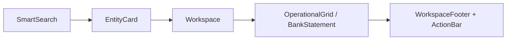
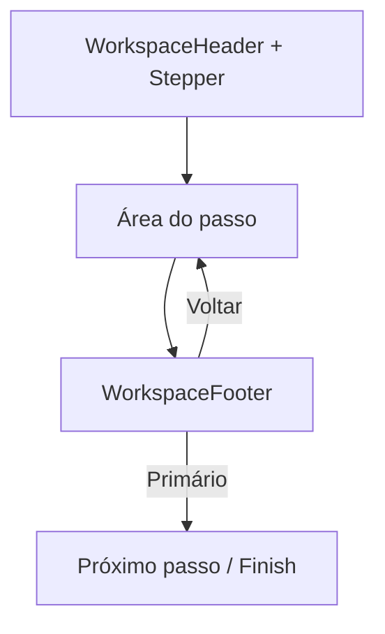
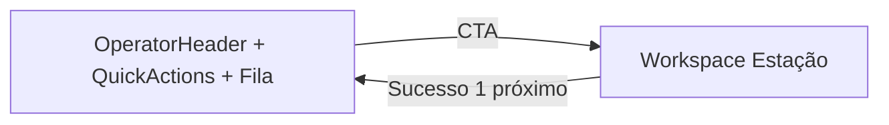

# DS-001 — Design System Operacional da Plataforma CDS

## Status
- Status: Proposed
- Data: 2026-07-13
- Autor: Plataforma CDS
- Constituição: [ADR-UX-001](adr/ADR-UX-001.md)
- Escopo: **Todos os motores e superfícies** (Comercial, Financeiro, Fiscal, Compras, Estoque, Produção, CRM, Portal Contador, Portal Web, Mobile)

---

## 1. Propósito

Este documento é o **Design System Operacional** oficial da Plataforma CDS.

| Este documento DEFINE | Este documento NÃO DEFINE |
|----------------------|---------------------------|
| Componentes reutilizáveis | Cores / branding |
| Comportamento e estados | Identidade visual gráfica |
| Quando usar / não usar | Tipografia de marca |
| Acessibilidade operacional | Marketing / landing |
| Contratos de teclado e layout | Temas estéticos |

> O Design System **implementa** o ADR-UX-001.  
> Nenhum motor pode inventar componente paralelo para a mesma responsabilidade.

**Slogan da plataforma:** *"Inteligência para gerir, tecnologia para crescer."*

---

## 2. Hierarquia e relacionamentos

```text
ADR-UX-001 (Constituição UX)
        │
        ▼
   DS-001 (este documento — contratos de componentes)
        │
        ▼
UX-FOUNDATION-001 → frontend/shared/ui/  (API operacional)
        │
        ▼
frontend/shared/design-system/  (tokens / primitives / CDS*)
        │
        ▼
Motores / Portais / Mobile
```

### Camadas de composição

```text
AppShell
 └── TopBar | NavigationRail
      └── Workspace
           ├── WorkspaceHeader  (ou OperatorHeader em Centrais)
           ├── Área operacional  (rola se lista/grade/extrato/timeline)
           │     SmartSearch · EntityCard · OperationalGrid · BankStatement · …
           └── WorkspaceFooter / ActionBar  (fixo)
```

### Mapa rápido: componente → papel ADR-UX-001

| Componente | Papel |
|------------|--------|
| AppShell, NavigationRail, TopBar | Casca da plataforma |
| Workspace* | Anatomia da Estação / Central |
| SmartSearch, EntityCard | Localizar |
| OperationalGrid, BankStatement, DataTable | Executar / consultar |
| Wizard, Stepper, ActionBar | Fluxo e CTA |
| Drawer, Modal, Toast, Alert | Contexto sem perder lugar |
| Empty/Loading/Error | Estados da área operacional |

---

## 3. Desktop First (resoluções oficiais)

A Plataforma CDS é **Desktop First**.

| Resolução | Papel |
|-----------|--------|
| 1366×768 | Mínimo suportado (notebooks legados) |
| 1600×900 | Alvo intermediário |
| 1920×1080 | Alvo principal de homologação |

**Mobile:** documento separado (fora do escopo do DS-001).  
Princípios do ADR-UX-001 permanecem; densidade e gestos serão tratados no DS Mobile.

### Densidade Operacional (UX-21.2 / UX-21.3)


A densidade de informação **varia conforme o contexto** da tela:

| Contexto | Densidade | Objetivo |
|----------|-----------|----------|
| **Centrais** | Alta | Máximo de informação útil no primeiro viewport |
| **Estações de Trabalho** | Foco absoluto na tarefa | Uma tarefa, CTA clara, sem muro de KPIs |
| **Cadastros** | Média | Formulários legíveis, agrupamento claro |
| **Relatórios** | Baixa | Respiração, leitura analítica |

**Regras:**
1. Centrais não devem parecer vazias — mas nunca apertadas.
2. Estações privilegiam precisão e fluxo, não packing de cartões.
3. Padding/gap canônicos em Centrais densas: **16–20px** padding, **16px** gap, **24px** entre seções, **radius 16px**.
4. EntityCard em Centrais usa variante **`compact`**.

### Regras de viewport

1. Sem scroll da **página/shell** em Workspace operacional.
2. Scroll interno apenas em listas, grades, extratos e timelines.
3. Header e Footer sempre visíveis nas resoluções oficiais.

---

## 4. Contrato comum de componente

Todo componente DS-001 deve documentar e implementar:

| Campo | Obrigatório |
|-------|-------------|
| Objetivo | Sim |
| Quando utilizar | Sim |
| Quando NÃO utilizar | Sim |
| Responsabilidade | Sim |
| Estados | Sim |
| Eventos | Sim |
| Acessibilidade | Sim |
| Comportamento | Sim |
| Exemplos | Sim |
| Anti-padrões | Sim |

### Estados canônicos (plataforma)

`idle` · `hover` · `focus` · `active` · `disabled` · `loading` · `error` · `empty` · `success` · `warning`

### Eventos canônicos (nomenclatura)

`onAction` · `onChange` · `onSelect` · `onSubmit` · `onCancel` · `onClose` · `onSearch` · `onNavigate` · `onRetry`

---

## 5. Catálogo oficial de componentes

---

### 5.1 AppShell

**Objetivo:** Casca raiz da aplicação (ERP / portal) que hospeda motores.  
**Quando usar:** Sempre que montar a aplicação desktop.  
**Quando NÃO usar:** Dentro de um Workspace (não aninhar shells).  
**Responsabilidade:** Slot de navegação + slot de conteúdo (`#page-content` ou equivalente).  
**Estados:** `ready`, `loading-module`, `error-bootstrap`.  
**Eventos:** `onNavigate`, `onLogout`.  
**Acessibilidade:** Landmark `application` / `main`; foco gerenciado na troca de rota.  
**Comportamento:** Altura = viewport útil; overflow hidden no shell.  
**Exemplo:** ERP CDS carrega Motor Comercial dentro do AppShell.  
**Anti-padrões:** Segunda barra superior dentro do motor; shell com scroll próprio.

---

### 5.2 Workspace

**Objetivo:** Contêiner de Estação ou Central (flex column: header + body + footer).  
**Quando usar:** Toda tela operacional ou central de motor.  
**Quando NÃO usar:** Modais, drawers, cards isolados.  
**Responsabilidade:** Garantir anatomia ADR (P08–P12): sem scroll de página.  
**Estados:** `idle`, `loading`, `error`.  
**Eventos:** — (composto).  
**Acessibilidade:** `main` com `aria-labelledby` do título.  
**Comportamento:** `height: 100%` do slot do AppShell; body `flex:1; min-height:0; overflow:auto` (somente body).  
**Implementação:** `frontend/shared/ui/Workspace/` — **STATUS ready** (FOUNDATION F2).  
**API:**

```js
const { Workspace } = require('frontend/shared/ui');
// ou: require('../../shared/ui/Workspace')

const page = Workspace.create({
  variant: 'station', // | 'central'
  header: Workspace.Header.create({
    title: 'Prestar Contas',
    subtitle: 'Conferência de retornos',
    context: 'Cliente · Documento',
    status: '● Pendente'
  }),
  body: Workspace.Body.create({ children: gradeEl }),
  footer: Workspace.Footer.create({
    left: btnCancelar,
    right: btnContinuar
  })
});
```

**Exemplo:** Prestação, Preparar Entrega, Conta Corrente (migração futura).  
**Anti-padrões:** `min-height: 100vh` empurrando footer para fora da janela; criar layout próprio no motor.

---

### 5.3 OperatorHeader

**Objetivo:** Cabeçalho de **Central** (orientação do turno).  
**Quando usar:** Centrais de Trabalho / monitoramento.  
**Quando NÃO usar:** Estações de execução (usar WorkspaceHeader).  
**Responsabilidade:** Título da Central + pulso curto (≤ 3 indicadores) + operador.  
**Estados:** `idle`, `refreshing`.  
**Eventos:** `onRefresh`.  
**Acessibilidade:** Heading nível 1 único.  
**Comportamento:** Fixo no topo do Workspace.  
**Exemplo:** “CENTRAL DE TRABALHO COMERCIAL”.  
**Anti-padrões:** KPI wall; segunda TopBar.

---

### 5.3.1 Hero — especificação oficial (UX-21.1 / UX-21.3)

**Objetivo:** Bloco inteligente de acolhimento contextual no topo das **Centrais**.  
**Quando usar:** Toda Central de Trabalho (Comercial, Financeira, Fiscal, Compras, Estoque, CRM, Executivo, Portal do Contador).  
**Quando NÃO usar:** Estações de execução (usar WorkspaceHeader); banners promocionais.

**Responsabilidade:**

| Slot | Conteúdo |
|------|----------|
| Saudação | Período do dia + nome do operador |
| Data/hora | Automática do sistema |
| Status | Resumo operacional genérico (itens + mensagem) |
| Ações | CTAs principais (≤ 2 evidentes) |
| Ilustração | Wallpaper via `::after` + `--cds-hero-wallpaper` (sem nó visual) |

**Ilustração (UX-21.3):** aplicada como `background-image` no `::after` do Hero, com gradiente + máscara. **Proibido** card, coluna, bordas, sombra ou elemento DOM separado.

**Períodos oficiais:**

| Faixa | Período | Saudação | Wallpaper |
|-------|---------|----------|-----------|
| 05:00–11:59 | `morning` | ☀️ Bom dia | Sol nascendo |
| 12:00–16:59 | `afternoon` | ☀️ Boa tarde | Sol alto |
| 17:00–18:59 | `sunset` | 🌇 Boa tarde | Pôr do sol |
| 19:00–04:59 | `night` | 🌙 Boa noite | Lua / cidade |

**API:** `Hero.create({ operatorName, statusItems, message, actions, now, liveClock })`  
**Subcomponentes:** `HeroGreeting` · `HeroStatus` · `HeroActions` · `HeroIllustration`  
**Implementação:** `frontend/shared/ui/Hero/` — **STATUS ready**.  
**Assets:** `illustrations/morning.svg|afternoon.svg|sunset.svg|night.svg` (somente SVG vetorial).  
**Estados:** fade de entrada; transição suave entre períodos; `liveClock` atualiza hora.  
**Acessibilidade:** `section` com `aria-label`; ilustração `aria-hidden`.  
**Anti-padrões:** fotos/PNG; forks de Hero no motor; gradientes exagerados; ilustração em “card” separado.
---

### 5.4 WorkspaceHeader

**Objetivo:** Cabeçalho padronizado de **Estação**.  
**Quando usar:** Toda Estação de Trabalho.  
**Quando NÃO usar:** Centrais (OperatorHeader); nunca duplicar com TopBar do shell.  
**Responsabilidade:** Sempre exibir:

| Slot | Obrigatório |
|------|-------------|
| Título | Sim |
| Subtítulo | Sim (ou vazio explícito) |
| Contexto | Sim (cliente, documento, período…) |
| Status / StateIndicator | Quando houver estado |
| Operador | Quando multioperador / auditoria leve |
| Última atualização | Quando dados forem live/refresh |

**Estados:** `idle`, `stale`, `refreshing`.  
**Eventos:** `onBack`, `onRefresh`.  
**Acessibilidade:** Um H1; status com texto, não só cor.  
**Comportamento:** Fixo; **nunca mais de uma barra superior** no Workspace.  
**Implementação:** `Workspace.Header` em `frontend/shared/ui/Workspace/` — **ready**.  
**Exemplo:** “Prestar Contas · Maria Silva · Doc C-004 · ● Pendente”.  
**Anti-padrões:** Duas barras; KPIs no header; título genérico (“Módulo”).

---

### 5.5 WorkspaceFooter

**Objetivo:** Rodapé fixo de ações da Estação.  
**Quando usar:** Toda Estação com CTA.  
**Quando NÃO usar:** Centrais só-leitura (podem omitir); listagens usam ActionBar na linha.  
**Responsabilidade:** Ações principais sempre visíveis — **nunca exigir scroll**.  
**Estados:** `idle`, `busy` (desabilita interação com `aria-busy`).  
**Eventos:** `onPrimary`, `onSecondary`, `onCancel` (via botões/ActionBar).  
**Acessibilidade:** Região `contentinfo`; atalho Enter no primário quando seguro.  
**Comportamento:** `flex-shrink: 0`; esquerda = cancelar/voltar; direita = ações.  
**Implementação:** `Workspace.Footer` — **ready**.  
**Exemplo:** `[ Cancelar ] …………………… [ Entregar ]`.  
**Anti-padrões:** Footer no fim do conteúdo rolável; primário fora da viewport.

---

### 5.6 NavigationRail

**Objetivo:** Navegação primária vertical do operador (≤ 5 destinos).  
**Quando usar:** AppShell desktop.  
**Quando NÃO usar:** Dentro de Workspace; mobile (doc separado).  
**Responsabilidade:** Hierarquia Motor → Centrais/Estações principais.  
**Estados:** `collapsed`, `expanded`, item `active`.  
**Eventos:** `onNavigate`.  
**Acessibilidade:** `nav`; setas; aria-current.  
**Comportamento:** Destinos estáveis; secundários em “Mais”/menu.  
**Exemplo:** Central · Preparar · Prestação · Conta Corrente · Clientes.  
**Anti-padrões:** Rail com 15 itens; Relatórios no bloco primário do turno.

---

### 5.7 TopBar

**Objetivo:** Barra global da plataforma (empresa, usuário, logout, motor atual).  
**Quando usar:** Uma vez no AppShell.  
**Quando NÃO usar:** Como segundo header dentro do Workspace.  
**Responsabilidade:** Identidade de sessão, não da tarefa.  
**Estados:** `authenticated`, `degraded`.  
**Eventos:** `onSwitchMotor`, `onOpenProfile`, `onLogout`.  
**Acessibilidade:** Landmarks; menu de usuário acessível.  
**Comportamento:** Fixo no AppShell; não compete com WorkspaceHeader.  
**Anti-padrões:** Duplicar título da tarefa na TopBar.

---

### 5.8 SmartSearch — especificação oficial

**Objetivo:** Busca única e inteligente para localizar entidades.  
**Quando usar:** Qualquer tarefa cujo primeiro passo seja “achar alguém/algo”.  
**Quando NÃO usar:** Filtros analíticos densos; busca só de relatório.

**Campos pesquisáveis (padrão):**

| Campo | Obrigatório na spec |
|-------|---------------------|
| Nome | Sim |
| CPF | Sim |
| CNPJ | Sim |
| Telefone | Sim |
| Documento | Sim |
| Código | Sim |
| Código de barras | Quando o domínio aplicar |

**Responsabilidade:** Um input omnisearch → resultados instantâneos → seleção.  
**Estados:** `idle`, `searching`, `loading`, `results`, `empty`, `error`, `disabled`.  
**Eventos:** `onQuery`, `onSelect`, `onClear`, `onStateChange`.  
**API:** `SmartSearch.create({ placeholder, provider, onSelect, debounce, shortcuts, filters, keys })` · `focus()` · `clear()`.  
**Implementação:** `frontend/shared/ui/SmartSearch/` — **STATUS ready** (FOUNDATION F3).  
**Acessibilidade:** `role="combobox"` / listbox; aria-activedescendant; anúncio de N resultados.  
**Comportamento:**
- Debounce curto (ex.: 200–300 ms).
- Destacar match.
- Teclado: `Ctrl+F` foca; ↑↓ navega; Enter seleciona; Esc limpa/fecha.
- Sem exigir combinação de filtros para a tarefa principal.
- Dados exclusivamente via `provider` (sem domínio de motor).

**Exemplo:** Prestação Locator (UX-12); Preparar Entrega (cliente); Clientes; Financeiro; Estoque.  
**Anti-padrões:** 4 campos obrigatórios lado a lado; “Buscar” sem Enter; resultados sem CTA; fork no motor.

---

### 5.9 EntityCard

**Objetivo:** Card padrão de entidade de negócio.  
**Quando usar:** Resultados de SmartSearch, filas, seleções.  
**Quando NÃO usar:** KPI; formulário completo; analytics.

**Variantes de densidade (UX-21.2):**

| Variante | Uso | Altura alvo |
|----------|-----|-------------|
| `compact` | Centrais / filas operacionais | 140–170px · layout horizontal |
| `normal` | Locator, listas gerais | Padrão equilibrado |
| `detailed` | Consulta expandida | Mais metadata / respiração |

**Slots obrigatórios:**

| Slot | Exemplos |
|------|----------|
| title | Nome da entidade |
| subtitle | Documento / código |
| status | Texto ou nó |
| metadata | Essenciais (telefone, cidade…) |
| actions.primary | 1 CTA |

**API:** `EntityCard.create({ variant, title, subtitle, metadata, status, badges, actions })`  
Alias legado: `compact: true` → `variant: 'compact'`.  
**Implementação:** `frontend/shared/ui/EntityCard/` — **STATUS ready** (FOUNDATION F3 + UX-21.2).  
**Estados:** `normal`, `selected`, `disabled`, `loading`, `error`.  
**Eventos:** `onSelect`, `onPrimaryAction`, `onSecondaryAction`.  
**Acessibilidade:** Card acionável; CTA com nome acessível; foco visível.  
**Comportamento:** Clique no card = selecionar; CTA explícita para ação; em `compact` o botão integra o bloco visual.  
**Anti-padrões:** 8 métricas no card; múltiplas CTAs primárias; layout de motor específico; fork no motor; usar `detailed` em Centrais densas.

---

### 5.10 SummaryCard

**Objetivo:** Resumo numérico curto (Central ou confirmação).  
**Quando usar:** Pulso da Central (≤ 3); resumo de confirmação de wizard.  
**Quando NÃO usar:** Estação default; muro de 11 cards.  
**Responsabilidade:** Um número + label.  
**Estados:** `idle`, `loading`.  
**Eventos:** `onClick` (opcional, se for atalho).  
**Anti-padrões:** SummaryCard como substituto de Extrato/Grade.

---

### 5.11 StatusBadge

**Objetivo:** Selo de status de entidade/documento.  
**Quando usar:** Linhas, EntityCard, headers.  
**Quando NÃO usar:** Como única forma de comunicar erro bloqueante (usar Alert).  
**Estados:** mapeados ao domínio + `unknown`.  
**Acessibilidade:** Texto do status sempre presente.  
**Anti-padrões:** Só ícone colorido sem texto.

---

### 5.12 StateIndicator

**Objetivo:** Estado da **operação em curso** (rascunho, pendente, salva, bloqueado).  
**Quando usar:** WorkspaceHeader, OperationalGrid (persistência).  
**Quando NÃO usar:** Status cadastral permanente (usar StatusBadge).  
**Exemplo STAB-04:** ● Alterações pendentes / ✓ Salvas.  
**Eventos:** —  
**Anti-padrões:** Confundir com badge de status de cliente.

---

### 5.13 OperationalGrid — especificação oficial

**Objetivo:** Grade editável de trabalho (estação).  
**Quando usar:** Digitação operacional (retornos, itens, lançamentos em linha).  
**Quando NÃO usar:** Consulta pura (usar DataTable); analytics.

**Contratos:**

| Tema | Regra |
|------|--------|
| Scroll | **Interno** à grade; nunca scroll da página |
| Ordenação | Colunas ordenáveis quando fizer sentido; default estável |
| Persistência | State = SSOT quando incremental; indicador StateIndicator |
| Atalhos | Enter confirma/salva campo; Tab navega; ver §6 Teclado |
| Estados de célula | `pristine`, `dirty`, `saving`, `saved`, `error` |
| Colunas | Mínimas para a tarefa; obs. opcional |
| Mensagens | Erro por linha + retry; sem jargão técnico |
| Indicadores | Saldo/linha; dirty global |

**Eventos:** `onCellChange`, `onCommit`, `onFlush`, `onRetryRow`.  
**Acessibilidade:** grid/table keyboard; foco restaurado após patch.  
**Exemplo:** Grade de Prestação (STAB-04).  
**Anti-padrões:** Payload a partir do DOM; esconder CTA no scroll da página; 12 colunas sem necessidade.

---

### 5.14 DataTable

**Objetivo:** Tabela de consulta (não editável ou pouco editável).  
**Quando usar:** Listagens, arquivos, resultados.  
**Quando NÃO usar:** Digitação intensa (OperationalGrid).  
**Eventos:** `onRowAction`, `onSort`, `onPageChange`.  
**Anti-padrões:** 10 ações por linha sem “Mais”.

---

### 5.15 Timeline

**Objetivo:** Histórico cronológico de eventos.  
**Quando usar:** Consulta de atendimento, auditoria leve.  
**Quando NÃO usar:** Execução do turno; substituir Extrato financeiro.  
**Comportamento:** Scroll interno.  
**Anti-padrões:** Timeline no primeiro viewport da Estação de digitação.

---

### 5.16 BankStatement — especificação oficial

**Objetivo:** Extrato padronizado para Conta Corrente, Financeiro, Fluxo de Caixa e extratos.  
**Quando usar:** Qualquer visão “saldo + lançamentos”.  
**Quando NÃO usar:** Dashboards com gráficos (Área Analítica).

**Estrutura obrigatória:**

```text
[ Contexto / Período / SmartSearch opcional ]
SALDO ATUAL · [ CTA Receber/Pagar se aplicável ]
EXTRATO
Data | Tipo | Descrição | Valor | Saldo
(scroll interno)
```

**Estados:** `loading`, `empty`, `ready`, `error`.  
**Eventos:** `onFilterPeriod`, `onSearch`, `onPrimaryCashAction`, `onSelectEntry`.  
**Acessibilidade:** Tabela com cabeçalhos; saldo anunciado.  
**Comportamento:** Mesma anatomia em todos os motores financeiros.  
**Anti-padrões:** 11 SummaryCards + 6 gráficos no default; colunas raras no extrato diário.

---

### 5.17 CreditStrip

**Objetivo:** Faixa única de crédito/limite no fluxo operacional.  
**Quando usar:** Preparar entrega / vendas a prazo / consignado.  
**Quando NÃO usar:** Triplicar em barra + assistente + conferência.  
**Responsabilidade:** Disponível · Valor da operação · Restante (mínimo).  
**Anti-padrões:** Painel “Assistente” espelhando a mesma faixa.

---

### 5.18 Wizard

**Objetivo:** Fluxo multipasso com WorkspaceHeader + body + WorkspaceFooter.  
**Quando usar:** Tarefas com subtarefas claras (≤ 4 passos conscientes).  
**Quando NÃO usar:** Ato único (um formulário + CTA).  
**Eventos:** `onNext`, `onBack`, `onFinish`, `onCancel`.  
**Comportamento:** Um objetivo por passo; footer sempre fixo.  
**Anti-padrões:** 5+ passos para um trabalho físico.

---

### 5.19 Stepper

**Objetivo:** Indicador visual de progresso do Wizard.  
**Quando usar:** Junto ao Wizard.  
**Quando NÃO usar:** Decoração em tela de um passo.  
**Labels:** Nome da tarefa (“Produtos”), não “Passo 2”.

---

### 5.20 ActionBar

**Objetivo:** Conjunto padronizado de ações.  
**Quando usar:** WorkspaceFooter, toolbars de lista, EntityCard.  
**Quando NÃO usar:** Dispersar botões sem hierarquia.

**Limites obrigatórios:**

| Tipo | Máximo |
|------|--------|
| Primária | **1** |
| Secundárias | **2** |
| Demais | Menu **“Mais”** |

**Eventos:** `onPrimary`, `onSecondary`, `onMoreAction`.  
**Anti-padrões:** 4 botões “primários”; esconder a única ação necessária em “Mais”.

---

### 5.21 Toolbar

**Objetivo:** Ferramentas da área (export, refresh, densidade) — não a CTA da tarefa.  
**Quando usar:** Acima de DataTable/Extrato.  
**Quando NÃO usar:** Substituir WorkspaceFooter.  
**Anti-padrões:** 4 exports competindo com Receber.

---

### 5.22 FiltersBar

**Objetivo:** Filtros opcionais/avançados.  
**Quando usar:** Arquivo, relatórios, listagens densas.  
**Quando NÃO usar:** Bloquear SmartSearch da tarefa principal.  
**Comportamento:** Recolhido por default no fluxo diário.  
**Anti-padrões:** 6 filtros obrigatórios para achar um consignado.

---

### 5.23 Drawer

**Objetivo:** Detalhe/consulta sem sair da listagem.  
**Quando usar:** Ver resumo, movimentos, detalhes.  
**Quando NÃO usar:** Substituir Estação completa de digitação.  
**Comportamento:** Poucas abas no default; demais em “Detalhes”.  
**Eventos:** `onOpen`, `onClose`, `onTabChange`.  
**Anti-padrões:** 9 abas no caminho diário.

---

### 5.24 Modal

**Objetivo:** Foco absoluto em uma decisão.  
**Quando usar:** Confirmação, autorização, recebimento rápido, impressão.  
**Quando NÃO usar:** Formulários longos de Estação.  
**Eventos:** `onConfirm`, `onCancel`, `onClose`.  
**Teclado:** Esc cancela; Enter confirma quando seguro.  
**Anti-padrões:** Modal empilhado; modal para navegar.

---

### 5.25 Toast

**Objetivo:** Feedback breve não bloqueante.  
**Quando usar:** Sucesso/aviso após ação.  
**Quando NÃO usar:** Erro que exige correção na grade (usar Alert/linha).  
**Anti-padrões:** Toast técnico com stack trace.

---

### 5.26 Alert

**Objetivo:** Mensagem persistente na área (erro/aviso/info).  
**Quando usar:** Bloqueio operacional, validação de lote.  
**Quando NÃO usar:** Decoração.  
**Linguagem:** Humana + próximo passo.

---

### 5.27 EmptyState

**Objetivo:** Área sem dados com CTA opcional.  
**Quando usar:** Lista/grade/extrato vazio.  
**Anti-padrões:** Página em branco sem orientação.

---

### 5.28 LoadingState

**Objetivo:** Carregamento da área operacional.  
**Quando usar:** Fetch inicial / refresh.  
**Quando NÃO usar:** Travando o footer indefinidamente sem timeout.  
**Anti-padrões:** Overlay global que esconde a CTA após a resposta.

---

### 5.29 ErrorState

**Objetivo:** Falha recuperável da área.  
**Quando usar:** Erro de carga.  
**Eventos:** `onRetry`.  
**Linguagem:** Humana; botão Tentar novamente.

---

### 5.30 Pagination

**Objetivo:** Páginas de DataTable/arquivo.  
**Quando usar:** Listagens longas.  
**Quando NÃO usar:** Grade operacional de um documento curto.  
**Eventos:** `onPageChange`, `onPageSizeChange`.

---

### 5.31 Tabs

**Objetivo:** Alternar vistas no mesmo contexto.  
**Quando usar:** Drawer/detalhe; Central secundária.  
**Quando NÃO usar:** Substituir Wizard de tarefa.  
**Anti-padrões:** Aba escondendo a única ação do turno.

---

### 5.32 Accordion

**Objetivo:** Detalhe sob demanda.  
**Quando usar:** “Saiba mais”, ajuda, seções raramente usadas.  
**Quando NÃO usar:** Esconder CTA principal.

---

### 5.33 CommandPalette

**Objetivo:** Paleta de comandos (`Ctrl+K` ou equivalente).  
**Quando usar:** Power users; navegação rápida entre estações.  
**Quando NÃO usar:** Único meio de achar a CTA do dia.  
**Eventos:** `onCommand`.

---

### 5.34 QuickActions

**Objetivo:** Atalhos gerais da Central (não repetem a fila prioritária).  
**Quando usar:** Central.  
**Quando NÃO usar:** Estação (usar ActionBar).  
**Limite:** Poucos; sem Relatórios no turno diário (ADR-UX-001).

---

### 5.35 FloatingAction

**Objetivo:** FAB excepcional.  
**Quando usar:** Casos raros aprovados em RFC.  
**Quando NÃO usar:** Default desktop CDS — preferir WorkspaceFooter.  
**Anti-padrões:** FAB escondendo a ação principal atrás de scroll.

---

### 5.36 ContextMenu

**Objetivo:** Menu de contexto (botão direito / “Mais”).  
**Quando usar:** Ações secundárias de linha.  
**Quando NÃO usar:** Ação primária do fluxo.  
**Limite:** Primárias na linha ≤ 3; resto aqui.

---

### 5.37 Breadcrumb

**Objetivo:** Trilha Central → Estação → Tarefa.  
**Quando usar:** Profundidade ≥ 2.  
**Quando NÃO usar:** Substituir botão Voltar do footer.  
**Eventos:** `onNavigate`.

---

### 5.38 ShortcutHint

**Objetivo:** Dica discreta de atalho (ex.: “Enter salva”).  
**Quando usar:** Grades e wizards.  
**Quando NÃO usar:** Legenda permanente ocupando meio viewport.  
**Comportamento:** Compacto; detalhes no KeyboardOverlay.

---

### 5.39 KeyboardOverlay

**Objetivo:** Mapa de atalhos sob demanda (`?` ou F1).  
**Quando usar:** Ajuda de teclado.  
**Quando NÃO usar:** Sempre aberto.  
**Eventos:** `onClose`.

---

### 5.40 ProgressBar

**Objetivo:** Progresso determinado/indeterminado de operação longa.  
**Quando usar:** Importação, geração de PDF, jobs.  
**Quando NÃO usar:** Substituir StateIndicator de grade.

---

### 5.41 UploadZone

**Objetivo:** Envio de arquivos.  
**Quando usar:** Anexos, XML, imagens.  
**Estados:** `idle`, `dragging`, `uploading`, `error`, `success`.  
**Eventos:** `onUpload`, `onReject`.

---

### 5.42 ConfirmationDialog

**Objetivo:** Modal de confirmação padronizado.  
**Quando usar:** Entregar, Encerrar, Excluir, ações irreversíveis.  
**Quando NÃO usar:** Avisos informativos (Toast/Alert).  
**Comportamento:** Uma pergunta; primário destrutivo separado quando aplicável.  
**Teclado:** Esc = não; foco inicial no seguro.

---

### 5.43 AuditTimeline

**Objetivo:** Timeline de auditoria (quem/quando/o quê).  
**Quando usar:** Tela de Auditoria / aba Detalhes.  
**Quando NÃO usar:** Viewport diário da Estação.  
**Comportamento:** Somente leitura; scroll interno.

---

## 6. Teclado — mapa oficial

| Atalho | Comportamento padrão |
|--------|----------------------|
| **Enter** | Confirma campo / avança / aciona primário seguro |
| **Esc** | Cancela edição / fecha modal-drawer / limpa busca |
| **F2** | Editar célula / item focado |
| **F3** | Localizar próximo (busca na grade/lista) |
| **F4** | Focar SmartSearch / busca da estação |
| **F7** | Alternar painel de ajuda / ShortcutHint expandido |
| **F8** | Próximo passo do Wizard (se válido) |
| **F9** | Ação secundária 1 do ActionBar (quando mapeada) |
| **F10** | Abrir menu “Mais” / ContextMenu da seleção |
| **F12** | Imprimir / preview de comprovante (quando aplicável) |
| **Ctrl+S** | Salvar / flush pendências |
| **Ctrl+F** | Focar SmartSearch |
| **Ctrl+P** | Imprimir |
| **Ctrl+Enter** | Confirmar e avançar (commit + next) |
| **Ctrl+K** | CommandPalette (quando habilitada) |
| **Tab / Shift+Tab** | Navegação de foco |
| **↑ ↓** | Navegar resultados SmartSearch / linhas |

### Regras

1. Atalhos **não** conflitam com o browser de forma destrutiva sem confirmação.
2. Domínios podem **estender**, não redefinir significados oficiais.
3. KeyboardOverlay deve listar atalhos ativos da Estação atual.
4. Grades operacionais são **100% operáveis por teclado**.

---

## 7. Fluxos compostos (diagramas)

### 7.1 Localizar → Executar



### 7.2 Wizard operacional



### 7.3 Central → Estação



---

## 8. Relacionamento com código existente

| DS-001 | Implementação atual (referência) |
|--------|----------------------------------|
| Workspace / Wizard | `WizardLayout`, layouts Dashboard/Consulta |
| StatusBadge | `Badge` / `CDSBadge` |
| DataTable | `Table` / `CDSTable` |
| Drawer / Modal | primitives `Drawer`, `Modal` |
| Empty / Loading / Error | `EmptyState`, `Loading`, `ErrorState` |
| Stepper / Tabs | `Stepper`, `Tabs` |
| SummaryCard | `StatCard` / `CDSSummaryCard` |
| SmartSearch | Evoluir a partir de `CDSSearchResult` + padrões de busca atuais |
| OperationalGrid / BankStatement / CreditStrip / EntityCard | **A criar / promover** conforme roadmaps UX |

Novos componentes nascem no Design System compartilhado — **nunca** só dentro de um motor.

---

## 9. Padrões obrigatórios (resumo normativo)

1. Um AppShell · um TopBar · um WorkspaceHeader por tela.
2. WorkspaceFooter/ActionBar fixos; CTA sempre visível.
3. ActionBar: 1 primária · ≤ 2 secundárias · resto em “Mais”.
4. SmartSearch como padrão de localização.
5. OperationalGrid / BankStatement com scroll interno apenas.
6. EntityCard com CTA única.
7. Sem KPI wall em Estação.
8. Teclado conforme §6.
9. Desktop First nas resoluções oficiais.
10. Conformidade com ADR-UX-001.

---

## 10. Checklist de aceite (componente ou tela)

- [ ] Usa apenas componentes DS-001 (ou RFC aprovada para extensão)
- [ ] Anatomia Workspace respeitada (header/body/footer)
- [ ] Sem scroll de página operacional
- [ ] ActionBar dentro dos limites
- [ ] SmartSearch quando a tarefa é localizar
- [ ] Grade/Extrato com scroll interno
- [ ] Estados Empty/Loading/Error cobertos
- [ ] Atalhos documentados / KeyboardOverlay atualizado se necessário
- [ ] Acessibilidade: foco, labels, status textual
- [ ] Sem anti-padrões das fichas
- [ ] Homologado em 1366×768 e 1920×1080
- [ ] ADR-UX-001 checklist também atendido

---

## 11. Critérios de aceite (documento / implementação)

Uma entrega está **conforme DS-001** quando:

1. O componente/tela está no catálogo ou tem RFC de extensão aprovada.
2. Contratos de Quando usar / Não usar foram respeitados.
3. Checklist §10 completo.
4. Não introduz componente paralelo com a mesma responsabilidade.
5. Review de Design System / UX assina conformidade.

**Não conformidade** bloqueia status “oficial” do motor, mesmo com backend correto.

---

## 12. Exemplos de composição

### Prestação (alvo)
`Workspace` + `WorkspaceHeader` + `SmartSearch`/`EntityCard` (locator) → `OperationalGrid` + `StateIndicator` + `WorkspaceFooter(ActionBar)`.

### Conta Corrente (alvo)
`Workspace` + `WorkspaceHeader` + `BankStatement` + `ActionBar(Receber)` + `FiltersBar` recolhido.

### Central
`Workspace` + `Hero` + `SummaryCard(≤4)` + fila de `EntityCard`/`DataTable` + `QuickActions` / `ActionBar`.

---

## 13. Anti-padrões globais

| Anti-padrão | Correção |
|-------------|----------|
| Componente local “igual” ao DS | Promover ou substituir |
| Segunda barra superior | Remover |
| CTA só após scroll | WorkspaceFooter fixo |
| Busca com 5 filtros obrigatórios | SmartSearch |
| Extrato + 11 KPIs + gráficos | BankStatement puro |
| Grade sem teclado | OperationalGrid + §6 |
| FAB no desktop como padrão | ActionBar no footer |

---

## 14. Governança e evolução

1. Novo componente → RFC → entrada no DS-001 → implementação em `frontend/shared/design-system`.
2. Proibido fork por motor.
3. Breaking change de contrato → nova versão + nota de migração.
4. Skill `.cds/skills/design-system` deve referenciar este DS-001.
5. Mobile → DS-00x futuro, herdando princípios.

---

## 15. Documentos relacionados

| Documento | Papel |
|-----------|--------|
| [ADR-UX-001](adr/ADR-UX-001.md) | Constituição UX |
| `AUDITORIA_UX_MOTOR_COMERCIAL.md` | Diagnóstico Comercial |
| `PLANO_REESTRUTURACAO_UX.md` / `ROADMAP_UX_COMERCIAL.md` | Implantação gradual |
| `frontend/shared/design-system/docs/CDS_DESIGN_SYSTEM.md` | Docs técnicas do código |

---

## Metadados

- Versão: 1.0.0-proposed
- Status: Proposed
- Última revisão: 2026-07-13
- Dependências: ADR-UX-001, Design System CDS (código)
- Motores: Todos

---

*DS-001 — Design System Operacional. Obrigatório para qualquer desenvolvimento futuro de interface da Plataforma CDS.*
