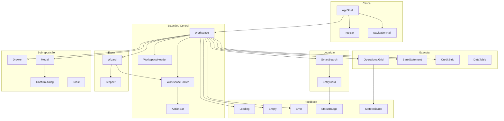

# UX-FOUNDATION-001 — Infraestrutura Oficial de UX da Plataforma CDS

## Status
- Status: Proposed
- Data: 2026-07-13
- Autor: Plataforma CDS

## Dependências normativas
| Documento | Papel |
|-----------|--------|
| [ADR-UX-001](.cds/adr/ADR-UX-001.md) | Constituição de UX |
| [DS-001](.cds/DS-001.md) | Contratos de componentes |
| Este documento | **Infraestrutura de código** `frontend/shared/ui` |

---

## 1. Objetivo

Eliminar definitivamente componentes duplicados entre motores.

> **Toda interface da Plataforma CDS utiliza componentes compartilhados em `frontend/shared/ui/`.**

Nenhum motor (Comercial, Financeiro, Fiscal, Compras, Estoque, Produção, CRM, Portais, Mobile) pode manter fork local da mesma responsabilidade.

---

## 2. Política oficial (normativa)

### 2.1 Proibições

1. **Proibido** criar em `frontend/modules/<motor>/components/` (ou equivalente) uma versão própria de qualquer componente listado no DS-001 / Shared UI.
2. **Proibido** copiar/colar implementação de outro motor.
3. **Proibido** “adaptar leve” com outro nome para a mesma responsabilidade (`MeuGrid` ≈ `OperationalGrid`).

### 2.2 Evolução

| Necessidade | Ação correta |
|-------------|--------------|
| Novo comportamento útil a ≥1 motor | Evoluir o componente em `shared/ui` |
| Variante visual/tema | Token / tema do Design System — não fork |
| Exceção temporária | RFC aprovada + prazo de migração ≤ 1 sprint |
| Bug | Corrigir no Shared UI; motores herdam |

### 2.3 Relação com Design System (código)

```text
ADR-UX-001  →  DS-001  →  UX-FOUNDATION-001
                              │
              ┌───────────────┴───────────────┐
              ▼                               ▼
 frontend/shared/design-system/     frontend/shared/ui/
 (tokens, primitives, CDS*)         (API operacional DS-001)
              │                               │
              └─────────── usados por ────────┘
                              ▼
                    Motores / Portais / Mobile
```

- **`design-system/`** — fundação (tokens, primitives, CDSButton, layouts base).
- **`shared/ui/`** — **fachada operacional** alinhada 1:1 ao DS-001 (Workspace, SmartSearch, OperationalGrid…).
- Motores consomem **`@shared/ui`** (via `require`/`import` do barrel), não reinventam.

---

## 3. Arquitetura da Shared UI

### 3.1 Localização

```text
frontend/shared/ui/
├── index.js                 # Barrel oficial
├── README.md
├── AppShell/
├── Workspace/
├── WorkspaceHeader/
├── WorkspaceFooter/
├── NavigationRail/
├── TopBar/
├── SmartSearch/
├── OperationalGrid/
├── EntityCard/
├── Hero/
├── BankStatement/
├── CreditStrip/
├── Wizard/
├── Stepper/
├── ActionBar/
├── Toolbar/
├── FiltersBar/
├── StatusBadge/
├── StateIndicator/
├── SummaryCard/
├── DataTable/
├── Timeline/
├── Drawer/
├── Modal/
├── ConfirmDialog/
├── Toast/
├── Loading/
├── Empty/
├── Error/
├── Pagination/
├── Tabs/
├── CommandPalette/
├── QuickActions/
├── Keyboard/                # mapa + overlay + hints
├── Hooks/                   # useSmartSearch, useWorkspaceFocus, …
├── Tokens/                  # re-export / aliases operacionais
└── Utils/                   # focus trap, debounce, a11y helpers
```

### 3.2 Diagrama de dependências



### 3.3 Regras de dependência

| Pode depender de | Não pode depender de |
|------------------|----------------------|
| `shared/design-system` | Motores (`motor-comercial`, …) |
| Outros `shared/ui` **mais baixos** (Utils → Hooks → átomos → compostos) | APIs de negócio do motor |
| Tokens / Utils / Hooks | Banco, ledger, crédito SSOT |

**Ciclos proibidos:** Workspace ↛ SmartSearch ↛ Workspace.

---

## 4. Mapa de componentes (contratos de infraestrutura)

Legenda de status de implementação:

| Status | Significado |
|--------|-------------|
| `planned` | Pasta criada; API documentada; implementação pendente |
| `bridge` | Reexporta/adapta primitive CDS existente |
| `ready` | Implementação Shared UI completa |

---

### 4.1 AppShell
| Campo | Contrato |
|-------|----------|
| Responsabilidade | Casca da aplicação: nav + slot de conteúdo |
| Dependências | TopBar, NavigationRail, design-system layouts |
| API pública | `create({ topBar, rail, content })` → `HTMLElement` |
| Eventos | `onNavigate`, `onLogout` |
| Estados | `ready`, `loading-module`, `error-bootstrap` |
| Boas práticas | Overflow hidden; height = viewport útil |
| Anti-padrões | Scroll no shell; segundo shell dentro do motor |
| Reutilização | Obrigatório em ERP e portais desktop |
| Status alvo | `planned` |

### 4.2 Workspace
| Campo | Contrato |
|-------|----------|
| Responsabilidade | Anatomia Estação/Central: header + body + footer |
| Dependências | WorkspaceHeader, WorkspaceBody, WorkspaceFooter |
| API pública | `Workspace.create({ variant, header, body, footer })` · `Header`/`Body`/`Footer` · `compose` · `getStyles` |
| Eventos | — |
| Estados | `idle`, `loading`, `error` |
| Boas práticas | `min-height:0` no body; só body rola |
| Anti-padrões | `min-height:100vh` empurrando footer |
| Reutilização | Toda tela operacional |
| Status alvo | `ready` (FOUNDATION F2 — 2026-07-13) |
| Caminho | `frontend/shared/ui/Workspace/` |
| Testes | `npx jest --config frontend/shared/ui/jest.config.js` |

### 4.3 WorkspaceHeader
| Campo | Contrato |
|-------|----------|
| Responsabilidade | Título, subtítulo, contexto, status, operador, updatedAt |
| Dependências | StatusBadge, StateIndicator (opcionais via slots) |
| API pública | `Workspace.Header.create({ title, subtitle, context, status, operator, updatedAt, breadcrumb, secondaryActions, onBack })` |
| Eventos | `onBack`, `onRefresh` |
| Estados | `idle`, `stale`, `refreshing` |
| Boas práticas | Um H1; nunca segunda barra |
| Anti-padrões | KPI wall no header |
| Reutilização | Todas as Estações |
| Status alvo | `ready` (FOUNDATION F2) |

### 4.4 WorkspaceFooter
| Campo | Contrato |
|-------|----------|
| Responsabilidade | Rodapé fixo de ações |
| Dependências | ActionBar (futuro); botões via `left`/`right`/`children` |
| API pública | `Workspace.Footer.create({ left, right, children, busy })` |
| Eventos | delegados aos botões / ActionBar |
| Estados | `idle`, `busy` |
| Boas práticas | Sempre visível; flex-shrink 0 |
| Anti-padrões | Footer no fim do conteúdo scrollável |
| Reutilização | Toda Estação com CTA |
| Status alvo | `ready` (FOUNDATION F2) |

### 4.4b WorkspaceBody
| Campo | Contrato |
|-------|----------|
| Responsabilidade | Única área com overflow-y no Workspace |
| API pública | `Workspace.Body.create({ children, scroll })` · `setContent(el, children)` |
| Status alvo | `ready` (FOUNDATION F2) |

### 4.5 NavigationRail
| Campo | Contrato |
|-------|----------|
| Responsabilidade | ≤ 5 destinos primários do operador |
| Dependências | — |
| API pública | `create({ items, activeId, collapsed })` |
| Eventos | `onNavigate` |
| Estados | `expanded`, `collapsed` |
| Boas práticas | Secundários em “Mais” |
| Anti-padrões | 15 itens no rail diário |
| Status alvo | `planned` |

### 4.6 TopBar
| Campo | Contrato |
|-------|----------|
| Responsabilidade | Sessão global (empresa, usuário, motor) |
| Dependências | — |
| API pública | `create({ company, user, motor, menus })` |
| Eventos | `onSwitchMotor`, `onLogout` |
| Anti-padrões | Duplicar título da tarefa |
| Status alvo | `planned` / bridge ERP |

### 4.7 SmartSearch
| Campo | Contrato |
|-------|----------|
| Responsabilidade | Busca omnisearch (Nome, CPF, CNPJ, Telefone, Documento, Código, barcode) |
| Dependências | Utils debounce/announce; EntityCard opcional para resultados |
| API pública | `create({ placeholder, provider, onSelect, debounce, shortcuts, filters, keys })` · `focus()` · `clear()` |
| Eventos | `onQuery`, `onSelect`, `onClear`, `onStateChange` |
| Estados | `idle`, `searching`, `loading`, `results`, `empty`, `error`, `disabled` |
| Boas práticas | Ctrl+F; ↑↓ Enter Esc; provider sem domínio |
| Anti-padrões | 4 filtros obrigatórios; fork no motor |
| Reutilização | Locator Prestação, Clientes, Preparar, Financeiro, Fiscal, Compras, Estoque |
| Status alvo | **`ready` (FOUNDATION F3 — 2026-07-13)** |

### 4.8 OperationalGrid
| Campo | Contrato |
|-------|----------|
| Responsabilidade | Grade editável; scroll interno; teclado; dirty/flush |
| Dependências | StateIndicator, Keyboard |
| API pública | `create({ columns, rows, onCellChange, onFlush })` |
| Eventos | `onCellChange`, `onCommit`, `onFlush`, `onRetryRow` |
| Estados célula | `pristine`, `dirty`, `saving`, `saved`, `error` |
| Boas práticas | State SSOT (padrão STAB-04) |
| Anti-padrões | Payload do DOM; scroll de página |
| Reutilização | Prestação, lançamentos similares |
| Status alvo | `planned` (migrar grade Comercial) |

### 4.9 EntityCard
| Campo | Contrato |
|-------|----------|
| Responsabilidade | title, subtitle, status, metadata, badges, CTA primary/secondary |
| Variantes | `compact` · `normal` · `detailed` (UX-21.2) |
| Dependências | — (StatusBadge/ActionBar futuros opcionais) |
| API pública | `create({ variant, title, subtitle, metadata, status, badges, actions })` |
| Eventos | `onSelect`, `onPrimaryAction`, `onSecondaryAction` |
| Estados | `normal`, `selected`, `disabled`, `loading`, `error` |
| Anti-padrões | 8 métricas; 3 CTAs primárias; enum de domínio no componente |
| Status alvo | **`ready` (FOUNDATION F3 + UX-21.2)** |

### 4.9.1 Hero
| Campo | Contrato |
|-------|----------|
| Responsabilidade | Saudação inteligente + data/hora + status + CTAs + ilustração SVG por período |
| Dependências | — (sem domínio de motor) |
| API pública | `create({ operatorName, statusItems, message, actions, now, liveClock })` |
| Subcomponentes | HeroGreeting · HeroStatus · HeroActions · HeroIllustration |
| Períodos | `morning` · `afternoon` · `sunset` · `night` |
| Assets | `illustrations/*.svg` (somente vetorial) |
| Eventos | via `actions[].onClick`; `cdsHero.update` / `destroy` |
| Anti-padrões | Fork no motor; fotos/PNG; banner publicitário |
| Reutilização | Todas as Centrais da plataforma |
| Status alvo | **`ready` (UX-21.1 — 2026-07-13)** |

### 4.10 BankStatement
| Campo | Contrato |
|-------|----------|
| Responsabilidade | Saldo + extrato (data, tipo, descrição, valor, saldo) |
| Dependências | DataTable ou tabela interna; ActionBar |
| API pública | `create({ balance, entries, period, onPrimaryCashAction })` |
| Eventos | `onFilterPeriod`, `onSearch`, `onSelectEntry` |
| Anti-padrões | 11 KPIs + gráficos no default |
| Reutilização | Conta Corrente, Financeiro, Fluxo de Caixa |
| Status alvo | `planned` (extrair de ContaCorrente) |

### 4.11 CreditStrip
| Campo | Contrato |
|-------|----------|
| Responsabilidade | Faixa única: disponível / valor operação / restante |
| Dependências | — |
| API pública | `create({ available, operationValue, remaining })` |
| Anti-padrões | Triplicar em assistente + barra + conferência |
| Status alvo | `planned` |

### 4.12 Wizard / Stepper
| Campo | Contrato |
|-------|----------|
| Responsabilidade | Multipasso ≤ 4; Stepper com labels de tarefa |
| Dependências | Workspace, WorkspaceFooter, Stepper |
| API pública | Wizard `create({ steps, stepIndex, body, footer })` |
| Eventos | `onNext`, `onBack`, `onFinish`, `onCancel` |
| Status alvo | `bridge` → WizardLayout / CDSStepper |

### 4.13 ActionBar
| Campo | Contrato |
|-------|----------|
| Responsabilidade | 1 primária · ≤ 2 secundárias · resto “Mais” |
| Dependências | design-system Button; ContextMenu |
| API pública | `create({ primary, secondary[], more[] })` |
| Eventos | `onPrimary`, `onSecondary`, `onMoreAction` |
| Anti-padrões | 4 primários |
| Status alvo | `planned` |

### 4.14 Toolbar / FiltersBar
| Campo | Contrato |
|-------|----------|
| Responsabilidade | Ferramentas / filtros avançados recolhíveis |
| Anti-padrões | Substituir footer; filtros obrigatórios no fluxo diário |
| Status alvo | `bridge` FiltersBar ← CDSFilterBar |

### 4.15 StatusBadge / StateIndicator / SummaryCard
| Campo | Contrato |
|-------|----------|
| StatusBadge | Status de entidade |
| StateIndicator | Estado da operação (dirty/saved) |
| SummaryCard | ≤ 3 no pulso da Central |
| Status alvo | `bridge` Badge / CDSStatusIndicator / StatCard |

### 4.16 DataTable / Timeline / Pagination / Tabs
| Campo | Contrato |
|-------|----------|
| DataTable | Consulta (não digitação intensa) |
| Timeline | Histórico |
| Status alvo | `bridge` Table, Timeline, Pagination, Tabs |

### 4.17 Drawer / Modal / ConfirmDialog / Toast
| Campo | Contrato |
|-------|----------|
| ConfirmDialog | Uma pergunta; Esc / Enter |
| Status alvo | `bridge` Drawer, Modal; ConfirmDialog `planned` |

### 4.18 Loading / Empty / Error
| Campo | Contrato |
|-------|----------|
| Status alvo | `bridge` Loading, EmptyState, ErrorState |

### 4.19 Keyboard / Hooks / Tokens / Utils
| Campo | Contrato |
|-------|----------|
| Keyboard | Mapa DS-001 §6 + Overlay + ShortcutHint |
| Hooks | `useDebouncedQuery`, `useFocusRestore`, `useHotkeys` |
| Tokens | Re-export design-system tokens |
| Utils | debounce, focus-trap, announce |
| Status alvo | `planned` / parcial |

### 4.20 CommandPalette / QuickActions
| Campo | Contrato |
|-------|----------|
| QuickActions | Só Central; não repetem fila prioritária |
| Status alvo | `planned` |

---

## 5. Ordem de implementação

Prioridade = desbloqueio de migração Comercial + ADR/DS.

| Fase | Componentes | Critério de saída |
|------|-------------|-------------------|
| **F0** | Utils, Tokens, Hooks (base) | Debounce, hotkeys, re-exports |
| **F1** | Loading, Empty, Error, StatusBadge, StateIndicator, Modal, Drawer, ConfirmDialog, Toast | Bridges estáveis |
| **F2** | Workspace, WorkspaceHeader, WorkspaceBody, WorkspaceFooter, ActionBar (**ready**); Hero (**ready** — UX-21.1) | Anatomia Estação + Hero de Central |
| **F3** | Wizard, Stepper | Fluxos multipasso |
| **F4** | SmartSearch, EntityCard (**ready** — sprint FOUNDATION F3) | Locator desbloqueado |
| **F5** | OperationalGrid | Grade STAB-04 migrável |
| **F6** | BankStatement, CreditStrip | Conta Corrente / Preparar |
| **F7** | AppShell, TopBar, NavigationRail, QuickActions | Casca unificada |
| **F8** | Toolbar, FiltersBar, DataTable, Timeline, Pagination, Tabs, CommandPalette, Keyboard overlay | Consolidação |

**Paralelo seguro:** F1 ∥ início F0; F4 ∥ F3 após F2.

Alinhamento com roadmap Comercial: UX-11 (BankStatement) · UX-12 (SmartSearch/EntityCard) · UX-13 (OperationalGrid no wizard curto).

---

## 6. Plano de migração — Motor Comercial → Shared UI

### 6.1 Princípios da migração

1. **Strangler:** motor passa a importar Shared UI; implementação local vira adaptador fino e depois some.
2. **Sem big-bang:** uma família por sprint.
3. **Contratos STAB-03/04 / UX-10 preservados.**
4. Cada PR: `build:motor-comercial` + `verify:motor-comercial` + testes da área.

### 6.2 Inventário → destino

| Origem atual (Comercial / DS) | Destino Shared UI | Estratégia |
|-------------------------------|-------------------|------------|
| `WizardLayout` | `ui/Wizard` | Bridge F3 |
| `FecharConsignacaoView` grade | `ui/OperationalGrid` | Extrair F5 |
| Busca cliente NovaConsignação / Clientes | `ui/SmartSearch` | Unificar F4 |
| Cards resultado cliente | `ui/EntityCard` | F4 |
| ContaCorrente extrato + cards | `ui/BankStatement` | Enxugar + F6 |
| Faixas crédito Preparar | `ui/CreditStrip` | F6 |
| Footer wizard entrega/prestação | `ui/WorkspaceFooter` + `ActionBar` | F2 |
| `Badge` / status linha | `ui/StatusBadge` | Bridge F1 |
| Persistência ●/✓ grade | `ui/StateIndicator` | F1/F5 |
| `Drawer` / `Modal` / confirm | `ui/Drawer` `Modal` `ConfirmDialog` | Bridge F1 |
| `Loading` `EmptyState` | `ui/Loading` `Empty` | Bridge F1 |
| CentralTrabalhoView shell | `ui/Workspace` variant central | F2 + F7 |
| Ações rápidas Central | `ui/QuickActions` | F7 |
| `CDSFilterBar` | `ui/FiltersBar` | Bridge F8 |
| `Table` listagens | `ui/DataTable` | Bridge F8 |

### 6.3 Fases de migração Comercial

| Sprint migração | Escopo | Aceite |
|-----------------|--------|--------|
| M1 | Bridges F1 no Comercial (import path) | Zero regressão visual crítica |
| M2 | Workspace + Footer + ActionBar em Entrega e Prestação | CTA sempre visível |
| M3 | SmartSearch + EntityCard no Locator Prestação (UX-12) | Busca única |
| M4 | OperationalGrid na Prestação (UX-13) | STAB-04 verde |
| M5 | BankStatement Conta Corrente (UX-11) | Extrato default — **feito** (Workspace station) |
| M6 | CreditStrip Preparar (UX-15) | Uma faixa de crédito |
| M7 | Remover wrappers mortos do motor | Grep sem duplicata |

### 6.4 Critério “migração concluída” por componente

- [ ] Única implementação em `shared/ui`
- [ ] Motor só importa do barrel `shared/ui`
- [ ] Testes unitários do componente no shared (quando lógica)
- [ ] Documentação DS-001 + pasta do componente atualizadas
- [ ] Nenhuma cópia em `modules/motor-comercial/**` da mesma responsabilidade

---

## 7. API do barrel

```js
// frontend/shared/ui/index.js
module.exports = {
  AppShell: require('./AppShell'),
  Workspace: require('./Workspace'),
  WorkspaceHeader: require('./WorkspaceHeader'),
  WorkspaceFooter: require('./WorkspaceFooter'),
  // …
};
```

Consumo nos motores:

```js
const { Workspace, ActionBar, SmartSearch } = require('../../../../shared/ui');
```

**Proibido:** `require('.../design-system/primitives/...')` para responsabilidades já cobertas pelo `shared/ui` (exceto durante bridge documentada).

---

## 8. Checklist (PR / nova tela)

- [ ] Componente existe em `shared/ui` ou RFC de extensão aprovada
- [ ] Motor não adicionou fork local
- [ ] Dependências só para baixo (Utils ← Hooks ← átomos ← compostos)
- [ ] API/eventos/estados alinhados ao DS-001
- [ ] Teclado conforme DS-001 §6 quando aplicável
- [ ] Sem scroll de página na Estação
- [ ] ActionBar: 1 + ≤2 + Mais
- [ ] Testes / verify do motor verdes
- [ ] ADR-UX-001 checklist atendido

---

## 9. Critérios de aceite (fundação)

A infraestrutura UX-FOUNDATION-001 está **conforme** quando:

1. Árvore `frontend/shared/ui/` existe com pastas do catálogo e barrel `index.js`.
2. Política §2 publicada e referenciada em ADR/DS/skills.
3. Mapa de componentes com API e status preenchido.
4. Ordem de implementação e plano de migração Comercial publicados.
5. Pelo menos bridges F1 iniciados **ou** stubs com `STATUS` explícito (`planned`/`bridge`) sem fingir `ready`.
6. Nenhum motor novo autorizado a criar UI paralela.

---

## 10. Anti-padrões da fundação

| Anti-padrão | Correção |
|-------------|----------|
| `motor-x/components/SmartSearch.js` | Usar `shared/ui/SmartSearch` |
| Shared UI importando Motor Comercial | Inverter dependência |
| “Só mais um StatCard local” | SummaryCard shared |
| Bridge eterna sem promover | Prazo M* no plano |
| Documentar DS-001 sem código shared/ui | Este foundation |

---

## 11. Relacionados

- Código: `frontend/shared/ui/`
- Design System: `frontend/shared/design-system/`
- Roadmap Comercial: `ROADMAP_UX_COMERCIAL.md`
- Skill: `.cds/skills/design-system/design-system.md`

---

## Metadados

- Versão: 1.0.0-proposed
- Última revisão: 2026-07-13
- Entregável: documentação + scaffolding Shared UI

---

*UX-FOUNDATION-001 — Base técnica para implementação do DS-001 na Plataforma CDS.*
