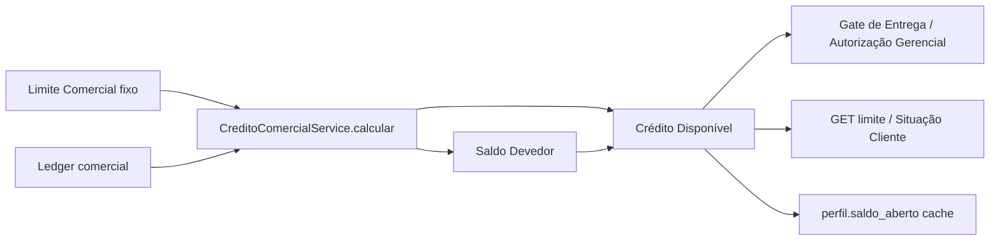

# AUDITORIA ENTERPRISE — Regra Oficial do Crédito Comercial (SSOT)

**Data:** 2026-07-12  
**Escopo:** Validação de consistência (sem implementação de correções)  
**SSOT analisado:** `backend/motores/motor-comercial/services/CreditoComercialService.js`  
**Método:** execução algébrica dos cenários oficiais + varredura de consumidores backend/frontend + fluxo de eventos/cache

---

## Resumo Executivo

### Veredito

| Pergunta | Resposta |
|----------|----------|
| A regra está correta nos cenários oficiais **completos** (estoque liquidado)? | **SIM** |
| Existe double counting do **mesmo valor vendido** em Estoque + Conta Corrente? | **NÃO** |
| A regra já é SSOT absoluta em toda a plataforma? | **NÃO** — backend alinhado; frontend ainda recalcula em mappers |
| Pode declarar a regra como definitiva sem ressalvas? | **COM RESSALVAS** (P1/P2 de governança e cenário incompleto) |

### Conclusão em uma frase

A fórmula `AR + estoque consignado` **não conta o valor vendido duas vezes** (a venda migra de estoque → AR), mas o Crédito Disponível só coincide com o exemplo oficial quando o estoque residual da consignação foi liquidado (devolução/perda/cortesia). O frontend ainda não trata o serviço como única fonte.

---

## Cenários Executados

Limite Comercial fixo nos testes: **R$ 50,00**.

| # | Cenário | Estoque | AR (CC) | Saldo Devedor | Credor | Crédito Disp. | Esperado | Status |
|---|---------|---------|---------|---------------|--------|---------------|----------|--------|
| 1 | Sem movimentação | 0 | 0 | 0 | 0 | **50** | Disp. 50 | **OK** |
| 2 | Entrega 50, sem prestação | 50 | 0 | 50 | 0 | **0** | Disp. 0; CC sem lançamento | **OK** |
| 3 | Entrega 50; V 45; D 5; P 0 | 0 | 45 | 45 | 0 | **5** | CC débito 45; Disp. 5 | **OK** |
| 4a | Entrega 50; V 45; P 40; **sem D** | **5** | 5 | **10** | 0 | **40** | Esperado Disp. **45** | **DIVERGE** |
| 4b | Entrega 50; V 45; D 5; P 40 (exemplo oficial) | 0 | 5 | 5 | 0 | **45** | CC 5; Disp. 45 | **OK** |
| 5 | Quitação (P total do AR) | 0 | 0 | 0 | 0 | **50** | Disp. 50 | **OK** |
| 6 | Pagamento 50 sobre devido 45 | 0 | −5 | 0 | 5 | **50** | Credor 5; Disp. ≤ Limite | **OK** |

### Leituras críticas dos cenários

**Cenário 3 — estoque deixa de comprometer?**  
Sim. Com `V + D = E` (45+5=50), `estoqueConsignado = 0` imediatamente. O valor vendido permanece **somente** no AR (Conta Corrente).

**Cenário 4 — só saldo financeiro?**  
Só se o estoque residual for zero. Sem devolução/perda/cortesia dos R$ 5 não vendidos, o serviço ainda compromete **R$ 5 de estoque + R$ 5 de AR = R$ 10**. O esperado “Disp. 45” assume consignação **liquidada** (como no exemplo oficial com D=5).

**Cenário 6 — nunca acima do limite?**  
Sim. `creditoDisponivel = max(0, limite − saldoDevedor)` e com `saldoDevedor = 0` o disponível fica em **50**, não 55.

---

## Fórmulas Validadas

### Oficial implementada

```
Crédito Disponível = max(0, Limite Comercial − Saldo Devedor)

Saldo Devedor =
  max(0, Σ VENDA_PRESTACAO − Σ PAGAMENTO)                         // Conta Corrente (AR)
+ max(0, Σ ENTREGA − Σ DEVOLUCAO − Σ VENDA − Σ PERDA − Σ CORTESIA) // Estoque consignado

Saldo Credor = max(0, Σ PAGAMENTO − Σ VENDA_PRESTACAO)
```

### Identidade anti–double counting (vendas)

Para qualquer valor `V` de venda:

- Sai do estoque: `estoque -= V`
- Entra no AR: `AR += V`

Logo **o mesmo real não permanece nos dois buckets**.  
Algebraicamente, com estoque e AR positivos:

```
Saldo Devedor = (V − P) + (E − D − V − Pe − C)
             = E − D − Pe − C − P
```

O termo `V` cancela-se. Não há dupla inclusão do vendido.

### Conta Corrente (projeção)

`calcularSaldoContaCorrente` / `calcularSaldosComerciais.saldoEmAberto` usam **apenas** `VENDA − PAGAMENTO`.  
Entrega **não** gera lançamento de CC — alinhado ao Cenário 2.

---

## Fluxo do Crédito



1. **Entrega** → aumenta estoque → sobe Saldo Devedor → cai Disponível.  
2. **Venda** → estoque ↓ / AR ↑ → Saldo Devedor **inalterado** (migração).  
3. **Devolução / Perda / Cortesia** → estoque ↓ → Disponível sobe.  
4. **Pagamento** → AR ↓ → Disponível sobe.  
5. **Pagamento > devido** → AR negativo vira Saldo Credor; Disponível = Limite (teto).

---

## Fluxo da Conta Corrente

| Evento | Efeito na CC (AR) | Efeito no Crédito |
|--------|-------------------|-------------------|
| ENTREGA | Nenhum | +Estoque |
| DEVOLUCAO | Nenhum | −Estoque |
| VENDA_PRESTACAO | +Débito | Estoque→AR (neto 0 no Saldo Devedor) |
| PAGAMENTO | −Débito / +Credor | −AR |
| FECHAMENTO_PRESTACAO | Não entra na fórmula de crédito | Snapshot/status; sync de cache |

Após liquidar estoque, **apenas o AR remanescente** compromete o crédito — alinhado à diretriz: “CC passa a ser a responsável pelo saldo financeiro remanescente”.

---

## Fluxo da Consignação

| Estado | Estoque no crédito? | AR no crédito? |
|--------|---------------------|----------------|
| RASCUNHO (sem entrega) | Não | Não |
| ENTREGUE / em aberto | Sim (saldo não liquidado) | Só se já houver vendas |
| Em prestação (parcial) | Residual ainda sim | Vendas − pagamentos |
| Encerrada **com estoque zerado** | Não | Só remanescente financeiro |
| Encerrada **com residual sem D/Pe/C** | **Ainda sim** | Também |

`FECHAMENTO_PRESTACAO` **não** zera estoque na fórmula. Quem zera estoque são `DEVOLUCAO`, `VENDA`, `PERDA`, `CORTESIA`.

---

## Double Counting

### Pergunta obrigatória

> Após encerrar, o valor vendido continua em Estoque **e** Conta Corrente?

| Avaliação | Resultado |
|-----------|-----------|
| Mesmo valor `VENDA` nos dois buckets | **NÃO** — exclusão mútua na fórmula |
| Classificação P0 de double counting do vendido | **NÃO APLICÁVEL / NÃO CONFIRMADO** |

### Nuance (não é double counting, mas divergência de expectativa)

Se a consignação encerra com **mercadoria residual** não devolvida/perdida/cortesia, o crédito ainda sente o residual como estoque **além** do AR das vendas. Isso **não** é contar o vendido duas vezes; é manter exposição de estoque + exposição financeira.

Para o exemplo oficial (D+V liquida E), o comportamento está correto.

---

## Riscos Encontrados

### P0

| ID | Risco | Evidência |
|----|-------|-----------|
| — | Double counting do valor **vendido** | **Não encontrado** |

### P1

| ID | Risco | Evidência | Impacto |
|----|-------|-----------|---------|
| P1-01 | Cenário 4 sem liquidação de residual diverge do esperado “Disp. 45” | Execução: Disp. **40** (estoque 5 + AR 5) | Homologação/confusão operacional se fecharem com residual |
| P1-02 | Frontend recalcula crédito fora do SSOT | `centralOperacoesMappers.metricasLimite`, `perfilMappers`, `NovaConsignacao` fallback `limite − saldo`, `CreditoComercial.js` | Quebra critério “nenhuma tela recalcula” |
| P1-03 | Preparar Entrega usa `limiteDisponivel − valorEntrega` localmente | `prepararEntregaMappers.calcularUtilizacaoLimite` | Preview pós-entrega; base ainda deveria vir só da API |

### P2

| ID | Risco | Evidência | Impacto |
|----|-------|-----------|---------|
| P2-01 | Recálculo + auditoria duplicados em pagamento/fechamento | `liberarLimitePorValor` → `sincronizarCachePerfil` **e** UC emite `CREDITO_COMERCIAL_RECALCULADO` + `gravarAuditoria` | Processamento duplicado (mesmo resultado) |
| P2-02 | Entrega/Devolução/Venda syncam cache **sem** evento `CREDITO_COMERCIAL_RECALCULADO` | `RegistrarEntrega`, `RegistrarDevolucao`, `RegistrarVenda` | Auditoria de crédito incompleta no ledger de eventos |
| P2-03 | `ConsultarLimiteDisponivel` aplica 2ª camada (`calcularLimiteDisponivel` + liberação gerencial) | `ConsultarLimiteDisponivelUseCase` | Dois caminhos de “ajuste” sobre o SSOT |
| P2-04 | `calcularParaPerfil` faz N+1 `listar` por consignação | `CreditoComercialService.calcularParaPerfil` | Performance em clientes com muitas consignações |

### P3

| ID | Risco | Evidência |
|----|-------|-----------|
| P3-01 | `LimiteCreditoService` é fachada; DI não padroniza uma única instância injetada | Bootstrap ainda não centraliza o serviço em todos os UCs |
| P3-02 | PrestacaoContas usa “saldoDevedor” do **painel da prestação** (vendas−recebimentos da consignação), não o Saldo Devedor do crédito do cliente | Semântico distinto — OK se rotulado, risco de confusão de nomenclatura |

---

## Auditoria do Serviço (SSOT)

| Consumidor | Usa CreditoComercialService? | Observação |
|------------|------------------------------|------------|
| `ledgerCacheDerivation.derivarSaldoAbertoPerfil` | Sim | Cache perfil |
| `SituacaoClienteProjectionService` | Sim | Expõe `creditoDisponivel` / `saldoDevedor` |
| `ConsultarLimiteDisponivelUseCase` | Sim (+ ajuste perfil) | Segunda camada gerencial |
| `RegistrarPagamento` / `FecharPrestacao` | Sim (métricas + auditoria) | |
| Gates de entrega (`consumirLimitePerfil`) | Indireto via `obterSaldoAbertoPerfilDerivado` | Mesma fórmula |
| Central / Perfil / NovaConsignacao (FE) | **Parcial / fallback local** | Viola critério estrito de SSOT UI |
| Conta Corrente FE | Lê campos; não recalcula fórmula completa | Depende da API |

**Veredito SSOT:** Backend de crédito operacional = **SSOT efetivo**. Plataforma completa (UI) = **SSOT incompleto**.

---

## Auditoria de Eventos

| Operação | Sync cache crédito | Evento `CREDITO_COMERCIAL_RECALCULADO` | Contagem |
|----------|--------------------|----------------------------------------|----------|
| Entrega | Sim | Não | 1 sync |
| Devolução | Sim | Não | 1 sync |
| Venda | Sim (`liberarLimitePorValor`) | Não | 1 sync |
| Pagamento | Sim + evento + gravarAuditoria | Sim | **≥2** passagens |
| Fechamento | Sim + evento + gravarAuditoria | Sim | **≥2** passagens |
| Quitação posterior (pagamento) | Idem pagamento | Sim | ≥2 |
| Autorização Gerencial | Não recalcula crédito permanente* | Não | — |

\*Liberação gerencial autoriza excesso pontual; não altera Limite Comercial (correto).

Critério “recalcular exatamente uma vez, nunca duas”: **não atendido** em Pagamento/Fechamento (cache + evento/auditoria).

---

## Auditoria de Banco / Estoque

| Pergunta | Resposta |
|----------|----------|
| Encerrar prestação remove itens do estoque consignado na fórmula? | **Não automaticamente** — só se houver movimentos que liquidem quantidades |
| Cálculo filtra só consignações em aberto? | **Não** — soma o ledger de **todas** as consignações do perfil (histórico). Correto para AR residual; estoque residual histórico também entra se não liquidado |
| Cache `perfil.saldo_aberto` | Derivado da mesma fórmula (não é fonte oficial) |

---

## Auditoria de Performance

| Ponto | Achado |
|-------|--------|
| Consultas | `calcularParaPerfil` / sync: 1 listagem de consignações + 1 listagem de movs por consignação (N+1) |
| Recálculos | Sync em quase toda escrita; Pagamento/Fechamento recalculam de novo para auditar |
| Duplicidade | Evento de domínio + `gravarAuditoria` no mesmo UC |

Severidade: **P2** (escala com volume de consignações por cliente).

---

## Recomendações (sem implementar nesta auditoria)

1. **Documentar regra de fechamento:** consignação só “deixa de comprometer estoque” quando `estoqueConsignado = 0`; caso contrário residual continua no crédito.  
2. **Homologar Cenário 4** sempre com liquidação completa (D/Pe/C) ou aceitar Disp. menor quando houver residual.  
3. **FE:** proibir `limite − utilizado` em mappers; consumir somente `creditoDisponivel` / `saldoDevedor` da API.  
4. **Eventos:** emitir `CREDITO_COMERCIAL_RECALCULADO` uma vez por operação (ou só no sync), cobrindo Entrega/Devolução/Venda.  
5. **Performance:** agregação de movs por perfil em uma query.  
6. Manter **Limite Comercial** imutável por operações (já observado).

---

## Conclusão

### Atendimento aos critérios de aceite

| Critério | Status |
|----------|--------|
| Nenhum cenário gera dupla contabilização do **vendido** | **ATENDE** |
| Crédito reflete obrigação atual (estoque liquidado + AR) | **ATENDE** nos cenários oficiais completos |
| Consignação encerrada deixa de comprometer **estoque** | **ATENDE se estoque zerado**; residual ainda compromete |
| Conta Corrente responsável pelo saldo financeiro remanescente | **ATENDE** (AR) |
| Limite Comercial imutável por operação | **ATENDE** |
| Crédito Disponível nunca negativo por erro de cálculo | **ATENDE** (`max(0, …)`) |
| Nenhuma tela recalcula por conta própria | **NÃO ATENDE** (P1-02) |
| CreditoComercialService como SSOT | **ATENDE no backend**; **parcial na UI** |

### Classificação final

**APROVADO COM RESSALVAS** para a **fórmula de negócio e anti–double counting do valor vendido**.

**NÃO APROVADO** como “SSOT definitivo de plataforma” até eliminar recálculos no frontend e fechar a semântica do residual pós-fechamento / unicidade de eventos.

### Diretriz confirmada

> Uma mesma obrigação nunca compromete o crédito duas vezes.  
> Após liquidar o estoque, o valor vendido migra integralmente para a Conta Corrente.

A implementação atual **respeita** esse princípio na álgebra do `CreditoComercialService`. As ressalvas são de **governança de consumo (UI)**, **auditoria de eventos** e **clareza operacional do residual de estoque**.
