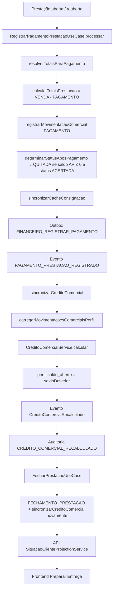

# AUDITORIA FORENSE — Crédito Comercial após Quitação Total

**Prioridade:** P0  
**Tipo:** Auditoria forense (sem correção implementada)  
**Data:** 2026-07-13  
**Banco auditado (somente leitura):** `C:/ProgramData/MercantilFiscal/dados/mercadao.db`  
**Caso reproduzido:** Cliente/perfil com Limite R$ 50 → após QUITADA, UI mostra Crédito disponível R$ 42 (esperado R$ 50)

---

## Veredito

A sincronização de crédito **executou corretamente**. O valor R$ 42 **não é cache stale nem falha de `sincronizarCreditoComercial()`**.

A divergência está na **semântica operacional vs. SSOT**:

| Camada | “Saldo 0 / QUITADA” | Crédito disponível |
|--------|---------------------|--------------------|
| Prestação / Conta Corrente (AR) | `Σ VENDA − Σ PAGAMENTO ≤ 0` → quitação | Não restaura limite sozinha |
| Crédito Comercial (SSOT) | Continua comprometendo **estoque consignado residual** | `50 − 8 = 42` |

**Causa raiz confirmada (evidência DB + código):** na consignação `#3` (QUITADA) restaram **R$ 8 de estoque consignado não liquidado** (4 unidades do produto 1 × R$ 2), sem `DEVOLUCAO` / `PERDA` / `CORTESIA`. O pagamento de R$ 40 quitou o AR (e gerou saldo credor R$ 8), mas **não liquidou o residual físico**.

---

## 1. Fluxo completo da quitação

### 1.1 Fluxograma (execução real)



### 1.2 Stack de métodos (pagamento → crédito → UI)

1. `RegistrarPagamentoPrestacaoUseCase.validar` / `processar`
2. `garantirPrestacaoAberta`
3. `resolverTotaisParaPagamento` → `calcularTotaisPrestacao` (**somente AR da prestação**)
4. `CreditoComercialService.calcularParaPerfil` (log de auditoria operacional — try/catch)
5. `validarPagamentoContraSaldo`
6. `registrarMovimentacaoComercial(..., tipoMovimentacao: 'PAGAMENTO')`
7. `determinarStatusAposPagamento` → `QUITADA`
8. `sincronizarCacheConsignacao`
9. `enfileirarBridgeOutbox(FINANCEIRO_REGISTRAR_PAGAMENTO)`
10. `enfileirarEvento(PAGAMENTO_PRESTACAO_REGISTRADO)`
11. **`sincronizarCreditoComercial`**
    - `carregarMovimentacoesComerciaisPerfil`
    - `CreditoComercialService.calcular`
    - `perfilComercial.atualizar({ saldoAberto })`
    - evento `CREDITO_COMERCIAL_RECALCULADO` / `CreditoComercialRecalculado`
    - `gravarAuditoria(CREDITO_COMERCIAL_RECALCULADO)`
12. `FecharPrestacaoUseCase.processar` → `FECHAMENTO_PRESTACAO` → **`sincronizarCreditoComercial` de novo**
13. Leitura UI: `projectionApi.obterSituacaoCliente` → `SituacaoClienteProjectionService.projetar` → `CreditoComercialService.calcular`
14. `NovaConsignacao._applyClientePerfil` → `buildPainelResumo` (apresenta; **não recalcula SSOT**)

---

## 2. Crédito Comercial — `CreditoComercialService`

**Arquivo SSOT:** `backend/motores/motor-comercial/services/CreditoComercialService.js`  
**Documento oficial:** `CREDITO_COMERCIAL_OFICIAL.md`

| Método | Função |
|--------|--------|
| `calcular({ limiteComercial, movimentacoes })` | **Única fórmula** — calcula métricas |
| `calcularParaPerfil(uow, perfilId)` | Carrega ledger do perfil + chama `calcular` |
| `derivarSaldoDevedor(movimentacoes)` | Alias de `calcular(...).saldoDevedor` |
| `sincronizarCreditoComercial` (orquestrador) | Persiste `perfil.saldo_aberto`, evento e auditoria |
| `montarAuditoriaRecalculo` | Payload `CREDITO_COMERCIAL_RECALCULADO` |

### Fórmula oficial implementada

```
Crédito Disponível = max(0, Limite Comercial − Saldo Devedor)

Saldo Devedor =
  max(0, Σ VENDA_PRESTACAO − Σ PAGAMENTO)                         // AR / Conta Corrente
+ max(0, Σ ENTREGA − Σ DEVOLUCAO − Σ VENDA − Σ PERDA − Σ CORTESIA) // estoque consignado

Saldo Credor = max(0, Σ PAGAMENTO − Σ VENDA_PRESTACAO)
```

**Confirmação:** a expectativa “Crédito = Limite − Saldo Devedor” está correta — **desde que Saldo Devedor = AR + estoque**, não apenas o saldo da prestação.

**Parâmetros de `calcular`:** `limiteComercial`, `movimentacoes[]` (`tipoMovimentacao`, `valor`).  
**Retorno:** `limiteComercial`, `saldoDevedor`, `saldoCredor`, `creditoDisponivel`, `saldoEmAbertoContaCorrente`, `estoqueConsignado`, `totalVendido`, `totalPago`, `totalEntregue`.

---

## 3. Conta Corrente Comercial (após último pagamento)

### Consulta (perfil 1 — caso R$ 50 / R$ 42)

```sql
SELECT limite_comercial, saldo_aberto FROM perfil_comercial WHERE id = 1;
-- limite_comercial = 50, saldo_aberto = 8

SELECT tipo_movimentacao, SUM(valor) AS total
FROM movimentacoes_comerciais
WHERE consignacao_id IN (SELECT id FROM consignacoes WHERE perfil_comercial_id = 1)
GROUP BY tipo_movimentacao;
```

### Resultado após quitação (métricas oficiais recalculadas no probe)

| Métrica | Valor |
|---------|-------|
| Saldo Devedor (AR positivo) | **R$ 0,00** |
| Saldo Credor | **R$ 8,00** (`PAGAMENTO 85 − VENDA 77` no perfil; na consig `#3`: `40 − 32`) |
| Estoque consignado | **R$ 8,00** |
| Saldo Devedor total (SSOT) | **R$ 8,00** |
| Crédito disponível | **R$ 42,00** |

Movimentações “abertas” no sentido de status de documento: **não**. O residual **não é movimento pendente** — é **exposição de estoque** ainda presente no ledger (`ENTREGA` sem liquidação completa).

---

## 4. Ledger Comercial — consignação `#3` (QUITADA)

| id | tipo | valor | grupo |
|----|------|------:|-------|
| 23 | ENTREGA | 20 | — |
| 24 | ENTREGA | 20 | — |
| 25 | ABERTURA_PRESTACAO | — | prest-3-…-iz7knq |
| 26 | VENDA_PRESTACAO | 12 | prest-3-…-iz7knq |
| 27 | VENDA_PRESTACAO | 20 | prest-3-…-iz7knq |
| 28 | FECHAMENTO_PRESTACAO | 32 | prest-3-…-iz7knq |
| 29 | REABERTURA_PRESTACAO | — | prest-3-…-dhyde4 |
| 30 | PAGAMENTO | **40** | prest-3-…-dhyde4 |
| 31 | FECHAMENTO_PRESTACAO | -40 | prest-3-…-dhyde4 |

**Somas consig `#3`:** ENTREGA **40**, VENDA **32**, PAGAMENTO **40**, DEVOLUCAO/PERDA/CORTESIA **0**.

```
estoqueConsignado = 40 − 0 − 32 − 0 − 0 = 8
AR = 32 − 40 = −8 → saldoDevedorAr = 0; saldoCredor = 8
saldoDevedor = 8
credito = 50 − 8 = 42
```

Não há movimento de quitação que zere estoque. `FECHAMENTO_PRESTACAO` **não entra** na fórmula de crédito.

### Itens (prova física do residual R$ 8)

```sql
SELECT * FROM consignacoes_itens WHERE consignacao_id = 3;
```

| produto | qtd entregue | qtd vendida | residual qty | residual R$ |
|---------|-------------:|------------:|-------------:|------------:|
| 1 (R$ 2) | 10 | 6 | **4** | **8** |
| 2 (R$ 1) | 20 | 20 | 0 | 0 |

---

## 5. Perfil Comercial

### Após a quitação (registro real)

| Campo | Valor |
|-------|------:|
| `id` | 1 |
| `cliente_id` | 1 |
| `limite_comercial` | **50** |
| `saldo_aberto` | **8** |
| `updated_at` | 2026-07-13 13:19:07 |

| Quem atualiza? | `sincronizarCreditoComercial` → `uow.perfilComercial.atualizar({ saldoAberto: metricas.saldoDevedor })` |
| Quando? | Após ENTREGA, DEVOLUCAO, VENDA, PERDA, CORTESIA, PAGAMENTO, FECHAMENTO (origens padronizadas) |
| Quem lê? | Central / listagens que usam cache do perfil; **Preparar Entrega usa projeção live**, não o cache isolado |
| Quem utiliza? | Cache operacional; SSOT de exibição de crédito na Nova Entrega = projeção |

**Conclusão:** o cache (`saldo_aberto = 8`) está **alinhado** ao SSOT. Não há dessincronia perfil × ledger neste caso.

---

## 6. Sincronização — `sincronizarCreditoComercial()`

| Pergunta | Resposta com evidência |
|----------|------------------------|
| É executado? | **Sim** |
| Sempre? | Em todos os UCs que alteram ledger listados no SSOT (entrega, devolução, venda, perda, cortesia, pagamento, fechamento) |
| Retorno antecipado? | Só falha hard se `perfilComercialId` nulo |
| Exceção silenciosa? | Apenas bloco de **auditoria** (`catch` sem rethrow). Cálculo + update de perfil **não** são engolidos |
| Feature flag? | **Não** no orquestrador |

**Evidência auditoria `auditoria` (ids 267 e 268):**

```json
{
  "acao": "CREDITO_COMERCIAL_RECALCULADO",
  "perfilComercialId": 1,
  "limiteComercial": 50,
  "saldoDevedor": 8,
  "saldoCredor": 8,
  "creditoDisponivel": 42,
  "origem": "PAGAMENTO_PRESTACAO",
  "consignacaoId": 3,
  "dataHora": "2026-07-13T13:19:06.966Z"
}
```

```json
{
  "origem": "FECHAMENTO_PRESTACAO",
  "saldoDevedor": 8,
  "creditoDisponivel": 42,
  "dataHora": "2026-07-13T13:19:07.007Z"
}
```

O sistema **já sabia** que o crédito era 42 no momento da quitação.

---

## 7. Eventos

| Item | Evidência |
|------|-----------|
| Tipo domínio | `EVENTOS_DOMINIO.CREDITO_COMERCIAL_RECALCULADO` → `'CreditoComercialRecalculado'` (`comercialEventosTipos.js`) |
| Publicação | `sincronizarCreditoComercial` → `enfileirarEvento(...)` |
| Consumo | Pipeline de eventos/outbox do motor (não altera a fórmula; espelha o recálculo) |
| Resultado persistido | Tabela `auditoria` com ação `CREDITO_COMERCIAL_RECALCULADO` (acima) |

Não há indício de evento “perdido” causando crédito errado: o evento registra **42**, igual à UI.

---

## 8. Cache — onde o valor fica “incorreto” para o operador?

| Camada | Valor | Correto segundo SSOT? |
|--------|------:|----------------------|
| Ledger | estoque residual **8** | Sim |
| Conta Corrente (AR) | **0** (credor **8**) | Sim |
| Perfil `saldo_aberto` | **8** | Sim |
| Projeção Situação Cliente | crédito **42** | Sim |
| Frontend Preparar Entrega | **42** | Sim (apresentação fiel) |
| UX Prestação “saldo 0 / QUITADA” | sugere “tudo liberado” | **Não equivalente ao SSOT** |

**Ponto de divergência de expectativa:** entre o **critério de quitação da prestação (AR)** e o **critério de liberação de crédito (AR + estoque)**.

Não há bug de cache entre ledger → perfil → API → frontend neste caso.

---

## 9. Frontend — Preparar Entrega

Caminho completo:

```
NovaConsignacao._applyClientePerfil
  → projectionApi.obterSituacaoCliente({ clienteId })
    → SituacaoClienteProjectionService.consultar + projetar
      → CreditoComercialService.calcular({ limiteComercial, movimentacoes })
  → clienteProfile.creditoDisponivel / limiteDisponivel = situacao.creditoDisponivel
  → buildPainelResumo(...)  // só formata; créditoAposEntrega = creditoApi − valorEntrega
  → PrepararEntregaView (label “Crédito disponível”)
```

Arquivos: `frontend/.../NovaConsignacao/index.js` (~674–690), `prepararEntregaMappers.js`, `PrepararEntregaView.js`.

**Origem do R$ 42:** API/projeção live do ledger — **não** ViewModel paralelo inventando fórmula.

---

## 10. Banco de dados — registros após quitação

### `perfil_comercial` (id=1)

- `limite_comercial = 50`
- `saldo_aberto = 8`

### `consignacoes` (perfil 1)

| id | status | entregue | acertado (cache) | pago | saldo_aberto (cache) |
|----|--------|---------:|-----------------:|-----:|---------------------:|
| 1 | ENCERRADA | 50 | 45 | 45 | 0 |
| 3 | **QUITADA** | 40 | **0** (*) | 40 | **-40** (*) |

(\*) Cache da consignação `#3` está **inconsistente com o ledger** (`valor_total_acertado=0` apesar de VENDAs 32; `saldo_aberto=-40`). Isso é um **defeito secundário de `derivarCamposCacheConsignacao` / fluxo de reabertura+pagamento**, **não** a causa do crédito 42 — o crédito lê o ledger, não esses campos.

### `movimentacoes_comerciais`

Ver seção 4. Perfil 1 agregado: ENTREGA 90, VENDA 77, DEVOLUCAO 5, PAGAMENTO 85 → estoque 8, AR −8, crédito 42.

### Cliente

`cliente_id = 1` ligado ao perfil 1; sem bloqueio (`bloqueado = 0`).

---

## 11. Linha do tempo — onde ocorre a divergência

```
Entrega #3 (R$ 40)                    → crédito ↓ (estoque 40)
       ↓
Prestação 1: VENDAS R$ 32             → estoque 8; AR 32
       ↓
Fechamento 1 (saldo AR 32)            → ACERTADA (estoque 8 permanece)
       ↓
Reabertura prestação
       ↓
Pagamento R$ 40                       → AR ≤ 0; saldoCredor 8; status QUITADA
       ↓
sincronizarCreditoComercial           → saldoDevedor=8; credito=42  ← cálculo CORRETO
       ↓
Fechamento 2                          → mesmo resultado 42
       ↓
Central: sai da fila (QUITADA / AR 0) ← critério de fila ≠ critério de crédito
       ↓
Preparar Entrega mostra R$ 42         ← fiel ao SSOT
```

**Divergência:** imediatamente após o pagamento que zera o AR **sem liquidar o residual de estoque de R$ 8**. A UI de prestação comunica “quitado”; o SSOT de crédito comunica “ainda há exposição de consignado”.

---

## Causa raiz confirmada

1. **Primária (crédito 42):** residual de estoque consignado **R$ 8** na consignação `#3` (4 un. × R$ 2) não liquidado por `DEVOLUCAO`/`PERDA`/`CORTESIA`.  
2. **Mecanismo:** `QUITADA` / saldo da prestação usa **somente** `VENDA − PAGAMENTO` (`calcularTotaisPrestacao`). Crédito usa **AR + estoque** (`CreditoComercialService.calcular`).  
3. **Agravante operacional:** pagamento de R$ 40 sobre vendas de R$ 32 (overpay) gerou `saldoCredor = 8`, que **não** cancela `estoqueConsignado` na fórmula.  
4. **Descartado:** falha de sync, cache de perfil desatualizado, frontend recalculando errado, feature flag, exceção engolindo o recálculo.

Alinhado à auditoria anterior `AUDITORIA_CREDITO_COMERCIAL_ENTERPRISE.md`: consignação encerrada/quitada **com residual** continua comprometendo crédito.

---

## Correção recomendada (NÃO IMPLEMENTADA)

Escolher **uma** política explícita (ADR), sem UPDATE paliativo de `saldo_aberto`:

### Opção A — Governança operacional (preferível se a regra SSOT atual for intencional)

1. Bloquear `QUITADA` / encerramento “total” enquanto `estoqueConsignado` da consignação > 0.  
2. Exigir liquidação do residual (devolução / perda / cortesia) antes do fechamento definitivo.  
3. Na Prestação e na Preparar Entrega, exibir **explicitamente** `estoqueConsignado` e `saldoCredor` além do saldo AR.  
4. Impedir ou alertar pagamento que exceda AR sem liquidar estoque.

### Opção B — Mudança de regra de negócio (só com ADR)

Ao atingir `QUITADA`/`ENCERRADA`, **deixar de contar estoque** daquela consignação no crédito (ou auto-gerar movimento de liquidação). Isso altera o SSOT e exige RFC/ADR — não é hotfix de UPDATE.

### Opção C — Correção colateral (não resolve o P0 sozinha)

Corrigir `derivarCamposCacheConsignacao` / sync pós-reabertura para `valor_total_acertado` e `saldo_aberto` da consignação não ficarem `0` / `-40` com ledger divergente.

**Não recomendado:** forçar `perfil.saldo_aberto = 0` ou `creditoDisponivel = limite` após QUITADA sem liquidar ledger — mascara a exposição real.

---

## Avaliação de impacto da correção

| Módulo | Opção A (governança) | Opção B (mudança SSOT) |
|--------|----------------------|-------------------------|
| Motor Comercial | Validações nos UCs de fechar/quitar; pouca mudança na fórmula | Alterar `CreditoComercialService` + testes oficiais |
| Conta Corrente Comercial | Inalterada (AR) | Pode divergir ainda mais da UX se estoque sumir sem movimento |
| Crédito Comercial | Continua SSOT atual; UI/fluxo passam a respeitar residual | Recálculo histórico de todos os perfis com residual |
| Central de Trabalho | Pode manter cliente em fluxo até liquidar residual (ou novo subestado) | Quitada sumiria da exposição de crédito imediatamente |
| Preparar Entrega | Mostrar estoque residual / bloquear expectativa de limite cheio | Passaria a mostrar 50 no caso atual (se regra mudar) |
| Prestação de Contas | Obrigar liquidação residual antes de “quitação total” | Status QUITADA liberaria crédito mesmo com qty residual |
| Financeiro (espelhamento) | Outbox de pagamento permanece; sem mudança de valor pago | Risco de divergência financeiro × estoque se auto-liquidar |

---

## Evidências anexas (resumo)

| Evidência | Local |
|-----------|-------|
| Fórmula SSOT | `CreditoComercialService.js` L59–90 |
| Sync + evento + auditoria | `sincronizarCreditoComercial.js` |
| Quitação por AR | `prestacaoOperacaoHelpers.js` `calcularTotaisPrestacao` / `determinarStatusAposPagamento` |
| Pagamento chama sync | `RegistrarPagamentoPrestacaoUseCase.js` L195–199 |
| Fechamento chama sync | `FecharPrestacaoUseCase.js` L91–95 |
| UI lê projeção | `NovaConsignacao/index.js` L674–690 |
| DB perfil | `saldo_aberto = 8`, `limite = 50` |
| DB ledger `#3` | ENTREGA 40 / VENDA 32 / PAGAMENTO 40 |
| DB itens `#3` | 4 un. residual × R$ 2 = R$ 8 |
| Auditoria | ids 267–268 → `creditoDisponivel: 42` |

---

## Conclusão

O sistema **não falhou em restabelecer o crédito após quitação financeira**; ele **manteve comprometidos R$ 8 de mercadoria consignada não liquidada**, exatamente conforme a regra oficial `AR + estoque`. A inconsistência percebida é **produto da quitação por Conta Corrente (AR)** sem **liquidação completa do estoque consignado**, com comunicação de UI que equipara “QUITADA” a “limite integralmente livre”.
