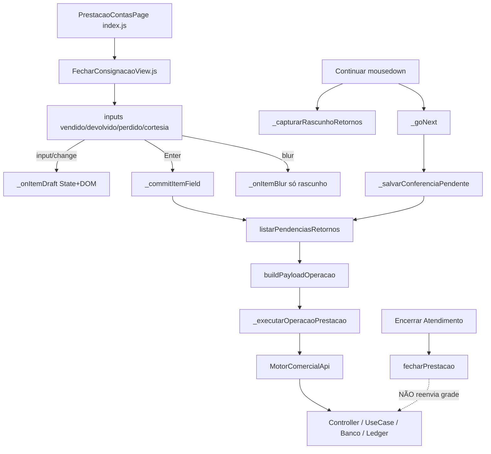

# AUDITORIA FORENSE — Grade da Prestação de Contas

**Prioridade:** P0  
**Tipo:** Auditoria forense Frontend + Fluxo UI (**sem correção de regra**)  
**Data:** 2026-07-13  
**Artefatos de reprodução:**  
- `frontend/modules/motor-comercial/tests/pages/gradePrestacaoForense.test.js` (7/7 ✔)  
- `frontend/modules/motor-comercial/pages/PrestacaoContas/gradeForenseAudit.js` (logs condicionais)  

---

## Conclusão definitiva — **Opção B**

> **Existe pelo menos um cenário em que o operador visualiza corretamente os dados na tela, mas eles não chegam ao backend.**

A Grade **não** é um espelho garantido do banco. Persistência é **explícita e incremental** (Enter / Continuar). Há caminhos em que o DOM mostra destino preenchido e a API/banco não recebem.

Isso **não** prova que no caso `#3` o operador digitou `devolução = 4` e o sistema apagou. Prova que a interface **pode** divergir — hipótese de falha exclusiva “Grade sempre envia o que se vê” fica **eliminada**.

---

## 1. Arquitetura da Grade



### Arquivos

| Camada | Arquivo |
|--------|---------|
| Page / orquestração | `pages/PrestacaoContas/index.js` |
| View grade | `pages/PrestacaoContas/FecharConsignacaoView.js` |
| ViewModel / deltas | `pages/PrestacaoContas/fecharConsignacaoMappers.js` |
| API client | `api/MotorComercialApi.js` |
| Logger forense | `pages/PrestacaoContas/gradeForenseAudit.js` |
| Teste reprodução | `tests/pages/gradePrestacaoForense.test.js` |

---

## 2. Ciclo de edição (quando persiste?)

| Evento | Vendido | Devolvido | Perdido | Cortesia |
|--------|---------|-----------|---------|----------|
| Digitar (`input`) | Só rascunho State+DOM | idem | idem | idem |
| `change` | Só rascunho | idem | idem | idem |
| `blur` | Só rascunho (**não** API) | idem | idem | idem |
| **Enter** | **Commit linha** (deltas) | idem | idem | idem |
| **Continuar** (step Retornos) | **Salva todas pendências** | idem | idem | idem |
| Encerrar | **Não** reenvia grade | — | — | — |
| Debounce | **Não existe** | | | |
| Autosave | **Não existe** | | | |

`onItemQtyChange → _commitItemField` existe no ctx, mas a View **não** chama — `change` só emite draft.

---

## 3. Commit — `_commitItemField`

| Pergunta | Resposta |
|----------|----------|
| Quem chama? | Enter (`_onItemKeydown`); **não** blur; **não** change |
| Quando? | Só no Enter do campo numérico |
| Pode deixar de ser chamado? | **Sim** — digitação + Continuar usa `_salvarConferenciaPendente` em vez disso; digitação sem Enter/Continuar = **nunca** |
| Return antecipado? | `campo === observacao`; item ausente; `pendencias.length === 0` |
| Condição silenciosa? | Reload silencioso zera State a partir do servidor **depois** de capturar rascunho (ok se rascunho veio do DOM) |

---

## 4. Estado da tela — DOM × State

| Situação | DOM | State (`resumoPrestacao.itens`) |
|----------|-----|----------------------------------|
| Digitando | Novo valor | Atualizado por `_onItemDraft` |
| Após `_reloadResumoSilencioso` | Pode manter rascunho | Volta ao servidor |
| Após `patchLinhaRetorno` (campo sem foco) | **Sobrescrito pelo servidor** | Servidor |

**Divergência possível e reproduzida (teste B3):** DOM mostra `devolvido=4`; após patch com item servidor (`devolvido=0`), DOM passa a `0` sem o operador apagar.

Comentário histórico no código (Electron): blur + Continuar **já** descartou rascunho no passado; mitigação atual = mousedown captura snapshot + blur não reverte.

---

## 5 / 11. Logs instrumentados

Ativar no DevTools:

```js
window.__CDS_FORENSE_GRADE__ = true
// ou localStorage.setItem('CDS_FORENSE_GRADE', '1')
```

Fases: `GRADE` → `STATE` → `COMMIT` → `PAYLOAD` → `API`.  
Buffer: `window.__CDS_FORENSE_GRADE_LOGS__`.  
**Default OFF** (no-op) — não altera regra.

---

## 6. Eventos

| Evento | Commit API? |
|--------|-------------|
| input / change | Não |
| blur | Não |
| keydown Enter | **Sim** (`_commitItemField`) |
| Tab / setas | Não (só navegação; `_skipNextBlur`) |
| Escape | Reverte input visual; State pode ficar dessincronizado até próximo draft |
| Continuar click | **Sim** (`_salvarConferenciaPendente`) após mousedown snapshot |
| Encerrar | **Não** (só `fecharPrestacao`) |

---

## 7. Debounce / autosave / fila

| Mecanismo | Existe? |
|-----------|---------|
| Debounce | **Não** |
| Autosave | **Não** |
| Fila | Sequencial `await` nas pendências |
| Promise pendente | Enter e Continuar são async; Continuar desabilita botão enquanto `salvandoConferencia` |

**“Digita → Encerrar imediato”:** Encerrar só existe no step 3. Para chegar lá é obrigatório Continuar no step Retornos (que aguarda save). Encerrar **em si** não espera grade — porque a grade já deveria ter sido salva no Continuar anterior. Se o operador **Volt assaltou** a grade depois do Continuar e editou de novo, precisa Continuar outra vez; Encerrar **não** recolhe esses edits.

---

## 8. Corrida (Race)

| Race | Risco | Mitigação atual | Residual |
|------|-------|-----------------|----------|
| Blur Electron × Continuar | Perdia rascunho | mousedown + snapshot | Se snapshot falhar, fallback no click |
| Enter commit × Continuar paralelo | Duplo delta | Botão Continuar desabilita só no Continuar | Enter não seta `salvandoConferencia` |
| Reload + `patchLinhaRetorno` | Apaga rascunho em campo sem foco | — | **Confirmado no teste B3** |
| Devolução após venda | DOM com devolução; bloqueio local | Mensagem de erro | Valor **visível** ≠ persistido |

---

## 9. Fluxo incremental

Ordem das pendências: **devolução → venda → perda → cortesia**.  
Continuar: `await` cada `_persistirPendencia` antes de avançar; se qualquer falha → **não avança**.  
Encerrar: **não** itera pendências da grade.

Bloqueio explícito no frontend:

```889:896:frontend/modules/motor-comercial/pages/PrestacaoContas/index.js
    if (tipo === 'devolucao') {
      if (this.prestacaoPronta || this.consignacao?.prestacaoContasAtiva?.status === 'ABERTA') {
        throw new Error(
          'Devolução indisponível após o início das vendas. ...'
        );
      }
```

---

## 10. Reprodução do caso #3

Parâmetros: Entrega 10 · Venda 6 · Devolução 4.

| Cenário | Resultado do teste | DOM | Payload | Banco simulado |
|---------|--------------------|-----|---------|----------------|
| Lento: preenche ambos → captura Continuar | ✔ | 6/4 | devolução 4 + venda 6 | 6/4 |
| Rápido: digita → snapshot imediato | ✔ | 6/4 | idem | 6/4 |
| Feliz: aplica deltas | ✔ | 6/4 | sim | 6/4 |
| Venda já salva + digita devolução 4 + bloqueio pós-abertura | ✔ **B2** | **mostra 4** | **não envia** | devolvido **0** |
| Draft sem commit | ✔ B1 | mostra 6/4 | só candidato | 0/0 até Continuar |
| patch após reload | ✔ B3 | **4 → 0** | — | — |
| Encerrar | ✔ B4 | pode mostrar 4 | **[]** | inalterado |

Comando:

```bash
npx jest --config frontend/modules/motor-comercial/jest.config.js frontend/modules/motor-comercial/tests/pages/gradePrestacaoForense.test.js
```

**Resultado:** 7 passed.

### Ligação com o caso real `#3` (DB)

No banco real: `vendida=6`, `devolvida=0`, sem movimento `DEVOLUCAO`, snapshot de fechamento com `saldo: 4`.  
Compatível com:

1. operador só confirmou venda 6 (nunca confirmou devolução 4), **ou**  
2. tentou devolução **depois** da venda (DOM podia mostrar 4; bloqueio impediu API; depois avançou só com venda).

Não há log de API de devolução rejeitada no SQLite; (2) é possível sem deixar rastros no ledger.

---

## 12. Timeline

```
Operador digita
  → input → State+DOM (GRADE log)
  → blur → mantém rascunho (sem API)
  → Enter → COMMIT → rascunho → reload → pendências → PAYLOAD → API → Banco/Ledger
     OU
  → Continuar mousedown → snapshot DOM
  → Continuar click → STATE/PAYLOAD → await todas APIs → avança step
  → (steps pagamento / conferência)
  → Encerrar → fecharPrestacao (NÃO relê grade)
```

**Onde nasce inconsistência possível:** entre **valor visível em rascunho** e **ausência de commit bem-sucedido** (incluindo bloqueio de devolução pós-venda e patch que zera DOM).

---

## Comparação final

| Camada | Caso feliz (6+4 juntos no Continuar) | Caso B2 (venda primeiro) |
|--------|--------------------------------------|---------------------------|
| DOM | 6 / 4 | 6 / **4** |
| State após reload | 6 / 4 | 6 / 0 |
| Payload | devolução+venda | devolução **bloqueada** |
| Banco | 6 / 4 | 6 / **0** |
| Ledger | DEVOLUCAO+VENDA | só VENDA |

---

## Critério de aceite

| Opção | Status |
|-------|--------|
| A — Grade sempre envia exatamente o que o operador visualiza | **REFUTADA** |
| **B — Existe cenário visual ≠ backend** | **CONFIRMADA** (testes B2, B3, B1) |

---

## Implicação para a próxima mudança de regra

Antes de endurecer “tudo precisa de destino” no Motor Comercial, a Grade deve garantir que:

1. o que está visível no step Retornos seja commitado ou bloqueie avanço;  
2. devolução não fique “fantasma” no DOM após venda;  
3. `patchLinhaRetorno` / reload não apague rascunho não commitado sem aviso.

Esta auditoria **não implementou** essas correções — apenas instrumentação condicional + testes forenses.

---

## Resumo executivo

A Grade trabalha com **rascunho visual** e **persistência sob demanda**. Por isso **pode** mostrar `devolução = 4` sem o backend receber. No caso `#3` histórico, o ledger prova ausência de devolução; a Grade explica **como** isso pode ocorrer mesmo com o operador “vendo” o número — sem contradizer a evidência de que a confirmação efetiva (API) nunca aconteceu.
