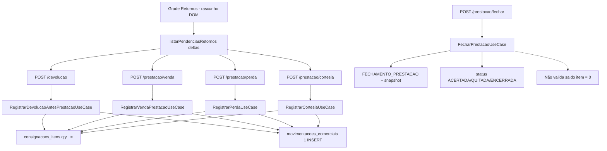

# AUDITORIA FORENSE — Persistência da Prestação de Contas

**Prioridade:** P0  
**Tipo:** Auditoria forense (**sem correção implementada**)  
**Data:** 2026-07-13  
**Banco (somente leitura):** `C:/ProgramData/MercantilFiscal/dados/mercadao.db`  
**Caso âncora:** consignação `#3` (QUITADA) — crédito 42 vs limite 50  

**Regra oficial a validar:** após a Prestação, toda quantidade entregue deve terminar em VENDA, DEVOLUÇÃO, PERDA ou CORTESIA. Não pode restar mercadoria sem destino.

---

## Veredito

A inconsistência **não** nasce no Crédito Comercial nem em “projeção inventando estoque residual”.

Ela nasce porque a Prestação **permite encerrar com unidades sem destino**, e o banco **persiste exatamente** essa grade incompleta.

No caso `#3` / item `#3`:

| Campo | Valor persistido |
|-------|-----------------:|
| Entregue | 10 |
| Vendida | 6 |
| Devolvida | 0 |
| Perdida | 0 |
| Cortesia | 0 |
| **Saldo sem destino** | **4** (= R$ 8) |

O snapshot de `FECHAMENTO_PRESTACAO` (movs 28 e 31) já registra `saldo: 4` nesse item. O sistema **sabia** e **aceitou**.

**Causa raiz confirmada:** ausência de barreira obrigatória (UI + Use Case) que imponha  
`ENTREGUE = VENDIDO + DEVOLVIDO + PERDA + CORTESIA` antes de fechar/quitar.  
O que foi gravado é fiel ao que foi registrado; o que falta são os destinos das 4 unidades.

---

## 1. Grade da Prestação

### Colunas

UI (`FecharConsignacaoView` / retornos): **Vendido, Devolvido, Perda, Cortesia** (+ saldo local).

### A soma sempre fecha?

**Não.**

A grade calcula saldo local:

```
saldo = entregue − vendido − devolvido − perdido − cortesia
```

Se `saldo > 0`, a UI emite apenas **aviso** (`warning`), não bloqueio:

```389:393:frontend/modules/motor-comercial/pages/PrestacaoContas/fecharConsignacaoMappers.js
  if (painel.pendentes > 0) {
    avisos.push({
      message: `Ainda existem ${painel.pendentes} unidade(s) sem destino (venda, devolução, perda ou cortesia)`,
      nivel: 'warning'
    });
  }
```

**Situação possível e observada:** sobra quantidade **sem classificação** e o fluxo continua até Encerrar / Receber / QUITADA.

---

## 2. Fluxo da UI → Banco



### Stack

| Camada | Arquivo / símbolo |
|--------|-------------------|
| Grade | `PrestacaoContas/FecharConsignacaoView.js` |
| ViewModel / deltas | `fecharConsignacaoMappers.js` → `listarPendenciasRetornos`, `buildPayloadOperacao` |
| Persistência de linha | `PrestacaoContas/index.js` → `_commitItemField`, `_salvarConferenciaPendente` |
| Encerrar | `_encerrarAtendimento` → `api.fecharPrestacao` |
| API client | `MotorComercialApi.js` |
| Rotas | `comercial.routes.js` |
| Controller | `ConsignacaoController.js` |
| UCs | `Registrar*UseCase`, `FecharPrestacaoUseCase` |
| Item + ledger | `consignacaoOperacaoHelpers.js` → `calcularSaldoItem`, `registrarMovimentacaoComercial` |

### Colunas enviadas?

Sim, **por delta incremental** (não há “salvar grade” batch):

| Campo UI | Endpoint | Payload |
|----------|----------|---------|
| Devolvido | `POST …/devolucao` | `{ itemId, quantidade: delta }` |
| Vendido | `POST …/prestacao/venda` | idem |
| Perda | `POST …/prestacao/perda` | idem |
| Cortesia | `POST …/prestacao/cortesia` | idem |

Ordem dos deltas: devolução → venda → perda → cortesia.

**Importante:** valores só digitados (blur/input) **não** vão ao banco até Enter / Continuar. Isso pode “perder” digitação não confirmada — mas no caso `#3` o fechamento **já** gravou saldo 4 no snapshot, então as 4 unidades estavam sem destino **no servidor** no momento do encerramento.

---

## 3. Persistência — o banco recebe o que o operador registrou?

### Consignação `#3` — `consignacoes_itens`

| item | produto | entregue | vendida | devolvida | perdida | cortesia | saldo qty | R$ residual |
|------|--------:|---------:|--------:|----------:|--------:|---------:|----------:|------------:|
| 3 | 1 | 10 | 6 | 0 | 0 | 0 | **4** | **8** |
| 4 | 2 | 20 | 20 | 0 | 0 | 0 | 0 | 0 |

`updated_at` do item 3: `2026-07-13 05:25:02` — bate com as vendas (movs 26/27). **Nenhuma atualização posterior** de devolução/perda/cortesia.

### Controles

| Consignação | Item | Fecha `E=V+D+P+C`? |
|-------------|------|--------------------|
| `#1` | 1 | **Sim** (50 = 45+5) |
| `#2` | 2 | **Sim** (200 = 150+40+10) |
| `#3` | 3 | **Não** (10 ≠ 6) |
| `#3` | 4 | **Sim** |

Conclusão: o banco persiste fielmente o que foi registrado via API. No item 3, **nunca chegou** destino para as 4 unidades.

---

## 4. Ledger Comercial

### Consignação `#3` — movimentos relevantes

| id | tipo | item | qty | valor |
|----|------|-----:|----:|------:|
| 23 | ENTREGA | 3 | 10 | 20 |
| 24 | ENTREGA | 4 | 20 | 20 |
| 25 | ABERTURA_PRESTACAO | — | — | — |
| 26 | VENDA_PRESTACAO | 3 | **6** | 12 |
| 27 | VENDA_PRESTACAO | 4 | 20 | 20 |
| 28 | FECHAMENTO_PRESTACAO | — | — | 32 |
| 29 | REABERTURA_PRESTACAO | — | — | — |
| 30 | PAGAMENTO | — | — | 40 |
| 31 | FECHAMENTO_PRESTACAO | — | — | -40 |

**Ausentes para o residual do item 3:** `DEVOLUCAO`, `PERDA`, `CORTESIA` (e venda das 4 un.).

### Snapshot no fechamento (evidência de ciência)

FECHAMENTO id 28 e id 31 — itens no snapshot:

```json
{ "id": 3, "qE": 10, "qV": 6, "qD": 0, "qP": 0, "qC": 0, "saldo": 4 }
{ "id": 4, "qE": 20, "qV": 20, "qD": 0, "qP": 0, "qC": 0, "saldo": 0 }
```

O ledger registra um movimento por operação bem-sucedida. **Não inventa** destino. Unidades sem movimento de destino permanecem como exposição no crédito.

---

## 5. Crédito Comercial — origem de `estoqueConsignado`

`CreditoComercialService.calcular` (SSOT):

```
estoqueConsignado = max(0,
  Σ ENTREGA − Σ DEVOLUCAO − Σ VENDA_PRESTACAO − Σ PERDA − Σ CORTESIA
)
```

**Utiliza os quatro destinos oficiais** (valores do ledger), **não** apenas `ENTREGA − VENDA`.

No caso `#3` (valores):

```
40 − 0 − 32 − 0 − 0 = 8
```

Equivale ao residual físico: `4 un. × R$ 2`.

O crédito **interpreta corretamente** os dados persistidos. Não há bug de fórmula omitindo DEVOLUÇÃO/PERDA/CORTESIA neste incidente (esses tipos simplesmente **não existem** no ledger do residual).

---

## 6. Evidências SQL (consultas realizadas)

```sql
SELECT id, consignacao_id, produto_id,
       quantidade_entregue, quantidade_vendida, quantidade_devolvida,
       quantidade_perdida, quantidade_cortesia, preco_unitario
FROM consignacoes_itens
WHERE consignacao_id IN (1,2,3)
ORDER BY consignacao_id, id;

-- saldo_restante = entregue - vendida - devolvida - perdida - cortesia
```

```sql
SELECT id, consignacao_id, consignacao_item_id, tipo_movimentacao,
       valor, quantidade, created_at
FROM movimentacoes_comerciais
WHERE consignacao_id = 3
ORDER BY id;
```

```sql
SELECT id, valor, snapshot
FROM movimentacoes_comerciais
WHERE consignacao_id = 3 AND tipo_movimentacao = 'FECHAMENTO_PRESTACAO';
```

**Resultado:** existe mercadoria sem destino **persistida** (não é só erro de projeção).

---

## 7. Consistência por item

Regra oficial:

```
ENTREGUE = VENDIDO + DEVOLVIDO + PERDA + CORTESIA
```

| Item | Diferença | Onde surgiu | Impacto no crédito |
|------|----------:|-------------|--------------------|
| `#3`/item 3 | **4 un. / R$ 8** | Grade permitiu avançar; `FecharPrestacaoUseCase` não bloqueou; nenhum UC de destino foi chamado para as 4 un. | `estoqueConsignado += 8` → crédito 42 |
| Demais itens auditados | 0 | — | — |

### Camada da falha

| Camada | Comportamento |
|--------|----------------|
| Grade / ViewModel | Avisa `pendentes`, **não impede** |
| API venda/perda/cortesia/devolução | Persiste só o que recebe |
| `FecharPrestacaoUseCase` | **Não** valida `calcularSaldoItem === 0` |
| `SaldoPrestacaoInconsistenteError` | Existe no domínio, **nunca é lançado** |
| Ledger | Fiel; sem movimento fantasma |
| Crédito | Fiel ao ledger |

---

## 8. Linha do tempo — onde nasce a inconsistência

```
Operador informa grade (item 3: vendido 6 de 10)
        ↓
Frontend: aviso soft de unidades sem destino
        ↓
API: só persiste VENDA qty 6  ← destinos das 4 un. NÃO enviados
        ↓
consignacoes_itens: vendida=6, saldo implícito=4
        ↓
Ledger: VENDA_PRESTACAO 6; sem D/P/C para o residual
        ↓
Fechar: snapshot com saldo=4; status segue  ← GATE AUSENTE
        ↓
Pagamento 40 / QUITADA (AR)
        ↓
Crédito: estoqueConsignado=8 → disponível 42
        ↓
Preparar Entrega: mostra 42 (correto perante ledger incompleto)
```

**Etapa da inconsistência:** entre a grade (aceitar saldo > 0) e o fechamento (aceitar snapshot com saldo > 0).  
**Não** na interpretação do crédito.

---

## Evidências resumidas

### Grade
- Quatro destinos editáveis; persistência por delta.
- `buildValidacoesFinais`: pendentes = **warning**.
- `_encerrarAtendimento`: só confirma + `fecharPrestacao` — sem checar saldo item.

### API
- Endpoints separados por destino; fechar não fecha destinos faltantes.

### Banco
- Item 3: `10 ≠ 6+0+0+0`.

### Ledger
- Snapshot de fechamento com `saldo: 4` (duas vezes).

### Crédito
- Fórmula completa com D/V/P/C; valor 8 derivado do ledger real.

---

## Causa raiz confirmada

1. **Persistência da grade incompleta é permitida** até o fechamento.  
2. No caso `#3`, **4 unidades nunca receberam destino** em item nem em ledger.  
3. O “estoque residual” do crédito é a **projeção correta** dessa inconsistência operacional/persistida — não um conceito de negócio paralelo inventado pelo serviço.  
4. Diante da regra oficial CDS (“não pode existir mercadoria sem destino após a Prestação”), o defeito é: **a Prestação não impõe essa regra na gravação/fechamento**.

Hipótese secundária (não provada nem necessária para o caso): digitação em rascunho DOM sem Continuar/Enter não persiste. No `#3`, o servidor já tinha saldo 4 no fechamento — a falha principal é o **gate ausente**, não corrupção pós-gravação.

---

## Correção recomendada (NÃO IMPLEMENTAR)

Alinhada à política A de `AUDITORIA_POLITICA_LIQUIDACAO_ESTOQUE_RESIDUAL.md`:

1. **Bloquear** Continuar / Encerrar / QUITADA enquanto `∃ item | calcularSaldoItem(item) > 0`.  
2. Promover o aviso atual de `warning` → **`danger` + hard stop**.  
3. Em `FecharPrestacaoUseCase`, lançar `SaldoPrestacaoInconsistenteError` (já existente) se qualquer item tiver saldo > 0.  
4. Opcional: endpoint/consulta de auditoria `prestacoes_com_saldo_item > 0`.  
5. **Não** alterar a fórmula do `CreditoComercialService` para “ignorar” o residual — isso mascararia grade incompleta.

Remediação de dados do caso `#3` (fora desta auditoria): registrar destino oficial das 4 un. (devolução/perda/cortesia/venda) via fluxo legítimo — **não** UPDATE manual de crédito.

---

## Conclusão

| Pergunta | Resposta |
|----------|----------|
| A grade grava corretamente o que foi confirmado via API? | **Sim** |
| O banco persiste corretamente? | **Sim** |
| O ledger registra corretamente cada destino enviado? | **Sim** |
| O Crédito interpreta corretamente? | **Sim** |
| A regra oficial “tudo precisa de destino” é aplicada? | **Não** — UI e Fechar permitem saldo item > 0 |
| Onde a informação “deixou de ser registrada”? | **Nunca foi enviada** destino para 4 un.; o fechamento aceitou assim |

Nenhuma alteração de código, ledger, saldo ou crédito foi realizada nesta auditoria.
