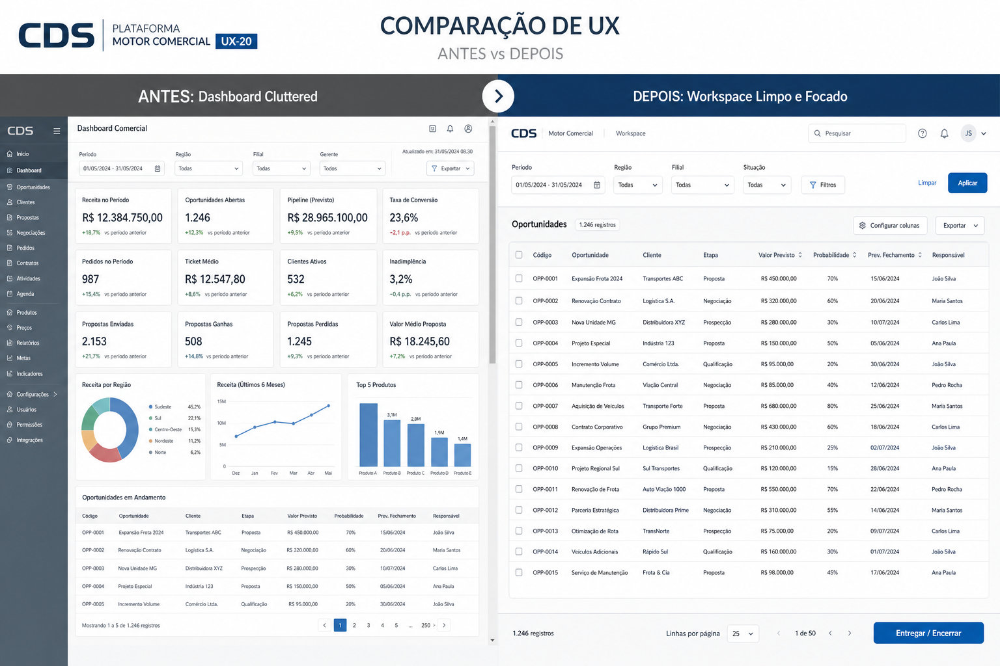
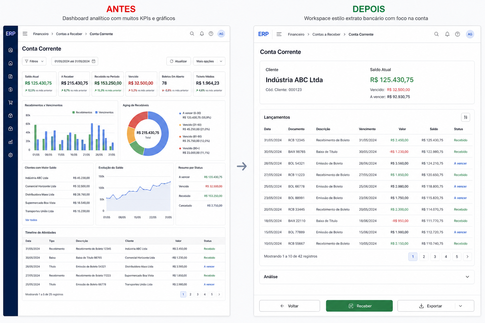

# AUDITORIA UX-20 — Operação Primeiro

**Data:** 2026-07-13  
**Sprint:** UX-20  
**Escopo:** Prestação · Conta Corrente · Preparar Entrega · Entrega  

**Não alterado:** Banco, APIs, Ledger, Recovery, Crédito Comercial, Outbox, Eventos, STAB-03/04 (persistência).

---

## 1. Entregas

| Tela | Rota | Shared UI | Estado |
|------|------|-----------|--------|
| Prestação Locator | `/prestacao` | Workspace + SmartSearch + EntityCard | Homologado |
| Prestação Estação | `/consignacoes/:id/prestacao` | Workspace; grade fill + scroll interno | Homologado |
| Conta Corrente | `/conta-corrente` | Workspace; Extrato + Análise recolhida | Homologado |
| Preparar Entrega | `/consignacoes/nova` | Workspace; 1 faixa de crédito | Homologado |
| Entrega | `/consignacoes/:id/entrega` | Workspace; confirmação fina + Entregar fixo | Homologado |

Antes × Depois (ilustrações):

---

## 2. Respostas obrigatórias

### O operador executa mais rápido?

**Sim.** Fluxos principais abrem direto na tarefa (localizar / extrato / produtos / confirmar), sem muro de KPIs nem sidebars de “assistente”.

### Houve redução de cliques?

**Sim.**
- Prestação: Central → `/prestacao` → 1 clique Prestar Contas (sem filtros de lista).
- Conta Corrente: Receber no footer (sem caçar CTA).
- Preparar: sem navegar assistente lateral.
- Entrega: Entregar sempre no footer; sem ler checklist de 8 itens.

### Existe scroll de página?

**Não** nos shells Workspace (`overflow: hidden` no root).  
Scroll apenas em: body Workspace (listas/extrato) ou grade de retornos (container dedicado).

### Existe informação duplicada?

**Reduzida ao mínimo operacional.** Removidos: sidebar Prestação, assistente Preparar, StatCards/checklist/impacto Entrega, KPIs Conta no viewport.  
Totais ainda aparecem uma vez por etapa quando necessários (pagamento/encerrar).

### O próximo passo está evidente?

**Sim.** Footer fixo com uma ação primária por etapa (Continuar / Encerrar / Receber / Entregar / Concluir).

### O Shared UI foi utilizado corretamente?

**Sim.** Workspace (+ Header/Body/Footer) em todas as quatro estações; SmartSearch + EntityCard no Locator. Sem forks locais desses componentes.

### Componentes do Motor Comercial que devem migrar ao Shared UI?

| Atual | Destino sugerido |
|-------|------------------|
| Grade STAB-04 Prestação | `OperationalGrid` |
| Stepper Preparar | `Stepper` / `Wizard` shared |
| Faixa de crédito Preparar | `CreditStrip` |
| Botões de rodapé | `ActionBar` |
| Banner Pronto/Bloqueado Entrega | `StateIndicator` |

---

## 3. Validação

- `CDS_BUILD_SPRINT=UX-20 npm run build:motor-comercial`
- `npm run verify:motor-comercial` → PASSED
- Jest telas Workspace + STAB-04 relevantes

---

## 4. Homologação

UX-20 conclui a identidade operacional das **quatro telas principais** do Motor Comercial sobre Shared UI: localizar, extratar, preparar e entregar — com foco em rapidez, clareza e zero scroll de página.
