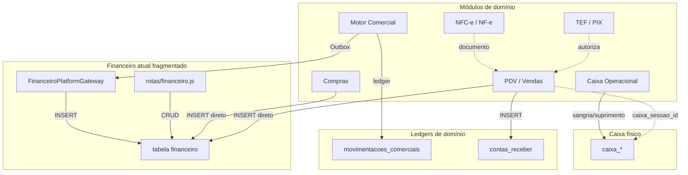

# FIN-01 — Auditoria de Arquitetura Financeira da Plataforma CDS

**Código:** FIN-01  
**Status:** AUDITORIA ARQUITETURAL (sem implementação)  
**Data:** 2026-07-13  
**Escopo:** Toda a Plataforma CDS — quem movimenta dinheiro, quem grava caixa/AR/AP, bypasses e acoplamentos

---

## 1. Diretriz oficial consolidada

> **Nenhum módulo movimenta dinheiro diretamente no caixa da empresa.**  
> Cada módulo executa apenas seu domínio e publica **eventos financeiros**.  
> O **Motor Financeiro** é a única autoridade (SSOT) sobre Caixa, Banco, Fluxo de Caixa, AR, AP, Conciliação e saldos financeiros.

Esta auditoria mapeia o **estado atual** (as-is) e prepara a migração para o **to-be** documentado em FIN-03 / FIN-04 / ADR.

---

## 2. Achados estruturais críticos

| Item | Situação atual |
|------|----------------|
| Pasta / motor `motor-financeiro/` | **Não existe** |
| Tabela `contas_pagar` | **Não existe** — AP = `financeiro` com `tipo='despesa'` |
| Tabelas `saldo_banco` / `fluxo_caixa` | **Não existem** |
| Escritores da tabela `financeiro` | **Múltiplos** (PDV, Compras, Financeiro API, Contas Receber, Bridge Comercial) |
| Caixa operacional (`caixa_*`) | **Subsystemo separado** — sangria/suprimento **não** espelham em `financeiro` |
| Motor Comercial | Ledger próprio + Outbox → Bridge → `INSERT financeiro` |
| E-commerce / Compra Fácil | **Ausente** no repositório |
| Ledger bancário dedicado | **Ausente** |

---

## 3. Quem movimenta dinheiro hoje?

| Módulo | Movimenta dinheiro? | Como? | SSOT? |
|--------|---------------------|-------|-------|
| **Financeiro ERP** (`rotas/financeiro.js`) | Sim | INSERT/UPDATE `financeiro`, baixa AR/AP, pagamento parcial | Parcial (API canônica, mas não exclusiva) |
| **PDV / Vendas** | Sim | `VendaPagamentoService` grava `financeiro` + `contas_receber` direto | **Não — bypass** |
| **Compras** | Sim | `criarFinanceiroCompra` grava despesa em `financeiro` | **Não — bypass** |
| **Contas a Receber** (`rotas/contas_receber.js`) | Sim | Baixa AR + INSERT/UPDATE `financeiro` | **Não — dual-path** |
| **Caixa** (`rotas/caixa.js`) | Sim (caixa físico) | `caixa`, `caixa_movimentacoes`, sangria/suprimento | **Não — desacoplado do ledger** |
| **Motor Comercial** | Sim (indireto) | Outbox → FinanceiroBridge → `FinanceiroPlatformGateway` | Parcial (único com evento/outbox) |
| **TEF / PIX** | Não (ledger) | Autorização / cobrança; dinheiro entra via venda | Infra de pagamento |
| **NFC-e / NF-e** | Não | Documento fiscal | Domínio fiscal |
| **Conta Corrente Comercial** | Não (caixa empresa) | Projeção do ledger comercial | Domínio crédito consignado |
| **Produção / E-commerce** | N/A | Não implementados | — |

---

## 4. Inventário de tabelas financeiras

| Tabela | Papel |
|--------|--------|
| `financeiro` | Ledger unificado receita/despesa (AR pendente + AP + baixas) |
| `contas_receber` | Parcelas AR de vendas PDV |
| `contas_receber_pagamentos` | Histórico de pagamentos parciais AR |
| `venda_pagamentos` / `venda_recebimentos` | Snapshot da venda (não é SSOT financeiro) |
| `caixa` / `caixa_sessoes` / `caixa_movimentacoes` / `caixa_fechamentos` | Turno e movimentações de caixa PDV |
| `auditoria_caixa` | Audit trail de caixa |
| `caixas` | Cadastro de caixas físicos |
| `tef_*` / `pix_cobrancas` | Infra TEF/PIX |
| `movimentacoes_comerciais` | Ledger domínio comercial (crédito consignação) |
| `perfis_comerciais.saldo_aberto` | Cache de crédito comercial |

---

## 5. Classificação de escritas (código)

### 5.1 ESCRITA_DIRETA_CAIXA

| Origem | Path âncora | Operações |
|--------|-------------|-----------|
| Caixa PDV/ERP | `backend/rotas/caixa.js` | Abertura, sangria, suprimento, fechamento |

**Gap:** sangria/suprimento **não** geram lançamento em `financeiro`.

### 5.2 ESCRITA_AR (contas a receber / receita)

| Origem | Path âncora | Bypass MF? |
|--------|-------------|------------|
| Financeiro API | `backend/rotas/financeiro.js` | Canônico |
| Contas Receber legado | `backend/rotas/contas_receber.js` | Dual-path |
| PDV prazo/vista | `backend/services/vendas/VendaPagamentoService.js` | **Forte** |
| Cancelamento/devolução | `VendaFinanceiroService.js` | **Forte** |
| Bridge Comercial | `FinanceiroPlatformGateway.js` | Via Outbox (ainda SQL direto na tabela) |

### 5.3 ESCRITA_AP (contas a pagar / despesa)

| Origem | Path âncora | Bypass MF? |
|--------|-------------|------------|
| Financeiro API (despesa manual / baixa) | `financeiro.js` | Canônico |
| Compras | `backend/rotas/compras.js` → `criarFinanceiroCompra` | **Forte** |
| Perda consignação | Bridge `registrarPerda` | Via Outbox |

### 5.4 ESCRITA_BANCO

**Zero ocorrências** de ledger bancário / saldo_banco / conciliação bancária de extrato.

### 5.5 EVENTO_OUTBOX (único caminho event-driven)

| Evento Outbox | UC Comercial | Gateway |
|---------------|--------------|---------|
| `FinanceiroLancarReceita` | RegistrarVendaPrestação | `registrarReceitaConsignacao` |
| `FinanceiroRegistrarPagamento` | RegistrarPagamentoPrestação | `registrarRecebimento` |
| `FinanceiroRegistrarPerda` | RegistrarPerda | `registrarPerda` |

---

## 6. Fluxos financeiros mapeados

### 6.1 PDV — Venda à vista

```
PDV → OrquestradorPagamento → VendaPagamentoService
  → INSERT vendas / venda_pagamentos / venda_recebimentos
  → INSERT financeiro (receita, status=recebido)
  → (opcional) NFC-e
  → caixa_sessao_id na venda (fechamento agrega; sem mov. unitária)
```

### 6.2 PDV — Venda a prazo

```
PDV → VendaPagamentoService
  → INSERT contas_receber (N parcelas)
  → INSERT financeiro (N linhas pendentes)
  → UPDATE clientes.credito_atual
```

### 6.3 Motor Comercial — Pagamento prestação

```
Prestação → RegistrarPagamentoPrestacaoUseCase
  → INSERT movimentacoes_comerciais (PAGAMENTO)
  → Outbox FinanceiroRegistrarPagamento
  → Bridge → INSERT financeiro (receita já recebido)
  → sincronizarCreditoComercial
```

**Não** grava caixa PDV. **Não** atualiza `contas_receber` do PDV.

### 6.4 Conta Corrente Comercial — “Recebimento”

```
UI Conta Corrente → Projection (leitura ledger)
  → Ação “Recebimento” navega para Financeiro ERP (contexto)
```

Conta Corrente comercial é **read model de domínio**, não caixa da empresa.

### 6.5 Compras — Pagamento fornecedor

```
Compras → criarFinanceiroCompra
  → DELETE+INSERT financeiro (despesa, origem=compra)
```

### 6.6 TEF

```
TEF autoriza → tef_transacoes
  → Venda grava financeiro (não o TEF)
```

### 6.7 PIX

```
A) PIX via TEF (pinpad) → mesmo pipeline da venda
B) pix_cobrancas (Mercado Pago/Stone) → paralelo, fraco acoplamento
```

### 6.8 Baixa AR no Financeiro ERP

```
financeiro-receber.js → POST /receber/:id/baixar
  → UPDATE financeiro status=recebido
  → (exige caixa aberto em alguns fluxos)
```

---

## 7. Diagrama as-is (acoplamentos)



---

## 8. Duplicidades e riscos

| # | Risco | Severidade |
|---|-------|------------|
| 1 | Dual AR: ledger comercial × `contas_receber` PDV | Alta |
| 2 | Dual crédito: `perfil_comercial` × `clientes.credito_atual` | Alta |
| 3 | Múltiplos writers em `financeiro` sem coordenação | Alta |
| 4 | Caixa desacoplado (sangria sem espelho financeiro) | Média |
| 5 | Bridge Comercial lança já liquidado (sem passar por AR/caixa) | Média |
| 6 | Dois PIX (TEF vs provedor) | Média |
| 7 | `consultarSaldo` da Bridge lê AR PDV (conceito misturado) | Média |
| 8 | Estorno Bridge = no-op | Média |
| 9 | Sem ledger bancário / conciliação de extrato | Alta (gap) |
| 10 | Sem Motor Financeiro como módulo SSOT | Bloqueante para to-be |

---

## 9. Classificação por operação (amostra)

| Operação | Origem | Evento comercial | Movimento financeiro atual | Impacto caixa | Impacto banco |
|----------|--------|------------------|----------------------------|---------------|---------------|
| Venda PDV vista | PDV | Venda quitada | INSERT `financeiro` receita | Sessão (agregado) | Forma textual |
| Venda PDV prazo | PDV | Venda a prazo | `contas_receber` + `financeiro` pendente | — | — |
| Baixa AR | Financeiro | Baixa título | UPDATE `financeiro` | Exige aberto | Forma |
| Pagamento consignação | Comercial | PAGAMENTO | Outbox → `financeiro` | — | — |
| Compra fornecedor | Compras | Entrada | INSERT despesa | — | — |
| Sangria | Caixa | Sangria | Só `caixa_movimentacoes` | Sim | — |
| TEF | PDV | Autorização | Indireto via venda | Indireto | Adquirente |

Centro de custo / conta contábil: **não modelados** de forma consistente no as-is.

---

## 10. Conclusão da auditoria

1. A plataforma **já possui** um núcleo financeiro (`financeiro` + UI ERP + caixa + TEF), mas **não** possui Motor Financeiro SSOT.
2. O Motor Comercial está **mais próximo** do modelo desejado (domínio → evento → bridge), porém ainda grava `financeiro` direto no gateway.
3. PDV e Compras são os **maiores bypasses** (escrita direta).
4. Caixa operacional precisa ser **absorvido** pelo Motor Financeiro (ou orquestrado exclusivamente por ele).
5. Conta Corrente Comercial deve permanecer domínio do Motor Comercial; apenas **eventos de liquidação** sobem ao Financeiro.

---

## 11. Entregáveis relacionados

| Documento | Conteúdo |
|-----------|----------|
| `FIN_02_EVENTOS_FINANCEIROS.md` | Catálogo de eventos |
| `FIN_03_SSOT_FINANCEIRO.md` | Arquitetura oficial to-be |
| `FIN_04_PLANO_DE_MIGRACAO.md` | Roadmap de migração |
| `ADR_FINANCEIRO_SSOT.md` | Decisão arquitetural |

---

*FIN-01 — Auditoria Arquitetural Financeira CDS — somente leitura / documentação.*
