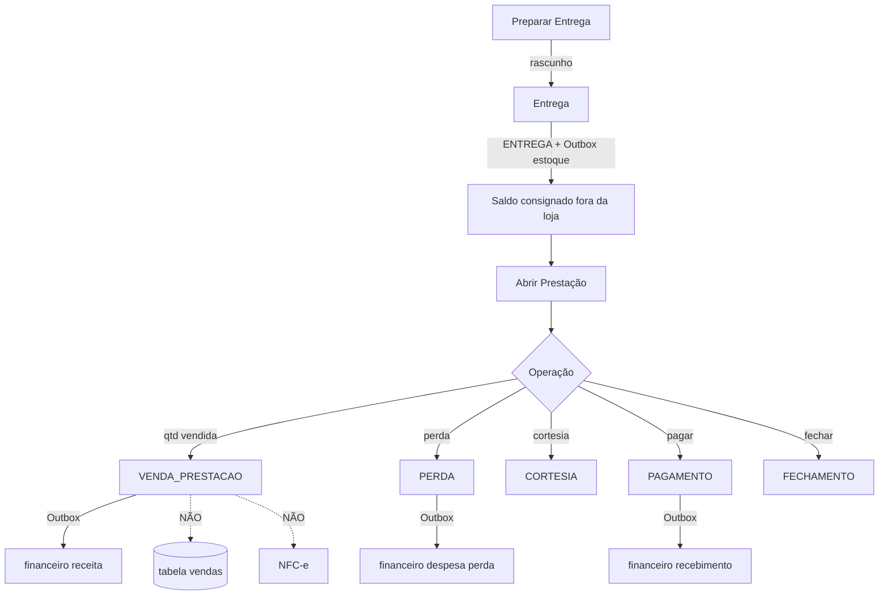

# MAPA COMPLETO DA VENDA — Plataforma CDS (As-Is)

**Data:** 2026-07-13  
**Tipo:** Mapa forense (somente leitura)  
**Complementa:** `AUDITORIA_FORENSE_ORIGENS_DA_VENDA.md`

---

## 1. Dois mundos de “venda”

```mermaid
flowchart LR
  subgraph PDV_WORLD["Mundo A — Venda Plataforma"]
    PDV_UI[PDV UI] --> API_V[/api/vendas]
    API_V --> CV[criarVenda]
    CV --> TBL[(vendas / itens / pagamentos)]
    CV --> EST_PDV[Estoque FEFO]
    CV --> FIN_PDV[financeiro + AR]
    CV --> FIS[emitirPorVendaId]
    FIS --> NFCE[(nfce_notas)]
  end

  subgraph COM_WORLD["Mundo B — Venda Comercial"]
    PRE_UI[Prestação UI] --> API_P[/prestacao/venda]
    API_P --> RVP[RegistrarVendaPrestacaoUseCase]
    RVP --> LED[(movimentacoes_comerciais VENDA_PRESTACAO)]
    RVP --> OBX[Outbox]
    OBX --> FIN_C[financeiro consignacao_venda]
  end

  PDV_WORLD -. sem ponte .-> COM_WORLD
```

Não há seta do Mundo B para a tabela `vendas` nem para o emissor NFC-e.

---

## 2. Mapa PDV (camada a camada)

| Camada | Artefato | Função |
|--------|----------|--------|
| Tela | `frontend/pdv/pages/pdv.html` + `frontend/pdv/js/pdv.js` | Carrinho, pagamento, finalização |
| Pré-cálculo | `POST /api/vendas/pre-calcular-distribuicao` | Split fiscal/não fiscal |
| Controller | *Inexistente* — `backend/rotas/vendas.js` | Bind HTTP |
| ApplicationService | *Inexistente* | — |
| Orquestração pagamento | `OrquestradorPagamento.processarFluxoPagamentoVenda` | TEF / status quitada vs aguardando |
| Núcleo informal | `VendaPagamentoService.criarVenda` | Persistência + estoque + financeiro |
| Motor Fiscal (prático) | `VendaFiscalService` → `emissor.emitirPorVendaId` | NFC-e |
| Motor Financeiro | *Não chamado* | INSERT inline |
| Ledger | *Não usado* | — |
| Outbox | *Não usado* | — |
| Recovery | *Fora deste fluxo* | — |

### Sequência temporal PDV

1. Distribuir itens fiscal × não fiscal  
2. Orquestrar pagamento (pode ficar `aguardando_nao_fiscal`)  
3. Transação SQL: venda + itens + estoque + pagamentos + (AR) + financeiro  
4. Commit  
5. Tentativa de emissão fiscal se solicitada e quitada  
6. Fase 2 opcional: pagamento não fiscal → emitir  

### Pontos de emissão fiscal no mapa

```
[A] Resposta de criarVenda → responderVendaComFiscal
[B] Pós pagamento-nao-fiscal → emitirFiscalSeSolicitado
[C] UI → POST /api/fiscal/emitir/venda/:id   ← fora do create
```

---

## 3. Mapa Comercial (ciclo consignação)



| Etapa | Entrada HTTP típica | Efeito de negócio | Efeito plataforma |
|-------|---------------------|-------------------|-------------------|
| Preparar | `POST /consignacoes` + itens | Documento rascunho | Nenhum financeiro/estoque |
| Entrega | `POST /consignacoes/:id/entrega` | Status ENTREGUE + ledger ENTREGA | Saída estoque via Outbox |
| Prestação venda | `POST .../prestacao/venda` | Nascimento da “venda” comercial | Receita espelhada |
| Receber (prestação) | `POST .../prestacao/pagamento` | Liquidação comercial | Segunda escrita financeiro |
| Receber (Conta Corrente) | `loadPage('financeiro')` | Bypass UI | Sem UC comercial |

---

## 4. Mapa de responsabilidades (quem faz o quê)

| Responsabilidade | PDV | Prestação / Comercial |
|------------------|-----|------------------------|
| Criar registro canônico de venda plataforma | `criarVenda` | — |
| Criar movimento de venda comercial | — | `RegistrarVendaPrestacaoUseCase` |
| Atualizar estoque loja | No create | Na entrega (antes) |
| Separar fiscal × não fiscal | `distribuidorEstoqueVenda` + orquestrador | **Não aplica** hoje |
| Emitir NFC-e | `emitirPorVendaId` | Não |
| Gerar AR (`contas_receber`) | Prazo no create | Não (gateway lê AR alheio em consulta) |
| Escrever `financeiro` | Direto | Via Outbox/Gateway |
| Ledger append-only | Não | Sim |
| Outbox | Não | Sim |
| Recovery comercial | — | Fluxos Recovery do módulo |

---

## 5. Mapa de entradas HTTP relacionadas a venda

### Plataforma / PDV

| Método | Rota | Cria venda? | Emite fiscal? |
|--------|------|-------------|---------------|
| POST | `/api/vendas` | **Sim** | Condicional pós-commit |
| POST | `/api/vendas/pre-calcular-distribuicao` | Não | Não |
| GET/POST | `/api/vendas/:id/pagamento-nao-fiscal` | Não | Condicional |
| POST | `/api/fiscal/emitir/venda/:vendaId` | Não | **Sim** |
| PUT/POST | cancelar / devolver | Não (lifecycle) | Pode cancelar NFC-e |

### Comercial

| Método | Rota (comercial) | Cria `vendas`? | Cria `VENDA_PRESTACAO`? |
|--------|------------------|----------------|-------------------------|
| POST | `/consignacoes` | Não | Não |
| POST | `/consignacoes/:id/entrega` | Não | Não |
| POST | `/consignacoes/:id/prestacao/venda` | Não | **Sim** |
| POST | `/consignacoes/:id/prestacao/pagamento` | Não | Não |
| POST | perda / cortesia / fechar | Não | Não |

---

## 6. Mapa financeiro (as-is)

```
PDV create ──────────────► INSERT financeiro (origem venda)
PDV prazo  ──────────────► INSERT contas_receber
Prestação VENDA ─Outbox──► INSERT financeiro (consignacao_venda, recebido, sem venda_id)
Prestação PAGTO ─Outbox──► INSERT financeiro (consignacao_pagamento, recebido)
Prestação PERDA ─Outbox──► INSERT financeiro (despesa consignacao_perda)
```

**Motor Financeiro SSOT:** inexistente como módulo único (ver FIN_01). Ambos os mundos **bypassam** a arquitetura alvo financeira.

---

## 7. Mapa de estoque (as-is)

```
PDV ──criação──► reduzirEstoqueDistribuido(fiscal, não fiscal) ──► lotes/FEFO
Entrega consignação ──Outbox──► ajusteEstoque (saída)
Devolução consignação ──Outbox──► ajusteEstoque (entrada)
Prestação VENDA ──► (sem estoque)
Prestação PERDA/CORTESIA ──► consome saldo consignado (sem rebaixa loja)
```

---

## 8. Mapa alvo (referência — não implementado)

```
PDV | Consignação | Pedido | Orçamento | E-commerce | App
                          │
                          ▼
                 VendaDTO Oficial + metadata origem
                          │
                          ▼
              VendaApplicationService
                          │
                          ▼
                 Núcleo Transacional
                    ├─ Motor Fiscal × Não Fiscal
                    ├─ Financeiro (SSOT)
                    ├─ Ledger (plataforma)
                    ├─ Outbox
                    └─ Recovery
```

Estado atual: **somente o topo esquerdo (PDV) existe parcialmente**, e **sem** ApplicationService / Outbox / Ledger unificados.

---

## 9. Gaps críticos no mapa

| Gap | Impacto |
|-----|---------|
| Dois significados de “venda” | Relatórios, fiscal, crédito e financeiro divergem |
| Prestação sem caminho para `vendas` | Impossível NFC-e da consignação pelo fluxo oficial de venda |
| PDV sem Outbox/Ledger | Impossível Recovery/auditoria no mesmo padrão comercial |
| Emissão fiscal via rota solta | Bypass do “núcleo” |
| Conta Corrente Receber órfão | Recebimento fora do motor |
| Pedido/Orçamento/E-commerce | Sem ponto de encaixe — precisam nascer já no DTO oficial |

---

**Fim do mapa (documento 2/3).**
