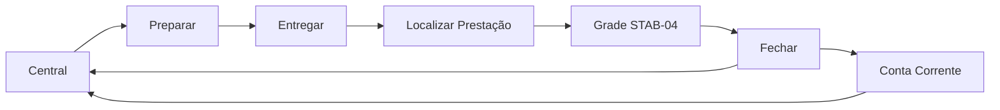

# MOCKUPS CONCEITUAIS (WIREFRAMES) — Motor Comercial

**Tipo:** Wireframes de baixa fidelidade (conceito operacional)  
**Data:** 2026-07-13  
**Não são layout final** — representam hierarquia, foco e conteúdo mínimo.

---

## 1. Central Comercial (turno)

```text
┌─────────────────────────────────────────────────────────────┐
│  CENTRAL DE TRABALHO                         [Operador]     │
├─────────────────────────────────────────────────────────────┤
│  Hoje:  3 entregas  ·  2 para fechar  ·  1 a receber        │
│  (máx. 3 números — sem muro de KPI)                         │
├─────────────────────────────────────────────────────────────┤
│  MINHA FILA DE TRABALHO                                     │
│  ┌───────────────────────────────────────────────────────┐  │
│  │ Cliente A · E3 Fechar        [ Prestar Contas ]       │  │
│  │ Cliente B · E2 Entregar      [ Continuar Entrega ]    │  │
│  │ Cliente C · E5 Saldo         [ Receber ]              │  │
│  └───────────────────────────────────────────────────────┘  │
│                                                             │
│  AÇÕES RÁPIDAS                                              │
│  [ Nova Entrega ]  [ Novo Cliente ]  [ Clientes ]           │
└─────────────────────────────────────────────────────────────┘
```

**Uma pergunta:** O que preciso fazer agora?  
**Fora daqui:** gráficos, rankings, playbooks.

---

## 2. Preparar Entrega

### 2.1 Selecionar consignado

```text
┌─────────────────────────────────────────────────────────────┐
│  PREPARAR ENTREGA                    Passo 1 de 3           │
├─────────────────────────────────────────────────────────────┤
│  Buscar consignado                                          │
│  ┌─────────────────────────────────────────────────────┐    │
│  │  Nome, CPF, CNPJ, telefone…                         │    │
│  └─────────────────────────────────────────────────────┘    │
│                                                             │
│  Resultados                                                 │
│  · Maria Silva · 123.456… · (85) 9… · Crédito R$ 50        │
│  · João …                                                   │
│                                                             │
│                                      [ Continuar → ]        │
└─────────────────────────────────────────────────────────────┘
```

### 2.2 Produtos

```text
┌──────────────────────────────────────────────┬──────────────┐
│  PREPARAR ENTREGA · Maria Silva              │ Crédito      │
│  Passo 2 de 3                                │ Disponível   │
│                                              │ R$ 50,00     │
│  Buscar produto (LIP)                        │ Valor entrega│
│  ┌──────────────────────────────────────┐    │ R$ 12,00     │
│  │                                      │    └──────────────┘
│  └──────────────────────────────────────┘                   │
│  Grade                                                      │
│  Produto        Qtd    Preço    Total                       │
│  Produto #1      6     2,00     12,00                       │
│                                                             │
│  [ ← Voltar ]                         [ Continuar → ]       │
└─────────────────────────────────────────────────────────────┘
```

*Uma faixa de crédito — sem Assistente Operacional duplicado.*

### 2.3 Confirmar + imprimir

```text
┌─────────────────────────────────────────────────────────────┐
│  CONFIRMAR · Maria Silva                 Passo 3 de 3       │
├─────────────────────────────────────────────────────────────┤
│  1 item · 6 un · R$ 12,00 · Crédito restante R$ 38,00       │
│                                                             │
│  [ Imprimir termo ]     [ Abrir Entrega ]     [ Voltar ]    │
│       (primário)              (secundário)                  │
└─────────────────────────────────────────────────────────────┘
```

---

## 3. Prestação de Contas

### 3.1 Localizador (NOVO — tela inicial)

```text
┌─────────────────────────────────────────────────────────────┐
│  PRESTAÇÃO DE CONTAS                                        │
│  Localize o consignado para iniciar                         │
├─────────────────────────────────────────────────────────────┤
│  ┌─────────────────────────────────────────────────────┐    │
│  │  Nome, CPF, CNPJ ou telefone                        │    │
│  └─────────────────────────────────────────────────────┘    │
│                                                             │
│  ┌─────────────────────────────────────────────────────┐    │
│  │ Maria Silva                                         │    │
│  │ CPF 123… · (85) 9… · Cidade X                       │    │
│  │ Saldo em aberto  R$ 42,00                           │    │
│  │ Última mov.      Venda · 12/07                       │    │
│  │                          [ Prestar Contas ]         │    │
│  └─────────────────────────────────────────────────────┘    │
└─────────────────────────────────────────────────────────────┘
```

**Uma pergunta:** Quem vou atender agora?

### 3.2 Grade STAB-04 (após selecionar)

```text
┌─────────────────────────────────────────────────────────────┐
│  PRESTAR CONTAS · Maria Silva · Doc C-004                   │
│  ● Alterações pendentes / ✓ Salvas                          │
├─────────────────────────────────────────────────────────────┤
│  Produto     Ent.  Dev.  Vend.  Perda  Cort.  Saldo         │
│  Produto #1   10    [4]   [6]    [0]    [0]     0           │
│                                                             │
│  Enter salva · Continuar avança                             │
│                                                             │
│  [ Voltar ]                         [ Continuar → Fechar ]  │
└─────────────────────────────────────────────────────────────┘
```

### 3.3 Fechar (totais + pagamento opcional)

```text
┌─────────────────────────────────────────────────────────────┐
│  FECHAR ATENDIMENTO · Maria Silva                           │
├─────────────────────────────────────────────────────────────┤
│  Vendido R$ 12,00 · Recebido R$ 0,00 · Saldo R$ 12,00       │
│                                                             │
│  Pagamento (opcional)                                       │
│  Valor [____]  Forma [ PIX ▼ ]                              │
│  [ Registrar pagamento ]                                    │
│                                                             │
│  [ ← Voltar à grade ]              [ Encerrar Atendimento ] │
└─────────────────────────────────────────────────────────────┘
```

### 3.4 Sucesso (um próximo passo)

```text
┌─────────────────────────────────────────────────────────────┐
│  Atendimento encerrado                                      │
│  Saldo em aberto: R$ 12,00                                  │
│                                                             │
│  [ Receber agora ]          [ Voltar à Central ]            │
│      (primário se saldo>0)                                  │
└─────────────────────────────────────────────────────────────┘
```

---

## 4. Conta Corrente (extrato)

```text
┌─────────────────────────────────────────────────────────────┐
│  CONTA CORRENTE · Maria Silva                               │
│  Período [ Este mês ▼ ]   Busca [____________]              │
├─────────────────────────────────────────────────────────────┤
│  SALDO ATUAL                                   R$ 12,00      │
│  [ Receber ]                                                │
├─────────────────────────────────────────────────────────────┤
│  EXTRATO                                                    │
│  Data       Tipo        Descrição           Valor    Saldo  │
│  12/07      Venda       Prestação #4       +12,00   12,00   │
│  10/07      Pagamento   PIX                −38,00    0,00   │
│  …                                                          │
└─────────────────────────────────────────────────────────────┘
```

**Fora do default:** gráficos, 11 KPIs, timeline gerencial, alertas embutidos.

---

## 5. Entrega

```text
┌─────────────────────────────────────────────────────────────┐
│  ENTREGA · Doc C-005 · Maria Silva                         │
│  Status: Pronto para entregar                               │
├─────────────────────────────────────────────────────────────┤
│  Itens                                                      │
│  Produto #1 · 25 UN · R$ 2,00 · R$ 50,00                    │
│                                                             │
│  Total: 25 un · R$ 50,00                                    │
├─────────────────────────────────────────────────────────────┤
│  [ Cancelar ]                              [ Entregar ]     │
└─────────────────────────────────────────────────────────────┘
```

Sem checklist técnico expandido; sem painel “Impacto” no primeiro viewport.

---

## 6. Fluxo ponta a ponta (mermaid)



---

## 7. Hierarquia visual (regras dos mockups)

1. **Uma CTA primária** por viewport  
2. Busca no topo quando a tarefa é localizar  
3. Grade / extrato no centro quando a tarefa é operar  
4. Totais só quando a tarefa é fechar / receber  
5. Gestão (gráficos, rankings) **nunca** no primeiro viewport operacional  

---

*Wireframes alinhados a `PLANO_REESTRUTURACAO_UX.md` e `ROADMAP_UX_COMERCIAL.md`.*
