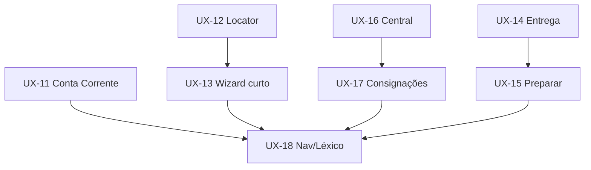

# ROADMAP UX COMERCIAL — Implantação gradual

**Base:** `AUDITORIA_UX_MOTOR_COMERCIAL.md` · `PLANO_REESTRUTURACAO_UX.md` · `MOCKUPS_UX_COMERCIAL.md`  
**Constituição UX:** `.cds/adr/ADR-UX-001.md`  
**Data:** 2026-07-13  

**Regra de ouro do roadmap:** cada sprint entrega valor ao operador **sem** tocar em Ledger, Recovery, Crédito SSOT, Outbox, APIs, banco ou contratos STAB-03/04.

Toda sprint FE: `CDS_BUILD_SPRINT=<sprint> npm run build:motor-comercial` + `npm run verify:motor-comercial`.

---

**Visão das sprints**

```text
UX-11  Conta Corrente extrato
UX-12  Prestação Locator + Estação
UX-20  Operação Primeiro (4 estações Workspace)  ← entregue 2026-07-13
UX-13  Prestação wizard curto (STAB-04 intacto)
UX-14  Entrega thin (absorvido em UX-20)
UX-15  Preparar limpo (absorvido em UX-20)
UX-16  Central unificada
UX-17  Consignações arquivo
UX-18  Nav + léxico + SmartSearch
```

---

## UX-11 — Conta Corrente como extrato

**Objetivo:** operador vê saldo + histórico em ≤ 5 s.  
**Duração sugerida:** 3–5 dias  

### Escopo
- Default: Saldo atual + Extrato enxuto + busca/período simples + Receber
- Colapsar / mover: muro de 11 cards, Indicadores, Gráficos, Alertas, Pendências embutidos → aba “Análise” ou Relatórios
- Reduzir colunas do extrato (data, tipo, descrição, valor, saldo)

### Fora
- Mudança de projeção financeira / regras de saldo

### Aceite
- [x] Viewport inicial sem gráficos
- [x] Receber acessível quando saldo > 0
- [x] Export permanece (pode ir para menu “Mais”)
- [x] verify:motor-comercial OK
- [x] Workspace oficial (Header / Body / Footer)
- [x] Análise fora do primeiro viewport

---

## UX-12 — Prestação Locator

**Objetivo:** achar consignado por Nome/CPF/CNPJ/Telefone e abrir a grade.  
**Duração sugerida:** 4–6 dias  

### Escopo
- Nova rota FE `/prestacao` (ou hub) com `PrestacaoLocator`
- Card resultado: nome, documento, telefone, cidade, saldo aberto, última mov, CTA **Prestar Contas**
- Navega para `/consignacoes/:id/prestacao` existente
- Entrada na Central / nav: “Prestação de Contas”

### Fora
- Alterar APIs de consignação (usar listagens/projeções já existentes; se faltar campo de telefone/cidade na projeção, usar o que já vem do cliente — **sem nova regra de negócio**)

### Aceite
- [x] Busca retorna lista essencial em 1 campo
- [x] Um clique leva à grade
- [x] Sem KPI wall no localizador
- [x] verify OK
- [x] Workspace + SmartSearch + EntityCard oficiais
- [x] Estação `/consignacoes/:id/prestacao` em Workspace (STAB-04 intacto)

---

## UX-13 — Prestação: wizard curto (STAB-04)

**Objetivo:** grade no centro; menos passos.  
**Duração sugerida:** 5–8 dias  

### Escopo
- Momentos alvo: **Retornos** → **Fechar** → **Sucesso**
- Fundir Conferir + Conferência Final no fluxo (banner / totais no Fechar)
- Um bloco de totais no Fechar (sem sidebar espelho)
- Sucesso com **um** próximo passo contextual

### Não negociável
- `flushPendingChanges`, State SSOT, dirty, indicador pendente/salvo
- Não implementar STAB-05 nesta sprint (salvo decisão explícita à parte)

### Aceite
- [ ] Operador digita retornos sem passar por 2 steps “vazios”
- [ ] Enter / Continuar / Encerrar ainda fazem flush
- [ ] Testes STAB-04 / grade verdes
- [ ] verify OK

---

## UX-14 — Entrega thin

**Objetivo:** confirmar saída rápido.  
**Duração sugerida:** 2–3 dias  

### Escopo
- Substituir checklist de 8 itens por banner Pronto / Bloqueado
- Remover ou ocultar “Impacto da Operação” do default
- Resumo: itens + total; Entregar no rodapé (já corrigido layout)

### Aceite
- [ ] Primeiro viewport = itens + CTA
- [ ] Entregar visível sem scroll de “teoria”
- [ ] verify OK

---

## UX-15 — Preparar Entrega limpo

**Objetivo:** seleção → produtos → confirmar → imprimir.  
**Duração sugerida:** 4–5 dias  

### Escopo
- `CreditStrip` único (remover duplicação Assistente)
- Conferência enxuta
- Conclusão: primário Imprimir · secundário Abrir Entrega
- Opcional: auto-sugerir Abrir Entrega quando origem = Central

### Aceite
- [ ] Crédito aparece em no máximo um lugar por passo
- [ ] Caminho feliz ≤ 3 passos conscientes
- [ ] verify OK

---

## UX-16 — Central unificada

**Objetivo:** uma fila, poucos números.  
**Duração sugerida:** 3–5 dias  

### Escopo
- Fundir / demover Próximas Entregas e Atendimentos para Fechar na Minha Fila
- Pulso do dia ≤ 3 chips
- Ações Rápidas sem Relatórios

### Não negociável
- Contratos UX-10 (estados E2–E5, Receber só E5, sem Fechar em Ações Rápidas)

### Aceite
- [ ] Sem listas duplicando a mesma CTA
- [ ] Auditoria de estados (`auditarCentralEstados`) continua passando
- [ ] verify OK

---

## UX-17 — Consignações como arquivo

**Objetivo:** tirar o cockpit do caminho diário.  
**Duração sugerida:** 3–4 dias  

### Escopo
- Remover ou colapsar KPI wall
- ActionMenu: 3 primárias + “Mais”
- Drawer: Resumo/Movimentos default; demais abas secundárias
- Atalhos da Central apontam para Prestação Locator / Preparar — não para lista como hub

### Aceite
- [ ] Lista utilizável sem “segunda Central”
- [ ] verify OK

---

## UX-18 — Nav, léxico e SmartSearch

**Objetivo:** consistência e menos cliques entre módulos.  
**Duração sugerida:** 4–6 dias  

### Escopo
- Nav primária ~5 destinos (ERP shell e/ou header do módulo)
- Léxico oficial (Prestar Contas, Encerrar Atendimento, Preparar Entrega, Receber)
- Componente `SmartSearch` compartilhado nas telas operacionais

### Aceite
- [ ] Operador chega em Prestação / Preparar / Conta / Clientes em 1 clique a partir da Central
- [ ] Labels consistentes nas CTAs principais
- [ ] verify OK

---

## Dependências entre sprints



**Paralelo seguro:** UX-11 ∥ UX-12 ∥ UX-14  
**Sequencial:** UX-12 → UX-13 · UX-16 → UX-17 · tudo → UX-18

---

## Métricas de sucesso (pós-rollout)

| Métrica | Antes (estimado) | Alvo |
|---------|------------------|------|
| Interações para fechar 1 atendimento | 15–25+ | ≤ 10 |
| Tempo até achar consignado na Prestação | N/A / via lista | ≤ 10 s |
| KPIs no primeiro viewport operacional | Alto | 0 (exceto Central ≤ 3) |
| Telas “centrais” no turno diário | 4+ | 1 |

Coletar feedback do operador após UX-13 e UX-16 (checkpoints humanos).

---

## Checklist de governança por sprint

- [ ] Escopo só FE / apresentação
- [ ] Nenhuma regra de crédito / ledger / recovery alterada
- [ ] STAB-04 preservado se tocar Prestação
- [ ] UX-10 preservado se tocar Central
- [ ] Testes da área + build + verify
- [ ] Atualizar skill/playbook só se criar padrão reutilizável (SmartSearch, CreditStrip)

---

## Pós-roadmap (backlog consciente)

- STAB-05 — hard-block saldo de item na grade (regra de domínio — **não** misturar com UX puro)
- Produtos como tela dedicada (só se operação pedir)
- Unificação profunda de drawers Consignações / Detalhes

---

*Roadmap para implantação gradual. Priorize UX-11 + UX-12 em paralelo para alívio imediato.*
