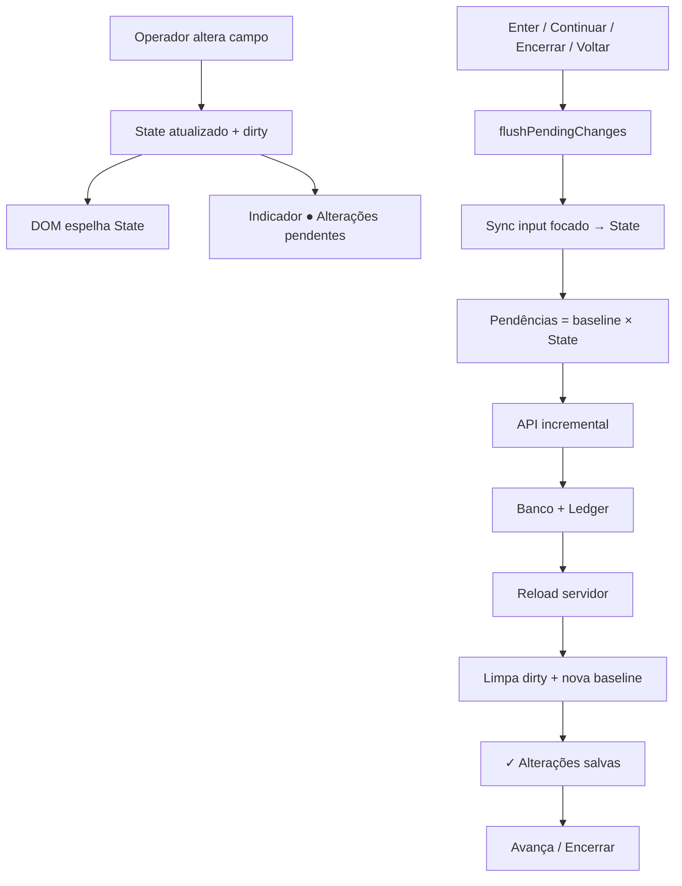

# STAB-04 — Consistência da Grade da Prestação de Contas

**Prioridade:** P0  
**Tipo:** Sprint de Estabilização (Frontend + UX)  
**Status:** IMPLEMENTADO  
**Data:** 2026-07-13  

---

## Princípio oficial

> **O que o operador vê é exatamente o que será gravado.**

State único → Render → Payload → API → Banco → Ledger → State sincronizado.

O DOM **nunca** é fonte da verdade para payload.

---

## Fluxograma atualizado



---

## O que mudou

| Antes | Depois (STAB-04) |
|-------|------------------|
| Payload via `coletarItensComRascunho` (DOM) | Payload via `listarPendenciasFromBaseline` (State) |
| Blur/Enter/Continuar caminhos distintos | `flushPendingChanges()` único |
| Encerrar ignorava grade | Encerrar **obrigatório** flush + bloqueio se dirty |
| Reload/`patch` apagava rascunho | Preserva dirty; patch espelha State |
| Sem feedback de persistência | ● pendente / ✓ salvas |

---

## Arquivos

- `pages/PrestacaoContas/gradeConsistencia.js` — State/dirty/baseline/flush helpers  
- `pages/PrestacaoContas/index.js` — orquestração  
- `pages/PrestacaoContas/FecharConsignacaoView.js` — patch dirty + indicador  
- `pages/PrestacaoContas/gradeForenseAudit.js` — `CDS_PRESTACAO_DEBUG`  
- `pages/PrestacaoContas/styles.css` — dirty + persistência  
- `tests/pages/stab04GradeConsistencia.test.js`

---

## Debug

```js
window.__CDS_PRESTACAO_DEBUG__ = true
// ou localStorage.setItem('CDS_PRESTACAO_DEBUG', '1')
```

Logs: State / Payload / API em `window.__CDS_PRESTACAO_DEBUG_LOGS__`.

---

## Fora de escopo (STAB-05)

Bloquear encerramento com `ENTREGUE ≠ V+D+P+C` permanece para a próxima sprint. STAB-04 estabiliza a interface sem alterar regra de negócio / crédito / ledger.

---

## Aceite

Não deve existir cenário operacional em que DOM ≠ State no momento do flush, nem State ≠ Payload gerado. Encerrar/Continuar/Voltar sempre passam por `flushPendingChanges`.
