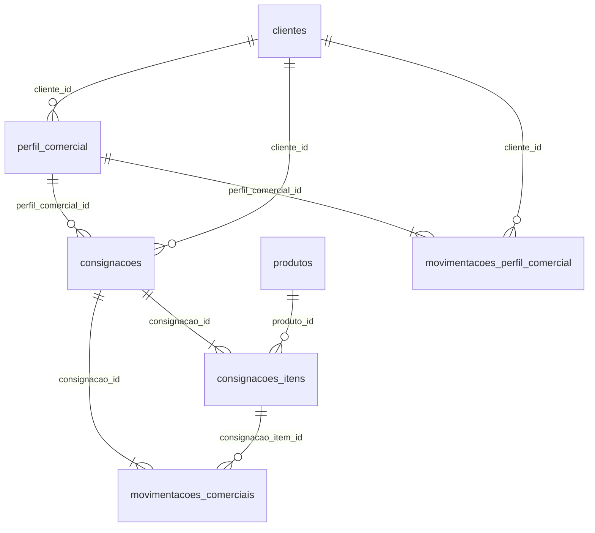

# Persistência — Motor Comercial v2.2

Base: Constituição Oficial do Domínio v2.1.3

## Tabelas oficiais (5)

| Tabela | Aggregate | Natureza |
|--------|-----------|----------|
| `perfil_comercial` | PerfilComercial | Aggregate root |
| `consignacoes` | Consignacao | Aggregate root |
| `consignacoes_itens` | ConsignacaoItem | Entidade filha |
| `movimentacoes_comerciais` | MovimentacaoComercial | Ledger append-only |
| `movimentacoes_perfil_comercial` | MovimentacaoPerfilComercial | Ledger append-only |

## Tabelas proibidas

Não existem e não devem ser criadas: `historico_comercial`, `acertos`, `liberacoes_gerenciais`, `conta_corrente`, `dashboard_*`, `ranking_*`, `timeline_*`.

## Migrations

```
migrations/
  001_perfil_comercial.js
  002_consignacoes.js
  003_consignacoes_itens.js
  004_movimentacoes_comerciais.js
  005_movimentacoes_perfil.js
  006_indices.js
  007_constraints.js
  index.js
```

Integração: `backend/database.js` → `aplicarMigrationsMotorComercialSync(db)` após `criarTabelasMiip()`.

## Repositories (5)

| Repository | Tabela | Operações |
|------------|--------|-----------|
| `PerfilComercialRepository` | `perfil_comercial` | CRUD (cache reconstruível) |
| `ConsignacaoRepository` | `consignacoes` | CRUD (cache reconstruível) |
| `ConsignacaoItemRepository` | `consignacoes_itens` | CRUD |
| `MovimentacaoComercialRepository` | `movimentacoes_comerciais` | **inserir + consultar** |
| `MovimentacaoPerfilRepository` | `movimentacoes_perfil_comercial` | **inserir + consultar** |

Ledgers são append-only (triggers SQLite impedem UPDATE/DELETE).

## Mapeamento de Value Objects

| Value Object | Persistência |
|--------------|--------------|
| `LimiteComercial`, `SaldoAberto`, `PerfilTipo` | Colunas em `perfil_comercial` |
| `StatusConsignacao` | Coluna `status` em `consignacoes` |
| `DocumentoComercial` | Colunas `documento_*` em `consignacoes` |
| `GrupoPrestacaoContas` | Colunas `prestacao_*` em `consignacoes` + `grupo_prestacao_contas_id` nas movimentações |
| `SnapshotMovimentacao` | Coluna JSON `snapshot` |
| `OrigemMovimentacao` | Coluna `origem` |
| `CorrelationId` | Coluna `correlation_id` |
| `CausationId` | Coluna `causation_id` |
| `ScoreConfiabilidade` | Cache em `score_confiabilidade` (não fonte de verdade) |

## Estados persistidos vs derivados

**Persistidos:** `RASCUNHO`, `ENTREGUE`, `ACERTADA`, `QUITADA`, `ENCERRADA`, `CANCELADA`

**Derivados (não coluna):** `EM_PRESTACAO`, `PARCIALMENTE_PAGA`, `EM_ATRASO`

## Diagrama físico


