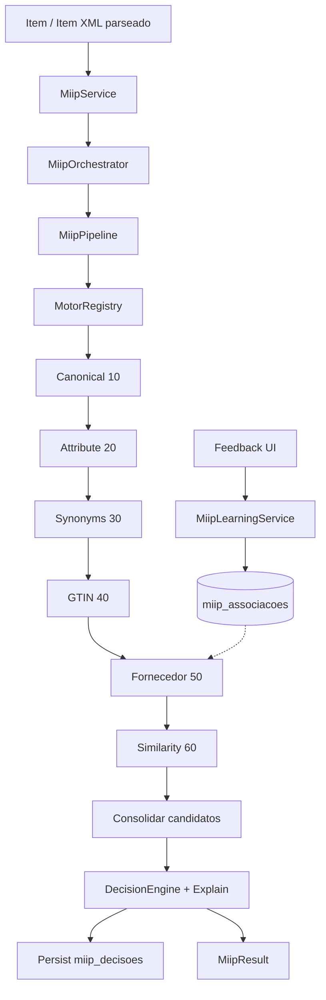
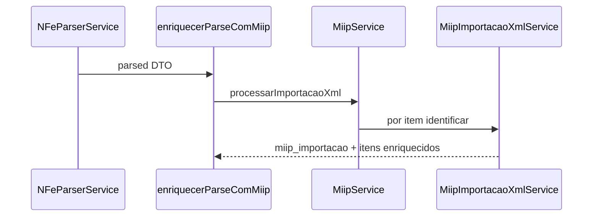

# Arquitetura Oficial — MIIP V1.0 RC1

**Projeto:** CDS Sistemas  
**Módulo:** MIIP — Motor Inteligente de Identificação de Produtos  
**Versão:** `1.0.0-rc1`  
**Status:** Release Candidate — congelamento arquitetural  
**Última revisão:** 2026-07-05 (Sprint RC1 — Consolidação)

---

## Sumário

1. [Objetivo](#1-objetivo)
2. [O que o MIIP faz e não faz](#2-o-que-o-miip-faz-e-não-faz)
3. [Pipeline oficial RC1](#3-pipeline-oficial-rc1)
4. [Camadas e componentes](#4-camadas-e-componentes)
5. [Motores registrados](#5-motores-registrados)
6. [Decision, Explain e Learning](#6-decision-explain-e-learning)
7. [Persistência e telemetria](#7-persistência-e-telemetria)
8. [Integrações externas](#8-integrações-externas)
9. [Estrutura de diretórios](#9-estrutura-de-diretórios)
10. [API HTTP](#10-api-http)
11. [Regras dos engines](#11-regras-dos-engines)
12. [Diagramas](#12-diagramas)

---

## 1. Objetivo

O **MIIP** é o motor centralizado de identificação de produtos do CDS Sistemas. Dado um item externo (XML parseado, digitação manual, API), resolve **qual produto interno do ERP corresponde**, com score, confiança, explicação e rastreabilidade.

**Ponto de entrada único:** `MiipService` (`backend/motores/miip/MiipService.js`). Rotas e outros módulos não devem chamar engines, `DecisionEngine` ou repositories diretamente.

---

## 2. O que o MIIP faz e não faz

### Faz

- Executa pipeline semântico + identificação via `MotorRegistry`
- Consolida candidatos e decide via `DecisionEngine` (único decisor)
- Explica decisões via `MiipExplainService`
- Persiste decisões em `miip_decisoes`
- Aprende associações fornecedor apenas com confirmação explícita (`MiipLearningService`)
- Importação XML em lote via `MiipImportacaoXmlService`
- Telemetria in-memory por execução

### Não faz

- Não parseia XML (responsabilidade de `NFeParserService`)
- Não grava compra, estoque ou financeiro
- Não altera `saveCompra()` nem pipeline fiscal
- Não depende da Central Inteligente de Entradas (consumida por ela, não o contrário)
- Não executa SQL nos engines semânticos (somente `ProdutoRepository` / `MiipAssociacoesRepository`)

---

## 3. Pipeline oficial RC1

Ordem fixa registrada em `MiipBootstrap.js` e executada por `MiipPipelineEngineRunner.js`:

| Prioridade | Código | Papel |
|------------|--------|-------|
| 10 | `motor_canonical` | Texto → `CanonicalProduct` |
| 20 | `motor_attribute_extractor` | `CanonicalProduct` → `SemanticProduct` |
| 30 | `motor_synonyms` | Enriquece `SemanticProduct` (JSON) |
| 40 | `motor_gtin` | Match EAN/GTIN → candidatos |
| 50 | `motor_associacao_fornecedor` | CNPJ + cProd → candidatos |
| 60 | `motor_similarity` | Compara semântica item vs melhor candidato |

### Fluxo pós-engines

```
Candidatos → deduplicação → MiipDecisionBuilder
         → DecisionEngine + MiipExplainService
         → MiipResult
         → persistir em miip_decisoes
         → MiipTelemetryService.finalizarExecucao()
```

### Bootstrap

```
MiipService._garantirInicializado()
  → inicializarMiip({ db })          [MiipBootstrap.js]
  → MotorRegistry.registrar × 6
```

### Execução por item

```
MiipService.identificar(item, contexto)
  → MiipOrchestrator.executar()
  → criarPipelinePadrao()            [MiipPipelineFactory.js]
  → MiipPipeline.executar()
  → MiipPipelineEngineRunner (engines)
  → MiipDecisionBuilder
  → MiipResponse / MiipResult
```

---

## 4. Camadas e componentes

```
┌─────────────────────────────────────────────────────────────┐
│  Consumidores: Compras, Central (enriquecerParseComMiip),   │
│                POST /api/miip/*, Central Revisão (frontend) │
└────────────────────────────┬────────────────────────────────┘
                             │
┌────────────────────────────▼────────────────────────────────┐
│  MiipService — fachada oficial                              │
│  MiipImportacaoXmlService — lote XML                        │
│  MiipLearningService — feedback (fora do pipeline)          │
└────────────────────────────┬────────────────────────────────┘
                             │
┌────────────────────────────▼────────────────────────────────┐
│  MiipOrchestrator → MiipPipeline                            │
│  MotorRegistry → 6 engines                                  │
│  MiipDecisionBuilder → DecisionEngine + Explain             │
└────────────────────────────┬────────────────────────────────┘
                             │
┌────────────────────────────▼────────────────────────────────┐
│  Repositories: ProdutoRepository, MiipAssociacoesRepository,│
│                MiipDecisoesRepository, MiipConfiguracoes...  │
│  Cache: ProdutoCache                                          │
└─────────────────────────────────────────────────────────────┘
```

| Componente | Arquivo | Responsabilidade |
|------------|---------|------------------|
| Fachada | `MiipService.js` | Única porta de entrada |
| Orquestração | `MiipOrchestrator.js` | Delega ao pipeline |
| Pipeline | `core/MiipPipeline.js` | Cérebro da execução |
| Factory | `core/MiipPipelineFactory.js` | Composição RC1 |
| Runner | `core/MiipPipelineEngineRunner.js` | Encadeamento semântico |
| Registry | `core/MotorRegistry.js` | Plugins de engines |
| Bootstrap | `MiipBootstrap.js` | Registro dos 6 motores |

---

## 5. Motores registrados

Todos implementam `IMotorIdentificacao`. Motores semânticos (10–30, 60) produzem estrutura ou comparação; motores 40–50 produzem `MiipCandidate[]`.

| Motor | Pasta | Identifica produto? |
|-------|-------|---------------------|
| Canonical | `engines/canonical/` | Não (`identificar` → meta) |
| Attribute | `engines/attributes/` | Não |
| Synonyms | `engines/synonyms/` | Não (dicionários JSON) |
| GTIN | `engines/gtin/` | Sim |
| Fornecedor | `engines/fornecedor/` | Sim |
| Similarity | `engines/similarity/` | Refina score |

**Pastas scaffold (sem implementação RC1):** `fiscal/`, `historico/`, `estatistica/`, `comercial/`, `normalizacao/` — reservadas para evolução futura.

---

## 6. Decision, Explain e Learning

| Camada | Arquivo | Regra |
|--------|---------|-------|
| **Decision** | `core/DecisionEngine.js` | Único decisor de ação (`auto_vincular`, `sugerir`, etc.) |
| **Builder** | `core/MiipDecisionBuilder.js` | Delega ao DecisionEngine + Explain |
| **Explain** | `core/MiipExplainService.js` | Toda decisão tem explicação |
| **Learning** | `services/MiipLearningService.js` | Fora do pipeline; exige `confirmado: true` |

Aprendizado grava em `miip_associacoes` e alimenta `MotorAssociacaoFornecedor` em execuções futuras.

---

## 7. Persistência e telemetria

| Tabela / recurso | Uso RC1 |
|------------------|---------|
| `miip_decisoes` | Persistência oficial por execução (`MiipDecisoesRepository`) |
| `miip_associacoes` | Aprendizado confirmado |
| `miip_configuracoes` | Feature flags runtime |
| `miip_sinonimos` | **Não usada** pelo motor Synonyms (JSON) — repo `@deprecated` |
| `miip_estatisticas` | **Não usada** em runtime — repo `@deprecated` |
| `MiipTelemetryService` | Métricas in-memory por sessão |
| `ProdutoCache` | Cache de `ProdutoSnapshot` |

---

## 8. Integrações externas

### Seam oficial pós-parse NF-e

`backend/shared/nfe/enriquecerParseComMiip.js` — usado por **Compras** e **Central de Entradas** sem alterar o parser:

```
NFeParserService.parse(xml)
  → enriquecerParseComMiip(parsed)
  → MiipService.processarImportacaoXml(parsed)
```

### Central Inteligente de Entradas

- **Não importa** o núcleo MIIP
- Usa `enriquecerParseComMiip` no processamento
- Usa `miipCentralRevisaoUtils` (somente leitura/agregação) para score e pendências

### Compras

- `MiipService.identificar` / importação XML
- `ensureProductForItem` delega ao MIIP quando habilitado

### API pública

- `POST /api/miip/identificar-lote` — expõe sugestões filtradas para GTIN + Fornecedor na UI (pipeline interno executa os 6 motores)
- `POST /api/miip/feedback` — aprendizado
- `GET /api/miip/health` — saúde RC1 (somente leitura)

---

## 9. Estrutura de diretórios

```
backend/motores/miip/
├── MiipService.js              # Fachada
├── MiipOrchestrator.js
├── MiipBootstrap.js
├── index.js                    # Exports (barrel)
├── core/                       # Pipeline, Decision, Explain, modelos
├── engines/                    # 6 motores RC1 + READMEs scaffold
├── services/                   # Learning, Importação XML, Telemetry
├── repositories/               # Persistência SQLite
├── contracts/                  # DTOs
├── config/                     # JSON (rules, synonyms, canonical…)
├── utils/                      # Normalizers, mappers, Central Revisão
├── metrics/                    # Coletores por motor / learning
├── audit/                      # Validadores readiness
├── logs/                       # Logs de integração e aprendizado
└── cache/                      # ProdutoCache
```

Testes: `tests/miip/` (17 suítes npm `test:miip`).

---

## 10. API HTTP

Montagem: `app.use('/api/miip', verificarToken, miipRoutes)` em `server.js`.

| Método | Rota | Descrição |
|--------|------|-----------|
| POST | `/identificar-lote` | Identificação em lote (UI Compras) |
| POST | `/feedback` | Confirmação manual → Learning |
| GET | `/health` | Saúde RC1 (pipeline, engines, DB, tempo médio) |

---

## 11. Regras dos engines

**Proibido para engines:**

- Executar SQL direto (usar repositories)
- Chamar outro engine
- Retornar `MiipAction` ou decidir associação final
- Acessar Compras, Central ou Parser

**Obrigatório:**

- `identificar()` retorna `MiipCandidate[]` ou estrutura semântica via meta
- Evidências via `MiipEvidence`
- Produtos via `ProdutoRepository` → `ProdutoSnapshot`

---

## 12. Diagramas

### Pipeline RC1 (mermaid)



### Fluxo importação XML



### Camadas (ASCII)

```
Entrada → MiipService → Orchestrator → Pipeline
              ↓
    [Canonical → Attribute → Synonym → GTIN → Fornecedor → Similarity]
              ↓
         DecisionEngine → Explain → Persist → Telemetry
              ↓
         MiipResult → Consumidor (Compras / Central / API)
```

---

## Referências

- [MIIP_RC1_RELEASE_NOTES.md](./MIIP_RC1_RELEASE_NOTES.md) — Release Candidate
- [MIIP_V1_RELEASE_REPORT.md](./MIIP_V1_RELEASE_REPORT.md) — Relatório V1.0
- [MIIP_READINESS_REPORT.md](./MIIP_READINESS_REPORT.md) — Prontidão (gerado por audit)
- Documentação por motor: `docs/MIIP_*.md`
- Módulo: `backend/motores/miip/README.md`

---

**RC1:** arquitetura congelada. Alterações de comportamento exigem nova versão após aprovação formal do release.
