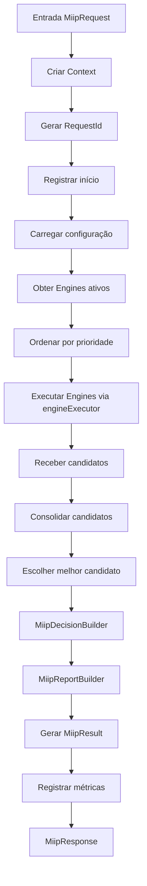
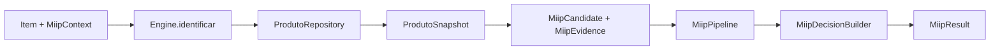
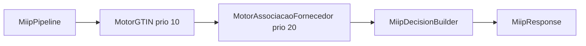

# Arquitetura Oficial — MIIP (Motor Inteligente de Identificação de Produtos)

**Projeto:** CDS Sistemas  
**Módulo:** MIIP — Motor Inteligente de Identificação de Produtos  
**Sprint:** 1.1 — Refinamento da Arquitetura  
**Status:** Infraestrutura base implementada (sem regras de negócio no ERP)  
**Versão:** 1.1.0-draft  

---

## Sumário

1. [Objetivo do MIIP](#1-objetivo-do-miip)
2. [Responsabilidades](#2-responsabilidades)
3. [O que o MIIP faz](#3-o-que-o-miip-faz)
4. [O que o MIIP NÃO faz](#4-o-que-o-miip-não-faz)
5. [Fluxo completo](#5-fluxo-completo)
6. [Arquitetura](#6-arquitetura)
7. [Estrutura de diretórios](#7-estrutura-de-diretórios)
8. [Responsabilidade de cada pasta](#8-responsabilidade-de-cada-pasta)
9. [Responsabilidade de cada classe](#9-responsabilidade-de-cada-classe)
10. [Como um novo Motor será adicionado](#10-como-um-novo-motor-será-adicionado)
11. [Como funciona o Orchestrator](#11-como-funciona-o-orchestrator)
12. [Como funciona o Service](#12-como-funciona-o-service)
13. [Como funcionam os Repositories](#13-como-funcionam-os-repositories)
14. [Como funcionam os DTOs](#14-como-funcionam-os-dtos)
15. [Sistema de Score](#15-sistema-de-score)
16. [Sistema de Confiança](#16-sistema-de-confiança)
17. [Sistema de Logs](#17-sistema-de-logs)
18. [Sistema de Aprendizado](#18-sistema-de-aprendizado)
19. [Preparação para MIIP Cloud](#19-preparação-para-miip-cloud)
20. [Pontos de integração futuros](#20-pontos-de-integração-futuros)
21. [Arquitetura completa para aprovação](#21-arquitetura-completa-para-aprovação)
22. [Sprint 1.1 — Refinamento da Arquitetura](#22-sprint-11--refinamento-da-arquitetura)
23. [Sprint 2 — Pipeline de Execução](#23-sprint-2--pipeline-de-execução)

---

## 1. Objetivo do MIIP

O **MIIP** é o motor centralizado de identificação de produtos do CDS Sistemas. Seu objetivo é **resolver, com precisão e rastreabilidade, qual produto interno do ERP corresponde a um item externo** — seja ele proveniente de XML de NF-e, digitação manual, leitura de código de barras, busca no PDV ou integração futura com serviços em nuvem.

Hoje o sistema resolve produtos de forma fragmentada e simplista:

- `ensureProductForItem()` em `backend/rotas/compras.js` faz match exato por `codigo`, `codigo_barras` ou `nome`, ou cria produto automaticamente.
- `POST /api/compras/parse-xml` apenas parseia o XML; não vincula produtos.
- A busca no PDV usa SQL com `match_exato`, sem motor unificado.

O MIIP substitui essa lógica dispersa por um **único ponto de decisão no backend**, seguindo o mesmo princípio arquitetural do `OrquestradorPagamento` e do Motor de Equipamentos: **o frontend coleta dados; o backend decide**.

### Metas mensuráveis

| Meta | Descrição |
|------|-----------|
| **Precisão** | Reduzir criação indevida de produtos duplicados em importação XML |
| **Velocidade** | Pré-preencher `produto_id` automaticamente após parse XML |
| **Rastreabilidade** | Registrar toda tentativa de identificação com score e confiança |
| **Aprendizado** | Melhorar sugestões com base em correções do operador |
| **Extensibilidade** | Permitir novos motores de identificação sem alterar rotas existentes |
| **Cloud-ready** | Preparar contrato de API para sincronização futura com MIIP Cloud |

---

## 2. Responsabilidades

### 2.1 Responsabilidades do MIIP (backend)

| Responsabilidade | Detalhe |
|------------------|---------|
| Identificar produto | Dado um item de entrada, retornar candidato(s) com score |
| Calcular confiança | Determinar se o match é automático, sugerido ou manual |
| Orquestrar motores | Executar motores plugáveis em ordem e agregar resultados |
| Registrar logs | Persistir cada tentativa para auditoria e aprendizado |
| Aprender com feedback | Incorporar correções do operador em aliases e pesos |
| Expor API interna | Interface estável para rotas, serviços e jobs |

### 2.2 Responsabilidades do Frontend (ERP / PDV)

| Responsabilidade | Detalhe |
|------------------|---------|
| Coletar dados | Enviar item bruto (nome, EAN, NCM, fornecedor, quantidade, etc.) |
| Exibir sugestões | Mostrar candidatos retornados pelo MIIP quando confiança < ALTA |
| Confirmar correção | Enviar feedback quando operador escolhe produto diferente da sugestão |
| **Não decidir match** | Frontend nunca aplica regra de score, peso ou threshold |

### 2.3 Responsabilidades fora do MIIP

| Módulo | Mantém responsabilidade |
|--------|-------------------------|
| `motorConversaoUnidades` | Conversão fracionada, KG, embalagem → estoque |
| Motor de Equipamentos | Sincronização outbound para balanças (PLU) |
| `OrquestradorPagamento` | Fluxo de pagamento fiscal/não fiscal |
| `lotesService` | Criação de lotes com validade |
| `estoqueFiscalService` | Split fiscal/não fiscal de estoque |
| Rotas de CRUD | Cadastro manual de produtos permanece em `rotas/produtos.js` |

---

## 3. O que o MIIP faz

1. **Recebe um item para identificação** via DTO padronizado (`ItemIdentificacaoDTO`).
2. **Executa motores de identificação** registrados (código de barras, nome similar, histórico de compra, alias de fornecedor, etc.).
3. **Agrega candidatos** com sistema de score ponderado.
4. **Calcula nível de confiança** (ALTA, MÉDIA, BAIXA, NENHUMA).
5. **Retorna resultado estruturado** (`ResultadoIdentificacaoDTO`) com ação recomendada:
   - `auto_vincular` — confiança ALTA, vincular sem intervenção
   - `sugerir` — apresentar top N candidatos ao operador
   - `criar_novo` — nenhum candidato confiável; sugerir cadastro
   - `revisar_manual` — conflito entre motores; exigir decisão humana
6. **Registra log completo** da operação (entrada, motores executados, scores, decisão).
7. **Processa feedback de aprendizado** quando operador confirma ou corrige sugestão.
8. **Expõe consulta de histórico** para auditoria e relatórios.

### Contextos de uso previstos

| Contexto | Trigger futuro | Comportamento esperado |
|----------|----------------|------------------------|
| Importação XML (compras) | Após `parse-xml` | Pré-preencher `produto_id` e confiança por item |
| Salvamento de compra | Substituir lógica de `ensureProductForItem` | Identificar antes de INSERT/UPDATE |
| Busca PDV | `GET /api/produtos/consulta-pdv/buscar` | Enriquecer com score MIIP |
| Cadastro assistido | Tela de produtos | Detectar duplicatas antes de salvar |
| API externa / MIIP Cloud | Endpoint dedicado | Mesmo contrato DTO, execução local ou remota |

---

## 4. O que o MIIP NÃO faz

| Exclusão | Motivo |
|----------|--------|
| **Não parseia XML de NF-e** | Responsabilidade de `rotas/compras.js` (permanece inalterada na Sprint 0) |
| **Não grava compra/venda** | MIIP apenas identifica; persistência fica nas rotas de domínio |
| **Não altera estoque** | Estoque é atualizado por `processarItensCompra` após identificação |
| **Não converte unidades** | `motorConversaoUnidades` permanece independente |
| **Não sincroniza balanças** | Motor de Equipamentos cuida de outbound PLU |
| **Não define preço ou margem** | Apenas sugere vínculo de produto; preços vêm do item de compra |
| **Não substitui cadastro manual** | Operador pode cadastrar produto sem passar pelo MIIP |
| **Não toma decisões no frontend** | Toda regra de score/confiança é backend-only |
| **Não envia dados para nuvem (Sprint 0)** | Apenas prepara contratos; MIIP Cloud é fase futura |
| **Não cria tabelas (Sprint 0)** | Schema será definido em sprint de implementação |

---

## 5. Fluxo completo

### 5.1 Fluxo principal — Identificação de item

```
┌─────────────────┐
│  Origem do Item │  (XML parse, compra manual, PDV, API)
└────────┬────────┘
         │
         ▼
┌─────────────────┐
│   Controller    │  Recebe HTTP, valida payload mínimo
│  (futuro)       │
└────────┬────────┘
         │
         ▼
┌─────────────────┐
│   MIIPService   │  Ponto de entrada do domínio
│  .identificar() │
└────────┬────────┘
         │
         ▼
┌─────────────────┐
│ MIIPOrchestrator│  Carrega motores ativos, define ordem
│  .executar()    │
└────────┬────────┘
         │
         ├──────────────────────────────────┐
         ▼                                  ▼
┌─────────────────┐              ┌─────────────────┐
│ Motor 1         │              │ Motor N         │
│ (ex: EAN exato) │     ...      │ (ex: Alias)     │
│ → CandidatoDTO[]│              │ → CandidatoDTO[]│
└────────┬────────┘              └────────┬────────┘
         │                                  │
         └──────────────┬───────────────────┘
                        ▼
              ┌─────────────────┐
              │  ScoreService   │  Agrega, normaliza, ranqueia
              │  .calcular()    │
              └────────┬────────┘
                       ▼
              ┌─────────────────┐
              │ConfiancaService │  Define nível e ação recomendada
              │  .avaliar()     │
              └────────┬────────┘
                       ▼
              ┌─────────────────┐
              │   LogService    │  Persiste operação completa
              │  .registrar()   │
              └────────┬────────┘
                       ▼
              ┌─────────────────┐
              │ ResultadoIdent. │  Retorno ao caller
              │      DTO        │
              └─────────────────┘
```

### 5.2 Fluxo — Importação XML de compra (integração futura)

```
Operador importa XML
        ↓
POST /api/compras/parse-xml          ← permanece como hoje (parse only)
        ↓
Frontend recebe itens sem produto_id
        ↓
POST /api/miip/identificar-lote      ← endpoint futuro
        ↓
MIIPService.identificarLote(itens[])
        ↓
Retorna itens enriquecidos:
  - produto_id (se confiança ALTA)
  - candidatos[] (se confiança MÉDIA/BAIXA)
  - acao_recomendada
  - score, confianca
        ↓
Frontend exibe grid com badges de confiança
        ↓
Operador confirma ou corrige
        ↓
POST /api/compras/ (salvar compra)   ← ensureProductForItem delega ao MIIP
```

### 5.3 Fluxo — Aprendizado por feedback

```
Operador corrige sugestão do MIIP
        ↓
POST /api/miip/feedback
  { operacao_id, produto_id_correto, motivo? }
        ↓
AprendizadoService.processarFeedback()
        ↓
  ├── Grava alias fornecedor (se aplicável)
  ├── Ajusta peso do motor que errou
  ├── Incrementa contador de acerto do motor correto
  └── Atualiza log original com resultado final
        ↓
Próximas identificações similares terão score melhorado
```

### 5.4 Fluxo — Decisão por nível de confiança

```
Resultado com candidato top
        │
        ├── Confiança ALTA   (score ≥ 90, sem conflito)
        │       → acao: auto_vincular
        │
        ├── Confiança MÉDIA  (score 70–89, ou conflito leve)
        │       → acao: sugerir (top 3 candidatos)
        │
        ├── Confiança BAIXA  (score 40–69)
        │       → acao: sugerir (top 5, destaque visual)
        │
        └── Confiança NENHUMA (score < 40)
                → acao: criar_novo ou revisar_manual
```

---

## 6. Arquitetura

O MIIP segue o padrão **Controller → Service → Orchestrator → Motores → Repositories**, alinhado ao Motor de Equipamentos e ao `OrquestradorPagamento`.

### 6.1 Diagrama de camadas

```
┌──────────────────────────────────────────────────────────────────────┐
│                        CAMADA DE APRESENTAÇÃO                        │
│  frontend/erp/js/compras.js  │  frontend/shared/js/pdvBuscaProduto  │
│  (coleta + exibe sugestões)  │  (coleta + exibe sugestões)          │
└──────────────────────────────────┬───────────────────────────────────┘
                                   │ HTTP (futuro)
┌──────────────────────────────────▼───────────────────────────────────┐
│                         CAMADA DE API (futuro)                       │
│              backend/controllers/MIIPController.js                   │
│              rotas: /api/miip/identificar, /feedback, /historico     │
└──────────────────────────────────┬───────────────────────────────────┘
                                   │
┌──────────────────────────────────▼───────────────────────────────────┐
│                         CAMADA DE SERVIÇO                            │
│  MIIPService          — fachada pública do domínio                   │
│  ScoreService         — agregação e ranking de candidatos            │
│  ConfiancaService     — thresholds e ação recomendada                │
│  AprendizadoService   — feedback loop e ajuste de pesos              │
│  LogService           — auditoria estruturada                        │
└──────────────────────────────────┬───────────────────────────────────┘
                                   │
┌──────────────────────────────────▼───────────────────────────────────┐
│                        CAMADA DE ORQUESTRAÇÃO                        │
│  MIIPOrchestrator     — pipeline de execução dos motores             │
│  MotorRegistry        — registro e resolução de motores plugáveis    │
│  MIIPManager          — bootstrap, lifecycle, health check           │
└──────────────────────────────────┬───────────────────────────────────┘
                                   │
┌──────────────────────────────────▼───────────────────────────────────┐
│                     CAMADA DE MOTORES (plugins)                      │
│  CodigoBarrasMotor │ NomeSimilaridadeMotor │ HistoricoCompraMotor     │
│  AliasFornecedorMotor │ NCMCategoriaMotor │ CodigoInternoMotor        │
└──────────────────────────────────┬───────────────────────────────────┘
                                   │
┌──────────────────────────────────▼───────────────────────────────────┐
│                       CAMADA DE PERSISTÊNCIA                         │
│  ProdutoMIIPRepository │ AliasRepository │ LogRepository              │
│  AprendizadoRepository │ ConfigRepository                             │
│  (SQLite — tabelas a serem criadas em sprint futura)                 │
└──────────────────────────────────────────────────────────────────────┘
```

### 6.2 Princípios arquiteturais

| Princípio | Aplicação no MIIP |
|-----------|-------------------|
| **Single Decision Point** | Toda identificação passa pelo `MIIPService` |
| **Plugin Architecture** | Motores são independentes e registráveis via `MotorRegistry` |
| **Immutable DTOs** | Entrada e saída via DTOs; motores não mutam estado global |
| **Fail-safe** | Se um motor falha, os demais continuam; erro é logado |
| **Local-first** | Execução 100% local no SQLite; cloud é opt-in futuro |
| **Audit by default** | Toda operação gera log, mesmo com match automático |
| **Separation of concerns** | Score ≠ Confiança ≠ Aprendizado — serviços distintos |

---

## 7. Estrutura de diretórios

```
backend/
└── motores/
    └── miip/
        ├── README.md                          # Documentação do módulo
        ├── index.js                           # Bootstrap e exports públicos
        │
        ├── core/
        │   ├── MIIPManager.js                 # Lifecycle, init, health
        │   ├── MIIPOrchestrator.js            # Pipeline de motores
        │   ├── MotorRegistry.js               # Registro plugável de motores
        │   └── MotorBase.js                   # Classe abstrata para motores
        │
        ├── motores/
        │   ├── CodigoBarrasMotor.js           # Match exato EAN/GTIN
        │   ├── CodigoInternoMotor.js          # Match exato codigo interno
        │   ├── NomeSimilaridadeMotor.js       # Similaridade textual (nome)
        │   ├── AliasFornecedorMotor.js        # Código do fornecedor → produto
        │   ├── HistoricoCompraMotor.js        # Itens já comprados do fornecedor
        │   ├── NCMCategoriaMotor.js           # NCM + categoria como hint
        │   └── README.md                      # Guia para criar novo motor
        │
        ├── services/
        │   ├── MIIPService.js                 # Fachada principal
        │   ├── ScoreService.js                # Agregação de scores
        │   ├── ConfiancaService.js            # Avaliação de confiança
        │   ├── AprendizadoService.js          # Feedback loop
        │   └── LogService.js                  # Registro de operações
        │
        ├── repositories/
        │   ├── ProdutoMIIPRepository.js       # Consultas otimizadas em produtos
        │   ├── AliasFornecedorRepository.js   # Aliases fornecedor → produto
        │   ├── MIIPLogRepository.js           # Logs de identificação
        │   ├── AprendizadoRepository.js       # Pesos, estatísticas, feedback
        │   └── MIIPConfigRepository.js        # Configurações do motor
        │
        ├── dto/
        │   ├── ItemIdentificacaoDTO.js        # Entrada padronizada
        │   ├── CandidatoDTO.js                # Produto candidato + score parcial
        │   ├── ResultadoIdentificacaoDTO.js   # Saída completa
        │   ├── FeedbackDTO.js                 # Correção do operador
        │   ├── MotorResultadoDTO.js           # Saída de um motor individual
        │   └── ContextoIdentificacaoDTO.js    # Metadados (origem, usuário, sessão)
        │
        ├── config/
        │   ├── miip.defaults.json             # Pesos, thresholds, motores ativos
        │   └── miip.schema.json               # Schema de validação de config
        │
        ├── events/
        │   ├── MIIPEventEmitter.js            # Eventos internos do motor
        │   └── eventTypes.js                  # Constantes de eventos
        │
        └── tests/
            ├── miip.orchestrator.test.js
            ├── miip.score.test.js
            ├── miip.confianca.test.js
            ├── miip.motores.test.js
            └── fixtures/                      # Itens de teste (XML samples)
```

### Convenção de nomenclatura

| Elemento | Padrão | Exemplo |
|----------|--------|---------|
| Pasta do módulo | `motores/miip/` | Alinhado a `motores/equipamentos/` |
| Motores plugáveis | `*Motor.js` em `motores/miip/motores/` | `CodigoBarrasMotor.js` |
| Serviços | `*Service.js` | `MIIPService.js` |
| Repositórios | `*Repository.js` | `MIIPLogRepository.js` |
| DTOs | `*DTO.js` | `ItemIdentificacaoDTO.js` |
| Tabelas (futuro) | prefixo `miip_` | `miip_logs`, `miip_aliases` |
| Rotas (futuro) | `/api/miip/*` | `/api/miip/identificar` |
| Eventos | `miip.<ação>` | `miip.identificado`, `miip.feedback` |

---

## 8. Responsabilidade de cada pasta

| Pasta | Responsabilidade |
|-------|------------------|
| `miip/` (raiz) | Bootstrap do módulo, exports públicos, README |
| `core/` | Orquestração, registro de motores, lifecycle, classe base |
| `motores/` | Implementações plugáveis de estratégias de identificação |
| `services/` | Lógica de domínio: score, confiança, aprendizado, logs |
| `repositories/` | Acesso a dados SQLite (produtos, aliases, logs, config) |
| `dto/` | Contratos de entrada/saída imutáveis entre camadas |
| `config/` | Defaults e schema de configuração do MIIP |
| `events/` | EventEmitter interno para desacoplamento e hooks futuros |
| `tests/` | Testes unitários e de integração do módulo |

---

## 9. Responsabilidade de cada classe

### 9.1 Core

| Classe | Responsabilidade |
|--------|------------------|
| **MIIPManager** | Inicializa o módulo no `server.js`; carrega config; registra motores; expõe `healthCheck()` |
| **MIIPOrchestrator** | Recebe `ItemIdentificacaoDTO`; executa motores em ordem; coleta `MotorResultadoDTO[]`; delega ao ScoreService |
| **MotorRegistry** | Mapa `codigo → instância do motor`; métodos `registrar()`, `listar()`, `resolver()`, `estaAtivo()` |
| **MotorBase** | Classe abstrata com `identificar(item): CandidatoDTO[]`, `getCodigo()`, `getPeso()`, `getDescricao()` |

### 9.2 Motores plugáveis (Sprint inicial planejada)

| Classe | Estratégia | Peso default | Score máximo |
|--------|------------|--------------|--------------|
| **CodigoBarrasMotor** | Match exato em `produtos.codigo_barras` (EAN/GTIN válido) | 1.0 | 100 |
| **CodigoInternoMotor** | Match exato em `produtos.codigo` | 0.9 | 95 |
| **AliasFornecedorMotor** | Lookup em `miip_aliases` (cnpj + codigo_fornecedor) | 0.95 | 98 |
| **HistoricoCompraMotor** | JOIN `compras_itens` + `compras` por fornecedor + nome/EAN | 0.8 | 85 |
| **NomeSimilaridadeMotor** | Similaridade textual (Levenshtein/token overlap) em `produtos.nome` | 0.6 | 75 |
| **NCMCategoriaMotor** | Hint por NCM igual + nome parcial (nunca decisão sozinha) | 0.3 | 50 |

### 9.3 Services

| Classe | Responsabilidade |
|--------|------------------|
| **MIIPService** | API pública: `identificar(item)`, `identificarLote(itens[])`, `registrarFeedback(feedback)`, `obterHistorico(filtros)` |
| **ScoreService** | Recebe candidatos de todos os motores; aplica pesos; deduplica por `produto_id`; ranqueia; retorna lista ordenada |
| **ConfiancaService** | Aplica thresholds; detecta conflitos entre motores; define `nivel_confianca` e `acao_recomendada` |
| **AprendizadoService** | Processa `FeedbackDTO`; cria/atualiza alias; ajusta pesos em `miip_aprendizado`; recalcula estatísticas |
| **LogService** | Monta registro completo; persiste via `MIIPLogRepository`; emite evento `miip.identificado` |

### 9.4 Repositories

| Classe | Responsabilidade |
|--------|------------------|
| **ProdutoMIIPRepository** | Queries otimizadas: busca por EAN, código, nome (exato e LIKE), produtos ativos |
| **AliasFornecedorRepository** | CRUD de aliases (cnpj_fornecedor + codigo_item → produto_id) |
| **MIIPLogRepository** | INSERT/SELECT em `miip_logs`; consultas por período, origem, confiança |
| **AprendizadoRepository** | Persiste pesos ajustados, contadores de acerto/erro por motor |
| **MIIPConfigRepository** | Lê/grava configuração runtime (motores ativos, thresholds) |

### 9.5 DTOs

| Classe | Responsabilidade |
|--------|------------------|
| **ItemIdentificacaoDTO** | Contrato de entrada: nome, codigo_barras, codigo_fornecedor, ncm, unidade, fornecedor_cnpj, origem |
| **CandidatoDTO** | produto_id, nome, codigo, codigo_barras, score_parcial, motor_origem, evidencias[] |
| **MotorResultadoDTO** | motor_codigo, duracao_ms, candidatos[], erro (se falhou) |
| **ResultadoIdentificacaoDTO** | operacao_id, candidatos[], melhor_candidato, score_final, nivel_confianca, acao_recomendada |
| **FeedbackDTO** | operacao_id, produto_id_escolhido, produto_id_sugerido, motivo, usuario_id |
| **ContextoIdentificacaoDTO** | origem (xml/compra/pdv/api), usuario_id, sessao_id, timestamp |

### 9.6 Controller (futuro)

| Classe | Responsabilidade |
|--------|------------------|
| **MIIPController** | Traduz HTTP ↔ DTO; chama `MIIPService`; retorna JSON padronizado; sem lógica de negócio |

---

## 10. Como um novo Motor será adicionado

Seguindo o padrão do `DriverRegistry` do Motor de Equipamentos:

### Passo 1 — Criar classe do motor

```javascript
// backend/motores/miip/motores/MeuNovoMotor.js
const MotorBase = require('../core/MotorBase');

class MeuNovoMotor extends MotorBase {
  getCodigo() { return 'meu_novo'; }
  getDescricao() { return 'Descrição da estratégia'; }
  getPeso() { return 0.7; }  // peso default na agregação

  async identificar(item) {
    // Retorna CandidatoDTO[]
    return [];
  }
}

module.exports = MeuNovoMotor;
```

### Passo 2 — Registrar no MotorRegistry

```javascript
// Em MIIPManager.inicializar() ou arquivo de bootstrap
motorRegistry.registrar('meu_novo', new MeuNovoMotor({
  produtoRepository,
  config
}));
```

### Passo 3 — Ativar em config

```json
// config/miip.defaults.json
{
  "motores_ativos": [
    "codigo_barras",
    "codigo_interno",
    "alias_fornecedor",
    "historico_compra",
    "nome_similaridade",
    "meu_novo"
  ]
}
```

### Passo 4 — Testes

Criar `tests/miip.motores.meu-novo.test.js` com fixtures de entrada e candidatos esperados.

### Regras para novos motores

| Regra | Descrição |
|-------|-----------|
| **Isolamento** | Motor não chama outro motor diretamente |
| **Sem side effects** | Motor apenas lê dados e retorna candidatos |
| **Timeout** | Cada motor tem timeout individual (default 500ms) |
| **Idempotência** | Mesma entrada → mesmos candidatos (exceto aprendizado) |
| **Evidências** | Todo candidato deve incluir `evidencias[]` explicando o match |
| **Score parcial** | Motor define score_parcial (0–100); ScoreService aplica peso |

---

## 11. Como funciona o Orchestrator

O `MIIPOrchestrator` é o coração do pipeline. Equivalente ao `EquipamentosManager` + pipeline de drivers.

### Ciclo de execução

```
1. RECEBER item (ItemIdentificacaoDTO) + contexto (ContextoIdentificacaoDTO)

2. RESOLVER motores ativos via MotorRegistry.listarAtivos()
   → Ordenados por prioridade configurável

3. PARA CADA motor (sequencial com timeout):
   a. Chamar motor.identificar(item)
   b. Capturar CandidatoDTO[] ou erro
   c. Montar MotorResultadoDTO { motor_codigo, duracao_ms, candidatos, erro }
   d. Se erro → logar e continuar (fail-safe)

4. DELEGAR ao ScoreService.aggregate(motorResultados[])
   → Lista unificada de candidatos ranqueados

5. DELEGAR ao ConfiancaService.avaliar(candidatos, motorResultados)
   → nivel_confianca + acao_recomendada

6. DELEGAR ao LogService.registrar(item, contexto, motorResultados, resultado)
   → operacao_id gerado

7. RETORNAR ResultadoIdentificacaoDTO
```

### Configuração de ordem e prioridade

| Ordem default | Motor | Justificativa |
|---------------|-------|---------------|
| 1 | CodigoBarrasMotor | Match exato EAN — maior precisão |
| 2 | CodigoInternoMotor | Código interno do ERP |
| 3 | AliasFornecedorMotor | Aprendizado + cadastro de aliases |
| 4 | HistoricoCompraMotor | Compras anteriores do mesmo fornecedor |
| 5 | NomeSimilaridadeMotor | Fallback textual |
| 6 | NCMCategoriaMotor | Apenas como reforço de score |

### Paralelização futura

Na Sprint 0 a execução é **sequencial** (simplicidade + SQLite single-writer). Em sprint futura, motores sem dependência de escrita poderão executar em `Promise.all()` com timeout individual.

---

## 12. Como funciona o Service

### MIIPService — Fachada pública

Único ponto de entrada para rotas e outros serviços do backend.

```
MIIPService
├── identificar(item, contexto?)
│     → MIIPOrchestrator.executar()
│     → ResultadoIdentificacaoDTO
│
├── identificarLote(itens[], contexto?)
│     → Para cada item: identificar() (com cache de candidatos por EAN)
│     → ResultadoIdentificacaoDTO[]
│
├── registrarFeedback(feedback)
│     → AprendizadoService.processarFeedback()
│     → LogService.atualizarResultado()
│
├── obterHistorico(filtros)
│     → MIIPLogRepository.buscar(filtros)
│
└── obterEstatisticas()
      → AprendizadoRepository.resumo()
```

### ScoreService

```
Entrada: MotorResultadoDTO[] (candidatos de cada motor)

Processo:
1. Para cada candidato: score_ponderado = score_parcial × peso_motor
2. Agrupar por produto_id (mesmo produto pode vir de vários motores)
3. Score final do produto = MAX(score_ponderado) + bonus_agregacao
   bonus_agregacao = +5 por cada motor adicional que apontou o mesmo produto (max +15)
4. Ordenar desc por score_final
5. Retornar CandidatoDTO[] ranqueados

Saída: lista ordenada + score_final do top 1
```

### ConfiancaService

```
Entrada: candidatos ranqueados + motorResultados

Processo:
1. score_top = candidatos[0].score_final (ou 0 se vazio)
2. gap = score_top - score_segundo (ou 0 se único)
3. motores_concordantes = quantos motores apontaram o top 1
4. Aplicar regras:

   ALTA:     score_top ≥ 90 E gap ≥ 15 E motores_concordantes ≥ 2
   MÉDIA:    score_top ≥ 70 E (gap ≥ 10 OU motores_concordantes ≥ 2)
   BAIXA:    score_top ≥ 40
   NENHUMA:  score_top < 40

5. Detectar conflito: se top 1 de motores de alta precisão (EAN, alias)
   apontam produtos diferentes → forçar revisar_manual

6. Mapear para acao_recomendada:
   ALTA     → auto_vincular
   MÉDIA    → sugerir
   BAIXA    → sugerir (com alerta)
   NENHUMA  → criar_novo
   conflito → revisar_manual
```

### AprendizadoService

```
Entrada: FeedbackDTO

Processo:
1. Buscar log original por operacao_id
2. Se produto escolhido ≠ sugerido:
   a. Criar/atualizar alias (fornecedor_cnpj + codigo_item → produto_id)
   b. Decrementar peso do motor que sugeriu errado (-0.05, min 0.1)
   c. Incrementar peso do motor que deveria ter acertado (+0.05, max 1.0)
3. Se produto escolhido = sugerido:
   a. Incrementar contador de acerto do motor principal
4. Persistir em miip_aprendizado
5. Emitir evento miip.feedback
```

### LogService

```
Entrada: item, contexto, motorResultados, resultado final

Registro em miip_logs:
- operacao_id (UUID)
- timestamp
- origem (xml, compra, pdv, api)
- item_entrada (JSON)
- motores_executados (JSON)
- candidatos (JSON)
- score_final, nivel_confianca, acao_recomendada
- produto_vinculado_id (null até feedback ou auto_vincular)
- duracao_total_ms
- usuario_id
```

---

## 13. Como funcionam os Repositories

Todos os repositories seguem o padrão do `EquipamentosRepository`: funções async que recebem a instância `db` (SQLite3), sem ORM.

### Tabelas planejadas (implementação futura — NÃO criar na Sprint 0)

| Tabela | Finalidade |
|--------|------------|
| `miip_logs` | Auditoria de cada operação de identificação |
| `miip_aliases` | Mapeamento fornecedor → produto (cnpj + codigo_item → produto_id) |
| `miip_aprendizado` | Pesos ajustados e contadores por motor |
| `miip_config` | Configuração runtime (JSON) |

### ProdutoMIIPRepository

Consultas de leitura otimizadas sobre tabela `produtos` existente:

| Método | Query base |
|--------|------------|
| `buscarPorCodigoBarras(ean)` | `WHERE codigo_barras = ? AND ativo = 1` |
| `buscarPorCodigo(codigo)` | `WHERE codigo = ? AND ativo = 1` |
| `buscarPorNomeExato(nome)` | `WHERE nome = ? AND ativo = 1` |
| `buscarPorNomeSimilar(nome, limit)` | `WHERE nome LIKE ? AND ativo = 1 LIMIT ?` |
| `buscarPorNCM(ncm)` | `WHERE ncm = ? AND ativo = 1` |

### AliasFornecedorRepository

| Método | Descrição |
|--------|-----------|
| `buscar(cnpj, codigoItem)` | Retorna produto_id do alias |
| `criar(cnpj, codigoItem, produtoId, origem)` | Cria alias com origem (manual/aprendizado) |
| `listarPorFornecedor(cnpj)` | Todos os aliases de um fornecedor |

### MIIPLogRepository

| Método | Descrição |
|--------|-----------|
| `inserir(registro)` | Grava log completo |
| `buscar(filtros)` | Consulta por período, origem, confiança, produto |
| `atualizarResultado(operacaoId, produtoId, feedback)` | Atualiza após feedback |

### AprendizadoRepository

| Método | Descrição |
|--------|-----------|
| `obterPeso(motorCodigo)` | Peso atual do motor |
| `ajustarPeso(motorCodigo, delta)` | Incrementa/decrementa peso |
| `incrementarAcerto(motorCodigo)` | Contador de acertos |
| `incrementarErro(motorCodigo)` | Contador de erros |
| `resumo()` | Estatísticas gerais para dashboard |

---

## 14. Como funcionam os DTOs

DTOs são objetos plain JavaScript (sem classes ORM) com factory functions para validação na construção.

### ItemIdentificacaoDTO (entrada)

```javascript
{
  produto_nome: string,          // obrigatório
  codigo_barras: string | null,  // EAN/GTIN
  codigo_fornecedor: string | null, // cProd do XML
  ncm: string | null,
  unidade: string | null,        // uCom
  fornecedor_cnpj: string | null,
  fornecedor_nome: string | null,
  preco_unitario: number | null, // hint para histórico
  produto_id_hint: number | null // se operador já pré-selecionou
}
```

### CandidatoDTO

```javascript
{
  produto_id: number,
  nome: string,
  codigo: string,
  codigo_barras: string | null,
  score_parcial: number,         // 0–100, antes do peso
  score_ponderado: number,       // após peso do motor
  motor_origem: string,          // codigo do motor
  evidencias: [                  // explicação do match
    { tipo: 'ean_exato', valor: '7891234567890' }
  ]
}
```

### ResultadoIdentificacaoDTO (saída)

```javascript
{
  operacao_id: string,           // UUID para feedback
  candidatos: CandidatoDTO[],    // ranqueados
  melhor_candidato: CandidatoDTO | null,
  score_final: number,
  nivel_confianca: 'ALTA' | 'MEDIA' | 'BAIXA' | 'NENHUMA',
  acao_recomendada: 'auto_vincular' | 'sugerir' | 'criar_novo' | 'revisar_manual',
  motores_executados: string[],
  duracao_total_ms: number
}
```

### Regras dos DTOs

| Regra | Descrição |
|-------|-----------|
| Imutabilidade | DTOs não são mutados após criação; serviços criam novos objetos |
| Validação na factory | `ItemIdentificacaoDTO.create(payload)` valida campos obrigatórios |
| Sem lógica de negócio | DTOs não calculam score nem confiança |
| Serialização JSON | Todos os campos são JSON-safe (sem Date objects; usar ISO string) |

---

## 15. Sistema de Score

### Fórmula de agregação

```
score_ponderado = score_parcial × peso_motor

score_final(produto) = MAX(score_ponderado de todos os motores para esse produto)
                     + bonus_agregacao

bonus_agregacao = MIN(15, (motores_que_apontaram_produto - 1) × 5)
```

### Score parcial por motor

| Motor | Condição | score_parcial |
|-------|----------|---------------|
| CodigoBarrasMotor | EAN exato, produto ativo | 100 |
| CodigoBarrasMotor | EAN exato, produto inativo | 60 |
| CodigoInternoMotor | Código exato | 95 |
| AliasFornecedorMotor | Alias confirmado (origem aprendizado) | 98 |
| AliasFornecedorMotor | Alias manual | 95 |
| HistoricoCompraMotor | Mesmo fornecedor + EAN na compra anterior | 90 |
| HistoricoCompraMotor | Mesmo fornecedor + nome exato | 80 |
| HistoricoCompraMotor | Mesmo fornecedor + nome similar (> 0.85) | 65 |
| NomeSimilaridadeMotor | Similaridade ≥ 0.95 | 75 |
| NomeSimilaridadeMotor | Similaridade 0.85–0.94 | 55 |
| NomeSimilaridadeMotor | Similaridade 0.70–0.84 | 35 |
| NCMCategoriaMotor | NCM igual + nome parcial (> 0.70) | 50 |

### Pesos default dos motores

| Motor | Peso | Justificativa |
|-------|------|---------------|
| codigo_barras | 1.00 | Máxima confiabilidade |
| alias_fornecedor | 0.95 | Aprendizado validado |
| codigo_interno | 0.90 | Código ERP |
| historico_compra | 0.80 | Contexto de fornecedor |
| nome_similaridade | 0.60 | Fuzzy — sujeito a falsos positivos |
| ncm_categoria | 0.30 | Apenas hint, nunca decisivo |

Pesos são ajustáveis via `AprendizadoService` e `miip_config`.

---

## 16. Sistema de Confiança

Score e confiança são conceitos separados:

- **Score** = quão bem o candidato corresponde ao item (métrica contínua 0–100)
- **Confiança** = quão seguro o sistema está para agir automaticamente (nível discreto)

### Níveis de confiança

| Nível | Critério | Ação | UX no frontend |
|-------|----------|------|----------------|
| **ALTA** | score ≥ 90, gap ≥ 15, ≥ 2 motores concordam | `auto_vincular` | Badge verde; produto pré-selecionado |
| **MÉDIA** | score ≥ 70, gap ≥ 10 ou ≥ 2 motores | `sugerir` | Badge amarelo; top 3 sugestões |
| **BAIXA** | score ≥ 40 | `sugerir` | Badge laranja; top 5 + alerta |
| **NENHUMA** | score < 40 | `criar_novo` | Badge cinza; formulário de cadastro |

### Regras especiais

| Situação | Override |
|----------|----------|
| Conflito EAN vs Alias (produtos diferentes) | `revisar_manual` independente do score |
| EAN válido mas produto inativo | Confiança máxima = MÉDIA |
| Item com `produto_id_hint` do operador | Pular MIIP; respeitar hint (confiança = ALTA manual) |
| Primeiro item do fornecedor (sem histórico) | Reduzir confiança em 1 nível |

---

## 17. Sistema de Logs

### Estrutura do log (`miip_logs`)

| Campo | Tipo | Descrição |
|-------|------|-----------|
| id | INTEGER PK | Auto-increment |
| operacao_id | TEXT UNIQUE | UUID da operação |
| created_at | DATETIME | Timestamp |
| origem | TEXT | xml, compra, pdv, api, cloud |
| usuario_id | INTEGER | Quem disparou (nullable) |
| item_entrada | TEXT (JSON) | ItemIdentificacaoDTO serializado |
| motores_executados | TEXT (JSON) | MotorResultadoDTO[] |
| candidatos | TEXT (JSON) | Candidatos ranqueados |
| score_final | REAL | Score do top 1 |
| nivel_confianca | TEXT | ALTA, MEDIA, BAIXA, NENHUMA |
| acao_recomendada | TEXT | auto_vincular, sugerir, etc. |
| produto_vinculado_id | INTEGER | Produto final (após feedback ou auto) |
| feedback_recebido | INTEGER | 0/1 |
| duracao_total_ms | INTEGER | Performance |

### Níveis de log

| Nível | Destino | Conteúdo |
|-------|---------|----------|
| **Operacional** | `miip_logs` (SQLite) | Toda identificação |
| **Debug** | Console/arquivo (dev only) | Detalhes de cada motor, queries |
| **Evento** | `MIIPEventEmitter` | `miip.identificado`, `miip.erro`, `miip.feedback` |
| **Auditoria** | Tabela `auditoria` existente | Ações críticas (auto-create via MIIP) |

### Retenção

- Logs operacionais: **365 dias** (configurável em `miip_config`)
- Job de limpeza: futuro cron no `MIIPManager`

---

## 18. Sistema de Aprendizado

### Fontes de aprendizado

| Fonte | Trigger | O que aprende |
|-------|---------|---------------|
| **Feedback explícito** | Operador corrige sugestão | Alias fornecedor, pesos de motor |
| **Confirmação implícita** | Operador aceita sugestão MÉDIA sem alterar | Incrementa acerto do motor |
| **Auto-vinculação validada** | Compra salva sem alteração do produto auto-vinculado | Reforça alias e histórico |
| **Cadastro posterior** | Operador cria produto após `criar_novo` | Sugere alias na próxima compra |

### Ciclo de aprendizado

```
                    ┌─────────────────┐
                    │  Identificação  │
                    └────────┬────────┘
                             │
              ┌──────────────┼──────────────┐
              ▼              ▼              ▼
        auto_vincular     sugerir       criar_novo
              │              │              │
              ▼              ▼              ▼
        Salvar compra   Operador       Operador cadastra
        sem alterar     confirma/      novo produto
              │         corrige              │
              ▼              │              ▼
        Reforço +1     FeedbackDTO     Alias criado
              │              │              │
              └──────────────┼──────────────┘
                             ▼
                    ┌─────────────────┐
                    │ miip_aprendizado│
                    │ miip_aliases    │
                    └────────┬────────┘
                             ▼
                    Próxima identificação
                    com score melhorado
```

### Limites de aprendizado

| Limite | Valor | Motivo |
|--------|-------|--------|
| Peso mínimo de motor | 0.10 | Evitar silenciar motor permanentemente |
| Peso máximo de motor | 1.00 | Teto de influência |
| Delta por feedback | ±0.05 | Aprendizado gradual |
| Alias auto sem confirmação | Proibido | Alias só via feedback ou cadastro explícito |

---

## 19. Preparação para MIIP Cloud

A Sprint 0 prepara o MIIP para operação **100% local**, mas o design permite evolução para **MIIP Cloud** sem refatoração do core.

### Princípios Cloud-ready

| Princípio | Implementação no design |
|-----------|-------------------------|
| **Contrato DTO estável** | Mesmos DTOs para local e cloud |
| **Transport abstrato** | `MIIPTransport` interface: `LocalTransport` (default) / `CloudTransport` (futuro) |
| **Local-first** | Cloud é fallback/enriquecimento, nunca bloqueante |
| **Dados anonimizados** | Apenas nomes normalizados + NCM + EAN enviados à nuvem (sem CNPJ, sem preços) |
| **Opt-in** | `miip_config.cloud_habilitado = false` por default |

### Arquitetura alvo com MIIP Cloud

```
┌──────────────┐         ┌─────────────────────────────────┐
│  MIIPService │────────►│       MIIPOrchestrator          │
└──────────────┘         └───────────────┬─────────────────┘
                                         │
                         ┌───────────────┼───────────────┐
                         ▼               ▼               ▼
                  ┌────────────┐  ┌────────────┐  ┌────────────┐
                  │Motores     │  │MIIP Cloud  │  │Aprendizado │
                  │Locais      │  │Transport   │  │Local       │
                  │(SQLite)    │  │(HTTPS API) │  │(SQLite)    │
                  └────────────┘  └──────┬─────┘  └────────────┘
                                         │
                                         ▼
                                  ┌────────────┐
                                  │ MIIP Cloud │
                                  │ - Base de  │
                                  │   produtos │
                                  │   global   │
                                  │ - ML model │
                                  │ - Aliases  │
                                  │   coletivos│
                                  └────────────┘
```

### MIIP Cloud — funcionalidades futuras

| Funcionalidade | Descrição |
|----------------|-----------|
| **Base global de EANs** | Produtos não cadastrados localmente identificados por base global |
| **Modelo ML coletivo** | Similaridade de nomes treinada com dados anonimizados de todos os clientes |
| **Sugestão de NCM** | Validação/sugestão de NCM por descrição |
| **Sync de aliases** | Aliases validados por múltiplos clientes reforçam score |
| **Dashboard central** | Métricas agregadas de acurácia por segmento |

### CloudTransport (futuro)

```javascript
// Interface planejada — NÃO implementar na Sprint 0
class CloudTransport {
  async identificar(itemAnonimizado) { /* HTTPS POST */ }
  async enviarFeedback(feedbackAnonimizado) { /* HTTPS POST */ }
  async healthCheck() { /* HTTPS GET */ }
  estaDisponivel() { /* timeout 2s */ }
}
```

### Regra de fallback

```
1. Executar motores locais (sempre)
2. SE cloud_habilitado E CloudTransport.estaDisponivel():
     a. Enviar item anonimizado
     b. Receber candidatos cloud com score_cloud
     c. ScoreService agrega candidatos locais + cloud (peso cloud = 0.5)
3. SE cloud indisponível:
     a. Continuar apenas com resultados locais (sem erro para o usuário)
4. Retornar resultado normalmente
```

---

## 20. Pontos de integração futuros

> **Sprint 0: nenhum destes pontos será alterado.** Documentados aqui para guiar sprints futuras.

| Ponto atual | Arquivo | Integração futura |
|-------------|---------|-------------------|
| Parse XML | `backend/rotas/compras.js` | Após parse, chamar `MIIPService.identificarLote()` |
| ensureProductForItem | `backend/rotas/compras.js:268` | Delegar para `MIIPService.identificar()` |
| Busca PDV | `backend/rotas/produtos.js` | Enriquecer resultados com score MIIP |
| Frontend compras | `frontend/erp/js/compras.js` | Exibir badges de confiança; enviar feedback |
| Bootstrap | `backend/server.js` | Adicionar `motorMIIP.inicializar()` |
| Testes | `tests/` | Suíte `test:miip` dedicada |

### Contrato de integração com ensureProductForItem (futuro)

```javascript
// ANTES (hoje):
function ensureProductForItem(item, callback) {
  // match exato ou INSERT
}

// DEPOIS (sprint futura):
async function ensureProductForItem(item, callback) {
  const resultado = await MIIPService.identificar(item, { origem: 'compra' });
  if (resultado.acao_recomendada === 'auto_vincular') {
    return callback(null, resultado.melhor_candidato.produto_id);
  }
  if (item.produto_id) {
    return callback(null, Number(item.produto_id));
  }
  // criar_novo: INSERT produto (lógica atual preservada como fallback)
}
```

---

## 21. Arquitetura completa para aprovação

### 21.1 Visão executiva

O **MIIP** centraliza a identificação de produtos no CDS Sistemas, eliminando lógica dispersa em rotas e frontend. Opera como motor plugável no backend, com score ponderado, níveis de confiança, logs auditáveis e aprendizado por feedback — preparado para evolução local → MIIP Cloud.

### 21.2 Diagrama geral do sistema

```
                         ┌─────────────────────────────────┐
                         │         CDS SISTEMAS            │
                         │                                 │
    ┌────────────────────┤         FRONTEND               │
    │  ERP (compras)     │  - Importa XML                  │
    │  ERP (produtos)    │  - Exibe sugestões/confiança    │
    │  PDV (busca)       │  - Envia feedback               │
    └────────┬───────────┤  - NÃO decide match             │
             │           └─────────────────────────────────┘
             │ HTTP
             ▼
    ┌────────────────────────────────────────────────────────┐
    │                    BACKEND (Express)                    │
    │                                                         │
    │  ┌─────────────┐    ┌──────────────────────────────┐   │
    │  │ rotas/      │    │     motores/miip/             │   │
    │  │ compras.js  │───►│                               │   │
    │  │ produtos.js │    │  MIIPService (fachada)        │   │
    │  └─────────────┘    │       │                       │   │
    │                     │  MIIPOrchestrator             │   │
    │                     │       │                       │   │
    │                     │  ┌────┴────┐                  │   │
    │                     │  │ Motores │ (plugáveis)      │   │
    │                     │  └────┬────┘                  │   │
    │                     │       │                       │   │
    │                     │  ScoreService                 │   │
    │                     │  ConfiancaService             │   │
    │                     │  AprendizadoService           │   │
    │                     │  LogService                   │   │
    │                     │       │                       │   │
    │                     │  Repositories (SQLite)        │   │
    │                     └──────────────────────────────┘   │
    │                                                         │
    │  ┌─────────────────┐  ┌──────────────────────────┐     │
    │  │ motorConversao  │  │ motor equipamentos       │     │
    │  │ (independente)  │  │ (independente)           │     │
    │  └─────────────────┘  └──────────────────────────┘     │
    │                                                         │
    │  ┌──────────────────────────────────────────────┐       │
    │  │ OrquestradorPagamento (independente)         │       │
    │  └──────────────────────────────────────────────┘       │
    └────────────────────────────────────────────────────────┘
             │
             │ (futuro, opt-in)
             ▼
    ┌─────────────────┐
    │   MIIP Cloud    │
    │   (HTTPS API)   │
    └─────────────────┘
```

### 21.3 Checklist de aprovação

| # | Item | Status Sprint 0 |
|---|------|-----------------|
| 1 | Objetivo e escopo definidos | ✅ Documentado |
| 2 | Separação faz / não faz | ✅ Documentado |
| 3 | Fluxo completo (identificação + aprendizado) | ✅ Documentado |
| 4 | Estrutura de diretórios e convenções | ✅ Documentado |
| 5 | Responsabilidades por classe | ✅ Documentado |
| 6 | Sistema de motores plugáveis | ✅ Documentado |
| 7 | Sistema de Score | ✅ Documentado |
| 8 | Sistema de Confiança | ✅ Documentado |
| 9 | Sistema de Logs | ✅ Documentado |
| 10 | Sistema de Aprendizado | ✅ Documentado |
| 11 | Preparação MIIP Cloud | ✅ Documentado |
| 12 | Pontos de integração mapeados | ✅ Documentado |
| 13 | Código implementado | ⏳ Sprint 1+ |
| 14 | Tabelas criadas | ⏳ Sprint 1+ |
| 15 | Rotas criadas | ⏳ Sprint 1+ |
| 16 | ensureProductForItem alterado | ⏳ Sprint futura |
| 17 | Importação XML alterada | ⏳ Sprint futura |

### 21.4 Sprints planejadas (pós-aprovação)

| Sprint | Entrega |
|--------|---------|
| **Sprint 0** | Arquitetura oficial (este documento) |
| **Sprint 1** | Core + DTOs + MIIPService + CodigoBarrasMotor + CodigoInternoMotor + tabelas |
| **Sprint 2** | NomeSimilaridadeMotor + HistoricoCompraMotor + Score + Confiança |
| **Sprint 3** | AliasFornecedorMotor + Aprendizado + Logs + feedback API |
| **Sprint 4** | Integração compras (parse-xml + ensureProductForItem) |
| **Sprint 5** | Integração PDV + dashboard de estatísticas |
| **Sprint 6+** | MIIP Cloud Transport + motores adicionais |

### 21.5 Decisões arquiteturais registradas

| Decisão | Escolha | Alternativa rejeitada | Motivo |
|---------|---------|----------------------|--------|
| Local do módulo | `backend/motores/miip/` | `backend/services/miip/` | Alinhamento com Motor de Equipamentos |
| Padrão de camadas | Controller → Service → Orchestrator → Motores → Repo | Lógica inline em rotas | Mesmo padrão de pagamentos e equipamentos |
| Execução de motores | Sequencial (Sprint 1) | Paralelo imediato | SQLite single-writer; simplicidade |
| Score vs Confiança | Serviços separados | Campo único | Score = match; confiança = ação — conceitos distintos |
| Aprendizado | Local com aliases | ML imediato | Gradual; funciona offline |
| Cloud | Opt-in, fallback | Cloud-first | PDV precisa funcionar offline |
| Tabelas | Prefixo `miip_` | Colunas em `produtos` | Isolamento e migração segura |

---

## 22. Sprint 1.1 — Refinamento da Arquitetura

**Escopo:** robustez estrutural antes da implementação de regras de negócio.  
**Restrições:** nenhuma alteração no ERP, Compras, XML, `ensureProductForItem()`, rotas ou telas. Nenhum SQL. Nenhum motor novo implementado.

### 22.1 Novas classes Core

#### MiipEvidence

Representa uma evidência produzida por um motor durante a identificação.

| Campo | Tipo | Descrição |
|-------|------|-----------|
| `motor` | string | Código do engine (ex.: `motor_gtin`) |
| `tipo` | string | Tipo da evidência (ex.: `gtin_exato`) |
| `descricao` | string | Texto legível para relatório |
| `peso` | number | Peso na agregação (0–100) |
| `valor` | string\|number | Valor observado (GTIN, cProd, etc.) |
| `score` | number | Score parcial desta evidência |
| `timestamp` | string | ISO 8601 |

**Arquivo:** `backend/motores/miip/core/MiipEvidence.js`

**Fluxo exemplo:**

```
Motor GTIN → tipo: gtin_exato → peso: 100 → valor: 7891234567890
```

#### MiipCandidate

Candidato consolidado utilizado pelo Orchestrator após agregação dos motores.

| Campo | Tipo | Descrição |
|-------|------|-----------|
| `produtoId` | number | ID do produto no ERP |
| `produto` | object | Snapshot do produto |
| `scoreTotal` | number | Score consolidado (0–100) |
| `confianca` | string | Nível `MiipConfidence` |
| `ranking` | number | Posição (1 = melhor) |
| `evidencias` | MiipEvidence[] | Evidências acumuladas |
| `motoresQueVotaram` | string[] | Engines que apontaram este candidato |
| `atributosExtraidos` | object | Atributos derivados (NCM, unidade, etc.) |

**Arquivo:** `backend/motores/miip/core/MiipCandidate.js`

**Relação com DTOs:** `ProdutoCandidatoDTO` permanece como saída parcial de cada motor; `MiipCandidate` é o objeto pós-consolidação do Orchestrator.

### 22.2 MiipResult — campos de auditoria

Além dos campos existentes (`decisao`, `score`, `candidatos`, `enginesExecutados`), o `MiipResult` passa a incluir:

| Campo | Tipo | Descrição |
|-------|------|-----------|
| `executionTime` | number | Tempo total de execução (ms) |
| `engineCount` | number | Quantidade de engines executados |
| `cacheHit` | boolean | Resultado servido pelo cache |
| `requestId` | string | ID único da requisição |
| `version` | string | Versão do contrato (`1.1.0`) |
| `startedAt` | string | ISO 8601 início |
| `finishedAt` | string | ISO 8601 fim |
| `durationMs` | number | Duração do pipeline (ms) |

`duracaoTotalMs` permanece como alias legado de `durationMs` para compatibilidade.

### 22.3 IRepository

Contrato abstrato para todos os repositories do MIIP.

**Arquivo:** `backend/motores/miip/repositories/IRepository.js`

| Método | Responsabilidade |
|--------|------------------|
| `getCodigo()` | Código único do repository |
| `getDescricao()` | Descrição legível |
| `buscarPorId(id)` | Busca por identificador |
| `listar(filtros)` | Listagem com filtros |
| `inserir(dados)` | Inserção |
| `atualizar(id, dados)` | Atualização |
| `remover(id)` | Remoção |

Validação de herança via `IRepository.validarHeranca(Classe)` — mesmo padrão de `IMotorIdentificacao`.

### 22.4 MotorRegistry — fluxo aprimorado

Cada motor registrado possui metadados completos:

| Campo | Descrição |
|-------|-----------|
| `codigo` | Identificador único |
| `descricao` | Estratégia de identificação |
| `versao` | Semver do motor |
| `prioridade` | Ordem de execução (menor = primeiro) |
| `ativo` | Participa do pipeline |
| `autor` | Responsável pelo motor |
| `dataCriacao` | ISO 8601 |

**Novos métodos:**

| Método | Ação |
|--------|------|
| `habilitar(codigo)` | Ativa motor sem alterar código |
| `desabilitar(codigo)` | Desativa motor |
| `listarInativos()` | Lista motores desabilitados |
| `obterMetadados(codigo)` | Metadados públicos (sem instância) |
| `totalAtivos()` | Contagem de motores ativos |

**Fluxo de registro:**

```
registrar({ codigo, Classe, descricao, versao, prioridade, ativo, autor })
    → validarHeranca(IMotorIdentificacao)
    → armazenar em Map
    → listarAtivos() usado pelo Orchestrator
```

Motores inativos permanecem registrados e podem ser reabilitados via config ou runtime.

### 22.5 Novas pastas infraestruturais

| Pasta | Finalidade | Status Sprint 1.1 |
|-------|------------|-------------------|
| `cache/` | Cache local de consultas (GTIN, associação, resultado) | README apenas |
| `metrics/` | Tempo médio, volume, taxa acerto/erro, consultas por motor | README apenas |
| `events/` | Eventos: ProdutoAssociado, ProdutoCriado, AssociacaoConfirmada, AssociacaoRecusada, ConfiancaBaixa | README apenas |

### 22.6 Estrutura definitiva dos Engines

```
engines/
├── gtin/              # Match exato GTIN/EAN
├── fornecedor/        # Associação CNPJ + cProd
├── normalizacao/      # Pré-processamento de itens
├── sinonimos/         # Aliases e sinônimos
├── similaridade/      # Similaridade textual
├── historico/         # Histórico de compras
├── estatistica/       # Padrões e pesos dinâmicos
├── fiscal/            # Hints por NCM
├── comercial/         # Hints por preço/unidade
├── atributos/         # Extração de atributos do nome
├── MotorGTIN.js       # (legado — migrar para gtin/ em sprint futura)
└── MotorAssociacaoFornecedor.js  # (legado — migrar para fornecedor/)
```

Cada subpasta contém `README.md` com responsabilidade documentada. Nenhum motor implementado nesta sprint nas subpastas.

### 22.7 Estrutura de diretórios atualizada (Sprint 1.1)

```
backend/motores/miip/
├── index.js
├── MiipService.js
├── MiipOrchestrator.js
├── MiipBootstrap.js
│
├── core/
│   ├── IMotorIdentificacao.js
│   ├── MotorRegistry.js
│   ├── MiipAction.js
│   ├── MiipConfidence.js
│   ├── MiipContext.js
│   ├── MiipResult.js
│   ├── MiipScore.js
│   ├── MiipEvidence.js          ← NOVO
│   └── MiipCandidate.js         ← NOVO
│
├── contracts/
├── repositories/
│   └── IRepository.js           ← NOVO
├── engines/
│   ├── gtin/ … atributos/       ← NOVO (subpastas)
│   └── *.js                     (motores legados na raiz)
├── cache/                       ← NOVO
├── metrics/                     ← NOVO
├── events/                      ← NOVO
├── utils/
├── config/
├── logs/
└── tests/
```

### 22.8 Decisões registradas (Sprint 1.1)

| Decisão | Escolha | Motivo |
|---------|---------|--------|
| Evidências separadas de candidatos | `MiipEvidence` + `MiipCandidate` | Rastreabilidade granular por motor |
| DTO vs Core | `ProdutoCandidatoDTO` (motor) + `MiipCandidate` (orquestrador) | Separação saída parcial vs consolidada |
| Repository contract | `IRepository` abstrato | Uniformidade e validação de herança |
| Toggle de motores | `habilitar`/`desabilitar` no registry | Feature flags sem deploy |
| Engines por domínio | Subpastas temáticas | Escalabilidade e ownership claro |

---

## 23. Sprint 2 — Pipeline de Execução

**Status:** Arquitetura implementada em `core/MiipPipeline.js` — **aguardando aprovação formal**  
**Escopo:** Somente o cérebro do MIIP. Sem identificação, banco, SQL, engines, integração ERP.

### 23.1 Princípio fundamental

> **Nenhum Engine pode ser executado diretamente.**  
> Todo produto recebido pelo MIIP passa pelo `MiipPipeline`.

O `MiipOrchestrator` existente permanece intacto nesta sprint. A migração Orchestrator → Pipeline ocorrerá quando regras e motores forem plugados via `engineExecutor`.

### 23.2 Fluxograma do Pipeline



### 23.3 Arquivos criados (`core/`)

| Arquivo | Responsabilidade |
|---------|------------------|
| `MiipPipeline.js` | Orquestra o fluxo completo — único ponto de execução |
| `MiipExecution.js` | Aggregate: requestId, timeline, candidatos, resultado, métricas, logs |
| `MiipExecutionState.js` | Estados: `CRIADO`, `INICIADO`, `EXECUTANDO`, `CONSOLIDANDO`, `FINALIZADO`, `ERRO` |
| `MiipExecutionTimeline.js` | Registra cada etapa: nome, início, fim, duração, status |
| `MiipRequest.js` | DTO de entrada (item + contexto) |
| `MiipResponse.js` | DTO de saída (resultado + relatório + execution) |
| `MiipCandidateCollection.js` | Coleção: adicionar, mesclar, ordenar, ranking, deduplicar |
| `MiipDecisionBuilder.js` | Monta decisão — **sem regras nesta sprint** |
| `MiipReportBuilder.js` | Gera relatório estrutural — **sem conteúdo enriquecido** |
| `MiipPipelineMetricsCollector.js` | Métricas por execução do pipeline (≠ `metrics/MiipMetricsCollector` por motor) |

### 23.4 Responsabilidade de cada classe

| Classe | Papel |
|--------|-------|
| **MiipPipeline** | Cérebro: coordena etapas, injeta config/engines, retorna `MiipResponse` |
| **MiipExecution** | Estado mutável de uma corrida do pipeline |
| **MiipExecutionTimeline** | Observabilidade intra-execução (profiling por etapa) |
| **MiipCandidateCollection** | Repositório em memória dos candidatos antes da decisão |
| **MiipDecisionBuilder** | Placeholder para regras de confiança (Sprint Score/Confiança) |
| **MiipReportBuilder** | Placeholder para relatório auditável (Sprint Logs) |
| **MiipPipelineMetricsCollector** | KPIs: duração, engines, candidatos, sucesso/erro |
| **MiipRequest / MiipResponse** | Contrato estável entrada/saída do pipeline |

### 23.5 Injeção de dependências (extensibilidade)

```javascript
const pipeline = new MiipPipeline({
  carregarConfiguracao: async (ctx) => ({ ... }),
  resolverEngines: (config, ctx) => [{ codigo: 'motor_gtin', prioridade: 10 }],
  engineExecutor: async (engines, item, context) => [/* candidatos */]
});
```

| Hook | Sprint futura |
|------|---------------|
| `carregarConfiguracao` | `MiipConfiguracoesRepository` |
| `resolverEngines` | `MotorRegistry.listarAtivos()` |
| `engineExecutor` | Invoca `IMotorIdentificacao.identificar()` |
| `MiipDecisionBuilder` | Thresholds ALTA/MÉDIA/BAIXA |
| `MiipReportBuilder` | Persistência em `miip_decisoes` |

### 23.6 Restrições respeitadas

| Proibido | Status |
|----------|--------|
| Regras de identificação | ✅ DecisionBuilder sem regras |
| Banco / SQL | ✅ Config em memória |
| Integração ERP | ✅ Nenhum arquivo ERP alterado |
| Engines concretos | ✅ `engineExecutor` vazio por default |
| GTIN / Similaridade | ✅ Não implementados |

### 23.7 Sugestões antes da Sprint seguinte

| # | Sugestão | Prioridade |
|---|----------|------------|
| 1 | Migrar `MiipOrchestrator.executar()` → delegar ao `MiipPipeline` | Alta |
| 2 | Implementar `engineExecutor` conectado ao `MotorRegistry` | Alta |
| 3 | Implementar regras em `MiipDecisionBuilder` + `ConfiancaService` | Alta |
| 4 | Persistir `MiipReportBuilder` em `miip_decisoes` | Média |
| 5 | Unificar métricas pipeline + motor em dashboard | Média |
| 6 | Timeout por engine no `engineExecutor` | Baixa |

**Aguardando aprovação** para conectar Pipeline ↔ Motores ↔ Banco.

---

## 24. Sprint 3 — Primeiro Engine Funcional (MotorGTIN)

**Status:** Implementado — **aguardando aprovação formal**  
**Escopo:** Ciclo completo `MiipService.identificar()` → Pipeline → MotorGTIN → MiipResponse. Sem integração ERP nova.

### 24.1 Migração Orchestrator → Pipeline

O `MiipOrchestrator` passou a delegar 100% ao `MiipPipeline` via `criarPipelinePadrao()`:

| Antes (Sprint 2) | Depois (Sprint 3) |
|------------------|-------------------|
| Lógica própria de consolidação | Delegação ao Pipeline |
| `_consolidarScore` / `_consolidarConfianca` duplicados | `MiipDecisionBuilder` única fonte |
| Engines chamados diretamente | `MiipPipelineEngineRunner` via Registry |

### 24.2 Novos arquivos

| Arquivo | Responsabilidade |
|---------|------------------|
| `engines/gtin/MotorGTIN.js` | Engine GTIN (SRP) |
| `core/MiipPipelineFactory.js` | Composição Pipeline + Registry + DecisionBuilder |
| `core/MiipPipelineEngineRunner.js` | `resolverEngines` + `engineExecutor` |
| `core/MiipPipelineConfigLoader.js` | Config via `MiipConfiguracoesRepository.buscarPorChave` |
| `docs/MIIP_MOTOR_GTIN.md` | Fluxo, diagrama, exemplos |

### 24.3 Fluxo E2E aprovado


### 24.4 Testes Sprint 3

| Suite | Casos |
|-------|-------|
| `test:miip-gtin` | GTIN existente, inexistente, vazio, inválido, duplicado, inativo |
| `test:miip-gtin-pipeline` | E2E Service → Pipeline → GTIN (5 casos) |
| `test:miip-pipeline` | DecisionBuilder com regras Sprint 3 |

---

## REGRAS OFICIAIS DOS ENGINES

**Status:** Aprovado — Sprint 3.1  
**Escopo:** Contrato definitivo para todos os Engines presentes e futuros do MIIP.

### Responsabilidades

| Componente | Responsabilidade |
|------------|------------------|
| **Engine** | Produzir `MiipCandidate[]` com `MiipEvidence[]` e score parcial |
| **ProdutoRepository** | Única fonte de leitura de produtos — retorna `ProdutoSnapshot` |
| **ProdutoSnapshot** | Dados completos do produto em memória — evita reconsultas |
| **MiipDecisionBuilder** | Única fonte de decisão: associar, criar, sugerir, revisar |
| **MiipPipeline** | Orquestra engines, consolida candidatos, invoca DecisionBuilder |

### Limitações (proibido para Engines)

- Executar SQL
- Acessar banco de dados diretamente
- Acessar outro Engine
- Acessar XML, Compras ou rotas do ERP
- Decidir ação final (`auto_vincular`, `criar_novo`, `sugerir`, `revisar_manual`)

### Fluxo oficial



### Contrato `IMotorIdentificacao`

| Entrada | Saída |
|---------|-------|
| `ItemIdentificavelDTO` + `MiipContext` | `MiipCandidate[]` — **nunca `null`** |
| | Cada candidato contém `snapshot: ProdutoSnapshot` |
| | Métricas via `MiipMetricsCollector` |

### Padrão de implementação (referência: MotorGTIN)

1. Estender `IMotorIdentificacao`
2. Injetar `ProdutoRepository` no construtor
3. Implementar `identificar()` — retornar `[]` ou candidatos
4. Montar `MiipEvidence` para cada fato observado
5. Anexar `ProdutoSnapshot` ao `MiipCandidate`
6. Registrar métricas — sem decisão de negócio

---

## 25. Sprint 3.1 — Padronização do Domínio

**Status:** Implementado — **aguardando aprovação formal**  
**Escopo:** Desacoplamento Engines ↔ banco. Sem novas regras de negócio.

### 25.1 Arquivos criados

| Arquivo | Responsabilidade |
|---------|------------------|
| `repositories/ProdutoRepository.js` | Leitura oficial de produtos (SQL centralizado) |
| `core/ProdutoSnapshot.js` | Snapshot imutável do produto para engines |
| `cache/ProdutoCache.js` | Estrutura reservada para cache futuro |

### 25.2 Arquivos alterados

| Arquivo | Alteração |
|---------|-----------|
| `engines/gtin/MotorGTIN.js` | Usa `ProdutoRepository`; sem SQL; sem decisão |
| `core/MiipCandidate.js` | Campo `snapshot: ProdutoSnapshot` |
| `core/IMotorIdentificacao.js` | Regras oficiais documentadas |
| `core/MiipDecisionBuilder.js` | Documentação: única fonte de decisão |
| `repositories/ProdutoMiipRepository.js` | Shim → delega ao `ProdutoRepository` |

---

## 26. Sprint 4 — Motor Associação por Fornecedor

**Status:** Implementado — **aguardando aprovação formal**  
**Escopo:** Segundo engine oficial. Sem integração ERP, sem aprendizado automático.

### 26.1 Pipeline com dois engines



### 26.2 Arquivos criados

| Arquivo | Responsabilidade |
|---------|------------------|
| `engines/fornecedor/MotorAssociacaoFornecedor.js` | Engine fornecedor padronizado |
| `docs/MIIP_MOTOR_FORNECEDOR.md` | Fluxo, diagrama, exemplos |
| `tests/miip/miip-fornecedor-pipeline.test.js` | E2E Pipeline GTIN + Fornecedor |

### 26.3 Separação de domínio (Sprint 3.1)

| Camada | Consulta |
|--------|----------|
| `MiipAssociacoesRepository` | Somente `miip_associacoes` |
| `ProdutoRepository` | `ProdutoSnapshot` do produto vinculado |
| `MotorAssociacaoFornecedor` | Nenhum SQL — apenas repositories |

### 26.4 Testes Sprint 4

| Suite | Casos |
|-------|-------|
| `test:miip-associacao-fornecedor` | Fornecedor conhecido/desconhecido, código inexistente, associação inativa, produto inexistente/inativo |
| `test:miip-fornecedor-pipeline` | E2E com GTIN + Fornecedor + conflito |

---

## 27. Sprint 5 — Aprendizado por Confirmação

**Status:** Implementado — **aguardando aprovação formal**  
**Escopo:** `MiipLearningService` como único ponto de persistência. Engines e Pipeline **não alterados**.

### 27.1 Arquitetura


### 27.2 Arquivos criados

| Arquivo | Responsabilidade |
|---------|------------------|
| `services/MiipLearningService.js` | Único serviço de aprendizado |
| `core/MiipLearningEvent.js` | Evento oficial de confirmação |
| `metrics/MiipLearningMetricsCollector.js` | Métricas: novos, reutilizações, reativações |
| `docs/MIIP_APRENDIZADO.md` | Documentação completa |

### 27.3 Repository — novos métodos

`salvarAssociacao`, `buscarAssociacao`, `incrementarConfirmacoes`, `desativarAssociacao`, `reativarAssociacao`

### 27.4 Regras de aprendizado

| Regra | Comportamento |
|-------|---------------|
| Sem `confirmado: true` | Rejeitado |
| Associação nova | `salvarAssociacao` |
| Mesmo produto ativo | `incrementarConfirmacoes` |
| Mesmo produto inativo | `reativarAssociacao` + incremento |
| Produto diferente ativo | `ASSOCIACAO_EXISTENTE_DIFERENTE` — UI decide |
| Substituição explícita | `confirmarSubstituicao: true` → desativa + salva |

### 27.5 Testes Sprint 5

| Suite | Casos |
|-------|-------|
| `test:miip-learning` | Nova, existente, reativação, sem confirmação, duplicada |

---

## 28. Sprint 5.1 — Regra de Proteção do Aprendizado

**Status:** Implementado — **aguardando aprovação formal**  
**Escopo:** Proteção contra substituição automática. Apenas `MiipLearningService`, testes e documentação.

### 28.1 Regra obrigatória

Associação **ativa** com produto diferente → estado `ASSOCIACAO_EXISTENTE_DIFERENTE` (decisão na UI).

| Campo do conflito | Origem |
|-------------------|--------|
| `produtoAtual` | Associação existente |
| `produtoNovo` | Confirmação do usuário |
| `fornecedor` | Entrada normalizada |
| `codigoFornecedor` | Entrada normalizada |

### 28.2 Ações explícitas da UI

| Entrada | Resultado |
|---------|-----------|
| `confirmarSubstituicao: true` | `desativarAssociacao` + `salvarAssociacao` |
| `substituicaoCancelada: true` | Mantém associação; `motivo: substituicao_cancelada` |

### 28.3 Testes Sprint 5.1

| Caso | Esperado |
|------|----------|
| Mesmo produto ativo | Incremento de confirmações |
| Produto diferente ativo | `ASSOCIACAO_EXISTENTE_DIFERENTE` |
| Substituição confirmada | Desativa anterior + grava novo |
| Substituição cancelada | Sem alteração no banco |

---

## 29. Sprint 6A — Integração MIIP com Importação XML

**Status:** Implementado — **aguardando aprovação formal**  
**Escopo:** Identificação MIIP no `parse-xml`. Fiscal, estoque e financeiro **inalterados**.

### 29.1 Feature flag

`usarMiipImportacaoXML` (default `true`) — reversível independente de `usarMiip`.

### 29.2 Componentes

| Arquivo | Responsabilidade |
|---------|------------------|
| `services/MiipImportacaoXmlService.js` | Lote + classificação + memória |
| `core/MiipImportacaoResultado.js` | Resultado por item |
| `rotas/compras.js` | Hook pós-parse |
| `docs/MIIP_IMPORTACAO_XML.md` | Documentação completa |

### 29.3 Testes Sprint 6A

| Suite | Casos |
|-------|-------|
| `test:miip-importacao-xml` | Todos, parcial, nenhum, fornecedor, flags |

---

## 30. Sprint 6B — Central de Revisão MIIP

**Status:** Implementado — **aguardando aprovação formal**  
**Escopo:** UX exclusiva. Módulo desacoplado. Compras inalterada após revisão.

### 30.1 Componentes

| Arquivo | Responsabilidade |
|---------|------------------|
| `frontend/erp/js/miip-central-revisao.js` | Modal fullscreen + atalhos |
| `frontend/css/miip-central-revisao.css` | Layout resumo/lista/painel |
| `utils/miipCentralRevisaoUtils.js` | Ordenação, sessão, estatísticas |
| `docs/MIIP_CENTRAL_REVISAO.md` | Documentação UX |

### 30.2 Testes Sprint 6B

| Suite | Casos |
|-------|-------|
| `test:miip-central-revisao` | Sem pendências, confirmação, cadastro, mista, aprendizado, cancelar, teclado |

---

## 31. Sprint 7 / 7.1 — Motor de Padronização Canônica (Canonical Engine)

**Status:** Sprint 7.1 implementado — **aguardando aprovação formal**  
**Escopo:** Fase 2 Inteligência. Transformação textual apenas. **Sem identificação.**

### 31.1 Objetivo

Base de Inteligência do MIIP. Converte qualquer descrição textual em `CanonicalProduct` — representação padronizada com tokens tipados, consumida por engines futuros (Atributos, Sinônimos, Similaridade, Estatístico).

### 31.2 Componentes

| Arquivo | Responsabilidade |
|---------|------------------|
| `engines/canonical/MotorCanonical.js` | Motor plugável (`IMotorIdentificacao`); `identificar()` sempre `[]` |
| `core/CanonicalProduct.js` | DTO: `original`, `normalizado`, `canonico`, `tokens`, `normalizedTokens`, `estatisticas` |
| `core/CanonicalToken.js` | Token tipado: `textoOriginal`, `textoCanonico`, `tipo`, `posicao`, `normalizado` |
| `core/TokenType.js` | Tipos: PALAVRA, MEDIDA, MARCA, QUANTIDADE, EMBALAGEM… |
| `core/CanonicalStatistics.js` | Métricas de processamento |
| `utils/CanonicalNormalizer.js` | Pipeline interno (11 etapas) |
| `utils/DecimalNormalizer.js` | Decimais: `1,5 LT` → `1.5L` |
| `utils/MeasurementTokenizer.js` | Medidas: `20W`, `3/8`, `5X80` |
| `config/canonical/*.json` | Config modular (abbreviations, units, measurements, stopwords, brands) |
| `docs/MIIP_CANONICAL_ENGINE.md` | Documentação completa |

### 31.3 Etapas de normalização (Sprint 7.1)

1. Maiúsculas  
2. Remover acentos  
3. **DecimalNormalizer** (`1,5 LT` → `1.5L`)  
4. Padronizar separadores (preserva decimais e frações)  
5. Remover caracteres especiais  
6. Colapsar espaços  
7. Padronizar unidades (`20 W` → `20W`)  
8. Aplicar aliases de unidade (`1LT` → `1L`)  
9. **MeasurementTokenizer** (preserva `220V`, `3/8`, `5X80`)  
10. Expandir abreviações via dicionário  
11. Classificar `TokenType` e montar `CanonicalToken`  

### 31.4 Restrições

- **Proibido:** banco, SQL, produtos, fornecedor, XML, GTIN, similaridade, comparação
- **Não registrado** em `MiipBootstrap` — não entra no pipeline de identificação Fase 1
- Texto `original` **nunca alterado**

### 31.5 Testes Sprint 7

| Suite | Casos |
|-------|-------|
| `test:miip-canonical` | 71 (abreviações, decimais, medidas, tokens tipados) |

---

## 32. Sprint 7.2 — Modelo Semântico do MIIP

**Status:** Implementado — **aguardando aprovação formal**  
**Escopo:** Contrato de domínio da Fase 2. **Sem extração, IA ou lógica de negócio.**

### 32.1 Objetivo

Definir a representação semântica única (`SemanticProduct`) que toda inteligência futura do MIIP consumirá. Nesta sprint todos os campos permanecem `null` — apenas o contrato é estabelecido.

### 32.2 Fluxo da Fase 2

```
Canonical Engine
      ↓
CanonicalProduct
      ↓
Attribute Engine (Sprint 8)
      ↓
SemanticProduct (preenchido)
      ↓
Similarity Engine (Sprint 9+)
```

### 32.3 Componentes

| Arquivo | Responsabilidade |
|---------|------------------|
| `core/SemanticProduct.js` | Produto semanticamente estruturado (38 campos) |
| `core/SemanticAttribute.js` | Atributo individual (tipo, valor, confiança, origem) |
| `core/SemanticAttributeType.js` | Enum oficial (TIPO, MARCA, POTENCIA, GTIN…) |
| `core/SemanticMetadata.js` | Metadados (versão, origem, timestamp, engine) |
| `docs/MIIP_MODELO_SEMANTICO.md` | Documentação completa |

### 32.4 Restrições

- **Proibido:** extração de atributos, similaridade, IA, banco, SQL, XML, identificação
- **Não integrado** ao pipeline nem ao Canonical Engine nesta sprint
- Instanciação padrão: **todos os campos `null`**

### 32.5 Testes Sprint 7.2

| Suite | Casos |
|-------|-------|
| `test:miip-semantico` | 18 (instanciação, serialização, estrutura, compatibilidade) |

---

## 33. Sprint 8 — Motor de Extração de Atributos (Attribute Engine)

**Status:** Implementado — **aguardando aprovação formal**  
**Escopo:** Extração automática de atributos. **Sem similaridade, IA ou identificação.**

### 33.1 Objetivo

Receber `CanonicalProduct` e retornar `SemanticProduct` preenchido. Primeiro motor que transforma texto em conhecimento estruturado.

### 33.2 Fluxo

```
CanonicalProduct
      ↓
MotorAttributeExtractor.extrair()
      ↓
AttributeParser (dicionários + TokenType + padrões)
      ↓
SemanticProduct + SemanticExtractionReport
```

### 33.3 Componentes

| Arquivo | Responsabilidade |
|---------|------------------|
| `engines/attributes/MotorAttributeExtractor.js` | Motor plugável (`IMotorIdentificacao`) |
| `utils/AttributeParser.js` | Localização de padrões e dicionários |
| `core/SemanticExtractionReport.js` | Relatório de extração |
| `config/attribute-dictionaries/*.json` | Marcas, tecnologias, cores, materiais… |
| `docs/MIIP_ATTRIBUTE_ENGINE.md` | Documentação completa |

### 33.4 Atributos extraídos

Marca, tipo, tecnologia, potência, voltagem, corrente, cor, material, acabamento, bitola, diâmetro, dimensões, peso, volume, embalagem, quantidade de embalagem, unidade de medida.

Cada atributo possui: `valor`, `confianca`, `origem`, `normalizado`.

### 33.5 Restrições

- **Proibido:** banco, SQL, XML, ERP, fornecedor, GTIN, similaridade, comparação, identificação
- **Não registrado** em `MiipBootstrap`
- `identificar()` → sempre `[]`; `getPeso()` → `0`

### 33.6 Testes Sprint 8

| Suite | Casos |
|-------|-------|
| `test:miip-attribute` | 77 (elétricos, hidráulicos, ferragens, tintas, mercantil, construção, ferramentas) |

---

## 34. Sprint 9 — Motor de Sinônimos (Synonym Engine)

**Status:** Implementado — **aguardando aprovação formal**  
**Escopo:** Enriquecimento semântico. **Sem similaridade, IA ou identificação.**

### 34.1 Objetivo

Receber `SemanticProduct` e retornar `SemanticProduct` enriquecido com sinônimos conhecidos, termos equivalentes e aliases semânticos.

### 34.2 Fluxo

```
SemanticProduct
      ↓
MotorSynonyms.enriquecer()
      ↓
SynonymDictionary (config/synonyms/*.json)
      ↓
SemanticProduct + SynonymReport
```

### 34.3 Componentes

| Arquivo | Responsabilidade |
|---------|------------------|
| `engines/synonyms/MotorSynonyms.js` | Motor plugável (`IMotorIdentificacao`) |
| `utils/SynonymDictionary.js` | Carrega e indexa dicionários JSON |
| `core/SynonymMatch.js` | Sinônimo encontrado |
| `core/SynonymReport.js` | Métricas do enriquecimento |
| `config/synonyms/*.json` | Dicionários por categoria |
| `docs/MIIP_SYNONYM_ENGINE.md` | Documentação completa |

### 34.4 Campos adicionados ao SemanticProduct

| Campo | Descrição |
|-------|-----------|
| `synonyms` | Lista de `SynonymMatch` |
| `relatedTokens` | Tokens equivalentes |
| `semanticAliases` | Pares `ORIGINAL=SINONIMO` |

### 34.5 Restrições

- **Proibido:** banco, SQL, XML, GTIN, similaridade, comparação, identificação
- **Não registrado** em `MiipBootstrap`
- `original` e `canonico` são preservados
- `identificar()` → sempre `[]`; `getPeso()` → `0`

### 34.6 Testes Sprint 9

| Suite | Casos |
|-------|-------|
| `test:miip-synonyms` | 77 (geral, elétrica, construção, hidráulica, mercantil, papelaria, ferragens) |

---

## 35. Sprint 10 — Motor de Similaridade Híbrida (Similarity Engine v1)

**Status:** Implementado — **aguardando aprovação formal**  
**Escopo:** Comparação entre dois `SemanticProduct` por atributos estruturados. **Sem identificação, decisão ou associação.**

### 35.1 Objetivo

Comparar dois `SemanticProduct` nunca usando texto bruto. Toda comparação ocorre via atributos estruturados com votação ponderada e explicação detalhada.

### 35.2 Fluxo

```
SemanticProduct A ──┐
                    ├── MotorSimilarity.comparar()
SemanticProduct B ──┘
                    ↓
            SimilarityComparator
                    ↓
         SimilarityWeights (JSON)
                    ↓
            SimilarityResult
```

### 35.3 Componentes

| Arquivo | Responsabilidade |
|---------|------------------|
| `engines/similarity/MotorSimilarity.js` | Motor plugável (`IMotorIdentificacao`) |
| `utils/SimilarityComparator.js` | Lógica de comparação e votação |
| `utils/SimilarityWeights.js` | Carrega pesos configuráveis |
| `core/SimilarityResult.js` | Resultado consolidado |
| `core/SimilarityVote.js` | Voto individual por atributo |
| `core/SimilarityExplanation.js` | Texto amigável |
| `core/SimilarityStatistics.js` | Métricas da comparação |
| `config/similarity-weights.json` | Pesos e thresholds |
| `docs/MIIP_SIMILARITY_ENGINE.md` | Documentação completa |

### 35.4 Votação (pesos padrão)

| Atributo | Peso |
|----------|------|
| marca | 25 |
| tipo | 20 |
| tecnologia | 20 |
| potencia | 20 |
| modelo | 15 |
| unidadeMedida, embalagem, quantidadeEmbalagem, material, cor | 5 cada |

### 35.5 Restrições

- **Proibido:** banco, SQL, XML, ERP, GTIN, decisão, associação
- **Não registrado** em `MiipBootstrap`
- `identificar()` → sempre `[]`; `getPeso()` → `0`
- Nunca retorna apenas porcentagem — inclui `votes` e `explicacao`

### 35.6 Testes Sprint 10

| Suite | Casos |
|-------|-------|
| `test:miip-similarity` | 80+ (idênticos, parecidos, diferentes, sinônimos, divergências por atributo) |

---

## 36. Sprint 11 — Decision Engine (Motor Decisório)

**Status:** Implementado — **aguardando aprovação formal**  
**Escopo:** Transformar scores em decisões oficiais. **Sem alterar ERP, XML, GTIN, Fornecedor, Aprendizado ou Similarity.**

### 36.1 Objetivo

Receber `SimilarityResult`, `MiipCandidateCollection` e `MiipContext`. Gerar `DecisionResult` com ação, certeza, motivos e explicação.

### 36.2 Fluxo

```
SimilarityResult ──┐
MiipCandidateCollection ──┼── DecisionEngine.decidir()
MiipContext ──────────────┘
              ↓
      decision-rules.json
              ↓
        DecisionResult + DecisionHistory
```

### 36.3 Componentes

| Arquivo | Responsabilidade |
|---------|------------------|
| `core/DecisionEngine.js` | Motor decisório principal |
| `core/DecisionResult.js` | Resultado oficial |
| `core/DecisionRule.js` | Regra configurável |
| `core/DecisionAction.js` | Ações: AUTO_ASSOCIAR, SUGERIR_CONFIRMACAO, etc. |
| `core/DecisionExplanation.js` | Texto amigável |
| `core/DecisionStatistics.js` | Métricas |
| `core/DecisionHistory.js` | Histórico |
| `config/decision-rules.json` | Regras e thresholds |
| `docs/MIIP_DECISION_ENGINE.md` | Documentação completa |

### 36.4 Regras iniciais

| Condição | Ação |
|----------|------|
| GTIN 100% | `AUTO_ASSOCIAR` |
| Fornecedor aprendido 100% | `AUTO_ASSOCIAR` |
| Score ≥ 95% e gap ≥ 15 | `SUGERIR_CONFIRMACAO` |
| Score 80%–94% | `MOSTRAR_SUGESTOES` |
| Score ≥ 95% e gap < 15 | `MOSTRAR_SUGESTOES` |
| Score < 80% / sem candidatos | `CADASTRAR_NOVO` |

### 36.5 Restrições

- **Proibido:** banco, SQL, XML, ERP, aprendizado, alterar similaridade
- Toda decisão MIIP deve passar pelo `DecisionEngine`
- Nenhum engine de identificação decide associar ou cadastrar

### 36.6 Testes Sprint 11

| Suite | Casos |
|-------|-------|
| `test:miip-decision` | 69 (GTIN, fornecedor, 95%, 80%, 79%, empates, gaps) |

---

## 37. Sprint 12 — MIIP Explain (Explicabilidade)

**Status:** Implementado — **aguardando aprovação formal**  
**Escopo:** Camada oficial de explicação das decisões. **Sem alterar Pipeline, ERP, XML, Decision Engine ou Similarity.**

### 37.1 Objetivo

Toda decisão do MIIP deve ser explicável. O usuário nunca vê apenas porcentagem — sempre vê motivos e recomendação.

### 37.2 Fluxo

```
DecisionResult ──┐
SimilarityResult ──┼── MiipExplainService.explicar()
SemanticProduct ───┘
              ↓
        MiipExplanation
              ↓
      ExplainFormatter → ExplainReport → Central MIIP
```

### 37.3 Componentes

| Arquivo | Responsabilidade |
|---------|------------------|
| `core/MiipExplainService.js` | Serviço principal |
| `core/MiipExplanation.js` | DTO de explicação |
| `core/ExplainReport.js` | Relatório Central MIIP |
| `utils/ExplainFormatter.js` | Modos: usuario, tecnico, auditoria |
| `docs/MIIP_EXPLAIN.md` | Documentação completa |

### 37.4 MiipExplanation

Campos: `titulo`, `resumo`, `nivelCerteza`, `motivosPositivos[]`, `motivosNegativos[]`, `atributosCoincidentes[]`, `atributosDivergentes[]`, `explicacaoCompleta`, `explicacaoCurta`, `recomendacao`.

### 37.5 Restrições

- **Não altera** regras de decisão nem engines existentes
- **Não consulta** banco, ERP ou XML
- Nenhuma decisão existe sem explicação

### 37.6 Testes Sprint 12

| Suite | Casos |
|-------|-------|
| `test:miip-explain` | 40 (GTIN, confirmação, similarity, modos, relatórios) |

---

## 38. Sprint 13 — Calibração Final do MIIP

**Status:** Implementado — **aguardando aprovação formal**  
**Escopo:** Auditoria final, validação arquitetural e relatório de prontidão V1.

### 38.1 Objetivo

Validar arquitetura, eliminar duplicações críticas, validar acoplamentos e declarar MIIP V1 pronto para produção.

### 38.2 Componentes

| Arquivo | Responsabilidade |
|---------|------------------|
| `audit/MiipAuditService.js` | Orquestra auditoria e gera relatório |
| `audit/MiipHealthCheck.js` | Saúde geral do MIIP |
| `audit/MiipPerformanceReport.js` | Execução e métricas das suítes |
| `audit/MiipArchitectureValidator.js` | Engines sem SQL/decisão/ERP |
| `audit/MiipDecisionValidator.js` | DecisionEngine + ExplainService centralizados |
| `utils/MiipDecisionAdapter.js` | Ponte DecisionEngine → Pipeline legado |
| `docs/MIIP_READINESS_REPORT.md` | Relatório de prontidão |

### 38.3 Refatorações Sprint 13

- `MiipDecisionBuilder` delega ao `DecisionEngine` e `MiipExplainService`
- Removidas regras de score duplicadas do DecisionBuilder

### 38.4 Verificações

| Regra | Status |
|-------|--------|
| Engines inteligência sem SQL direto | ✅ Validado |
| Engines não tomam decisão | ✅ Validado |
| Engines não alteram ERP | ✅ Validado |
| Decisão via DecisionEngine | ✅ Pipeline via DecisionBuilder |
| Explicação via ExplainService | ✅ DecisionBuilder integrado |
| Importação XML `_classificar` | ⚠️ Pendência documentada |

### 38.5 Testes Sprint 13

| Suite | Casos / Uso |
|-------|-------------|
| `test:miip-readiness` | 40+ (validadores, health, integração) |
| `test:miip-readiness-full` | Executa todas as 17 suítes + gera relatório |

---

## 39. Sprint 14 — Observabilidade e Telemetria (Encerramento V1.0)

**Status:** Implementado — **aguardando aprovação formal**  
**Escopo:** Camada de observabilidade. **Encerra oficialmente MIIP V1.0.**

### 39.1 Objetivo

Toda execução gera métricas, todo erro é rastreável, toda decisão é auditável — sem alterar regras de negócio.

### 39.2 Componentes

| Arquivo | Responsabilidade |
|---------|------------------|
| `services/MiipTelemetryService.js` | Telemetria de execuções |
| `services/MiipMonitoringService.js` | Monitoramento operacional |
| `services/MiipDiagnosticService.js` | Diagnóstico e health check |
| `core/MiipExecutionReport.js` | Relatório por execução |
| `core/MiipHealthStatus.js` | Estados OK / WARNING / ERROR |
| `core/MiipPerformanceMetrics.js` | Métricas agregadas |
| `docs/MIIP_TELEMETRIA.md` | Documentação |
| `docs/MIIP_V1_RELEASE_REPORT.md` | Relatório final V1.0 |

### 39.3 Critérios por execução

Toda execução deve possuir: `requestId`, `tempo`, `motores`, `resultado`, `explicacao`, `health`.

### 39.4 Testes Sprint 14

| Suite | Casos |
|-------|-------|
| `test:miip-telemetry` | 40+ (falhas, timeout, health, performance, logs) |

---

## Referências internas

- [ARQUITETURA_PAGAMENTOS.md](../ARQUITETURA_PAGAMENTOS.md) — Padrão Orquestrador
- [backend/motores/equipamentos/README.md](../backend/motores/equipamentos/README.md) — Padrão Motor plugável
- [AUDITORIA_MOTOR_BALANCAS.md](../AUDITORIA_MOTOR_BALANCAS.md) — Auditoria de referência

---

**Documento preparado para aprovação.**  
Nenhum código, tabela, rota ou função existente foi alterado nesta Sprint 0.
