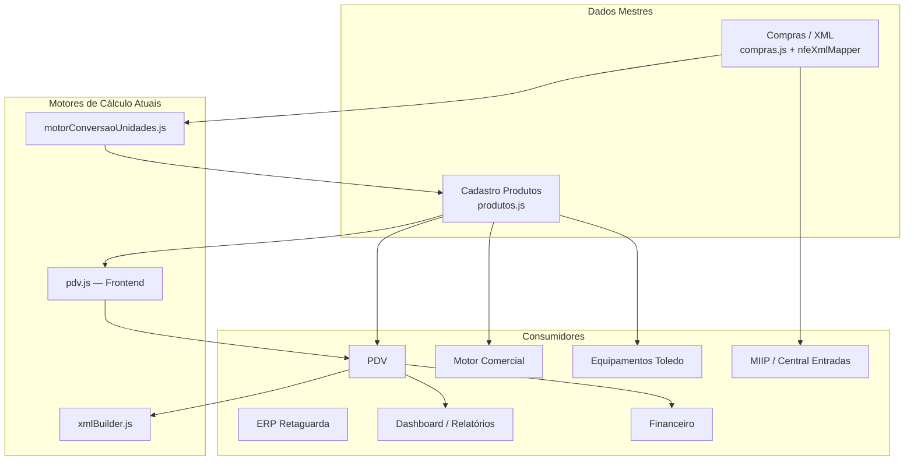

# Auditoria Arquitetural — Motor de Formação de Preços

**Documento:** Auditoria da Plataforma CDS para implantação do Pricing Engine  
**Versão:** 1.0  
**Tipo:** Auditoria Arquitetural (somente leitura — nenhum código alterado)  
**Data:** Julho/2026

---

## Resumo Executivo

A Plataforma CDS **não possui um motor centralizado de precificação**. A lógica de preço, margem, desconto e formação de custo está **espalhada em ~95 arquivos** entre backend, frontend PDV, ERP e motores auxiliares, com **duplicação significativa** entre camadas cliente e servidor.

### Principais achados

| Dimensão | Situação atual |
|----------|----------------|
| **Fonte da verdade de preço de venda** | Campo `produtos.preco_venda` + promoções/atacado em tabelas auxiliares |
| **Formação de preço pós-compra** | `motorConversaoUnidades.js` (backend) + `sincronizarFormacaoPrecoProduto` (frontend ERP) — **fórmula duplicada** |
| **Precificação no PDV** | Calculada **100% no frontend** (`pdv.js`, ~5.400 linhas); backend apenas persiste valores recebidos |
| **Margem padrão** | Hardcoded **30%** em 6+ locais (JS, SQL default, NFe import) |
| **Desconto máximo / preço mínimo** | **Não existem** como política configurável |
| **Venda abaixo do custo** | **Sem validação** em backend ou PDV |
| **Tabela de preços** | **Inexistente** (apenas mock no Motor Comercial) |
| **Impostos sobre preço** | Estrutura fiscal NFC-e/NFe; **sem cálculo de ICMS/PIS/COFINS** (CST isento) |
| **Comissão / cashback / bonificação** | **Não implementados** |
| **Markup** | Termo **ausente**; usa-se `lucro_percentual` / `margem_lucro` |

### Conclusão arquitetural

O novo **Motor de Formação de Preços** deve ser implementado como **Motor de Domínio** (`backend/motores/motor-precos/`), expondo projeções/APIs consumidas por PDV, ERP, Comercial, Fiscal e Equipamentos — tornando-se a **única fonte da verdade** para cálculos de preço, margem, desconto e políticas comerciais.

---

## Fase 1 — Mapa de Cálculos por Tipo

### 1.1 Preço de venda

| Local | Arquivo | Linhas | Responsabilidade |
|-------|---------|--------|------------------|
| Backend | `backend/lib/motorConversaoUnidades.js` | 132–145 | `precoVenda = precoCompra × (1 + margem/100)` |
| Backend | `backend/shared/nfe/mappers/nfeXmlMapper.js` | 47–48 | `preco_venda_sugerido = precoUnitario × 1.3` (hardcoded) |
| Backend | `backend/rotas/produtos.js` | 1134, 1348 | Preço promocional sugerido a partir de % desconto |
| Frontend | `frontend/erp/js/produtos.js` | 2630–2660 | `sincronizarFormacaoPrecoProduto` — formação bidirecional compra/lucro/venda |
| Frontend | `frontend/erp/js/compras.js` | 533–548, 578–605 | Margem → preço venda sugerido na nota de compra |
| Frontend | `frontend/pdv/js/pdv.js` | 2083–2216 | Seleção promo/atacado/varejo no carrinho |
| Frontend | `frontend/shared/js/pdvBuscaProduto.js` | 27–35 | Escolhe `preco_promocional` vs `preco_venda` |

### 1.2 Preço mínimo

**Não implementado.** Nenhum campo, validação ou configuração encontrada.

### 1.3 Preço promocional

| Local | Arquivo | Linhas | Responsabilidade |
|-------|---------|--------|------------------|
| Backend | `backend/rotas/produtos.js` | 910–916, 1260–1264, 2095–2098 | CRUD promoções; cálculo % desconto; validação 1–100% |
| Frontend | `frontend/erp/js/produtos.js` | 4227–4257 | Confirma sugestão: `precoPromocional = precoOriginal × (1 - desconto/100)` |
| Frontend | `frontend/pdv/js/pdv.js` | 2094–2096 | Aplica `preco_promocional` do produto no carrinho |
| Backend | `backend/motores/equipamentos/services/PromocaoMapper.js` | 19–20 | Mapeia promo para balança Toledo |

### 1.4 Preço atacado

| Local | Arquivo | Linhas | Responsabilidade |
|-------|---------|--------|------------------|
| Backend | `backend/rotas/produtos.js` | 2136–2212 | CRUD tiers; validação ordem decrescente de preço |
| Frontend | `frontend/erp/js/produtos.js` | 2520–2550 | Conversão % ↔ `preco_atacado` a partir de `preco_venda` |
| Frontend | `frontend/pdv/js/pdv.js` | 2117–2188 | `obterPrecoAtacado(produtoId, quantidade, precoBase)` |

### 1.5 Margem / Lucro

| Local | Arquivo | Linhas | Fórmula |
|-------|---------|--------|---------|
| Backend | `backend/lib/motorConversaoUnidades.js` | 132–145 | `precoVenda = custo × (1 + margem/100)` |
| Backend | `backend/shared/nfe/mappers/nfeXmlMapper.js` | 47–48 | Margem fixa 30% |
| Backend | `backend/services/reportFiscalHelpers.js` | 59–62 | `lucro = valor_item - (qtd × preco_compra)` |
| Backend | `backend/rotas/dashboard.js` | 86–165 | Agregação SQL `lucro_estimado` |
| Frontend | `frontend/erp/js/produtos.js` | 2641–2660 | Lucro reverso: `(venda - compra) / compra × 100` |
| Frontend | `frontend/erp/js/compras.js` | 1157–1162, 1223–1235 | `calcularMargemItem`, `calcularValorVendaItem` |

### 1.6 Markup

**Termo ausente.** Equivalente funcional: `lucro_percentual` / `margem_lucro` (% sobre custo).

### 1.7 Desconto

| Local | Arquivo | Linhas | Responsabilidade |
|-------|---------|--------|------------------|
| Frontend PDV | `frontend/pdv/js/pdv.js` | 803–912, 2476–2508, 2588–2616 | Desconto item %, manual, carrinho, acréscimo, split fiscal |
| Backend Fiscal | `backend/services/fiscal/xmlBuilder.js` | 434–471 | `ratearDescontoNosItens` — rateio proporcional NFC-e |
| Backend Compras | `backend/rotas/compras.js` | 90–124 | Rateio desconto nota → itens |
| Backend Vendas | `backend/services/vendas/VendaPagamentoService.js` | 505–850 | Persiste `desconto` recebido do cliente |
| Frontend ERP | `frontend/erp/js/produtos.js` | 3788–3792 | Validação promo 1–100% |
| Frontend Shared | `frontend/shared/js/fiscalImpressao.js` | 168–169 | Exibe desconto em cupom |

### 1.8 Imposto

| Local | Arquivo | Linhas | Responsabilidade |
|-------|---------|--------|------------------|
| Backend Fiscal | `backend/services/fiscal/xmlBuilder.js` | 586–659 | `vProd`, `vDesc`, `vNF`; blocos ICMS/PIS/COFINS estruturais (CST 07 isento) |
| Backend Fiscal | `backend/services/fiscal/danfe.js` | 117–178 | Exibição impostos em DANFE |
| Backend Fiscal | `backend/services/fiscal/unidadeFiscal.js` | 47–84 | Valida `qCom × vUnCom ≈ vProd` (±0.02) |
| Frontend ERP | `frontend/erp/js/produtos.js` | 1866–1875 | Captura alíquotas ICMS/PIS/COFINS (sem cálculo de valor) |

**Nota:** Não há motor tributário integrado à formação de preço. Impostos são estruturais/documentais.

### 1.9 Comissão

**Não implementado.**

### 1.10 Frete

| Local | Arquivo | Linhas | Responsabilidade |
|-------|---------|--------|------------------|
| Backend | `backend/rotas/compras.js` | 90–124 | Rateio proporcional frete por item |
| Backend | `backend/shared/nfe/mappers/nfeXmlMapper.js` | — | Parse `valor_frete` do XML |
| Frontend | `frontend/erp/js/compras.js` | 608–628 | Total nota: `produtos - desconto + frete + outras` |

### 1.11 Custo financeiro

**Não implementado** como componente de precificação. Existe apenas `custo_unitario_final` pós-rateio de compra.

### 1.12 Bonificação / Cashback

**Não implementados.**

### 1.13 Despesas (outras despesas na compra)

| Local | Arquivo | Linhas | Responsabilidade |
|-------|---------|--------|------------------|
| Backend | `backend/rotas/compras.js` | 90–124 | Rateio `valor_outras_despesas` proporcional |
| Frontend | `frontend/erp/js/compras.js` | 608–628 | Soma no total da nota |

---

## Fase 2 — Operações Monetárias (Math, round, parseFloat)

### Padrões de arredondamento identificados

| Padrão | Arquivos principais | Uso |
|--------|---------------------|-----|
| `Math.round(n × 100) / 100` | `motorConversaoUnidades.js`, `pdv.js`, `financeiro.js` | Centavos BRL |
| `Math.round(n × 10000) / 10000` | `motorConversaoUnidades.js` | Custo unitário 4 decimais |
| `Math.round(n × 100)` | `ToledoPrix4Mapper.js`, adapters TEF/PIX | Centavos para hardware/pagamento |
| `Number(x.toFixed(2))` | `compras.js`, `produtos.js`, `xmlBuilder.js` | Arredondamento display/persistência |
| `round2()` | `backend/services/fiscal/utils.js` | Helper fiscal compartilhado |
| `parseFloat` / `Number()` | Widespread | Parsing de inputs — **risco de float** |

### Arquivos com cálculo monetário real (backend — amostra prioritária)

| # | Arquivo | Tipo de cálculo |
|---|---------|-----------------|
| 1 | `backend/lib/motorConversaoUnidades.js` | Custo, margem, preço venda |
| 2 | `backend/rotas/compras.js` | Rateio frete/desconto/despesas |
| 3 | `backend/rotas/produtos.js` | Promo, atacado, valor estoque |
| 4 | `backend/services/fiscal/xmlBuilder.js` | Rateio desconto NFC-e, totais |
| 5 | `backend/services/distribuidorEstoqueVenda.js` | Subtotal, split fiscal/não-fiscal |
| 6 | `backend/services/reportFiscalHelpers.js` | Lucro estimado |
| 7 | `backend/rotas/dashboard.js` | Agregações lucro |
| 8 | `backend/rotas/financeiro.js` | Rateio pagamento fiscal |
| 9 | `backend/shared/nfe/mappers/nfeXmlMapper.js` | Import NFe → preço sugerido |
| 10 | `backend/motores/motor-comercial/usecases/consignacao/*` | qty × precoUnitario |
| 11 | `backend/motores/equipamentos/drivers/toledo/prix4/ToledoPrix4Mapper.js` | preço × 100 centavos |
| 12 | `backend/services/vendas/VendaPagamentoService.js` | Persistência totais |
| 13 | `backend/services/lotesService.js` | valor_total lote |
| 14 | `backend/services/fiscal/unidadeFiscal.js` | Validação unitária fiscal |

### Arquivos com cálculo monetário real (frontend — amostra prioritária)

| # | Arquivo | Tipo de cálculo |
|---|---------|-----------------|
| 1 | `frontend/pdv/js/pdv.js` | **Motor de venda completo** |
| 2 | `frontend/erp/js/produtos.js` | Formação preço, promo, atacado |
| 3 | `frontend/erp/js/compras.js` | Margem, rateio, total nota |
| 4 | `frontend/shared/js/pdvBuscaProduto.js` | Seleção preço promo |
| 5 | `frontend/shared/js/fiscalImpressao.js` | Layout cupom/DANFE |
| 6 | `frontend/erp/js/financeiro-relatorios.js` | Lucro/prejuízo display |
| 7 | `frontend/modules/motor-comercial/pages/NovaConsignacao/index.js` | Total consignação |
| 8 | `frontend/modules/motor-comercial/pages/EntregaConsignacao/index.js` | Validação limite |
| 9 | `frontend/modules/motor-comercial/pages/PrestacaoContas/index.js` | Preço venda manual |
| 10 | `frontend/modules/motor-comercial/components/form/CurrencyInput.js` | Parse/format BRL |

---

## Fase 3 — Módulos Consumidores de Preço



| Módulo | Usa preço como | Calcula preço? | Arquivos-chave |
|--------|----------------|----------------|----------------|
| **Cadastro Produtos** | Fonte mestre | Sim (ERP frontend + validação backend parcial) | `rotas/produtos.js`, `erp/js/produtos.js` |
| **PDV** | Preço de venda runtime | **Sim — principal motor** | `pdv/js/pdv.js` |
| **Motor Comercial** | Preço unitário consignação | Sim (qty × preço) | usecases consignação, `NovaConsignacao` |
| **Compras** | Custo → venda | Sim (rateio + margem) | `rotas/compras.js`, `erp/js/compras.js` |
| **Importação XML / NFe** | Custo importado | Sim (margem 30% fixa) | `nfeXmlMapper.js` |
| **Promoções** | Preço promocional | Sim (% desconto) | `rotas/produtos.js`, `erp/js/produtos.js` |
| **Atacado** | Tiers de quantidade | Sim (PDV resolve tier) | `rotas/produtos.js`, `pdv.js` |
| **Vendas (backend)** | Persistência | Não (recebe do cliente) | `VendaPagamentoService.js` |
| **Fiscal NFC-e** | Documento fiscal | Sim (rateio desconto) | `xmlBuilder.js` |
| **Estoque** | Valorização | Sim (estoque × custo) | `rotas/produtos.js` L46–77 |
| **Financeiro** | Rateio pagamento | Sim (proporcional) | `rotas/financeiro.js` |
| **Dashboard** | Lucro estimado | Sim (SQL agregado) | `rotas/dashboard.js`, `reportFiscalHelpers.js` |
| **Equipamentos** | Envio preço balança | Sim (× 100 centavos) | `ToledoPrix4Mapper.js` |
| **MIIP / Central Entradas** | Metadado XML | Não (mapeia `preco_unitario`) | `mapearItemCompra.js` |
| **E-commerce / Marketplace** | — | **Não existem** | — |
| **Tabelas de Preço** | — | **Não existem** | Mock em `ProdutoBridge.js` |
| **Orçamentos / Pedidos** | — | **Não existem como módulo** | — |

---

## Fase 4 — Validações Existentes

| Validação | Existe? | Onde | Lacuna |
|-----------|---------|------|--------|
| Desconto promo 1–100% | ✅ | `rotas/produtos.js` L1262; `erp/js/produtos.js` L3788 | Apenas fluxo de sugestão promo |
| Limite desconto manual PDV R$ 50 | ⚠️ Parcial | `pdv.js` L24 — constante; modal supervisor **nunca invocado** | Sem enforcement |
| Autorização supervisor desconto | ⚠️ Parcial | `auth.js` `verificarSupervisorToken`; token enviado L3474 | Backend venda **não valida** token |
| Margem mínima | ❌ | — | — |
| Preço mínimo | ❌ | — | — |
| Preço negativo | ⚠️ Parcial | Frontend produtos L2822; PDV floor R$ 0.01 L2486 | Backend POST produto **sem validação** |
| Lucro negativo | ❌ | — | Permitido implicitamente |
| Venda abaixo do custo | ❌ | — | — |
| Preço zerado | ⚠️ Parcial | PDV rejeita `precoUnitario <= 0`; floor 0.01 | ERP permite combinações inválidas |
| Preço manual PDV | ✅ | `pdv.js` L2437–2508 | Sem limite vs custo/margem |
| Atacado tier ordering | ✅ | `rotas/produtos.js` L2156–2160 | — |
| Consignação vs limite crédito | ✅ | `NovaConsignacao`, `EntregaConsignacao` | Motor Comercial |
| precoVenda >= 0 consignação | ✅ | `ConsignacaoDTO.js` L243 | — |
| Equipamentos preco >= 0 | ✅ | `ProdutoValidator.js`, `PromocaoValidator.js` | — |

---

## Fase 5 — Configurações Existentes

| Configuração | Valor atual | Onde | Configurável? |
|--------------|-------------|------|---------------|
| Margem padrão | **30%** | `database.js` DEFAULT, `motorConversaoUnidades.js`, `nfeXmlMapper.js`, `compras.js`, `erp/js/compras.js` | ❌ Hardcoded |
| Desconto padrão promo | **15%** | `rotas/produtos.js`, `erp/js/produtos.js` | ❌ Hardcoded |
| Limite desconto manual PDV | **R$ 50** | `pdv.js` L24 | ❌ Hardcoded |
| Margem por grupo | — | — | ❌ Não existe |
| Desconto máximo | — | — | ❌ Não existe |
| Desconto por usuário/gerente | — | — | ❌ Não existe (só relatório autorizações) |
| Tributação integrada | Alíquotas cadastro | `produtos` ICMS/PIS/COFINS % | Armazena, não calcula |
| Tabela de preços | `'PADRAO'` mock | `ProdutoBridge.js` | ❌ Não existe |
| Promoções | Tabela `promocoes` | DB + CRUD | ✅ Por produto/período |
| Atacado | Tabela `produto_atacado` | DB + CRUD | ✅ Por produto/qty |
| `configuracoes` (KV) | Fiscal, TEF, empresa | `database.js` seed | ❌ Sem chaves de pricing |

### Campos de banco relacionados a preço

**Tabela `produtos`:** `preco_compra`, `preco_venda`, `lucro_percentual`, `preco_unidade`, `custo_por_kg`

**Tabela `produto_atacado`:** `quantidade_minima`, `preco_atacado`

**Tabela `promocoes`:** `preco_original`, `preco_promocional`, `desconto_percentual`

**Tabela `compras_itens`:** `preco_unitario`, `margem_lucro`, `preco_venda_sugerido`, `desconto_rateado`, `custo_unitario_final`

**Tabela `vendas_itens`:** `preco_unitario`, `desconto_percentual`, `desconto_atacado`, `tipo_preco`, `promocao_id`

**Tabela `produtos_preco_historico`:** histórico alterações compra/venda

**Motor Comercial `consignacoes_itens`:** `preco_unitario`, `subtotal_entregue`, `subtotal_acertado`

---

## Fase 6 — Cálculos no Frontend (detalhado)

| Arquivo | Linhas | Responsabilidade |
|---------|--------|------------------|
| `frontend/pdv/js/pdv.js` | 24, 803–912, 2083–2216, 2437–2616, 3428–3465 | **Motor de venda:** promo, atacado, desconto item/carrinho, acréscimo, split fiscal, totais, barcode balança |
| `frontend/erp/js/produtos.js` | 52–133, 550–558, 1464–1474, 2520–2663, 4227–4257 | Formação preço, preview estoque, atacado %, promo |
| `frontend/erp/js/compras.js` | 509–628, 1157–1235 | Subtotal item, margem, rateio, total nota |
| `frontend/shared/js/pdvBuscaProduto.js` | 27–35 | Preço efetivo na busca |
| `frontend/shared/js/fiscalImpressao.js` | 25–43, 114, 168–169 | Layout monetário cupom |
| `frontend/shared/js/vendasHistoricoUi.js` | 33–35 | Soma histórico |
| `frontend/erp/js/financeiro-relatorios.js` | 235–259 | Receitas − despesas |
| `frontend/modules/motor-comercial/pages/NovaConsignacao/index.js` | 416–831 | Σ(qty × preco), limite |
| `frontend/modules/motor-comercial/pages/EntregaConsignacao/index.js` | 219, 462–466 | Total vs limite |
| `frontend/modules/motor-comercial/pages/PrestacaoContas/index.js` | 746–771 | Preço venda manual |
| `frontend/modules/motor-comercial/components/form/CurrencyInput.js` | 93–106 | Parse centavos |

**Total: 12 arquivos frontend com cálculo monetário real** (excluindo bundle gerado e display-only).

---

## Fase 7 — Duplicações (contagem)

| Tipo de cálculo | Locais distintos com fórmula | Locais |
|-----------------|------------------------------|--------|
| **Preço de venda (custo + margem)** | **4** | `motorConversaoUnidades.js`, `nfeXmlMapper.js` (×1.3), `erp/produtos.js`, `erp/compras.js` |
| **Margem / lucro %** | **6** | Backend compra, NFe import, reportFiscalHelpers, dashboard, ERP produtos, ERP compras |
| **Desconto (rateio proporcional)** | **3** | `pdv.js` (split fiscal), `xmlBuilder.js` (NFC-e), `compras.js` (nota compra) |
| **Desconto (item/carrinho PDV)** | **1** (mas monolítico) | `pdv.js` |
| **Preço atacado (resolução tier)** | **1** | `pdv.js` `obterPrecoAtacado` — backend não resolve |
| **Preço promocional (seleção)** | **2** | `pdvBuscaProduto.js`, `pdv.js` |
| **Subtotal (qty × preço)** | **8+** | PDV, consignação (5 usecases), distribuidorEstoque, devolução, compras, lotes |
| **Impostos (valor)** | **0** | Apenas estrutura XML; sem cálculo |
| **Impostos (validação unitária)** | **1** | `unidadeFiscal.js` |

### Fórmulas duplicadas críticas

```
precoVenda = precoCompra × (1 + margem/100)    → 4 implementações independentes
descontoItem = (subtotalItem / total) × desconto → 3 implementações (PDV, fiscal, compras)
lucro = valorVenda - (qtd × precoCompra)       → 2 implementações (SQL + frontend display)
```

---

## Fase 8 — Impactos da Migração

### Módulos que **dependerão** do Pricing Engine

| Prioridade | Módulo | Motivo |
|------------|--------|--------|
| P0 | **PDV** | Motor de venda atual no frontend — maior risco de divergência |
| P0 | **Cadastro Produtos / Compras** | Formação de preço e custo |
| P1 | **Fiscal NFC-e** | Rateio desconto deve usar mesmo algoritmo |
| P1 | **Promoções / Atacado** | Políticas comerciais centralizadas |
| P2 | **Motor Comercial** | Substituir mock `consultarPreco`; aplicar políticas |
| P2 | **Equipamentos Toledo** | Sincronizar preço/promo da fonte única |
| P3 | **Dashboard / Relatórios** | Lucro estimado via projeção do motor |
| P3 | **Financeiro** | Rateio fiscal alinhado |

### Módulos que **devem deixar de calcular preço**

| Módulo | O que remover/migrar |
|--------|---------------------|
| `frontend/pdv/js/pdv.js` | `obterPrecoAtacado`, formação subtotal/desconto → chamar API |
| `frontend/erp/js/produtos.js` | `sincronizarFormacaoPrecoProduto` → preview via API |
| `frontend/erp/js/compras.js` | `calcularMargemItem`, rateio → API |
| `backend/shared/nfe/mappers/nfeXmlMapper.js` | Margem 30% hardcoded → motor |
| `backend/rotas/produtos.js` | Cálculo promo sugerida → motor |

### Módulos **simplificáveis**

- `VendaPagamentoService.js` — validar preços recebidos vs motor (fail-safe)
- `distribuidorEstoqueVenda.js` — receber split já calculado
- Motor Comercial usecases — delegar `precoUnitario` ao motor

### Cálculos **removíveis** após migração

- Duplicatas de margem 30% hardcoded (6 locais → 1 config motor)
- `obterPrecoAtacado` no PDV
- `sincronizarFormacaoPrecoProduto` no ERP
- `preco_venda_sugerido = preco × 1.3` no NFe mapper

---

## Fase 9 — Riscos Arquiteturais

| Risco | Severidade | Evidência |
|-------|------------|-----------|
| **Cálculos conflitantes** | 🔴 Alta | PDV calcula preço final; backend persiste sem revalidar |
| **Fórmulas diferentes** | 🔴 Alta | Margem: `(1+m/100)` vs lucro reverso `(v-c)/c×100` — equivalentes mas implementações distintas |
| **Arredondamentos diferentes** | 🟡 Média | `Math.round×100`, `toFixed(2)`, `round2()`, 4 decimais custo — inconsistência em cascata |
| **Float inadequado** | 🟡 Média | Uso extensivo de `parseFloat`/`Number` sem decimal library |
| **Divergência PDV vs Fiscal** | 🔴 Alta | Desconto rateado separadamente em PDV (split fiscal) e `xmlBuilder.js` |
| **Lógica espalhada** | 🔴 Alta | Sem PricingService; 95+ arquivos tangenciam preço |
| **Código duplicado** | 🔴 Alta | 4× formação preço, 3× rateio desconto |
| **Supervisor discount morto** | 🟡 Média | Infra existe, nunca invocada |
| **Sem preço mínimo/abaixo custo** | 🔴 Alta | Risco comercial e fiscal |
| **Tabela preços inexistente** | 🟡 Média | Impossibilita multi-canal (PDV, e-commerce futuro) |
| **ProdutoBridge mock** | 🟡 Média | Motor Comercial usa preço fictício (100) |

---

## Fase 10 — Proposta Arquitetural

### Recomendação: **Motor de Domínio** (`motor-precos`)

| Opção | Adequação | Justificativa |
|-------|-----------|---------------|
| Service simples | ❌ Insuficiente | Múltiplas políticas, contextos (PDV, compra, consignação, fiscal) |
| **Motor** | ✅ **Recomendado** | Alinhado a `motor-comercial`, `miip`, `central-entradas`; encapsula domínio, projeções, bridges |
| Biblioteca compartilhada | ⚠️ Parcial | Útil para **funções puras** (round, rateio) dentro do motor, não como solução única |
| Componente Shared frontend | ❌ Insuficiente | Frontend deve **consumir** projeções, não recalcular |

### Arquitetura proposta

```
                    ┌─────────────────────────────┐
                    │     motor-precos (Motor)     │
                    ├─────────────────────────────┤
                    │ PricingCatalog (políticas)   │
                    │ PricingEngine (cálculos)     │
                    │ PricingPolicyService         │
                    │ PricingProjectionService     │
                    │ Decimal/Money utilities      │
                    └──────────────┬──────────────┘
                                   │
          GET /api/precos/projections/*
                                   │
     ┌──────────┬──────────┬───────┴───────┬──────────┐
     ▼          ▼          ▼               ▼          ▼
   PDV        ERP       Comercial        Fiscal    Equipamentos
 (consume)  (consume)   (bridge)      (rateio)    (sync)
```

### Princípios

1. **Backend calcula; frontend exibe** — PDV envia intenção (produto, qty, contexto); recebe preço breakdown.
2. **Decimal para dinheiro** — eliminar float em cálculos críticos.
3. **Políticas configuráveis** — margem, desconto máximo, preço mínimo via `configuracoes` ou tabelas do motor.
4. **Idempotência** — mesmo input → mesmo output (incluindo arredondamento).
5. **Auditoria** — log de formação de preço (similar a `produtos_preco_historico`).

### Componente Shared (complementar)

`shared/pricing/` ou `@cds/pricing-core` — **apenas funções puras** espelhadas backend/frontend para:
- `roundMoney(value, decimals)`
- `calcMargin(cost, price)`
- `applyDiscount(price, percent)`

Usado **dentro** do motor; frontend **não** deve importar para calcular preço de venda.

---

## Mapa de Dependências

```
produtos.preco_venda ──► PDV (cálculo local) ──► vendas_itens.preco_unitario
        │                                              │
        ▼                                              ▼
promocoes / atacado ──► PDV                     VendaPagamentoService
        │                                              │
        ▼                                              ▼
motorConversaoUnidades ◄── compras_itens         xmlBuilder (NFC-e)
        │
        ▼
produtos.preco_compra / preco_venda
        │
        ▼
reportFiscalHelpers ──► dashboard (lucro_estimado)
```

**Dependência crítica:** PDV → Backend Venda **sem validação de preço** → Fiscal NFC-e usa valores persistidos.

---

## Mapa de Responsabilidades (estado atual vs futuro)

| Responsabilidade | Hoje | Futuro (Pricing Engine) |
|------------------|------|-------------------------|
| Formação preço pós-compra | `motorConversaoUnidades` + ERP JS | `PricingEngine.formFromPurchase()` |
| Preço venda runtime PDV | `pdv.js` | `GET /precos/quote` |
| Promo / atacado | DB + PDV local | `PricingPolicyService` |
| Rateio desconto | 3 implementações | `PricingEngine.allocateDiscount()` |
| Margem / lucro | Espalhado | `PricingEngine.calcMargin()` |
| Validação políticas | Quase inexistente | `PricingPolicyValidator` |
| Histórico preço | `produtos_preco_historico` | Motor + eventos domínio |
| Impostos sobre preço | Estrutural fiscal | Integração futura (motor fiscal) |

---

## Arquivos Afetados (estimativa)

| Camada | Arquivos a modificar (migração) | Arquivos a criar |
|--------|--------------------------------|------------------|
| Backend motor | — | ~40–60 (novo motor) |
| Backend rotas/services | ~15 | 2–3 (routes, controller) |
| Frontend PDV | 1 (`pdv.js` — grande) | 1 (PricingApi client) |
| Frontend ERP | 2 (`produtos.js`, `compras.js`) | — |
| Motor Comercial | 3–5 | Bridge real |
| Fiscal | 2 (`xmlBuilder.js`, `unidadeFiscal.js`) | — |
| Equipamentos | 2–3 | — |
| Database | 0–1 (config keys) | 2–4 (políticas, tabelas preço) |
| Testes | ~15 existentes + novos | ~30+ |

**Total estimado:** ~25 arquivos existentes impactados; ~80–100 arquivos no novo motor.

---

## Estimativa de Impacto

| Métrica | Valor |
|---------|-------|
| Esforço implementação motor | **Grande** (8–12 sprints) |
| Risco de regressão PDV | **Crítico** — requer testes E2E extensivos |
| Risco fiscal | **Alto** — rateio desconto deve ser idêntico |
| Benefício consolidado | **Alto** — fonte única, políticas, multi-canal |
| Quick win possível | Centralizar margem 30% + rateio desconto (2 sprints) |

---

## Plano de Migração

### Etapa 0 — Preparação (esta auditoria)
- ✅ Mapeamento completo
- Documento arquitetural aprovado

### Etapa 1 — Fundação (Sprint P-1)
- Criar `backend/motores/motor-precos/` (estrutura DDD igual motor-comercial)
- Implementar `Money`/`Decimal` utilities
- Implementar `PricingEngine` com fórmulas puras (margem, rateio, arredondamento)
- Testes unitários 100% das fórmulas

### Etapa 2 — API de cotação (Sprint P-2)
- `GET /api/precos/quote` — produto + qty + contexto → breakdown preço
- Integrar promo/atacado do DB
- PDV consome API (modo shadow: compara local vs API, log divergências)

### Etapa 3 — Políticas (Sprint P-3)
- Config: margem padrão, desconto máximo, preço mínimo
- Validação supervisor desconto (wire token)
- Bloqueio venda abaixo custo (configurável)

### Etapa 4 — Compras e formação (Sprint P-4)
- Substituir `motorConversaoUnidades` margem → motor
- Substituir `sincronizarFormacaoPrecoProduto` ERP
- Unificar import NFe

### Etapa 5 — Fiscal alinhado (Sprint P-5)
- `xmlBuilder.ratearDescontoNosItens` → delegar ao motor
- Testes paridade PDV ↔ NFC-e

### Etapa 6 — PDV cutover (Sprint P-6)
- Remover cálculos locais PDV
- Validação backend em `VendaPagamentoService`

### Etapa 7 — Consumidores secundários (Sprint P-7+)
- Motor Comercial bridge real
- Equipamentos sync
- Dashboard projeções
- Tabelas de preço multi-canal

---

## Roadmap de Implementação

| Sprint | Entrega | Dependência |
|--------|---------|-------------|
| **P-0** | Auditoria (este documento) | — |
| **P-1** | Motor skeleton + Money + testes fórmulas | P-0 |
| **P-2** | API quote + shadow mode PDV | P-1 |
| **P-3** | Políticas + validações + config | P-1 |
| **P-4** | Compras + ERP formação preço | P-2, P-3 |
| **P-5** | Fiscal rateio unificado | P-2 |
| **P-6** | PDV cutover | P-2, P-3, P-5 |
| **P-7** | Motor Comercial + Equipamentos | P-6 |
| **P-8** | Tabelas de preço + multi-canal | P-6 |
| **P-9** | Impostos integrados (opcional) | P-8 |

---

## Recomendação Arquitetural Final

Implementar o **Motor de Formação de Preços** como **Motor de Domínio autônomo** (`backend/motores/motor-precos/`), seguindo os padrões já estabelecidos na Plataforma CDS:

- **Projection Services** para consumo read-only (PDV, dashboards)
- **Use Cases** para mutações (aplicar política, registrar histórico)
- **Bridges** para produtos, promoções, fiscal
- **DTOs + Error Catalog** próprios
- **Frontend** consome exclusivamente APIs/projeções — zero cálculo de preço de venda

Biblioteca compartilhada de funções puras (`shared/pricing/`) complementa o motor, mas **não substitui** a autoridade do backend.

Esta abordagem garante que o Pricing Engine se torne a **fonte única da verdade** para preço, margem, descontos e políticas comerciais — eliminando as duplicações e riscos identificados nesta auditoria.

---

## Critérios de Aceitação — Status

| Critério | Status |
|----------|--------|
| Todos os cálculos monetários mapeados | ✅ |
| Todos os módulos consumidores identificados | ✅ |
| Todas as duplicações listadas | ✅ |
| Todos os riscos documentados | ✅ |
| Nenhuma alteração funcional realizada | ✅ |
| Nenhuma regra de negócio modificada | ✅ |
| Relatório arquitetural concluído | ✅ |

---

## Anexo A — Inventário Completo de Arquivos Backend (pricing-related)

<details>
<summary>Clique para expandir (~82 arquivos)</summary>

- `backend/lib/motorConversaoUnidades.js`
- `backend/rotas/produtos.js`
- `backend/rotas/compras.js`
- `backend/rotas/vendas.js`
- `backend/rotas/dashboard.js`
- `backend/rotas/financeiro.js`
- `backend/database.js`
- `backend/services/fiscal/xmlBuilder.js`
- `backend/services/fiscal/danfe.js`
- `backend/services/fiscal/unidadeFiscal.js`
- `backend/services/fiscal/utils.js`
- `backend/services/fiscal/nfeDevolucaoCompra.js`
- `backend/services/distribuidorEstoqueVenda.js`
- `backend/services/fiscalNaoFiscalService.js`
- `backend/services/reportFiscalHelpers.js`
- `backend/services/lotesService.js`
- `backend/services/usuarioRelatorioService.js`
- `backend/services/vendas/VendaPagamentoService.js`
- `backend/services/vendas/VendaDevolucaoService.js`
- `backend/services/vendaUnidadeHelpers.js`
- `backend/shared/nfe/mappers/nfeXmlMapper.js`
- `backend/shared/nfe/contracts/NfeItemParseadoDTO.js`
- `backend/motores/motor-comercial/usecases/consignacao/*` (8+ arquivos)
- `backend/motores/motor-comercial/bridges/ProdutoBridge.js`
- `backend/motores/motor-comercial/dto/AcertoDTO.js`
- `backend/motores/motor-comercial/http/dto/ConsignacaoDTO.js`
- `backend/motores/equipamentos/drivers/toledo/prix4/ToledoPrix4Mapper.js`
- `backend/motores/equipamentos/contracts/ProdutoValidator.js`
- `backend/motores/equipamentos/contracts/PromocaoValidator.js`
- `backend/motores/equipamentos/services/ProdutoMapper.js`
- `backend/motores/equipamentos/services/PromocaoMapper.js`
- `backend/motores/miip/utils/mapearItemCompra.js`
- `backend/services/tef/*` (valores transação — centavos)
- `tests/motor-conversao-unidades/*`, `tests/shared/nfe/*`, `tests/fiscal/*`, `tests/motor-comercial/*`, `tests/motor-equipamentos/*`

</details>

## Anexo B — Inventário Frontend (cálculo real)

1. `frontend/pdv/js/pdv.js`
2. `frontend/erp/js/produtos.js`
3. `frontend/erp/js/compras.js`
4. `frontend/shared/js/pdvBuscaProduto.js`
5. `frontend/shared/js/fiscalImpressao.js`
6. `frontend/shared/js/vendasHistoricoUi.js`
7. `frontend/erp/js/financeiro-relatorios.js`
8. `frontend/modules/motor-comercial/pages/NovaConsignacao/index.js`
9. `frontend/modules/motor-comercial/pages/EntregaConsignacao/index.js`
10. `frontend/modules/motor-comercial/pages/PrestacaoContas/index.js`
11. `frontend/modules/motor-comercial/pages/Consignacoes/index.js`
12. `frontend/modules/motor-comercial/components/form/CurrencyInput.js`

---

*Documento gerado por auditoria arquitetural read-only. Nenhum arquivo de código foi alterado.*
