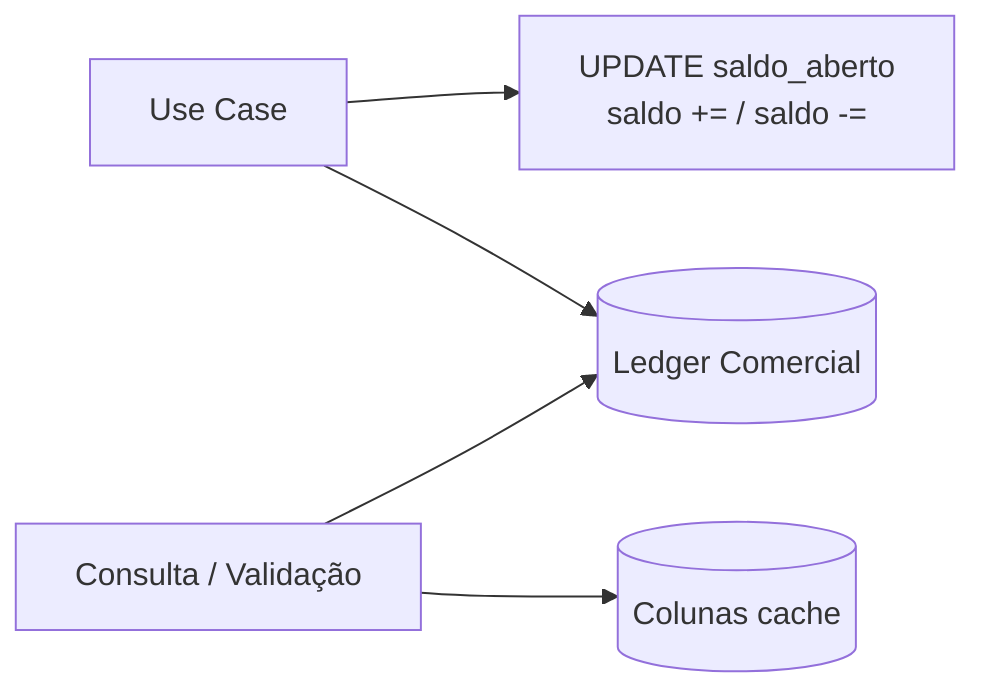
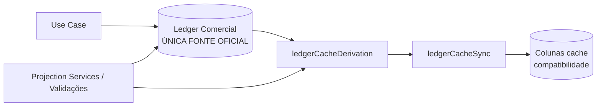

# Ledger — Single Source of Truth (Sprint P-1)

**Motor Comercial · CDS Platform**  
**Versão:** P-1  
**Data:** 2026-07-08  
**Status:** Concluída

---

## 1. Motivação

A auditoria O-14 identificou um **modelo híbrido (dual-write)** no Motor Comercial:

```
Movimentação → Ledger + UPDATE saldo_aberto → Consulta
```

Isso criava duas fontes concorrentes de verdade: o **Ledger Comercial** (`movimentacoes_comerciais`) e colunas derivadas persistidas (`saldo_aberto`, `valor_total_*`).

A Sprint P-1 elimina o dual-write **sem alterar** regras de negócio, telas, APIs, contratos HTTP, Use Cases públicos ou fluxo da Cremolia.

---

## 2. Arquitetura Antiga



**Problemas:**

| Problema | Impacto |
|----------|---------|
| Dual-write em entrega, devolução, venda, pagamento, fechamento | Divergência silenciosa entre ledger e colunas |
| Validação de limite lia coluna; `ConsultarLimiteDisponivel` lia ledger de perfil | Inconsistência entre escrita e leitura |
| Projection Services já derivavam do ledger, mas write path ignorava | Duas semânticas de saldo coexistindo |

---

## 3. Arquitetura Nova



**Pipeline de escrita:**

1. Registrar movimentação no Ledger (append-only)
2. Derivar saldos via `derivarSaldoAbertoPerfil()` / `derivarCamposCacheConsignacao()`
3. Sincronizar colunas cache via `sincronizarCachePerfil()` / `sincronizarCacheConsignacao()`

**Pipeline de leitura:**

- Projection Services (Dashboard, Conta Corrente, Saldos, etc.) — já ledger-first desde Sprint 2.4.4
- `ConsultarLimiteDisponivelUseCase` — saldo consumido derivado do ledger comercial
- `ConsultarOperacaoConsignacaoUseCase` — saldos derivados quando repositório de movimentações disponível
- Validações de limite (`consumirLimitePerfil`, `executarValidacaoEntrega`, `AlterarLimiteComercial`) — ledger-first

---

## 4. Inventário de Campos Derivados (Fase 1)

### 4.1 Perfil Comercial

| Campo | Tabela | Classificação | SSOT pós P-1 |
|-------|--------|---------------|--------------|
| `saldo_aberto` | `perfil_comercial` | **Cache de projeção** | Ledger comercial (ENTREGA − DEVOLUCAO − VENDA − PAGAMENTO) |
| `limite_comercial` | `perfil_comercial` | **Estado de configuração** | Coluna + ledger perfil (`LIMITE_ALTERADO`, `LIBERACAO_GERENCIAL`) |
| `score_confiabilidade` | `perfil_comercial` | **Cache externo** | ScoreService / coluna (não ledger comercial) |

### 4.2 Consignação

| Campo | Tabela | Classificação | SSOT pós P-1 |
|-------|--------|---------------|--------------|
| `valor_total_entregue` | `consignacao` | **Cache de projeção** | Σ movimentações `ENTREGA` |
| `valor_total_acertado` | `consignacao` | **Cache de projeção** | Σ `VENDA_PRESTACAO`; substituído no `FECHAMENTO_PRESTACAO` |
| `valor_total_pago` | `consignacao` | **Cache de projeção** | Σ `PAGAMENTO` |
| `saldo_aberto` | `consignacao` | **Cache de projeção** | Replay incremental + reset no fechamento (ver §5) |
| `status` | `consignacao` | **Estado de ciclo de vida** | Use Case (não derivável só do ledger) |
| `prestacao_contas_ativa` | `consignacao` | **Estado operacional** | Use Case |
| Quantidades em `consignacao_item` | `consignacao_item` | **Estado operacional de itens** | Use Case (com ledger como auditoria) |

### 4.3 Campos já ledger-first (pré P-1)

| Área | Serviço / UC |
|------|----------------|
| Conta Corrente | `ContaCorrenteProjectionService` |
| Saldos comerciais | `SaldoProjectionService` |
| Dashboard / KPIs | `DashboardProjectionService`, `IndicadoresProjectionService` |
| Resumo prestação | `ResumoPrestacaoProjectionService` |
| Histórico | `HistoricoProjectionService` |
| Situação cliente | `SituacaoClienteProjectionService` |
| Workflow | `WorkflowProjectionService` |

---

## 5. Fórmulas de Derivação (Fase 3)

### 5.1 Limite consumido do perfil

```
saldoAbertoPerfil = Σ ENTREGA
                  − Σ DEVOLUCAO
                  − Σ VENDA_PRESTACAO
                  − Σ PAGAMENTO
```

Implementação: `derivarSaldoAbertoPerfil()` em `ledgerCacheDerivation.js`.

> **Nota de compatibilidade:** `TRANSFERENCIA_SAIDA/ENTRADA` possuem `afetaLimite: true` no catálogo, mas o write path histórico **não** alterava limite. P-1 preserva esse comportamento.

### 5.2 Cache da consignação

Replay cronológico das movimentações:

| Tipo | Efeito no cache |
|------|-----------------|
| `ENTREGA` | `valorTotalEntregue += valor`; `saldoAberto = valorTotalEntregue` |
| `DEVOLUCAO` | `saldoAberto = max(0, saldoAberto − valor)` |
| `VENDA_PRESTACAO` | `valorTotalAcertado += valor`; `saldoAberto += valor` |
| `PAGAMENTO` | `valorTotalPago += valor`; `saldoAberto = max(0, saldoAberto − valor)` |
| `FECHAMENTO_PRESTACAO` | `valorTotalAcertado` e `saldoAberto` **substituídos** por totais da prestação |

Implementação: `derivarCamposCacheConsignacao()` em `ledgerCacheDerivation.js`.

---

## 6. Alterações no Write Pipeline (Fase 4)

| Use Case | Antes | Depois |
|----------|-------|--------|
| `RegistrarEntregaConsignacao` | `consumirLimite` UPDATE + SET saldo | Valida via ledger; movimentação; `sincronizarCache*` |
| `RegistrarDevolucaoAntesPrestacao` | `saldo -=` + `liberarLimite` UPDATE | Movimentação; `sincronizarCache*` |
| `RegistrarVendaPrestacao` | `saldo +=`, `valorTotalAcertado +=` | Movimentação; `sincronizarCacheConsignacao` |
| `RegistrarPagamentoPrestacao` | `saldo -=`, `valorTotalPago +=` | Movimentação; `sincronizarCacheConsignacao` |
| `FecharPrestacao` | SET saldo/valorTotalAcertado | Movimentação; `sincronizarCacheConsignacao` |
| `consumirLimitePerfil` | Lia/escrevia coluna | Deriva do ledger; valida; sync após movimentação |
| `liberarLimitePerfil` | `saldo -=` na coluna | `sincronizarCachePerfil` após movimentação |
| `AlterarLimiteComercial` | Lia `perfil.saldoAberto` | `obterSaldoAbertoPerfilDerivado()` |

---

## 7. Alterações no Read Pipeline (Fase 5)

| Consumidor | Status pós P-1 |
|------------|----------------|
| Dashboard / KPIs / Conta Corrente | ✅ Já ledger-first |
| Cliente 360 / Situação | ✅ `SituacaoClienteProjectionService` |
| Workflow / Pendências / Playbooks | ✅ Projection Services |
| Prestação / Resumo | ✅ `ResumoPrestacaoProjectionService` |
| `ConsultarLimiteDisponivel` | ✅ Saldo do ledger comercial |
| `ConsultarOperacaoConsignacao` | ✅ Deriva saldos quando movimentações disponíveis |
| `ConsultarPerfilComercial` | ⚠️ Retorna coluna cache (compatibilidade HTTP); cache sincronizado na escrita |

---

## 8. Compatibilidade (Fase 6)

- **Colunas mantidas** — `saldo_aberto`, `valor_total_*` permanecem no banco e nas respostas HTTP
- **Papel das colunas** — cache de compatibilidade, sincronizado após cada movimentação
- **Sem migration destrutiva** — dados legados continuam legíveis; cache é rederivado na próxima operação de escrita
- **APIs inalteradas** — mesmos endpoints, mesmos campos JSON, mesmos status codes

---

## 9. Módulos Criados

```
backend/motores/motor-comercial/services/projections/
  ledgerCacheDerivation.js   # Funções puras: ledger → valores derivados
  ledgerCacheSync.js         # Sincronização cache pós-movimentação
```

Exportados em `services/projections/index.js`.

---

## 10. Testes (Fase 7)

```bash
npm run test:motor-comercial          # 90 testes (inclui 10 novos P-1)
npm run test:motor-comercial-ledger-cache
```

Cenários cobertos: Entrega, Devolução, Venda, Pagamento, Fechamento, fluxo completo perfil+consignação.

---

## 11. Auditoria Final (Fase 9)

### Existe algum saldo persistido que ainda seja utilizado como fonte oficial?

**Não no write path crítico.** Validações de limite e sincronização de cache usam derivação do ledger.

**Ressalvas menores (aceitas para compatibilidade):**

| Local | Situação |
|-------|----------|
| `ConsultarPerfilComercial` / `PerfilDTO` | Retorna coluna cache (sincronizada na escrita) |
| `executarValidacaoEntrega` sem `movimentacaoComercialRepository` | Fallback para coluna (deps legados) |
| `calcularLimiteDisponivel` sem movimentações comerciais | Fallback para coluna perfil |

### Existe algum UPDATE que gere divergência?

**Não.** Os UPDATEs remanescentes em `saldo_aberto` / `valor_total_*` são executados **exclusivamente** por `sincronizarCachePerfil` / `sincronizarCacheConsignacao`, sempre após derivação do ledger na mesma transação.

### Existe algum cálculo fora do Ledger?

| Cálculo | Fonte |
|---------|-------|
| Saldos financeiros (vendas − pagamentos) | Ledger via Projection Services |
| Limite consumido | Ledger comercial |
| Cache consignação/perfil | Derivado do ledger (sync) |
| Status consignação / prestação | Use Case (estado, não saldo) |
| Quantidades de itens | Use Case + ledger como auditoria |
| Score confiabilidade | Cache / ScoreService |

---

## 12. Benefícios

- **Uma fonte oficial** para todos os saldos comerciais reconstruíveis
- **Eliminação do dual-write** nas operações de entrega, devolução, venda, pagamento e fechamento
- **Consistência** entre validação de limite, projeções e cache persistido
- **Zero impacto funcional** — 90/90 testes passando, APIs e UX inalterados
- **Base para evoluções** — P-2 pode migrar leituras HTTP restantes para projeções explícitas

---

## 13. Roadmap

| Sprint | Escopo |
|--------|--------|
| **P-1** ✅ | Ledger SSOT + cache sync + testes + documentação |
| P-2 | `ConsultarPerfilComercial` / listagens retornarem projeção explícita |
| P-3 | Job de reconciliação cache vs ledger para dados legados |
| P-4 | Remover fallbacks de coluna quando 100% dos deps tiverem repositório comercial |

---

## 14. Referências

- `docs/AUDITORIA_FINAL_MOTOR_COMERCIAL.md` — diagnóstico O-14
- `backend/motores/motor-comercial/services/projections/projectionHelpers.js` — projeções financeiras
- `backend/motores/motor-comercial/config/comercialTiposMovimentacao.js` — metadados do ledger
