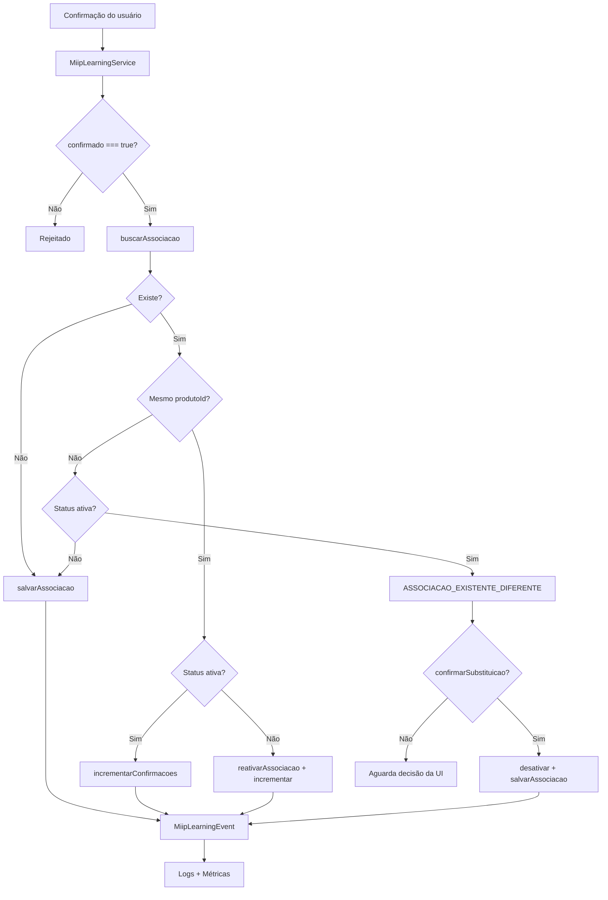

# MIIP — Aprendizado por Confirmação (Sprint 5 / 5.1)

Mecanismo oficial de aprendizado permanente do MIIP. Somente o `MiipLearningService` persiste associações.

## Princípio fundamental

> **Nenhum Engine grava aprendizado.**  
> Toda gravação passa por `MiipLearningService` → `MiipAssociacoesRepository`.

O aprendizado só ocorre com **confirmação explícita do usuário** (`confirmado: true`).

## Regra de proteção do aprendizado (Sprint 5.1)

Quando já existe associação **ativa** para o par **fornecedor + código do fornecedor** e o usuário confirma um **produto diferente**, o sistema **não substitui automaticamente**.

Retorna o estado `ASSOCIACAO_EXISTENTE_DIFERENTE` com:

| Campo | Descrição |
|-------|-----------|
| `produtoAtual` | Produto já associado |
| `produtoNovo` | Produto que o usuário tentou confirmar |
| `fornecedor` | Nome do fornecedor |
| `codigoFornecedor` | Código do item no fornecedor |

A **interface** decide o próximo passo. Substituição, desativação ou reativação só ocorrem após confirmação explícita adicional:

| Flag de entrada | Efeito |
|-----------------|--------|
| *(nenhuma)* | Retorna `ASSOCIACAO_EXISTENTE_DIFERENTE` — aguarda decisão |
| `confirmarSubstituicao: true` | Desativa associação anterior e grava o novo produto |
| `substituicaoCancelada: true` | Mantém associação atual; retorna conflito com `motivo: substituicao_cancelada` |

## Fluxo completo

```
Operador confirma associação
        ↓
MiipService.registrarFeedback()
        ↓
MiipLearningService.registrarConfirmacao()
        ↓
Validação (confirmado + CNPJ + cProd + produtoId)
        ↓
MiipAssociacoesRepository.buscarAssociacao()
        ↓
┌─────────────────────────────────────────────────────┐
│ Nova?           → salvarAssociacao()                │
│ Mesmo produto?  → incrementarConfirmacoes()         │
│ Inativa?        → reativarAssociacao() + incremento │
│ Produto dif.?   → ASSOCIACAO_EXISTENTE_DIFERENTE    │
│ Subst. confirm.?→ desativar + salvarAssociacao()    │
└─────────────────────────────────────────────────────┘
        ↓
MiipLearningEvent + Logs + Métricas
        ↓
MotorAssociacaoFornecedor utiliza na próxima identificação
```

## Diagrama



## Entrada (`registrarConfirmacao`)

```json
{
  "confirmado": true,
  "cnpj": "12.345.678/0001-99",
  "codigoFornecedor": "PROD-001",
  "fornecedor": "Distribuidora ABC",
  "descricaoFornecedor": "Arroz Integral 5kg",
  "produtoId": 42,
  "usuario": 7,
  "origem": "xml",
  "requestId": "import-2026-001"
}
```

## Saída — nova associação

```json
{
  "sucesso": true,
  "gravado": true,
  "reutilizacao": false,
  "reativada": false,
  "associacaoId": 1,
  "confirmacoes": 1,
  "motivo": "associacao_criada",
  "evento": {
    "requestId": "import-2026-001",
    "produtoId": 42,
    "cnpj": "12345678000199",
    "codigoFornecedor": "PROD-001"
  }
}
```

## Saída — confirmação duplicada (reutilização)

```json
{
  "sucesso": true,
  "gravado": false,
  "reutilizacao": true,
  "confirmacoes": 3,
  "motivo": "confirmacao_incrementada"
}
```

## Saída — associação existente com produto diferente (Sprint 5.1)

```json
{
  "sucesso": false,
  "gravado": false,
  "pendenteDecisao": true,
  "estado": "ASSOCIACAO_EXISTENTE_DIFERENTE",
  "motivo": "associacao_existente_diferente",
  "conflito": {
    "produtoAtual": 10,
    "produtoNovo": 42,
    "fornecedor": "Distribuidora ABC",
    "codigoFornecedor": "PROD-001"
  }
}
```

## Saída — substituição confirmada

```json
{
  "sucesso": true,
  "gravado": true,
  "substituida": true,
  "associacaoAnteriorId": 3,
  "associacaoId": 4,
  "motivo": "associacao_substituida"
}
```

Entrada adicional: `"confirmarSubstituicao": true`

## MiipLearningEvent

| Campo | Descrição |
|-------|-----------|
| `requestId` | ID da operação |
| `produtoId` | Produto escolhido |
| `fornecedor` | Nome do fornecedor |
| `cnpj` | CNPJ normalizado |
| `codigoFornecedor` | cProd normalizado |
| `descricaoFornecedor` | Descrição do item |
| `usuario` | ID do operador |
| `origem` | xml, api, feedback, etc. |
| `timestamp` | ISO 8601 |

## Repository — métodos de aprendizado

| Método | Responsabilidade |
|--------|------------------|
| `buscarAssociacao()` | Busca por CNPJ + cProd (qualquer status) |
| `salvarAssociacao()` | Cria nova associação com `confirmacoes: 1` |
| `incrementarConfirmacoes()` | Incrementa contador + `ultima_confirmacao` + `ultimo_usuario` |
| `reativarAssociacao()` | Status `ativa` |
| `desativarAssociacao()` | Status `inativa` |

Contadores `confirmacoes`, `ultima_confirmacao` e `ultimo_usuario` ficam em `metadados` JSON (colunas dedicadas em sprint futura).

## Métricas (`MiipLearningMetricsCollector`)

| Métrica | Descrição |
|---------|-----------|
| `totalAprendizados` | Total de operações bem-sucedidas |
| `aprendizadosNovos` | Novas associações criadas |
| `reutilizacoes` | Confirmações incrementadas |
| `associacoesReativadas` | Associações reativadas |
| `substituicoes` | Substituições confirmadas explicitamente |
| `conflitos` | Retornos `ASSOCIACAO_EXISTENTE_DIFERENTE` |
| `rejeitados` | Sem confirmação ou entrada inválida |
| `erros` | Falhas de persistência |

## Logs

Cada operação registra: usuário, fornecedor, produtoId, codigoFornecedor, resultado, tempo.

## Testes

```bash
npm run test:miip-learning
npm run test:miip
```

## Arquivos

| Arquivo | Papel |
|---------|-------|
| `services/MiipLearningService.js` | Único serviço de aprendizado |
| `core/MiipLearningEvent.js` | Evento oficial |
| `metrics/MiipLearningMetricsCollector.js` | Métricas de aprendizado |
| `repositories/MiipAssociacoesRepository.js` | Persistência |

## Proibido

- Aprendizado automático (sem `confirmado: true`)
- Engines gravando em `miip_associacoes`
- Substituição automática de associação existente com produto diferente
- Substituição sem `confirmarSubstituicao: true` após conflito
