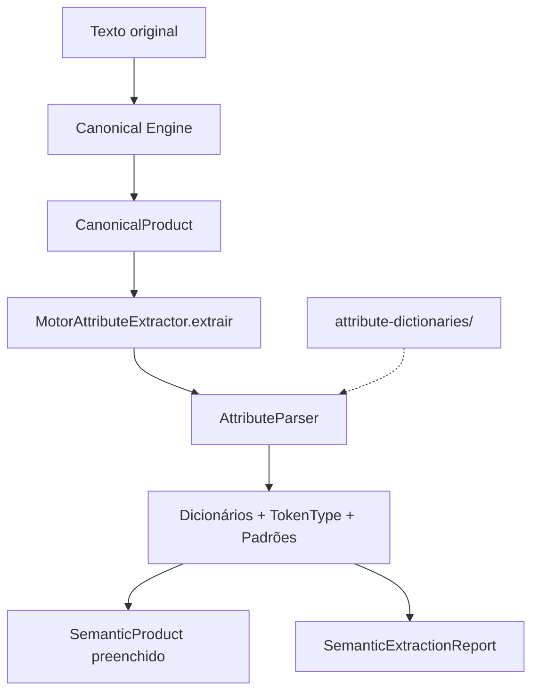

# MIIP — Motor de Extração de Atributos (Attribute Engine)

> **MIIP V1.0 RC1** — Documentação congelada. Pipeline oficial com 6 motores. Ver [ARQUITETURA_MIIP.md](./ARQUITETURA_MIIP.md).


**Sprint 8 — Fase 2 Inteligência**  
**Status:** Implementado — aguardando aprovação formal

---

## 1. Objetivo

O **Motor Attribute Extractor** é o primeiro motor que transforma texto em conhecimento estruturado. Recebe um `CanonicalProduct` e retorna um `SemanticProduct` preenchido com atributos extraídos automaticamente.

**Não identifica produtos. Não compara produtos. Não acessa banco, XML ou ERP.**

---

## 2. Responsabilidades

| Componente | Papel |
|------------|-------|
| `MotorAttributeExtractor` | Orquestra extração; implementa `IMotorIdentificacao` |
| `AttributeParser` | Localiza padrões e dicionários nos tokens |
| `SemanticExtractionReport` | Relatório de atributos encontrados/não encontrados |
| `config/attribute-dictionaries/` | Dicionários evolutivos sem alterar código |

---

## 3. Fluxo



```
CanonicalProduct
      ↓
AttributeParser (tokens + dicionários + padrões)
      ↓
SemanticProduct + SemanticExtractionReport
```

---

## 4. Entrada e saída

### Entrada

`CanonicalProduct` — com `canonico`, `tokens` e/ou `normalizedTokens`.

### Saída

```javascript
const { produto, relatorio } = motor.extrair(canonicalProduct);
```

| Saída | Tipo | Descrição |
|-------|------|-----------|
| `produto` | `SemanticProduct` | Campos semânticos preenchidos |
| `relatorio` | `SemanticExtractionReport` | Métricas da extração |

---

## 5. Atributos extraídos

| Campo | Fonte típica | Confiança |
|-------|--------------|-----------|
| `marca` | TokenType.MARCA / brands.json | 95–100 |
| `tipo` | technologies.json (tipos) / inferência | 85–95 |
| `tecnologia` | technologies.json | 95 |
| `potencia` | Padrão `NW` / `NKW` | 100 |
| `tensao` | Padrão `NV` | 100 |
| `corrente` | Padrão `NA` | 100 |
| `cor` | colors.json | 95 |
| `material` | materials.json | 95 |
| `acabamento` | materials.json (acabamentos) | 95 |
| `bitola` | Fração `3/8`, `1/2` | 90 |
| `diametro` | `NMM`, `NPOL` | 90–100 |
| `comprimento` / `largura` | Dimensão `5X80`, `NCM`, `NM` | 90 |
| `peso` | `NKG`, `NG` | 100 |
| `volume` | `NML`, `NL`, `NLT` | 100 |
| `embalagem` | TokenType.EMBALAGEM / package-types.json | 95–100 |
| `quantidadeEmbalagem` | Número após embalagem | 85 |
| `unidadeMedida` | Sufixo da medida principal | 90 |

Cada atributo em `atributosExtras` possui: `valor`, `confianca`, `origem`, `normalizado`.

### Origens

| Valor | Significado |
|-------|-------------|
| `token_tipo` | TokenType do Canonical Engine |
| `dicionario` | Match em attribute-dictionaries |
| `padrao_medida` | Regex de medida composta |
| `inferencia` | Heurística contextual |

---

## 6. Exemplo oficial

**Canônico:** `LAMPADA FLUORESCENTE PHILIPS 20W CAIXA 10`

| Campo | Valor | Confiança |
|-------|-------|-----------|
| tipo | LAMPADA | 95–100 |
| marca | PHILIPS | 100 |
| tecnologia | FLUORESCENTE | 95 |
| potencia | 20W | 100 |
| embalagem | CAIXA | 100 |
| quantidadeEmbalagem | 10 | 85 |

---

## 7. Configuração

`backend/motores/miip/config/attribute-dictionaries/`

| Arquivo | Conteúdo |
|---------|----------|
| `brands.json` | Marcas |
| `technologies.json` | Tecnologias e tipos de produto |
| `package-types.json` | Embalagens |
| `units.json` | Unidades de medida |
| `colors.json` | Cores |
| `materials.json` | Materiais e acabamentos |

Novas entradas podem ser adicionadas sem alterar código.

---

## 8. Uso

```javascript
const MotorCanonical = require('./engines/MotorCanonical');
const MotorAttributeExtractor = require('./engines/MotorAttributeExtractor');

const canonical = new MotorCanonical().canonicalizar('Lamp. Flor. Philips 20W Cx C/10');
const { produto, relatorio } = new MotorAttributeExtractor().extrair(canonical);

console.log(produto.marca);              // PHILIPS
console.log(produto.potencia);           // 20W
console.log(relatorio.confiancaMedia);   // ~95
console.log(relatorio.atributosEncontrados);
```

---

## 9. Limitações

| Limitação | Comportamento |
|-----------|---------------|
| Modelo de produto | Não extraído (campo `modelo`) |
| Comparação | Não implementada |
| GTIN/NCM/CEST | Não extraídos nesta sprint |
| Marcas compostas | `BLACK DECKER` requer token único |
| Pipeline | Não registrado no MiipBootstrap |
| IA | Não utilizada |

---

## 10. Restrições

- **Proibido:** banco, SQL, XML, ERP, fornecedor, GTIN, similaridade, comparação, identificação
- `identificar()` → sempre `[]`
- `getPeso()` → `0`

---

## 11. Testes

```bash
npm run test:miip-attribute
```

**77 casos** cobrindo:

| Categoria | Casos |
|-----------|-------|
| Elétricos | 9 |
| Hidráulicos | 8 |
| Ferragens | 8 |
| Tintas | 8 |
| Papelaria | 8 |
| Mercantil | 8 |
| Construção | 8 |
| Ferramentas | 8 |
| Interface / estrutura | 12 |

---

## 12. Critérios de aceite

- [x] Recebe `CanonicalProduct`
- [x] Retorna `SemanticProduct` preenchido
- [x] Cada atributo com valor, confiança, origem e normalizado
- [x] Dicionários configuráveis
- [x] ≥ 60 casos de teste
- [x] Nenhuma comparação ou identificação
- [x] Isolamento total (sem banco/XML/ERP)

---

**Documento preparado para aprovação.**
