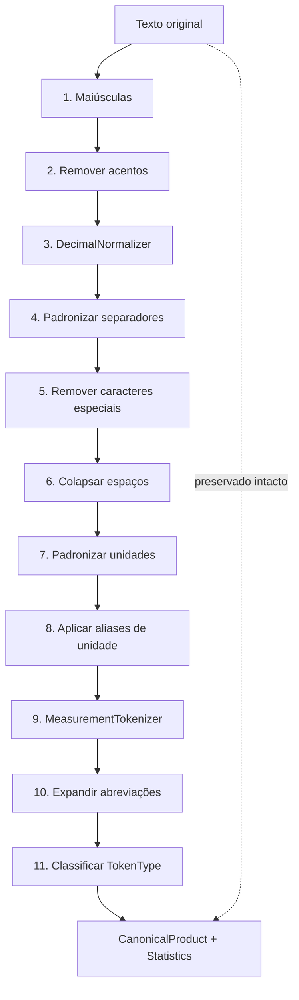

# MIIP — Motor de Padronização Canônica (Canonical Engine)

> **MIIP V1.0 RC1** — Documentação congelada. Pipeline oficial com 6 motores. Ver [ARQUITETURA_MIIP.md](./ARQUITETURA_MIIP.md).


**Sprint 7.1 — Refinamento Final**  
**Status:** Implementado — aguardando aprovação formal

---

## 1. Objetivo

O **Motor Canonical** é a base de toda a Inteligência do MIIP. Ele **não identifica produtos**. Sua única responsabilidade é transformar descrições textuais em uma **representação canônica padronizada** (`CanonicalProduct`) com tokens tipados, estatísticas e formas normalizadas.

Motores futuros (Atributos, Sinônimos, Similaridade, Estatístico) consumirão essa representação como entrada comum.

---

## 2. O que o motor NÃO faz

| Proibido | Motivo |
|----------|--------|
| Identificar produtos | Escopo exclusivo dos motores Fase 1 |
| Consultar banco / SQL | Trabalha apenas com string |
| Consultar fornecedor, XML, GTIN | Sem dependências externas |
| Comparar ou calcular similaridade | Sprint 8+ |
| Alterar o texto original | Imutabilidade da entrada |

---

## 3. Arquitetura

```
Entrada (string)
      │
      ▼
┌─────────────────────┐
│   MotorCanonical    │  implements IMotorIdentificacao
│   canonicalizar()   │
└─────────┬───────────┘
          │
          ▼
┌─────────────────────┐
│ CanonicalNormalizer │  pipeline interno (11 etapas)
├─────────────────────┤
│ DecimalNormalizer   │  preserva decimais (1,5 → 1.5L)
│ MeasurementTokenizer│  preserva medidas (20W, 3/8, 5X80)
└─────────┬───────────┘
          │
          ▼
┌─────────────────────┐
│  CanonicalProduct   │  tokens + normalizedTokens + estatísticas
└─────────────────────┘
```

### 3.1 Arquivos

| Caminho | Papel |
|---------|-------|
| `engines/canonical/MotorCanonical.js` | Motor plugável |
| `engines/MotorCanonical.js` | Re-export (compatibilidade) |
| `core/CanonicalProduct.js` | DTO de saída |
| `core/CanonicalToken.js` | Token tipado individual |
| `core/TokenType.js` | Enum de tipos semânticos |
| `core/CanonicalStatistics.js` | Métricas de processamento |
| `utils/CanonicalNormalizer.js` | Orquestrador do pipeline |
| `utils/DecimalNormalizer.js` | Normalização de decimais |
| `utils/MeasurementTokenizer.js` | Tokenização de medidas |
| `config/canonical/*.json` | Configuração modular |

### 3.2 Configuração modular (`config/canonical/`)

| Arquivo | Responsabilidade |
|---------|------------------|
| `abbreviations.json` | Abreviações textuais e embalagens |
| `units.json` | Unidades e aliases (ex.: LT → L) |
| `measurements.json` | Sufixos de medida, frações, dimensões |
| `stopwords.json` | Palavras funcionais (DE, COM, E…) |
| `brands.json` | Marcas conhecidas |

---

## 4. Pipeline interno



### Etapa 3 — DecimalNormalizer

Preserva números decimais com vírgula. Nunca quebra em tokens separados.

| Entrada | Saída |
|---------|-------|
| `1,5 LT` | `1.5L` |
| `2,75 KG` | `2.75KG` |
| `0,75 ML` | `0.75ML` |

### Etapa 9 — MeasurementTokenizer

Reconhece e preserva tokens compostos:

| Padrão | Exemplo | Tipo |
|--------|---------|------|
| Potência | `20W`, `9W`, `2.5KW` | MEDIDA |
| Voltagem | `220V`, `127V` | MEDIDA |
| Peso/Volume | `500ML`, `1KG`, `1.5L` | MEDIDA |
| Fração | `3/8`, `1/2` | MEDIDA |
| Dimensão | `5X80` | MEDIDA |
| Comprimento | `12MM`, `3POL` | MEDIDA |
| Quantidade | `12UN` | QUANTIDADE |

### Etapa 11 — Classificação TokenType

| Tipo | Critério |
|------|----------|
| `PALAVRA` | Texto genérico ou stopword |
| `NUMERO` | Apenas dígitos (`3.14`) |
| `MEDIDA` | Padrão de medida composta |
| `MARCA` | Presente em `brands.json` |
| `UNIDADE` | Unidade isolada |
| `QUANTIDADE` | Formato `NUN` (ex.: `12UN`) |
| `EMBALAGEM` | CX, PCT, CJ e expansões |
| `DESCONHECIDO` | Fallback |

---

## 5. CanonicalProduct

| Campo | Descrição |
|-------|-----------|
| `original` | Texto recebido — **nunca modificado** |
| `normalizado` | Após etapas 1–8 (antes de abreviações) |
| `canonico` | String final com abreviações expandidas |
| `tokens` | Array de strings do `canonico` (compatibilidade) |
| `normalizedTokens` | Array de `CanonicalToken` tipados |
| `atributos` | Quantidades e unidades extraídas |
| `estatisticas` | `CanonicalStatistics` |
| `metadata` | Versão e etapas aplicadas |

### CanonicalToken

| Campo | Descrição |
|-------|-----------|
| `textoOriginal` | Token antes da expansão (ex.: `LAMP`) |
| `textoCanonico` | Após expansão (ex.: `LAMPADA`) |
| `tipo` | `TokenType` |
| `posicao` | Índice no produto |
| `normalizado` | Forma normalizada (ex.: `LAMPADAS` → `LAMPADA`) |

### CanonicalStatistics

| Campo | Descrição |
|-------|-----------|
| `quantidadeTokens` | Total de tokens |
| `quantidadePalavras` | Tokens tipo PALAVRA |
| `quantidadeMedidas` | Tokens tipo MEDIDA |
| `quantidadeMarcas` | Tokens tipo MARCA |
| `tempoProcessamento` | Duração em ms |

### Exemplo oficial

```json
{
  "original": "Lamp. Flor. 20W Philips",
  "normalizado": "LAMP FLOR 20W PHILIPS",
  "canonico": "LAMPADA FLUORESCENTE 20W PHILIPS",
  "tokens": ["LAMPADA", "FLUORESCENTE", "20W", "PHILIPS"],
  "normalizedTokens": [
    {
      "textoOriginal": "LAMP",
      "textoCanonico": "LAMPADA",
      "tipo": "PALAVRA",
      "posicao": 0,
      "normalizado": "LAMPADA"
    },
    {
      "textoOriginal": "FLOR",
      "textoCanonico": "FLUORESCENTE",
      "tipo": "PALAVRA",
      "posicao": 1,
      "normalizado": "FLUORESCENTE"
    },
    {
      "textoOriginal": "20W",
      "textoCanonico": "20W",
      "tipo": "MEDIDA",
      "posicao": 2,
      "normalizado": "20W"
    },
    {
      "textoOriginal": "PHILIPS",
      "textoCanonico": "PHILIPS",
      "tipo": "MARCA",
      "posicao": 3,
      "normalizado": "PHILIPS"
    }
  ],
  "atributos": {
    "quantidades": [20],
    "unidades": ["W"],
    "totalTokens": 4
  },
  "estatisticas": {
    "quantidadeTokens": 4,
    "quantidadePalavras": 2,
    "quantidadeMedidas": 1,
    "quantidadeMarcas": 1,
    "tempoProcessamento": 1
  }
}
```

---

## 6. Exemplos reais de transformação

| Original | Canônico |
|----------|----------|
| `Lamp. Flor. 20W Philips` | `LAMPADA FLUORESCENTE 20W PHILIPS` |
| `água mineral 1,5 LT` | `AGUA MINERAL 1.5L` |
| `Açúcar Cristal 1,5 KG` | `ACUCAR CRISTAL 1.5KG` |
| `Lampada 220V` | `LAMPADA 220V` |
| `PARAFUSO 3/8 ACO` | `PARAFUSO 3/8 ACO` |
| `LIXA 5X80` | `LIXA 5X80` |
| `CX 12 UN PCT` | `CAIXA 12UN PACOTE` |
| `MOTOR 2,5 KW` | `MOTOR 2.5KW` |
| `LEITE 1 LT INTEGRAL` | `LEITE 1L INTEGRAL` |

---

## 7. Uso

```javascript
const MotorCanonical = require('./engines/MotorCanonical');
const motor = new MotorCanonical();

const produto = motor.canonicalizar('Lamp. Flor. 20W Philips');
// produto.canonico → "LAMPADA FLUORESCENTE 20W PHILIPS"
// produto.normalizedTokens[2].tipo → "MEDIDA"

await motor.identificar({ produto_nome: 'Arroz 5KG' });
// → [] (sempre vazio)
// motor.obterUltimoCanonical() → CanonicalProduct
```

---

## 8. Compatibilidade

- `tokens[]`, `atributos`, `original`, `normalizado`, `canonico` mantidos
- `carregarDicionario()` continua disponível (agrega `config/canonical/`)
- `MotorCanonical` API inalterada
- Versão do produto: `1.1.0`

---

## 9. Testes

```bash
npm run test:miip-canonical
```

**71 casos** cobrindo:

- Decimais (`1,5 LT`, `2,75 KG`, `0,75 ML`)
- Frações (`3/8`, `1/2`)
- Potências (`20W`, `2.5KW`)
- Voltagens (`220V`, `127V`)
- Medidas (`500ML`, `12MM`, `3POL`, `5X80`)
- Embalagens (`CX`, `PCT`, `12UN`)
- Acentos e pontuação
- Abreviações e misturas
- TokenType e CanonicalStatistics
- Isolamento (sem SQL/repositórios)

---

## 10. Critérios de aceite — Sprint 7.1

- [x] `DecimalNormalizer` preserva decimais
- [x] `MeasurementTokenizer` preserva medidas compostas
- [x] `CanonicalToken` com tipos semânticos
- [x] Config modular em `config/canonical/`
- [x] `CanonicalStatistics` com métricas
- [x] ≥ 50 casos de teste
- [x] Nenhuma quebra de compatibilidade
- [x] Motor isolado (sem banco, XML, ERP)

---

## 11. Sugestões para Sprint 8

1. **Motor de Atributos** — consumir `normalizedTokens` por `TokenType.MEDIDA` e `QUANTIDADE`
2. **Motor de Sinônimos** — mapear `normalizado` contra dicionário semântico
3. **Motor de Similaridade** — comparar vetores de `CanonicalToken` entre descrição e catálogo
4. **Pré-processamento no pipeline** — invocar `MotorCanonical` antes dos motores de identificação
5. **Dicionário evolutivo** — aprendizado de abreviações por fornecedor (camada externa ao Canonical)
6. **Singularização avançada** — regras morfológicas PT-BR para `normalizado`
7. **Integração Central de Revisão** — exibir `canonico` e tipos de token na revisão manual

---

**Documento preparado para aprovação.**
