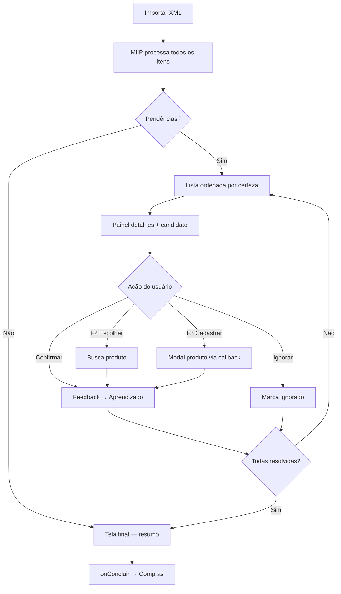

# MIIP — Central de Revisão (Sprint 6B)

Primeira interface oficial do MIIP. Módulo **desacoplado** do fluxo de Compras.

## Escopo

| Incluído | Excluído |
|----------|----------|
| Modal fullscreen de revisão | Alteração fiscal/tributária |
| Resumo visual da importação | Estoque, financeiro, NFC-e |
| Confirmação e aprendizado | Mudança na lógica da tela de Compras |
| Atalhos de teclado | Novos motores (similaridade, IA) |

A tela de Compras continua **exatamente igual** após a revisão.

## Fluxo

```
Compras → Importar XML → parse-xml → MIIP (6A)
        ↓
Central de Revisão MIIP (somente pendências)
        ↓
Usuário confirma / escolhe / cadastra / ignora
        ↓
MiipLearningService (feedback imediato)
        ↓
Tela de Compras preenchida (fluxo atual)
        ↓
Usuário grava a compra
```

## Diagrama



## O que a Central mostra

### Resumo (topo)

- Itens da nota
- Associados automaticamente
- Precisam confirmação
- Precisam cadastro
- Precisão da importação (%)
- Tempo de processamento

### Lista (esquerda) — apenas pendências

Ordenação obrigatória:

1. Maior nível de certeza (score)
2. Menor nível de certeza
3. Itens sem candidato (cadastro)

**Não** exibe itens associados automaticamente.

### Painel (direita)

- Produto do XML, fornecedor, cProd, quantidade, unidade, valor
- Melhor candidato CDS com score e evidências

## Botões e atalhos

| Ação | Botão | Atalho |
|------|-------|--------|
| Confirmar produto | Confirmar Produto | `Enter` |
| Próximo item | — | `Tab` |
| Item anterior | — | `Shift+Tab` |
| Pesquisar produto | Escolher outro | `F2` |
| Cadastrar produto | Cadastrar Novo | `F3` |
| Ignorar | Ignorar Item | — |
| Cancelar revisão | Cancelar | `Esc` |

## Aprendizado

Ao confirmar (candidato ou busca manual):

```
POST /api/miip/feedback
  confirmado: true
  origem: central_revisao_miip
        ↓
MiipLearningService.registrarConfirmacao()
```

Toast discreto:

> ✓ MIIP aprendeu esta associação. Próximas importações serão automáticas.

## Tela final

Antes de abrir a Compras:

- Importação concluída
- Identificados automaticamente: **XX**
- Aprendeu: **XX** novas associações
- Precisão: **XX%**
- Botão: **Abrir tela de Compras**

## Integração com Compras (mínima)

`compras.js` apenas delega:

```javascript
MiipCentralRevisao.iniciar({
  dadosImportacao: data,
  apiUrl: API_URL,
  produtos: produtosCompraList,
  obterUsuario: obterUsuarioLogadoCompra,
  abrirCadastroProduto: abrirCadastroProdutoCentralMiip,
  onConcluir: (resultado) => finalizarImportacaoXmlCompra(data),
  onCancelar: () => { /* limpa XML */ }
});
```

Rollback: `usarMiipImportacaoXML = false` pula a Central e mantém fluxo 6A/legado.

## Arquivos

| Arquivo | Papel |
|---------|-------|
| `frontend/erp/js/miip-central-revisao.js` | UI + orquestração |
| `frontend/css/miip-central-revisao.css` | Estilos |
| `backend/motores/miip/utils/miipCentralRevisaoUtils.js` | Lógica pura (testável) |
| `frontend/erp/js/compras.js` | Hook fino (~40 linhas) |

## Testes

```bash
npm run test:miip-central-revisao
npm run test:miip
```

| Caso | Validação |
|------|-----------|
| Sem pendências | `pendencias.length === 0` |
| Só confirmação | Filtro `precisaConfirmacao` |
| Só cadastro | Filtro `precisaCadastro` |
| Mista | Ordenação por score |
| Aprendizado | `aprendizados` incrementa |
| Cancelar | `ignoradas` |
| Teclado | `proximaPendenciaNaoResolvida` |

## Rollback

Desabilitar importação MIIP (`usarMiipImportacaoXML=false`) — Central não é aberta.
