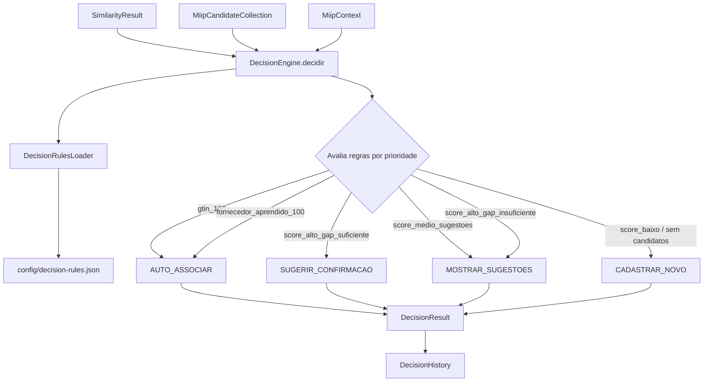

# MIIP — Decision Engine (Motor Decisório)

> **MIIP V1.0 RC1** — Documentação congelada. Pipeline oficial com 6 motores. Ver [ARQUITETURA_MIIP.md](./ARQUITETURA_MIIP.md).


**Sprint 11 — Fase 2 Inteligência**  
**Status:** Implementado — aguardando aprovação formal

---

## 1. Objetivo

O **Decision Engine** é o cérebro decisório do MIIP. Ele recebe os resultados produzidos pelos engines (candidatos, similaridade, contexto) e gera a **decisão oficial**.

Esta sprint **não altera** ERP, XML, GTIN, Fornecedor, Aprendizado nem o Similarity Engine.

**Princípio:** Toda decisão do MIIP deve ser tomada exclusivamente pelo Decision Engine. Nenhum outro engine decide.

---

## 2. Arquitetura



```
SimilarityResult ──┐
MiipCandidateCollection ──┼── DecisionEngine.decidir()
MiipContext ──────────────┘
              ↓
      decision-rules.json
              ↓
        DecisionResult
```

### Componentes

| Arquivo | Responsabilidade |
|---------|------------------|
| `core/DecisionEngine.js` | Motor decisório principal |
| `core/DecisionResult.js` | Resultado oficial da decisão |
| `core/DecisionRule.js` | Regra configurável |
| `core/DecisionAction.js` | Ações oficiais |
| `core/DecisionExplanation.js` | Texto amigável |
| `core/DecisionStatistics.js` | Métricas da decisão |
| `core/DecisionHistory.js` | Registro histórico |
| `utils/DecisionRulesLoader.js` | Carrega regras JSON |
| `config/decision-rules.json` | Configuração das regras |

---

## 3. Entrada e Saída

### Entrada

| Parâmetro | Descrição |
|-----------|-----------|
| `SimilarityResult` | Resultado do Similarity Engine (opcional) |
| `MiipCandidateCollection` | Candidatos consolidados dos engines |
| `MiipContext` | Contexto da operação |

### Saída — `DecisionResult`

| Campo | Descrição |
|-------|-----------|
| `acao` | `AUTO_ASSOCIAR`, `SUGERIR_CONFIRMACAO`, `MOSTRAR_SUGESTOES`, `CADASTRAR_NOVO` |
| `nivelCerteza` | `ALTA`, `MEDIA`, `BAIXA`, `NENHUMA` |
| `motivos` | Códigos técnicos da decisão |
| `explicacao` | Texto amigável + baseadoEm |
| `produtoSelecionado` | Melhor candidato |
| `alternativas` | Demais candidatos ranqueados |
| `precisaConfirmacao` | Operador deve confirmar |
| `precisaCadastro` | Cadastro de novo produto |
| `score` | Score do melhor candidato |
| `estatisticas` | Regras avaliadas, tempo, regra vencedora |
| `historico` | Registro da decisão |

---

## 4. Regras Iniciais

| Prioridade | Regra | Condição | Ação |
|------------|-------|----------|------|
| 1 | `gtin_100` | GTIN encontrado 100% | `AUTO_ASSOCIAR` |
| 2 | `fornecedor_aprendido_100` | Fornecedor aprendido 100% | `AUTO_ASSOCIAR` |
| 3 | `score_alto_gap_suficiente` | Score ≥ 95% e gap ≥ 15 | `SUGERIR_CONFIRMACAO` |
| 4 | `score_medio_sugestoes` | Score 80%–94% | `MOSTRAR_SUGESTOES` |
| 5 | `score_alto_gap_insuficiente` | Score ≥ 95% e gap < 15 | `MOSTRAR_SUGESTOES` |
| 6 | `score_baixo_cadastro` | Score < 80% | `CADASTRAR_NOVO` |
| 99 | `sem_candidatos` | Nenhum candidato | `CADASTRAR_NOVO` |

### Thresholds configuráveis

```json
{
  "sugerirConfirmacao": 95,
  "mostrarSugestoes": 80,
  "gapMinimoConfirmacao": 15
}
```

---

## 5. Exemplos

### GTIN 100% — associação automática

```javascript
const DecisionEngine = require('./core/DecisionEngine');
const MiipCandidateCollection = require('./core/MiipCandidateCollection');

const engine = new DecisionEngine();
const colecao = new MiipCandidateCollection();
colecao.adicionar({
  produtoId: 42,
  scoreTotal: 100,
  motoresQueVotaram: ['motor_gtin'],
  evidencias: [{ tipo: 'gtin_exato', score: 100, motor: 'motor_gtin' }]
});

const resultado = engine.decidir(null, colecao);
// resultado.acao === 'AUTO_ASSOCIAR'
// resultado.explicacao.texto:
//   "Produto identificado automaticamente.\nBaseado em:\nCódigo de barras."
```

### Score 95% com gap 15 — confirmação

```javascript
// Candidato 1: score 95 | Candidato 2: score 80
// resultado.acao === 'SUGERIR_CONFIRMACAO'
// resultado.precisaConfirmacao === true
```

### Score 79% — cadastro

```javascript
// resultado.acao === 'CADASTRAR_NOVO'
// resultado.precisaCadastro === true
```

### Empate 95/95 — sugestões

```javascript
// gap = 0 (< 15)
// resultado.acao === 'MOSTRAR_SUGESTOES'
// resultado.motivos inclui 'score_alto_gap_insuficiente'
```

---

## 6. DecisionExplanation

Exemplo de saída amigável:

```
Produto identificado automaticamente.
Baseado em:
Código de barras.
Fornecedor.
Marca.
Potência.
```

---

## 7. DecisionHistory

Cada decisão registra:

| Campo | Exemplo |
|-------|---------|
| `regra` | `gtin_100` |
| `score` | `100` |
| `data` | ISO 8601 |
| `versaoRegra` | `1.0.0` |
| `acao` | `AUTO_ASSOCIAR` |
| `operacaoId` | UUID da operação |

---

## 8. Restrições

| Proibido | Motivo |
|----------|--------|
| Consultar banco / SQL | Decisão pura em memória |
| Consultar ERP / XML | Fora do escopo Sprint 11 |
| Criar aprendizado | Responsabilidade de sprint futura |
| Alterar Similarity Engine | Engine independente |

---

## 9. Integração futura

```
Engines (GTIN, Fornecedor, Similarity...)
              ↓
    MiipCandidateCollection
              ↓
       DecisionEngine.decidir()   ← Sprint 11
              ↓
        DecisionResult
              ↓
    Pipeline / UI / Orchestrator   ← Sprint 12+
```

O `MiipDecisionBuilder` existente será migrado para delegar ao `DecisionEngine` em sprint futura.

---

## 10. Testes

```bash
npm run test:miip-decision
```

| Categoria | Casos |
|-----------|-------|
| Infraestrutura (DTOs, loader) | 8 |
| GTIN 100% | 10 |
| Fornecedor 100% | 7 |
| Score 95%+ gap grande | 8 |
| Score 80–94% | 11 |
| Score < 80% | 8 |
| Empates e gaps | 11 |
| Histórico, contexto, serialização | 6 |
| **Total** | **69** |

---

**Documento preparado para aprovação da Sprint 11.**
