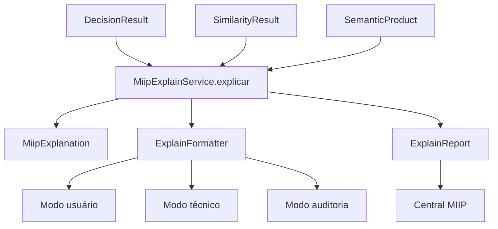

# MIIP — Camada de Explicabilidade (Explain Service)

> **MIIP V1.0 RC1** — Documentação congelada. Pipeline oficial com 6 motores. Ver [ARQUITETURA_MIIP.md](./ARQUITETURA_MIIP.md).


**Sprint 12 — Fase 2 Inteligência**  
**Status:** Implementado — aguardando aprovação formal

---

## 1. Objetivo

Toda decisão tomada pelo MIIP deve ser **explicável**. O usuário nunca vê apenas uma porcentagem — sempre vê os motivos da decisão.

Esta sprint **não altera** ERP, XML, Compras, Pipeline, GTIN, Fornecedor, Similarity nem Decision Engine.

---

## 2. Arquitetura



```
DecisionResult ──┐
SimilarityResult ──┼── MiipExplainService
SemanticProduct ───┘
              ↓
        MiipExplanation
              ↓
      ExplainFormatter → ExplainReport
```

### Componentes

| Arquivo | Responsabilidade |
|---------|------------------|
| `core/MiipExplainService.js` | Serviço principal de explicação |
| `core/MiipExplanation.js` | DTO de explicação oficial |
| `core/ExplainReport.js` | Relatório para Central MIIP |
| `utils/ExplainFormatter.js` | Formatação em 3 modos |

---

## 3. Entrada e Saída

### Entrada

| Parâmetro | Descrição |
|-----------|-----------|
| `DecisionResult` | Decisão oficial (obrigatório) |
| `SimilarityResult` | Comparação semântica (opcional) |
| `SemanticProduct` | Produto estruturado (opcional) |

### Saída — `MiipExplanation`

| Campo | Descrição |
|-------|-----------|
| `titulo` | Título amigável da decisão |
| `resumo` | Resumo em uma frase |
| `nivelCerteza` | ALTA, MEDIA, BAIXA, NENHUMA |
| `motivosPositivos[]` | Motivos a favor (ex.: "Marca igual") |
| `motivosNegativos[]` | Motivos contra (ex.: "Modelo diferente") |
| `atributosCoincidentes[]` | Atributos que coincidem |
| `atributosDivergentes[]` | Atributos que divergem |
| `explicacaoCompleta` | Texto formatado completo |
| `explicacaoCurta` | Título + resumo |
| `recomendacao` | Ação recomendada ao operador |

---

## 4. Modos de formatação

| Modo | Uso | Formato |
|------|-----|---------|
| `usuario` | UI operador | ✔/✖ com texto amigável |
| `tecnico` | Debug / suporte | Atributos e motivos técnicos |
| `auditoria` | Logs / compliance | JSON estruturado |

---

## 5. Exemplos

### Identificação automática (GTIN)

```
Produto identificado automaticamente.

Motivos:
✔ Código de barras igual
✔ Código de barras. confirmado

Recomendação:
Produto será associado automaticamente.
```

### Confirmação necessária

```
Produto precisa confirmação.

Motivos:
✔ Marca igual
✔ Potência igual
✖ Modelo diferente
✖ Embalagem diferente

Recomendação:
Confirme antes de prosseguir.
```

### Uso em código

```javascript
const MiipExplainService = require('./core/MiipExplainService');

const service = new MiipExplainService();
const explicacao = service.explicar(decisionResult, similarityResult, semanticProduct);

console.log(explicacao.explicacaoCompleta);
console.log(explicacao.motivosPositivos);
console.log(explicacao.recomendacao);

// Para Central MIIP
const report = service.gerarRelatorio(decisionResult, similarityResult, null, 'usuario');
console.log(report.textoFormatado);
```

---

## 6. ExplainReport (Central MIIP)

| Campo | Descrição |
|-------|-----------|
| `explicacao` | MiipExplanation completa |
| `modo` | usuario / tecnico / auditoria |
| `textoFormatado` | Texto pronto para exibição |
| `geradoEm` | ISO 8601 |
| `acao` | Ação da decisão |
| `score` | Score consolidado |
| `produtoId` | Produto selecionado |
| `precisaConfirmacao` | Flag UI |
| `precisaCadastro` | Flag UI |

---

## 7. Restrições

- **Não altera** regras de decisão
- **Não altera** Pipeline, ERP, XML ou Compras
- **Não consulta** banco de dados
- Toda decisão **deve** ter explicação (mesmo decisão nula retorna mensagem informativa)

---

## 8. Testes

```bash
npm run test:miip-explain
```

| Categoria | Casos |
|-----------|-------|
| Infraestrutura (DTOs, formatter) | 8 |
| GTIN e fornecedor | 6 |
| Similarity e atributos | 10 |
| Relatórios e modos | 9 |
| Ações e cenários | 13 |
| **Total** | **40** |

---

## 9. Integração futura

```
DecisionEngine → DecisionResult
SimilarityEngine → SimilarityResult
       ↓
MiipExplainService.explicar()
       ↓
ExplainReport → Central de Revisão MIIP (Sprint 13+)
```

---

**Documento preparado para aprovação da Sprint 12.**
