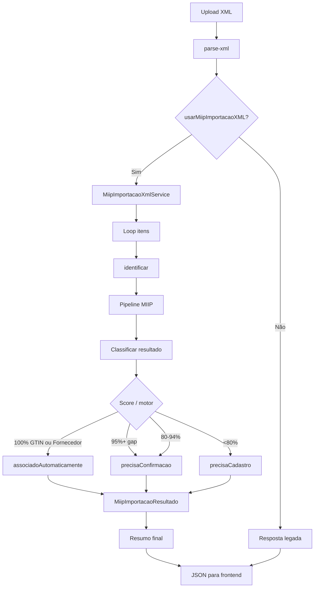

# MIIP — Integração com Importação XML (Sprint 6A)

> **MIIP V1.0 RC1** — Documentação congelada. Pipeline oficial com 6 motores. Ver [ARQUITETURA_MIIP.md](./ARQUITETURA_MIIP.md).


Primeira integração oficial do MIIP com o ERP na importação de NF-e (compras).

## Escopo

| Incluído | Excluído |
|----------|----------|
| Identificação de produtos via MIIP | Lógica fiscal |
| Feature flag reversível | Estoque, financeiro, tributos |
| Resumo em memória ao final do parse | Nova tela |
| Compatibilidade com UI existente | Similaridade, IA, sinônimos |

## Feature flag

| Chave | Default | Descrição |
|-------|---------|-----------|
| `usarMiipImportacaoXML` | `true` | Habilita MIIP no `POST /api/compras/parse-xml` |

**Reversão imediata:** `usarMiipImportacaoXML = false` restaura o fluxo anterior (parse sem MIIP + `POST /api/miip/identificar-lote` no frontend).

Requer também `usarMiip = true`. Se o MIIP global estiver desligado, a importação XML segue no legado.

Variável de ambiente: `MIIP_USAR_MIIP_IMPORTACAO_XML=false`

## Fluxo completo

```
Arquivo XML (upload)
        ↓
POST /api/compras/parse-xml
        ↓
Parse NF-e (inalterado — fiscal intacto)
        ↓
usarMiipImportacaoXML?
   ├─ false → resposta JSON legada
   └─ true  → MiipService.processarImportacaoXml()
                ↓
         Para cada item:
           Item XML → ItemIdentificavelDTO
                ↓
           MiipService.identificar()
                ↓
           Pipeline → MotorGTIN → MotorAssociacaoFornecedor
                ↓
           DecisionBuilder → MiipResult
                ↓
           MiipImportacaoResultado (memória)
        ↓
Resumo + itens enriquecidos (produto_id, miip_sugestao)
        ↓
Frontend: aplicarMiipImportacaoXml() — sem nova tela
        ↓
Usuário revisa/confirma APÓS importação terminar
```

## Diagrama



## MiipImportacaoResultado

| Campo | Descrição |
|-------|-----------|
| `produtoXML` | Item original do XML |
| `produtoEncontrado` | Produto identificado (`id`, `nome`, `codigo`) |
| `nivelCerteza` | `ALTA`, `MEDIA`, `BAIXA`, `NENHUMA` |
| `acao` | `auto_vincular`, `sugerir`, `criar_novo`, `revisar_manual` |
| `motivos` | Lista de regras aplicadas |
| `candidatoSelecionado` | Melhor candidato do pipeline |
| `precisaConfirmacao` | Item na lista de confirmação |
| `precisaCadastro` | Item na lista de cadastro |
| `associadoAutomaticamente` | Vinculado sem intervenção |

## Resumo final

```json
{
  "totalItens": 12,
  "identificadosAutomaticamente": 8,
  "precisamConfirmacao": 2,
  "precisamCadastro": 2,
  "tempoProcessamento": 145
}
```

Retornado em `parsed.miip_importacao.resumo` na resposta do `parse-xml`.

## Regras de classificação (Sprint 6A)

| Condição | Resultado |
|----------|-----------|
| Score 100% + `motor_gtin` ou `motor_associacao_fornecedor` | `associadoAutomaticamente = true` |
| Score ≥ 95% + gap ≥ 5 vs 2º candidato | `precisaConfirmacao = true` |
| Score 80%–94% | `precisaConfirmacao = true` |
| Score &lt; 80% ou sem candidato | `precisaCadastro = true` |
| Conflito entre motores | `precisaConfirmacao = true` |

**Nenhuma confirmação ocorre durante a leitura do XML.**

## Resposta do parse-xml (com MIIP)

```json
{
  "chave_acesso": "...",
  "fornecedor": "Distribuidora ABC",
  "fornecedor_cnpj": "12345678000199",
  "itens": [
    {
      "produto_nome": "Arroz 5kg",
      "codigo_fornecedor": "A001",
      "codigo_barras": "7891234567890",
      "produto_id": 42,
      "miip_resultado": { "associadoAutomaticamente": true, "..." : "..." },
      "miip_sugestao": null
    }
  ],
  "miip_importacao": {
    "usarMiipImportacaoXML": true,
    "operacaoId": "35260...",
    "resultados": [],
    "resumo": {
      "totalItens": 1,
      "identificadosAutomaticamente": 1,
      "precisamConfirmacao": 0,
      "precisamCadastro": 0,
      "tempoProcessamento": 32
    }
  }
}
```

## Logs

Evento `importacao_xml_concluida` em `MiipIntegracaoLogService`:

- tempo total (`duracaoMs`)
- itens processados
- identificados automaticamente
- pendentes de confirmação
- pendentes de cadastro

## Arquivos

| Arquivo | Papel |
|---------|-------|
| `services/MiipImportacaoXmlService.js` | Processamento em lote |
| `core/MiipImportacaoResultado.js` | DTO por item |
| `MiipService.processarImportacaoXml()` | Porta de entrada |
| `config/miipFeatureFlags.js` | Flag `usarMiipImportacaoXML` |
| `rotas/compras.js` | Integração no `parse-xml` |
| `frontend/erp/js/compras.js` | `aplicarMiipImportacaoXml()` |

## Testes

```bash
npm run test:miip-importacao-xml
npm run test:miip
```

| Caso | Esperado |
|------|----------|
| Todos encontrados | `identificadosAutomaticamente = total` |
| Parcial | Mix automático + confirmação + cadastro |
| Nenhum encontrado | `precisamCadastro = total` |
| Fornecedor conhecido | Motor associação, auto 100% |
| Fornecedor desconhecido | Cadastro |
| Flag ligada | `miip_importacao` presente |
| Flag desligada | `null` — fluxo legado |

## Rollback

```sql
UPDATE miip_configuracoes SET valor = 'false' WHERE chave = 'usarMiipImportacaoXML';
```

Ou: `MIIP_USAR_MIIP_IMPORTACAO_XML=false`

O frontend volta a chamar `POST /api/miip/identificar-lote` após o parse.
