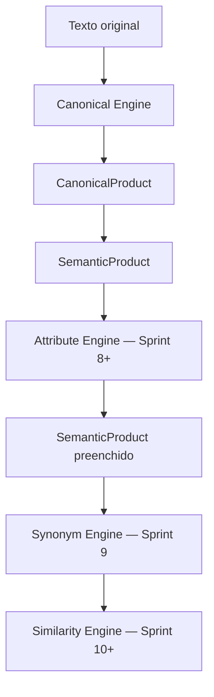

# MIIP — Modelo Semântico

**Sprint 7.2 — Domínio da Fase 2**  
**Status:** Implementado — aguardando aprovação formal

---

## 1. Objetivo

O **Modelo Semântico** define o contrato oficial de representação estruturada de produtos no MIIP. Toda inteligência da Fase 2 (Atributos, Sinônimos, Similaridade, Estatístico) trabalhará sobre este domínio.

Esta sprint **não implementa extração, IA, similaridade ou identificação**. Apenas define os tipos de domínio.

---

## 2. Responsabilidade

| Entidade | Papel |
|----------|-------|
| `SemanticProduct` | Produto semanticamente estruturado |
| `SemanticAttribute` | Atributo individual com confiança e origem |
| `SemanticAttributeType` | Enum oficial de tipos de atributo |
| `SemanticMetadata` | Metadados auxiliares (versão, engine, timestamp) |

---

## 3. Fluxo na Fase 2



```
Canonical Engine
      ↓
CanonicalProduct
      ↓
SemanticProduct (contrato — campos nulos)
      ↓
Attribute Engine (futuro)
      ↓
Synonym Engine (Sprint 9)
      ↓
Similarity Engine (futuro)
```

---

## 4. SemanticProduct

Representa um produto semanticamente estruturado. **Todos os campos iniciam `null`** até serem preenchidos por engines futuros.

### Campos

| Campo | Tipo | Descrição |
|-------|------|-----------|
| `original` | `string\|null` | Texto de entrada |
| `canonico` | `string\|null` | Forma canônica |
| `tipo` | `string\|null` | Tipo de produto (ex.: LAMPADA) |
| `categoria` | `string\|null` | Categoria |
| `subcategoria` | `string\|null` | Subcategoria |
| `marca` | `string\|null` | Marca |
| `modelo` | `string\|null` | Modelo |
| `linha` | `string\|null` | Linha comercial |
| `familia` | `string\|null` | Família de produtos |
| `tecnologia` | `string\|null` | Tecnologia (ex.: FLUORESCENTE) |
| `potencia` | `string\|null` | Potência (ex.: 20W) |
| `tensao` | `string\|null` | Tensão (ex.: 220V) |
| `corrente` | `string\|null` | Corrente elétrica |
| `cor` | `string\|null` | Cor |
| `material` | `string\|null` | Material |
| `acabamento` | `string\|null` | Acabamento |
| `bitola` | `string\|null` | Bitola |
| `diametro` | `string\|null` | Diâmetro |
| `comprimento` | `string\|null` | Comprimento |
| `largura` | `string\|null` | Largura |
| `altura` | `string\|null` | Altura |
| `espessura` | `string\|null` | Espessura |
| `peso` | `string\|null` | Peso |
| `volume` | `string\|null` | Volume |
| `capacidade` | `string\|null` | Capacidade |
| `unidadeMedida` | `string\|null` | Unidade de medida |
| `embalagem` | `string\|null` | Tipo de embalagem |
| `quantidadeEmbalagem` | `number\|null` | Quantidade na embalagem |
| `ncm` | `string\|null` | NCM fiscal |
| `cest` | `string\|null` | CEST fiscal |
| `gtin` | `string\|null` | Código GTIN |
| `tokens` | `string[]\|null` | Tokens canônicos |
| `normalizedTokens` | `CanonicalToken[]\|null` | Tokens tipados |
| `synonyms` | `SynonymMatch[]\|null` | Sinônimos conhecidos |
| `relatedTokens` | `string[]\|null` | Tokens equivalentes |
| `semanticAliases` | `string[]\|null` | Pares `ORIGINAL=SINONIMO` |
| `atributosExtras` | `SemanticAttribute[]\|null` | Atributos extensíveis |
| `metadata` | `SemanticMetadata\|null` | Metadados |

### Exemplo (contrato futuro — preenchimento manual nesta sprint)

**Entrada:** `Lamp. Flor. Philips 20W Cx C/10`

**Canônico:** `LAMPADA FLUORESCENTE PHILIPS 20W CAIXA 10`

**SemanticProduct (ilustrativo):**

```json
{
  "original": "Lamp. Flor. Philips 20W Cx C/10",
  "canonico": "LAMPADA FLUORESCENTE PHILIPS 20W CAIXA 10",
  "tipo": "LAMPADA",
  "marca": "PHILIPS",
  "tecnologia": "FLUORESCENTE",
  "potencia": "20W",
  "embalagem": "CAIXA",
  "quantidadeEmbalagem": 10,
  "categoria": null,
  "subcategoria": null,
  "modelo": null
}
```

> Na Sprint 7.2, a instanciação padrão (`SemanticProduct.create()`) retorna **todos os campos `null`**. O exemplo acima demonstra o contrato que engines futuros preencherão.

---

## 5. SemanticAttribute

| Campo | Tipo | Descrição |
|-------|------|-----------|
| `tipo` | `SemanticAttributeType\|null` | Tipo do atributo |
| `valor` | `string\|number\|null` | Valor bruto |
| `confianca` | `number\|null` | Confiança (0–1) |
| `origem` | `string\|null` | Origem (engine, manual, xml…) |
| `normalizado` | `string\|null` | Valor normalizado |
| `metadata` | `SemanticMetadata\|null` | Metadados |

---

## 6. SemanticAttributeType

| Valor | Uso |
|-------|-----|
| `TIPO` | Tipo de produto |
| `MARCA` | Marca |
| `MODELO` | Modelo |
| `TECNOLOGIA` | Tecnologia |
| `POTENCIA` | Potência |
| `TENSAO` | Tensão |
| `COR` | Cor |
| `MATERIAL` | Material |
| `BITOLA` | Bitola |
| `DIAMETRO` | Diâmetro |
| `PESO` | Peso |
| `VOLUME` | Volume |
| `CAPACIDADE` | Capacidade |
| `EMBALAGEM` | Embalagem |
| `UNIDADE` | Unidade |
| `QUANTIDADE` | Quantidade |
| `NCM` | NCM |
| `CEST` | CEST |
| `GTIN` | GTIN |
| `OUTRO` | Atributo extensível |

---

## 7. SemanticMetadata

| Campo | Tipo | Descrição |
|-------|------|-----------|
| `versao` | `string` | Versão do contrato (padrão `1.0.0`) |
| `origem` | `string\|null` | Origem dos dados |
| `timestamp` | `string\|null` | ISO timestamp |
| `engine` | `string\|null` | Engine que produziu os dados |
| `observacoes` | `string\|null` | Notas livres |

---

## 8. Uso

```javascript
const SemanticProduct = require('./core/SemanticProduct');
const SemanticAttribute = require('./core/SemanticAttribute');
const SemanticAttributeType = require('./core/SemanticAttributeType');

// Contrato vazio — todos os campos null
const produto = SemanticProduct.create();

// Validação estrutural do contrato
const { valido, campos, ausentes } = SemanticProduct.validarEstrutura(produto);

// Serialização
const json = produto.toJSON();
```

---

## 9. Limitações (Sprint 7.2)

| Limitação | Comportamento |
|-----------|---------------|
| Extração de atributos | **Não implementada** |
| Preenchimento automático | **Não implementado** |
| Integração com Canonical | **Não implementada** (Sprint 8) |
| Validação de valores | Apenas estrutural (presença de campos) |
| Persistência | **Não implementada** |

---

## 10. Testes

```bash
npm run test:miip-semantico
```

**18 casos** cobrindo:

- Instanciação com campos nulos
- Serialização `toJSON()`
- Validação estrutural (`validarEstrutura`)
- Compatibilidade com `CanonicalToken` e `SemanticAttribute`
- Ausência de lógica proibida (SQL, IA, similaridade)
- Exemplo documentado da lâmpada Philips

---

## 11. Critérios de aceite

- [x] Domínio semântico completamente definido
- [x] Nenhuma lógica de negócio
- [x] Nenhuma inteligência ou algoritmo
- [x] Campos inicialmente nulos
- [x] Testes de contrato
- [x] Documentação e diagrama de fluxo

---

**Documento preparado para aprovação.**
