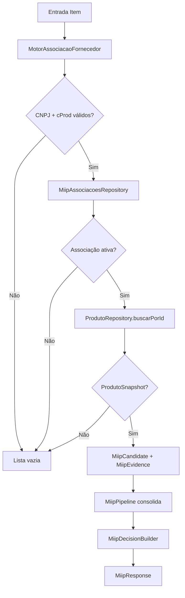

# MIIP — Motor Associação por Fornecedor (Sprint 4)

> **MIIP V1.0 RC1** — Documentação congelada. Pipeline oficial com 6 motores. Ver [ARQUITETURA_MIIP.md](./ARQUITETURA_MIIP.md).


Segundo engine oficial do MIIP. Reconhece produtos pelo histórico do fornecedor (CNPJ + cProd).

## Fluxo completo

```
MiipService.identificar()
        ↓
MiipPipeline
        ↓
MotorGTIN (prioridade 10)
        ↓
MotorAssociacaoFornecedor (prioridade 20)
        ↓
MiipAssociacoesRepository.buscarPorFornecedorCodigo()
        ↓
ProdutoRepository.buscarPorId()
        ↓
ProdutoSnapshot
        ↓
MiipCandidate + MiipEvidence
        ↓
MiipDecisionBuilder
        ↓
MiipResponse
```

## Diagrama



## Responsabilidade única (SRP)

| Faz | Não faz |
|-----|---------|
| Normaliza CNPJ e cProd | Consultar GTIN ou nome |
| Consulta `miip_associacoes` via repository | Executar SQL |
| Carrega `ProdutoSnapshot` via `ProdutoRepository` | Criar/alterar associações |
| Monta candidato com evidências | Aprendizado automático |
| Retorna `MiipCandidate[]` | Decisão final (Pipeline) |

## Registro no MotorRegistry

| Campo | Valor |
|-------|-------|
| `codigo` | `motor_associacao_fornecedor` |
| `ativo` | `true` |
| `prioridade` | `20` (imediatamente após GTIN = 10) |

## Exemplo de entrada

```json
{
  "fornecedorCnpj": "12.345.678/0001-99",
  "codigoFornecedor": "PROD-001",
  "produtoNome": "Arroz Integral 5kg",
  "contexto": {
    "origem": "xml",
    "operacaoId": "import-001"
  }
}
```

## Exemplo de saída (associação encontrada)

```json
{
  "decisao": {
    "acao": "auto_vincular",
    "confianca": "ALTA",
    "melhorCandidato": {
      "produtoId": 50,
      "snapshot": {
        "id": 50,
        "codigo": "ARROZ-INT-5KG",
        "nome": "Arroz Integral 5kg"
      },
      "scoreTotal": 100,
      "evidencias": [
        {
          "motor": "motor_associacao_fornecedor",
          "tipo": "associacao_fornecedor",
          "descricao": "Associação ativa encontrada em miip_associacoes",
          "valor": 1
        }
      ],
      "motoresQueVotaram": ["motor_associacao_fornecedor"]
    }
  },
  "enginesExecutados": ["motor_gtin", "motor_associacao_fornecedor"]
}
```

## Logs registrados

| Campo | Descrição |
|-------|-----------|
| `motor` / `engine` | `motor_associacao_fornecedor` |
| `fornecedorCnpj` | CNPJ normalizado |
| `codigoFornecedor` | cProd normalizado |
| `produtoId` | ID encontrado ou null |
| `duracaoMs` / `tempoMs` | Tempo de execução |

## Testes

```bash
npm run test:miip-associacao-fornecedor   # Unitários
npm run test:miip-fornecedor-pipeline     # E2E Pipeline
npm run test:miip                         # Suite completa
```

## Arquivos

| Arquivo | Papel |
|---------|-------|
| `engines/fornecedor/MotorAssociacaoFornecedor.js` | Engine principal |
| `engines/MotorAssociacaoFornecedor.js` | Shim de compatibilidade |
| `repositories/MiipAssociacoesRepository.js` | Consulta `miip_associacoes` |
| `repositories/ProdutoRepository.js` | Carrega `ProdutoSnapshot` |
