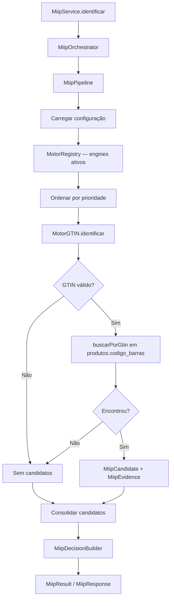

# MIIP — Motor GTIN (Sprint 3)

Primeiro engine funcional do MIIP. Padrão de referência para todos os engines futuros.

## Fluxo completo

```
MiipService.identificar()
        ↓
MiipOrchestrator.executar()  →  delega ao Pipeline
        ↓
MiipPipeline.executar()
        ↓
MotorRegistry.listarAtivos()
        ↓
MiipPipelineEngineRunner (engineExecutor)
        ↓
MotorGTIN.identificar()
        ↓
ProdutoRepository.buscarPorGtin()
        ↓
MiipCandidate + MiipEvidence
        ↓
MiipDecisionBuilder.build()
        ↓
MiipResult → MiipResponse
```

## Diagrama



## Responsabilidade única (SRP)

| Faz | Não faz |
|-----|---------|
| Normaliza GTIN (`normalizarGtin`) | Consultar fornecedor |
| Busca em `produtos.codigo_barras` | Buscar por nome/descrição |
| Monta `MiipEvidence` e `MiipCandidate` | Similaridade, histórico, IA |
| Retorna candidatos via `identificar()` | Decisão final (Pipeline) |

## Registro no MotorRegistry

| Campo | Valor |
|-------|-------|
| `codigo` | `motor_gtin` |
| `ativo` | `true` |
| `prioridade` | `10` (menor = executa primeiro — conforme `ARQUITETURA_MIIP.md`) |

> **Nota:** O prompt da Sprint 3 cita prioridade `100`. A arquitetura aprovada define **menor número = primeiro**. Mantido `10` para GTIN executar antes de outros motores.

## Exemplo de entrada

```json
{
  "codigoBarras": "7891234567890",
  "produtoNome": "Arroz 5kg",
  "contexto": {
    "origem": "api",
    "operacaoId": "op-001"
  }
}
```

## Exemplo de saída (GTIN encontrado — produto ativo)

```json
{
  "decisao": {
    "acao": "auto_vincular",
    "confianca": "ALTA",
    "melhorCandidato": {
      "produtoId": 10,
      "scoreTotal": 100,
      "evidencias": [
        {
          "motor": "motor_gtin",
          "tipo": "gtin_exato",
          "descricao": "GTIN localizado em produtos.codigo_barras",
          "peso": 100,
          "valor": "7891234567890",
          "score": 100
        }
      ],
      "motoresQueVotaram": ["motor_gtin"]
    },
    "regrasAplicadas": true
  },
  "score": { "valor": 100, "gap": null },
  "enginesExecutados": ["motor_gtin"]
}
```

## Exemplo de saída (GTIN ausente)

```json
{
  "decisao": {
    "acao": "criar_novo",
    "confianca": "NENHUMA",
    "melhorCandidato": null,
    "motivo": "sem_candidatos"
  },
  "candidatos": [],
  "enginesExecutados": ["motor_gtin"]
}
```

## Logs e métricas

Cada execução do motor registra:

| Canal | Campos |
|-------|--------|
| `MiipMetricsCollector` | motor, duração, encontrado, erro |
| `MiipMotorLogService` | motor, item, resultado, duração, erro |
| `MiipPipelineMetricsCollector` | requestId, duração total, engines, candidatos |

## Arquivos

| Arquivo | Papel |
|---------|-------|
| `engines/gtin/MotorGTIN.js` | Engine principal |
| `engines/MotorGTIN.js` | Shim de compatibilidade |
| `repositories/ProdutoRepository.js` | Lookup GTIN — única fonte SQL |
| `core/ProdutoSnapshot.js` | Snapshot do produto no candidato |
| `utils/normalizarGtin.js` | Validação EAN-8/12/13/14 |
| `core/MiipPipelineFactory.js` | Composição Pipeline + Registry |
| `core/MiipPipelineEngineRunner.js` | Execução via Registry |
| `core/MiipDecisionBuilder.js` | Regras de decisão centralizadas |

## Testes

```bash
npm run test:miip-gtin           # Unitários do motor
npm run test:miip-gtin-pipeline  # E2E Service → Pipeline → GTIN
npm run test:miip                # Suite completa MIIP
```

## Preparado para reutilização

O motor é agnóstico à origem. O mesmo `MotorGTIN` atende:

- XML (via `MiipService` + `ItemIdentificavelDTO`)
- Excel (futuro importador → `identificar()`)
- API (`POST /miip/identificar-lote`)
- Marketplace (futuro adapter)
- MIIP Cloud (futuro gateway)
