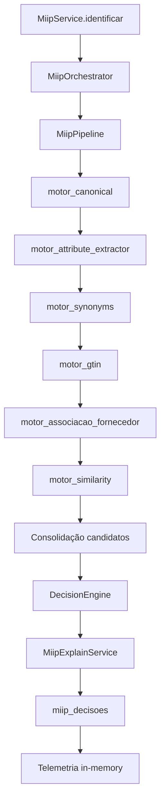

# MIIP V1.0 RC1 — Release Notes

**Versão:** `1.0.0-rc1`  
**Data:** 2026-07-05  
**Tipo:** Release Candidate (congelamento arquitetural)  
**Sprint:** RC1 — Consolidação Final

---

## Sumário executivo

O MIIP V1.0 RC1 consolida o Motor Inteligente de Identificação de Produtos após 14 sprints de implementação e auditoria arquitetural. Esta release **não adiciona funcionalidades** — apenas documentação, health, scripts, benchmark e marcação de itens deprecados.

**Decisão de auditoria pré-RC1:** APROVADO COM RESSALVAS (dívida técnica documentada abaixo).

---

## Arquitetura final

- **Fachada única:** `MiipService`
- **Pipeline:** `MiipOrchestrator` → `MiipPipeline` → `MotorRegistry`
- **Decisão centralizada:** `DecisionEngine` via `MiipDecisionBuilder`
- **Explicabilidade:** `MiipExplainService`
- **Aprendizado:** `MiipLearningService` (fora do pipeline, confirmação explícita)
- **Documentação:** [`ARQUITETURA_MIIP.md`](./ARQUITETURA_MIIP.md)

---

## Pipeline oficial RC1

| # | Motor | Prioridade |
|---|-------|------------|
| 1 | `motor_canonical` | 10 |
| 2 | `motor_attribute_extractor` | 20 |
| 3 | `motor_synonyms` | 30 |
| 4 | `motor_gtin` | 40 |
| 5 | `motor_associacao_fornecedor` | 50 |
| 6 | `motor_similarity` | 60 |

Pós-engines: consolidação → Decision → Explain → `miip_decisoes` → telemetria in-memory.

---

## Motores

| Motor | Status RC1 |
|-------|------------|
| Canonical | ✅ Ativo |
| Attribute Extractor | ✅ Ativo |
| Synonyms | ✅ Ativo (JSON) |
| GTIN | ✅ Ativo |
| Associação Fornecedor | ✅ Ativo |
| Similarity | ✅ Ativo |
| fiscal, historico, estatistica, comercial | 📁 Scaffold (futuro) |

---

## Integrações (inalteradas nesta release)

| Módulo | Contrato |
|--------|----------|
| Compras | `MiipService`, `enriquecerParseComMiip` |
| Central Inteligente | `enriquecerParseComMiip`, `miipCentralRevisaoUtils` |
| Parser NF-e | `NFeParserService` → seam `enriquecerParseComMiip` |
| API | `/api/miip/identificar-lote`, `/feedback`, `/health` |

---

## Health RC1 (`GET /api/miip/health`)

Resposta somente leitura com:

- `statusGeral` — `ok` | `degradado` | `indisponivel`
- `componentes.pipeline` — pipeline inicializado
- `componentes.registry` — `MotorRegistry` (total, ativos, metadados)
- `componentes.engines` — motores carregados no pipeline
- `componentes.decisionEngine` / `explain` / `learning`
- `componentes.banco` — conectividade SQLite + `tempoMedioMs` histórico
- `componentes.telemetria` — execuções in-memory (`MiipTelemetryService`)
- `versao`: `1.0.0-rc1`
- `pronto`: consolidação de todos os componentes

---

## Fluxograma RC1



---

## Dependências

| Pacote / módulo | Uso |
|-----------------|-----|
| `sqlite3` / `database.js` | Persistência `miip_decisoes`, configurações |
| `express` | Rotas `/api/miip/*` |
| Node.js `fs` / `path` | Dicionários sinônimos JSON, health filesystem |
| `NFeParserService` | Seam `enriquecerParseComMiip` (Compras/Central) |

Sem dependências externas de ML ou serviços cloud no RC1.

---

## Benchmark oficial

```bash
npm run test:miip-benchmark-rc1
```

Cenários: **10, 50, 100, 200** itens.  
Relatório: [`MIIP_RC1_BENCHMARK.md`](./MIIP_RC1_BENCHMARK.md)

Métricas: tempo total, média por item, throughput, memória, motores executados, tempo médio por engine.

---

## Testes

```bash
npm run test:miip                 # 17 suítes
npm run test:miip-readiness       # Validadores arquitetura
npm run test:miip-readiness-full  # Gera MIIP_READINESS_REPORT.md
npm run test:miip-readiness-final # Benchmark + audit
```

---

## Limitações conhecidas (RC1)

1. **API `/identificar-lote`** expõe na UI apenas motores GTIN + Fornecedor; pipeline interno executa os 6 motores.
2. **Telemetria** in-memory — não persiste histórico operacional em tabela dedicada.
3. **Processamento em lote** sequencial (sem paralelismo).
4. **Sinônimos** via JSON estático — tabela `miip_sinonimos` não integrada ao motor.
5. **Pastas scaffold** (`engines/fiscal/`, etc.) sem implementação.

---

## Dívidas técnicas aceitas para RC1

| Item | Severidade | Plano pós-RC1 |
|------|------------|---------------|
| `MiipSinonimosRepository` não usado | Média | Integrar ou remover em GA |
| `MiipEstatisticasRepository` não usado | Média | Integrar ou remover em GA |
| Drift API vs pipeline semântico | Média | Documentar na UI ou expor motores |
| `MiipDiagnosticService` fora do health HTTP legado | Baixa | Opcional em GA |
| Limite de itens em `identificar-lote` | Baixa | Configurável em GA |
| Benchmark sequencial | Baixa | Pool controlado em GA |

---

## Itens deprecados

| Artefato | Motivo |
|----------|--------|
| `MiipSinonimosRepository` | Motor Synonyms usa `SynonymDictionary` (JSON). Reservado para futura evolução do MIIP V2. |
| `MiipEstatisticasRepository` | Agregados via `MiipDecisoesRepository`. Reservado para futura evolução do MIIP V2. |

Arquivos **mantidos** — não removidos nesta release.

---

## Melhorias previstas para MIIP V2

1. Persistência de telemetria operacional
2. Integração `miip_sinonimos` com motor Synonyms
3. Limite configurável de lote na API
4. Health com `MiipDiagnosticService.executar()` resumido
5. Paralelização controlada em importação XML
6. Exposição de motores semânticos na UI de sugestão
7. MIIP Cloud (opt-in, contrato DTO estável)

---

## Confirmação de escopo RC1

| Regra | Status |
|-------|--------|
| Novos motores | ❌ Não |
| Alteração de pipeline | ❌ Não |
| Alteração DecisionEngine | ❌ Não |
| Alteração Explain | ❌ Não |
| Alteração Learning | ❌ Não |
| Alteração integração Central | ❌ Não |
| Documentação atualizada | ✅ Sim |
| Scripts corrigidos | ✅ Sim |
| Health aprimorado | ✅ Sim |
| Benchmark executado | ✅ Via `npm run test:miip-benchmark-rc1` |
| Testes existentes | ✅ Devem passar sem alteração de comportamento |

---

**Parecer:** APROVADO PARA CONGELAMENTO RC1 — após `npm run test:miip` e benchmark documentado.
