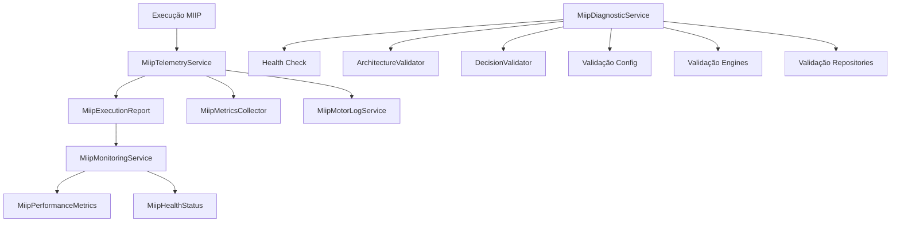

# MIIP — Observabilidade e Telemetria

**Sprint 14 — Encerramento MIIP V1.0**  
**Status:** Implementado — aguardando aprovação formal

---

## 1. Objetivo

Criar a camada de observabilidade do MIIP. Todo processamento gera métricas, todo erro é rastreável e toda decisão é auditável — **sem alterar regras de negócio**.

---

## 2. Arquitetura



---

## 3. Componentes

| Arquivo | Responsabilidade |
|---------|------------------|
| `services/MiipTelemetryService.js` | Registra execuções, tempos, motores, decisões |
| `services/MiipMonitoringService.js` | Tempo médio/máximo, erros, configs |
| `services/MiipDiagnosticService.js` | Health check completo |
| `core/MiipExecutionReport.js` | Relatório por execução |
| `core/MiipHealthStatus.js` | Estados OK / WARNING / ERROR |
| `core/MiipPerformanceMetrics.js` | Métricas agregadas |

---

## 4. MiipTelemetryService

### Registra

| Campo | Descrição |
|-------|-----------|
| `requestId` | Identificador único |
| `enginesExecutados` | Motores que rodaram |
| `tempoPorEngine` | Tempo individual por motor |
| `tempoTotal` | Tempo total da execução |
| `quantidadeCandidatos` | Candidatos produzidos |
| `scoreFinal` | Score consolidado |
| `decisao` | Ação decidida |
| `explicacao` | MiipExplanation |
| `warnings` / `errors` | Alertas e falhas |
| `health` | OK / WARNING / ERROR |

### Uso

```javascript
const MiipTelemetryService = require('./services/MiipTelemetryService');

const telemetry = new MiipTelemetryService();
const requestId = telemetry.iniciarExecucao();

telemetry.registrarEngine(requestId, {
  motor: 'motor_gtin',
  tempoMs: 42,
  encontrado: true
});

const report = telemetry.finalizarExecucao(requestId, {
  tempoTotal: 50,
  decisao: 'AUTO_ASSOCIAR',
  scoreFinal: 100,
  quantidadeCandidatos: 1,
  explicacao: { titulo: 'Produto identificado automaticamente.' }
});

console.log(report.toJSON());
```

---

## 5. MiipMonitoringService

Analisa telemetria e métricas:

- Tempo médio, máximo e mínimo
- Motores com erro
- Motores desativados no registry
- Falhas de configuração JSON

---

## 6. MiipDiagnosticService

Executa:

1. Health Check estrutural (Sprint 13 validators)
2. Validação de configuração
3. Validação de engines obrigatórios
4. Validação de repositories
5. Monitoramento operacional

```javascript
const diag = new MiipDiagnosticService();
const health = diag.healthCheck();
// { status: 'OK', saudavel: true, resumo: {...} }
```

---

## 7. MiipExecutionReport

Campos obrigatórios por execução:

- `requestId`, `tempoTotal`, `enginesExecutados`
- `decisao`, `nivelConfianca`, `explicacao`
- `health`, `warnings`, `errors`

---

## 8. Logs

Integração com `MiipMotorLogService`:

- Cada motor registrado gera log
- Finalização gera evento `execucao_finalizada`
- Erros e timeouts são persistidos no buffer

---

## 9. Restrições

- **Não altera** ERP, Compras, XML, Motores, Similarity, Decision, Explain, Aprendizado
- **Não altera** regras de negócio
- Camada puramente observacional

---

## 10. Testes

```bash
npm run test:miip-telemetry
```

| Categoria | Casos |
|-----------|-------|
| DTOs (Health, Metrics, Report) | 6 |
| Telemetry (execução, erro, timeout) | 10 |
| Monitoring e Diagnostic | 8 |
| Performance e logs | 10 |
| Falhas e health | 8 |
| **Total** | **42** |

---

## 11. MIIP V1.0 — Encerramento

Com a Sprint 14, o **MIIP V1.0** está completo:

| Sprint | Entrega |
|--------|---------|
| 7–9 | Canonical, Semântico, Attribute, Synonym |
| 10 | Similarity Engine |
| 11 | Decision Engine |
| 12 | Explain Service |
| 13 | Calibração e Readiness |
| 14 | Telemetria e Observabilidade |

---

**Documento preparado para aprovação da Sprint 14 — MIIP V1.0.**
