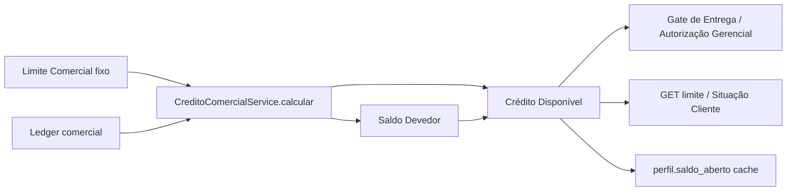
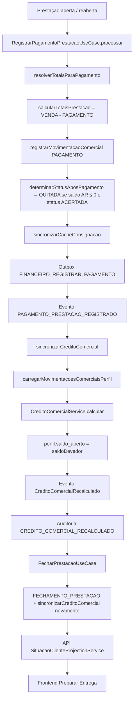
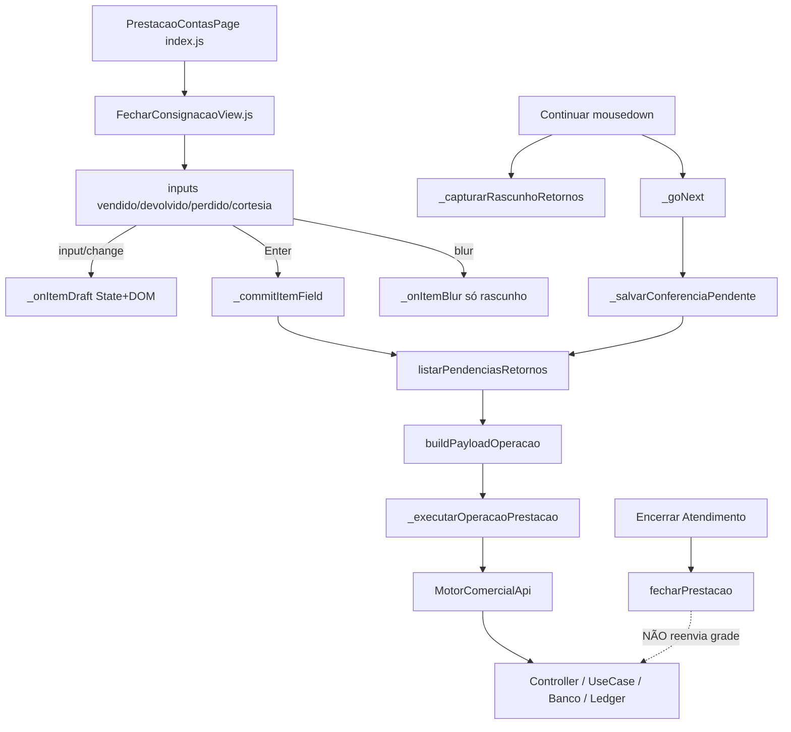
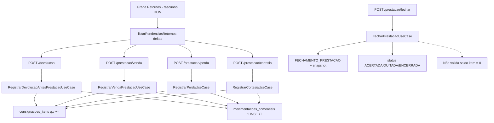
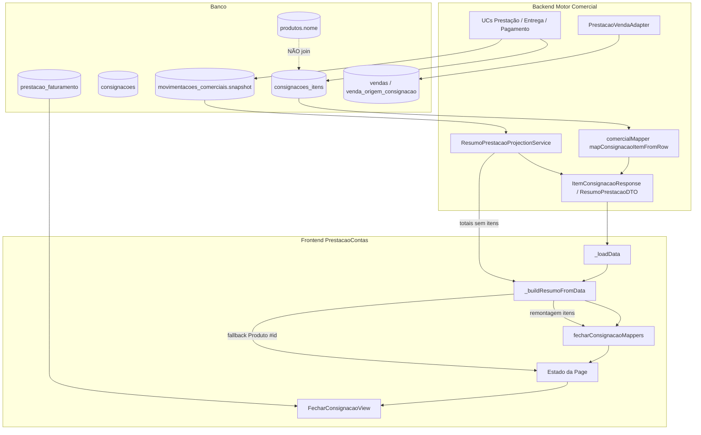
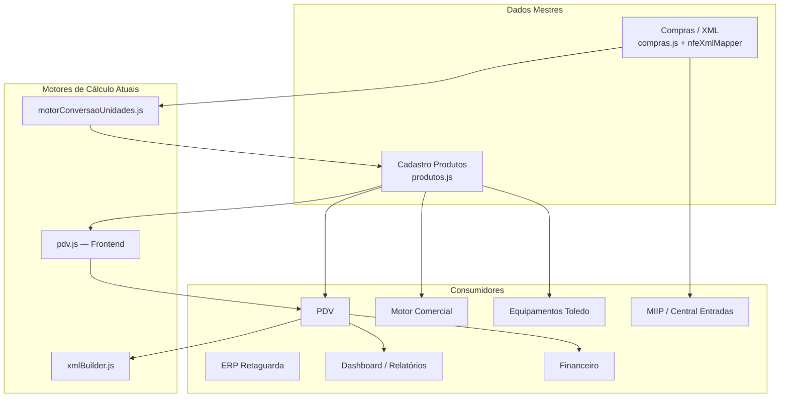

# Arquivo — Auditorias Comerciais

> Compilado gerado na limpeza RC1 (unificação). Fontes originais preservadas no histórico git.

## Sumário

- [AUDITORIA_APPEND_ONLY_LEDGER.md](#auditoria-append-only-ledger)
- [AUDITORIA_CADASTRO_CLIENTES_S-3.1.md](#auditoria-cadastro-clientes-s-3-1)
- [AUDITORIA_COMERCIAL_BUSCA_PRODUTOS.md](#auditoria-comercial-busca-produtos)
- [AUDITORIA_COMPLETA_MOTOR_COMERCIAL.md](#auditoria-completa-motor-comercial)
- [AUDITORIA_CREDITO_COMERCIAL_ENTERPRISE.md](#auditoria-credito-comercial-enterprise)
- [AUDITORIA_ENDPOINT_PAGAMENTO.md](#auditoria-endpoint-pagamento)
- [AUDITORIA_FINAL_INTEGRIDADE_PRESTACAO.md](#auditoria-final-integridade-prestacao)
- [AUDITORIA_FINAL_MOTOR_COMERCIAL.md](#auditoria-final-motor-comercial)
- [AUDITORIA_FORENSE_CREDITO_POS_QUITACAO.md](#auditoria-forense-credito-pos-quitacao)
- [AUDITORIA_FORENSE_GRADE_PRESTACAO.md](#auditoria-forense-grade-prestacao)
- [AUDITORIA_FORENSE_ORIGENS_DA_VENDA.md](#auditoria-forense-origens-da-venda)
- [AUDITORIA_FORENSE_PRESTACAO_PERSISTENCIA.md](#auditoria-forense-prestacao-persistencia)
- [AUDITORIA_FORENSE_PRESTACAO_STAB06_5.md](#auditoria-forense-prestacao-stab06-5)
- [AUDITORIA_MOTOR_BALANCAS.md](#auditoria-motor-balancas)
- [AUDITORIA_POLITICA_LIQUIDACAO_ESTOQUE_RESIDUAL.md](#auditoria-politica-liquidacao-estoque-residual)
- [AUDITORIA_PRICING_ENGINE.md](#auditoria-pricing-engine)
- [AUDITORIA_RECUPERACAO_OPERACIONAL.md](#auditoria-recuperacao-operacional)
- [AUDITORIA_RFC03_RECOVERY.md](#auditoria-rfc03-recovery)
- [AUDITORIA_S-5.2_MOTOR_COMERCIAL.md](#auditoria-s-5-2-motor-comercial)
- [AUDITORIA_STAB04.md](#auditoria-stab04)
- [AUDITORIA_STAB06_3_2.md](#auditoria-stab06-3-2)
- [AUDITORIA_STAB06_3.md](#auditoria-stab06-3)
- [AUDITORIA_STAB06.md](#auditoria-stab06)

---

<a id="auditoria-append-only-ledger"></a>

## Fonte: `AUDITORIA_APPEND_ONLY_LEDGER.md`

## Auditoria Forense — Append-Only do Ledger Comercial

**Status:** Concluída  
**Severidade:** P0  
**Data:** 2026-07-13  
**Sintoma:** `SQLITE_CONSTRAINT` / `movimentacoes_comerciais é append-only` durante  
`POST /api/comercial/consignacoes/:id/prestacao/pagamento`

---

## Resumo Executivo

| Pergunta | Resposta |
|----------|----------|
| **Quem tentou alterar a tabela?** | `MovimentacaoComercialRepository.atualizarGrupoPrestacaoContasId` |
| **Por quê?** | Heal de “movimentações órfãs” introduzido na correção do 400 de pagamento (reancoragem de `grupo_prestacao_contas_id`) |
| **Qual operação?** | `UPDATE movimentacoes_comerciais SET grupo_prestacao_contas_id = ? WHERE id = ?` |
| **Deveria existir?** | **Não.** Violação arquitetural P0 |
| **Erro arquitetural?** | **Sim.** Ledger Comercial é oficialmente append-only |

O trigger SQLite `trg_mov_comerciais_no_update` abortou corretamente a mutação.  
A falha em cascata gerava HTTP 400 no pagamento.

---

## Fluxo SQL (ordem do incidente)

```
BEGIN (UnitOfWork)
  SELECT consignacao ...
  SELECT movimentacoes_comerciais WHERE consignacao_id = ? AND grupo_prestacao_contas_id = <grupo_ativo>
  SELECT movimentacoes_comerciais WHERE consignacao_id = ?   -- ledger completo
  UPDATE movimentacoes_comerciais                            -- ❌ ABORT
    SET grupo_prestacao_contas_id = <grupo_ativo>
    WHERE id = <venda_orfa>
  → RAISE(ABORT, 'movimentacoes_comerciais é append-only')
ROLLBACK
→ PersistenciaError → HTTP 400
```

**Nenhum INSERT de PAGAMENTO chegou a ocorrer** nesse caminho.

---

## Auditoria do Banco

### Triggers em `movimentacoes_comerciais`

| Trigger | Evento | Efeito |
|---------|--------|--------|
| `trg_mov_comerciais_origem_check` | BEFORE INSERT | Valida `origem` |
| **`trg_mov_comerciais_no_update`** | **BEFORE UPDATE** | **`RAISE(ABORT, 'movimentacoes_comerciais é append-only')`** |
| **`trg_mov_comerciais_no_delete`** | **BEFORE DELETE** | **`RAISE(ABORT, 'movimentacoes_comerciais é append-only')`** |

Fonte: `backend/motores/motor-comercial/migrations/007_constraints.js` (linhas ~88–103).

### Constraints / CHECK

- FK: `consignacao_id`, `consignacao_item_id`, `usuario_id`
- Sem CHECK de negócio além dos triggers de origem/status
- **Append-only garantido por trigger, não por remoção da API**

### Quem dispara / quando / por qual operação

| Campo | Valor |
|-------|-------|
| Dispara | Qualquer `UPDATE`/`DELETE` na tabela |
| Quando | Antes da mutação física |
| Operação que acionou | `atualizarGrupoPrestacaoContasId` no fluxo de pagamento |

---

## Stack completa (responsável)

```
POST /prestacao/pagamento
  ConsignacaoController.registrarPagamento
    RegistrarPagamentoPrestacaoUseCase.processar
      resolverTotaisParaPagamento
        reancorarMovimentacoesOrfasAoGrupo          ← origem lógica
          MovimentacaoComercialRepository
            .atualizarGrupoPrestacaoContasId        ← origem SQL
              UPDATE movimentacoes_comerciais ...
                trg_mov_comerciais_no_update        ← abort correto
```

| Camada | Arquivo | Linha / símbolo |
|--------|---------|-----------------|
| Controller | `controllers/ConsignacaoController.js` | `registrarPagamento` |
| Use Case | `usecases/consignacao/RegistrarPagamentoPrestacaoUseCase.js` | `processar` |
| Helper | `usecases/consignacao/prestacaoOperacaoHelpers.js` | `reancorarMovimentacoesOrfasAoGrupo` |
| Repository | `repositories/MovimentacaoComercialRepository.js` | `atualizarGrupoPrestacaoContasId` |
| SQL | `UPDATE ... SET grupo_prestacao_contas_id = ? WHERE id = ?` | — |
| Trigger | `migrations/007_constraints.js` | `trg_mov_comerciais_no_update` |

---

## Fluxo do Ledger

```
Venda (INSERT VENDA_PRESTACAO)     ✅ append-only
  ↓
Pagamento (INSERT PAGAMENTO)      ✅ esperado
  ↓
[Heal órfãos] UPDATE grupo_id     ❌ P0 — violação
  ↓
Trigger ABORT
```

Pontos que **tentavam** editar histórico:

| Ação | Existia? | Classificação |
|------|----------|---------------|
| Editar lançamento | Sim (`atualizarGrupo…`) | **P0** |
| Atualizar saldo no ledger | Não (saldo é cache em `perfil`/`consignacao`) | OK |
| Corrigir valor | Não | — |
| Mudar grupo via UPDATE | **Sim** | **P0** |
| Alterar data | Não | — |
| Remover lançamento | Não | — |

---

## Fluxo da Conta Corrente

```
Pagamento → registrarMovimentacaoComercial → INSERT ✅
```

Pagamento **não** altera lançamento existente de venda.  
O UPDATE indevido era só o heal de grupo, não o pagamento em si.

Cache `perfil.saldo_aberto` / `consignacao.*` via `UPDATE` em entidades mutáveis: **permitido** (não é ledger).

---

## Fluxo da Consignação / Recovery

| Componente | UPDATE no ledger? |
|------------|-------------------|
| Recovery Framework (FE) | Não |
| `sincronizarCreditoComercial` | Não (atualiza perfil) |
| `AbrirPrestacao` reclaim | Não (atualiza `prestacaoContasAtiva` na consignação) |
| **Reancoragem órfã (P0 pagamento)** | **Sim — causa raiz** |

---

## Arquitetura oficial (confirmada)

> Ledger Comercial = **Append Only**  
> Correção = **novo lançamento compensatório (INSERT)**  
> Nunca UPDATE. Nunca DELETE.

Documentação alinhada: `docs/PERSISTENCIA.md`, `docs/LEDGER_SINGLE_SOURCE_OF_TRUTH.md`, ADR ledger.

---

## Causa raiz

A sprint de correção do HTTP 400 (vendas em grupo órfão) introduziu `atualizarGrupoPrestacaoContasId` para “mover” vendas ao grupo ativo.  
Isso **reescreve histórico** e viola append-only. O trigger oficial da plataforma bloqueou corretamente.

---

## Correção aplicada (origem, sem workaround)

1. **Removido** o `UPDATE` real no repository (método vira guarda que loga `LEDGER` + lança `LEDGER_APPEND_ONLY_VIOLATION`).
2. **`reancorarMovimentacoesOrfasAoGrupo`** não executa mais UPDATE — lança erro se chamado.
3. **Heal correto:** `apontarPrestacaoAtivaParaGrupoRecuperavel`  
   - atualiza apenas o **ponteiro** `consignacoes.prestacaoContasAtiva` (entidade mutável)  
   - ledger permanece intacto  
   - pagamento faz **INSERT** no grupo recuperado.
4. Fallback: totais pela Conta Corrente da consignação (`Σ VENDA − Σ PAGAMENTO`) sem mutar ledger.
5. Instrumentação: log `==================== LEDGER ====================` antes de qualquer tentativa de UPDATE/DELETE no repository.

**Não** desabilitamos trigger.  
**Não** removemos constraint.  
**Não** alteramos histórico.

---

## Impacto

| Antes | Depois |
|-------|--------|
| Pagamento abortava com SQLITE_CONSTRAINT | Pagamento recupera ponteiro / AR e faz INSERT |
| Histórico seria reescrito | Histórico preservado |
| Trigger silencioso para o operador | Log LEDGER + erro tipado se alguém tentar mutar de novo |

---

## Critério final

✓ Nenhuma movimentação comercial sofre UPDATE/DELETE  
✓ Correção operacional via ponteiro de consignação + INSERT de pagamento  
✓ Trigger append-only permanece oficial e ativo  


---

<a id="auditoria-cadastro-clientes-s-3-1"></a>

## Fonte: `AUDITORIA_CADASTRO_CLIENTES_S-3.1.md`

## Sprint S-3.1 — Relatório de Auditoria Enterprise: Cadastro de Clientes

**Data:** 2026-07-08  
**Escopo:** Ciclo completo Cadastro → Validação → Persistência → Relacionamentos → Projeções → Listagens → Edição → Exclusão  
**Modo:** Auditoria somente leitura — **nenhuma correção aplicada**

---

## 1. Resumo executivo

O cadastro mestre de clientes existe **apenas no ERP** (`/api/clientes`), implementado como rota monolítica sem camada de domínio. O Motor Comercial **não cadastra clientes** — apenas cria **Perfis Comerciais** vinculados a clientes ERP existentes e consome projeções.

Os problemas de persistência e exibição têm **causa raiz estrutural**: dois domínios de crédito/limite independentes, ausência de enriquecimento da API de perfil com dados do cadastro ERP, stubs de atualização no backend comercial, e mapeamentos incorretos no gateway de plataforma.

| Área | Status |
|------|--------|
| Persistência ERP (campos do formulário) | ✅ Grava corretamente (exceto coluna legada `endereco`) |
| Persistência Perfil Comercial | ⚠️ Parcial — `observacoes` no PUT não persiste |
| Relacionamentos | ⚠️ Integridade parcial — DELETE ERP não valida vínculos comerciais |
| APIs | ⚠️ Inconsistências POST vs PUT, DTOs informais |
| Frontend ERP | ✅ Funcional com bugs menores de UX |
| Frontend Comercial | ❌ Listagem/360° com dados incompletos |
| Projeções | ⚠️ Conta Corrente incompatível com Cliente 360 |
| Listagens vs consulta | ❌ Informações divergentes entre ERP e Comercial |

---

## 2. Arquitetura auditada

```
┌─────────────────────────────────────────────────────────────────┐
│  ERP Frontend (clientes.js / PDV clientes.js)                   │
│  POST/PUT/GET/DELETE → /api/clientes                            │
└────────────────────────────┬────────────────────────────────────┘
                             ▼
┌─────────────────────────────────────────────────────────────────┐
│  backend/rotas/clientes.js  →  SQLite: clientes                 │
└────────────────────────────┬────────────────────────────────────┘
                             │
         ┌───────────────────┼───────────────────┐
         ▼                   ▼                   ▼
  contas_receber         vendas          perfil_comercial
  (fiado ERP)                           consignacoes
         │                   │                   │
         └───────────────────┴───────────────────┘
                             ▼
┌─────────────────────────────────────────────────────────────────┐
│  Motor Comercial: ClientePlatformGateway (read-only)           │
│  Perfil Comercial CRUD + 12 Projection Services               │
└────────────────────────────┬────────────────────────────────────┘
                             ▼
┌─────────────────────────────────────────────────────────────────┐
│  Frontend PerfilComercial (Central 360°)                        │
└─────────────────────────────────────────────────────────────────┘
```

---

## 3. Persistência

### 3.1 Tabela `clientes` (ERP)

**Arquivo:** `backend/database.js` (linhas 1357–1374)

| Coluna | Gravada no POST/PUT? | Exibida no frontend? |
|--------|----------------------|----------------------|
| `nome` | ✅ Obrigatória | ✅ |
| `cpf_cnpj` | ✅ | ✅ |
| `telefone` | ✅ | ✅ |
| `email` | ✅ | ✅ |
| `cep`, `rua`, `numero`, `bairro`, `cidade`, `uf` | ✅ | ✅ Form + detalhe |
| `limite_credito` | ✅ | ✅ |
| `credito_atual` | INSERT=0; atualizado por vendas/financeiro | ✅ Somente leitura |
| `created_at` | Auto | ✅ Somente detalhe |
| `endereco` (legado TEXT) | ❌ **Nunca escrita** | ❌ |

**Arquivo de rotas:** `backend/rotas/clientes.js`

### 3.2 Perfil Comercial

**Tabela:** `perfil_comercial` — **Arquivo:** `backend/motores/motor-comercial/migrations/001_perfil_comercial.js`

| Campo UI (Novo/Editar Perfil) | API | Persistido? |
|-------------------------------|-----|-------------|
| `clienteId` | POST | ✅ |
| `perfilTipo` | POST | ✅ |
| `limiteComercial` | POST / PATCH limite | ✅ |
| `observacoes` | POST | ✅ |
| `observacoes` | PUT | ❌ **Stub ignora** |
| `ativo` | PUT | ✅ (via ativar/inativar) |
| `motivo` (bloqueio) | PATCH bloquear | ❌ **Frontend não envia** |

**Causa raiz do PUT de perfil:** `bootstrapUseCases.js:81-88` — `atualizarPerfilComercialUseCase` é stub que só alterna `ativo`; não existe `AtualizarPerfilComercialUseCase`.

### 3.3 Campos opcionais ERP

Todos os campos opcionais do formulário ERP são persistidos. Não há campos de classificação, status comercial ou múltiplos contatos/endereços no schema — **fora do escopo atual do banco**.

---

## 4. Relacionamentos

| Relacionamento | FK / vínculo | Integridade na exclusão | Observação |
|----------------|--------------|-------------------------|------------|
| Cliente × Vendas | `vendas.cliente_id` | ✅ Bloqueia DELETE | `clientes.js:203-214` |
| Cliente × Contas a Receber | `contas_receber.cliente_id` | ❌ Não verificado no DELETE | Pode falhar por FK ou órfãos |
| Cliente × Perfil Comercial | `perfil_comercial.cliente_id` | ❌ Não verificado | Unique `(cliente_id, perfil_tipo)` |
| Cliente × Consignação | `consignacoes.cliente_id` | ❌ Não verificado | RESTRICT na migration |
| Cliente × Conta Corrente (comercial) | Via consignações + ledger | N/A | Projeção exige `consignacaoId` |
| Cliente × Histórico | `HistoricoProjectionService` | N/A | Agrega por `clienteId` |
| Cliente × Pendências | `PendenciasProjectionService` | N/A | Links para `/clientes/:id` |
| Cliente × Recomendações | `RecommendationService` | N/A | Filtra por `clienteId` |

**Impacto:** Exclusão de cliente ERP pode falhar silenciosamente (500 SQLite) ou deixar inconsistência se FKs não estiverem ativas.

---

## 5. APIs auditadas

### 5.1 ERP `/api/clientes`

| Método | Entrada | Saída | Problemas |
|--------|---------|-------|-----------|
| GET `/` | — | `SELECT *` raw | Expõe coluna legada `endereco` |
| GET `/:id` | id | Row + endereço normalizado | OK |
| GET `/buscar` | `termo` | id, nome, cpf, telefone | Auth duplicada; carrega todos e filtra em memória |
| POST `/` | 11 campos | `{ id, message }` | CPF normalizado; duplicidade 409 |
| PUT `/:id` | 11 campos | `{ message }` | **CPF sem normalização; sem check duplicidade** |
| DELETE `/:id` | id | `{ message }` | Só checa vendas |

**Inconsistência de erro:** POST duplicado retorna `{ success: false, message }`; demais erros usam `{ error }`. Frontend lê apenas `error` → mensagem genérica (`clientes.js:266`).

### 5.2 Motor Comercial `/api/comercial/perfil-comercial`

| Método | DTO entrada | DTO saída | Problemas |
|--------|-------------|-----------|-----------|
| GET list | Filtros paginação | `PerfilResponse[]` | **Sem join `clientes`** — falta nome/CPF |
| POST | `CriarPerfilRequest` | Perfil | OK |
| PUT | `AtualizarPerfilRequest` | Perfil | **`observacoes` ignorado** |
| PATCH bloquear | `motivo` obrigatório | Perfil | **UI não envia `motivo`** |
| PATCH limite | `novoLimite` | Perfil | OK |

**Arquivos:** `http/dto/PerfilDTO.js`, `controllers/PerfilComercialController.js`, `repositories/PerfilComercialRepository.js`

### 5.3 ClientePlatformGateway (leitura)

**Arquivo:** `bridges/platform/ClientePlatformGateway.js`

| Campo gateway | Origem DB | Bug |
|---------------|-----------|-----|
| `documento` | `cpf_cnpj` | Nomenclatura diferente da API ERP |
| `endereco.logradouro` | `endereco` (legado) | CRUD grava `rua`, não `endereco` |
| `endereco.estado` | `row.estado` | **Coluna é `uf`** → sempre null |
| `bloqueado` | hardcoded `false` | Ignora `perfil_comercial.bloqueado` |
| `ativo` | hardcoded `true` | Parcialmente corrigido por contas vencidas |

---

## 6. Frontend auditado

### 6.1 ERP — `frontend/erp/js/clientes.js` (espelhado em `frontend/pdv/js/clientes.js`)

**Payload create/update:** nome, cpf_cnpj, telefone, email, cep, rua, numero, bairro, cidade, uf, limite_credito.

| Comportamento | Status |
|---------------|--------|
| Grid refresh após save | ✅ `loadClientes()` |
| Erro CPF duplicado | ❌ Lê `error`, API retorna `message` |
| Busca client-side | ⚠️ CPF formatado na carga inicial; **raw após filtro** (linhas 58 vs 98) |
| Endereço no detalhe | ✅ |
| PDV após save | ⚠️ `loadClientes()` injeta lista no `#page-content` — pode quebrar layout PDV |

### 6.2 Motor Comercial — `pages/PerfilComercial/index.js`

| Comportamento | Status |
|---------------|--------|
| Cadastro ERP | ❌ Não existe — só perfil comercial |
| Lista de perfis | ❌ Mostra `clienteId` no lugar do nome |
| CPF/Score na grid | ❌ `'-'` — API não retorna |
| Bloquear perfil | ❌ Falha — sem `motivo` |
| Editar observações | ❌ PUT não persiste |
| Cliente 360° | ⚠️ 12 projeções; Conta Corrente falha com só `clienteId` |
| Paginação | ❌ Importada mas UI não renderizada |
| URL `/clientes/:id` | ⚠️ Ambíguo — perfil id ou cliente id |

**Mapper:** `perfilMappers.js` — espera `clienteNome`, `cpfCnpj`, `telefone`, `score` que a API não fornece.

---

## 7. Banco de dados — consistência enviado × gravado × retornado

### Fluxo ERP (cadastro completo)

```
Formulário → POST/PUT JSON → clientes.* → GET SELECT * → Grid/Modal
```

✅ Consistente para campos do formulário (exceto `endereco` legado).

### Fluxo Perfil Comercial

```
Dialog → POST perfil → perfil_comercial.* → GET perfil (sem join) → Grid (sem nome)
Dialog → PUT observacoes → STUB (só ativo) → observacoes inalterado
```

❌ Quebra na camada de atualização e enriquecimento de listagem.

### Dualidade de limites (causa raiz transversal)

| Conceito | ERP (`clientes`) | Comercial (`perfil_comercial`) |
|----------|------------------|--------------------------------|
| Limite | `limite_credito` | `limite_comercial` |
| Saldo aberto | `credito_atual` (fiado) | `saldo_aberto` (consignação) |
| Uso | PDV, contas a receber | Consignação, projeções, bloqueio |

**Não há sincronização** ao salvar cliente ERP ou criar perfil.

---

## 8. Projeções relacionadas a clientes

| Projeção | Parâmetro | Compatível com Cliente 360? | Observação |
|----------|-----------|-------------------------------|------------|
| `situacao-cliente` | `clienteId` | ✅ | Base do 360° |
| `dashboard` | `clienteId` opcional | ✅ | |
| `saldos` | `clienteId` | ✅ | |
| `historico` | `clienteId` | ✅ | |
| `timeline` | `clienteId` / datas | ✅ | Corrigido em sprint anterior |
| `indicadores` | `clienteId` | ✅ | |
| `insights` | `clienteId` | ✅ | |
| `pendencias` | `clienteId` | ✅ | |
| `recomendacoes` | `clienteId` | ✅ | |
| `playbooks` | `clienteId` | ✅ | |
| `workflow` | `clienteId` | ✅ | |
| **`conta-corrente`** | **`consignacaoId` obrigatório** | ❌ | Frontend envia `clienteId` (`PerfilComercial/index.js:396`) |

**Arquivo:** `ContaCorrenteProjectionService.js:22-24`

Frontend mapper (`perfilMappers.js`) também espera campos não produzidos por `SituacaoClienteDTO` (`limiteUtilizado`, `ultimaCompra`, `diasSemMovimentacao`, etc.) — preenchidos com fallback `-`.

---

## 9. Listagens — consistência

| Contexto | Nome cliente | CPF | Endereço | Limite | Status/Bloqueio |
|----------|--------------|-----|----------|--------|-----------------|
| ERP lista | ✅ | ✅ formatado* | ❌ | `limite_credito` | ❌ |
| ERP detalhe | ✅ | ✅ | ✅ | ✅ | ❌ |
| Comercial lista | ❌ (id) | ❌ | ❌ | `limite_comercial` | ⚠️ duplicado |
| Comercial 360° | ⚠️ parcial | ⚠️ | ❌ | ✅ | ✅ projeção |
| ERP busca `/buscar` | ✅ | ✅ | ❌ | ❌ | ❌ |
| Comercial busca ERP | ✅ | ✅ | ❌ | ❌ | ❌ |

\* Formatação inconsistente após filtro local.

---

## 10. Logs recomendados (próxima fase — não implementados)

Pontos sugeridos para diagnóstico em homologação:

| Ponto | Arquivo | O que logar |
|-------|---------|-------------|
| Entrada POST/PUT | `backend/rotas/clientes.js` | Body recebido vs campos persistidos |
| Saída GET perfil | `PerfilComercialController.js` | Campos retornados vs join esperado |
| PUT perfil stub | `bootstrapUseCases.js:81` | Campos descartados (`observacoes`) |
| Bloquear sem motivo | `BloquearPerfilComercialUseCase.js:25` | Payload recebido |
| Gateway endereço | `ClientePlatformGateway.js:38-44` | `rua` vs `endereco`, `uf` vs `estado` |
| Conta corrente 360 | `ProjectionController.js` | `clienteId` vs `consignacaoId` |
| Frontend save | `clientes.js:255`, `PerfilComercial/index.js:1007` | Payload enviado / resposta |

Prefixo sugerido: `[AUDIT-S3.1][CLIENTES]`.

---

## 11. Código legado — marcar para remoção/consolidação

| Item | Arquivo | Ação recomendada |
|------|---------|------------------|
| Coluna `endereco` | `database.js` | Migrar para `rua` ou remover |
| `ClienteBridge.js` vs `ClienteBridgeAdapter` | `bridges/` | Consolidar em adapter |
| `ContaCorrenteController.js` | controllers | Stub vazio — implementar ou remover |
| `registrarBridgesLegados()` | `bootstrapUseCases.js:126+` | Remover após consolidação |
| `frontend/pdv/js/clientes.js` | PDV | Extrair módulo compartilhado |
| `atualizarPerfilComercialUseCase` stub | `bootstrapUseCases.js:81` | Substituir por use case real |
| Auth duplicada `/buscar` | `clientes.js:27` | Remover `autenticarToken` interno |
| Documentação `/api/v1/comercial` | docs/API.md | Alinhar com `/api/comercial` |

---

## 12. Problemas encontrados — matriz completa

| ID | Problema | Causa raiz | Impacto | Prioridade |
|----|----------|------------|---------|------------|
| **P0-01** | Lista Comercial exibe ID em vez do nome | `PerfilComercialRepository.listar` sem JOIN `clientes`; frontend espera `clienteNome` | Operador não identifica clientes | **P0** |
| **P0-02** | Bloquear perfil falha silenciosamente | UI não envia `motivo`; use case exige (`BloquearPerfilComercialUseCase:25`) | Bloqueio comercial inoperante | **P0** |
| **P0-03** | Editar observações do perfil não persiste | Stub `atualizarPerfilComercialUseCase` ignora `observacoes` | Dados comerciais perdidos | **P0** |
| **P0-04** | Conta Corrente no Cliente 360 falha | `ContaCorrenteProjectionService` exige `consignacaoId`; UI envia `clienteId` | Seção financeira vazia/erro | **P0** |
| **P1-01** | Dois modelos de limite/crédito | ERP `limite_credito` vs comercial `limite_comercial` sem sync | Decisões comerciais com dados divergentes | **P1** |
| **P1-02** | Gateway mapeia endereço errado | `logradouro←endereco` (vazio), `estado←estado` (coluna inexistente) | Bridges/consignação com endereço null | **P1** |
| **P1-03** | PUT cliente sem normalizar/validar CPF | Assimetria POST vs PUT em `clientes.js` | CPF duplicado ou formatado no banco | **P1** |
| **P1-04** | DELETE cliente não valida vínculos comerciais | Só checa `vendas` | Exclusão parcial ou erro SQLite | **P1** |
| **P1-05** | Dois modelos de bloqueio | ERP (contas vencidas) vs `perfil_comercial.bloqueado` vs gateway hardcoded | Status inconsistente entre telas | **P1** |
| **P2-01** | Erro 409 CPF duplicado mal exibido | API `{ message }` vs UI lê `{ error }` | UX confusa no cadastro ERP | **P2** |
| **P2-02** | CPF formatado só na carga inicial | Filtro local não usa `formatarCpfCnpj` | Grid inconsistente após busca | **P2** |
| **P2-03** | POST/PUT retornam só mensagem | Sem entidade atualizada | Frontend depende de reload | **P2** |
| **P2-04** | Paginação perfil não renderizada | `Pagination` importado, UI ausente | Lista truncada em 20 itens | **P2** |
| **P2-05** | URL `/clientes/:id` ambígua | Perfil id vs cliente id | Navegação confusa, bookmarks quebrados | **P2** |
| **P2-06** | PDV save chama `loadClientes()` | Reuso do módulo ERP | Layout PDV corrompido após cadastro | **P2** |
| **P2-07** | SituacaoClienteDTO vs frontend mapper | Campos esperados não projetados | KPIs 360° com `-` | **P2** |
| **P3-01** | Coluna `endereco` legada | Schema antigo | Dados mortos no banco | **P3** |
| **P3-02** | Código duplicado ERP/PDV clientes | Copy-paste | Manutenção dobrada | **P3** |
| **P3-03** | `/perfis` e `/clientes` idênticos | Rotas redundantes | Confusão de nomenclatura | **P3** |
| **P3-04** | Busca Novo Perfil não filtra telefone | `buscarClientesErp` incompleto | UX de busca incompleta | **P3** |

---

## 13. Correções recomendadas (planejamento — Sprint S-3.2+)

### Fase 1 — P0 (bloqueadores operacionais)

1. **Enriquecer listagem de perfil:** JOIN `clientes` no repository ou camada de aplicação → retornar `clienteNome`, `cpfCnpj`, `telefone`.
2. **Implementar `AtualizarPerfilComercialUseCase`** real com persistência de `observacoes`.
3. **Corrigir bloqueio:** UI solicita `motivo` + envia no PATCH; ou relaxar validação com motivo padrão documentado.
4. **Conta Corrente 360:** Estender projeção para aceitar `clienteId` (agregar consignações) **ou** frontend passa `consignacaoId` da consignação ativa.

### Fase 2 — P1 (integridade estrutural)

5. **Documentar e expor dualidade de limites** na UI (rótulos distintos: "Limite Fiado ERP" vs "Limite Comercial") ou sincronizar via evento de domínio.
6. **Corrigir `ClientePlatformGateway`:** `logradouro ← rua`, `estado ← uf`, `bloqueado ← perfil_comercial`.
7. **Simetria POST/PUT clientes:** normalizar CPF, validar duplicidade no PUT.
8. **DELETE clientes:** validar `perfil_comercial`, `consignacoes`, `contas_receber` antes de excluir.

### Fase 3 — P2/P3 (qualidade e débito técnico)

9. Unificar tratamento de erro 409 no frontend ERP.  
10. Extrair `clientes.js` compartilhado ERP/PDV.  
11. Renderizar paginação na lista comercial.  
12. Padronizar URLs (`/clientes/:clienteId` vs `/perfis/:perfilId`).  
13. Migrar/remover coluna `endereco`.

---

## 14. Arquivos envolvidos (índice)

| Camada | Arquivo |
|--------|---------|
| ERP API | `backend/rotas/clientes.js` |
| Schema | `backend/database.js` |
| Gateway | `backend/motores/motor-comercial/bridges/platform/ClientePlatformGateway.js` |
| Perfil DI | `backend/motores/motor-comercial/infrastructure/di/bootstrapUseCases.js` |
| Perfil DTO | `backend/motores/motor-comercial/http/dto/PerfilDTO.js` |
| Perfil Controller | `backend/motores/motor-comercial/controllers/PerfilComercialController.js` |
| Perfil Repository | `backend/motores/motor-comercial/repositories/PerfilComercialRepository.js` |
| Bloquear UC | `backend/motores/motor-comercial/usecases/perfil/BloquearPerfilComercialUseCase.js` |
| Conta Corrente Proj. | `backend/motores/motor-comercial/services/projections/ContaCorrenteProjectionService.js` |
| Situação Proj. | `backend/motores/motor-comercial/services/projections/SituacaoClienteProjectionService.js` |
| Rotas comercial | `backend/motores/motor-comercial/routes/comercial.routes.js` |
| ERP Frontend | `frontend/erp/js/clientes.js` |
| PDV Frontend | `frontend/pdv/js/clientes.js` |
| Comercial UI | `frontend/modules/motor-comercial/pages/PerfilComercial/index.js` |
| Comercial Mapper | `frontend/modules/motor-comercial/pages/PerfilComercial/perfilMappers.js` |
| Comercial API | `frontend/modules/motor-comercial/api/MotorComercialApi.js` |

---

## 15. Critérios de aceite — checklist

| Critério | Atendido |
|----------|----------|
| Fluxo completamente auditado | ✅ |
| Relacionamentos verificados | ✅ |
| Persistência validada | ✅ |
| APIs auditadas | ✅ |
| Frontend auditado | ✅ |
| Banco auditado | ✅ |
| Relatório técnico gerado | ✅ |
| Correções planejadas por causa raiz | ✅ |
| Nenhuma correção aplicada nesta sprint | ✅ |

---

## 16. Próximo passo sugerido

Abrir **Sprint S-3.2 — Correções Estruturais do Cadastro de Clientes** priorizando itens **P0-01 a P0-04**, com testes de integração cobrindo o ciclo cadastro ERP → perfil comercial → listagem → 360° → bloqueio.


---

<a id="auditoria-comercial-busca-produtos"></a>

## Fonte: `AUDITORIA_COMERCIAL_BUSCA_PRODUTOS.md`

## Auditoria Comercial — Busca de Produtos e Inconsistências

**Data:** 2026-07-09  
**Escopo:** Motor Comercial — Nova Consignação e utilitários operacionais  
**Sintoma reportado:** Produtos não eram encontrados ao inserir na consignação

---

## Resumo executivo

A busca de produtos estava **completamente inoperante** por dois bugs estruturais no frontend. A correção restaura o fluxo e alinha a busca ao mesmo endpoint usado pelo PDV.

| Severidade | Problema | Status |
|------------|----------|--------|
| **P0** | `Input.create` ignorava `id` — `getElementById('product-search')` retornava `null` | Corrigido |
| **P0** | Busca de cliente/produto lia `.value` do container `div`, não do `<input>` | Corrigido |
| **P1** | `buscarProdutosErp` carregava todos os produtos e filtrava no cliente | Corrigido — usa `/produtos/consulta-pdv/buscar` |
| **P2** | Sem feedback visual de resultados de produtos | Corrigido — painel de resultados + `choiceDialog` |
| **P2** | Produto duplicado podia ser adicionado duas vezes | Corrigido — validação antes de inserir |
| **P2** | Enter não funcionava na busca de cliente | Corrigido |

---

## Causa raiz (P0)

### 1. Componente Input sem suporte a `id`

`NovaConsignacao` passava `id: 'product-search'`, mas `Input.create` não aplicava o atributo no elemento `<input>`. O método `_addProduct` usava:

```javascript
document.getElementById('product-search') // sempre null
```

Resultado: clique em **Adicionar** saía silenciosamente sem ação.

### 2. Leitura incorreta do valor do campo

Tanto cliente quanto produto usavam o **container** retornado por `Input.create` (um `div.cds-input-group`) e liam `.value`, que em elementos `div` é sempre `undefined`.

Isso quebrava:
- Botão **Buscar** de clientes (exceto quando vinham do Cliente 360°)
- Tecla **Enter** nos campos de busca
- Botão **Adicionar** de produtos

---

## Correções aplicadas

### `Input.js`
- Suporte a `id` e `name` no elemento `<input>` interno

### `operacional.js`
- `extrairValorInput(field)` — lê valor do input real dentro do container
- `buscarProdutoPorIdErp(id)` — busca por ID numérico
- `buscarProdutosErp(termo)` — prioriza `/produtos/consulta-pdv/buscar` (mesmo do PDV), com fallback para listagem local
- `normalizarProdutoBusca` — padroniza `nome` e `preco_venda`

### `NovaConsignacao/index.js`
- Busca de cliente corrigida com `extrairValorInput`
- Etapa de itens: botões **Buscar** e **Adicionar**, Enter funcional
- Painel de resultados com ação por produto
- `choiceDialog` quando há múltiplos resultados
- Bloqueio de produto duplicado na mesma consignação

---

## Homologação sugerida

1. Reiniciar app ou recarregar após `npm run build:motor-comercial`
2. Nova Consignação → etapa **Itens**
3. Buscar por nome parcial → ver lista de resultados
4. Adicionar produto → confirmar na tabela
5. Buscar por ID ou código de barras → adicionar
6. Tentar adicionar o mesmo produto → mensagem de duplicidade
7. (Menu) Nova Consignação sem 360° → buscar cliente por nome → confirmar funcionamento

---

## Testes

```bash
npm run test:motor-comercial-frontend
npm run build:motor-comercial
```

Novos testes: `buscarProdutosErp.test.js`


---

<a id="auditoria-completa-motor-comercial"></a>

## Fonte: `AUDITORIA_COMPLETA_MOTOR_COMERCIAL.md`

## Auditoria Completa — Motor Comercial

**Data:** 2026-07-09  
**Escopo:** Frontend Motor Comercial + integração API  
**Objetivo:** Corrigir bugs e inconsistências para operação perfeita

---

## Resumo

| Severidade | Encontrados | Corrigidos |
|------------|-------------|------------|
| P0 — Quebra fluxo | 9 | 9 |
| P1 — Inconsistência relevante | 8 | 8 |
| P2 — UX / borda | 4 | 3 |

**111 testes frontend** passando após correções. Bundle reconstruído.

---

## P0 — Corrigidos

### 1. Busca de produtos na Nova Consignação
- `Input` não aplicava `id` → `getElementById` falhava
- Valor lido do container `div` em vez do `<input>`
- Busca usava listagem completa em vez do endpoint PDV
- **Correção:** `Input.js`, `operacional.js`, `NovaConsignacao` (sessão anterior)

### 2. `extractErrorMessage` não importado em `api/client.js`
- Qualquer erro de API gerava `ReferenceError` em vez de mensagem útil
- **Correção:** import + filtro de params `undefined` na query string

### 3. `DetalhesConsignacao` — CockpitDrawer quebrado
- Faltava `projectionApi`, `_formatDate`, `_openPrestacao`
- **Correção:** página reescrita com APIs e métodos delegados

### 4. Validação de limite na Nova Consignação
- `limiteDisponivel` era subtraído do saldo novamente
- **Correção:** campos `limiteComercial`, `limiteDisponivel`, `saldo` separados; validação direta

### 5. Checklist de entrega — limite incorreto
- Ternário no-op; bypass incorreto com limite zero
- **Correção:** usa `resumoPrestacao.limiteDisponivel`; comparação correta

### 6. Central de Consignações — filtro cliente na API
- Nome de cliente enviado como `clienteId`
- **Correção:** `clienteId` só quando numérico; filtro por nome permanece client-side

### 7. Duplicar consignação — payload inválido
- Enviava `documento` manual (formato antigo)
- **Correção:** alinhado ao S-6 (`documentoExterno`, sem documento manual)

### 8. Central de Prestação — itens vazios
- Resumo sem itens não consultava `consignacao.itens`
- **Correção:** merge de itens da consignação antes do fallback do histórico

### 9. Busca de cliente no wizard
- Mesmo bug de `.value` no container
- **Correção:** `extrairValorInput` em todos os campos de busca

---

## P1 — Corrigidos

| # | Área | Correção |
|---|------|----------|
| 1 | Bootstrap | `DetalhesConsignacao` e `HistoricoPrestacao` recebem `query` |
| 2 | Cliente 360° | Navegação com contexto em Detalhes, Histórico, Consignações |
| 3 | Consignações | Atalhos entrega/prestação/conta corrente propagam contexto |
| 4 | Editar rascunho | Navega para wizard com `?consignacaoId=` + carregamento |
| 5 | Nova Consignação | `removerItem` chama API para itens persistidos |
| 6 | Perfil Comercial | Botões Bloquear / Desbloquear perfil no header |
| 7 | Prestação | Reabrir exige `isAutorizacaoGerencial()` |
| 8 | ERP menu | `comercial-acertos` aponta para `/consignacoes` |

---

## P2 — Corrigidos / pendentes

| Item | Status |
|------|--------|
| Footer do wizard após salvar rascunho | Corrigido (`_updateWizard`) |
| Playbooks null guard no DOM | Corrigido |
| Quantidade fixa 1 ao adicionar produto | Pendente (melhoria UX) |
| Auto-refresh da prestação durante edição | Pendente (pausar timer) |

---

## Fluxos homologados (checklist)

- [ ] Nova Consignação: buscar cliente, buscar produto, adicionar, salvar rascunho
- [ ] Editar rascunho pela Central → wizard carrega itens
- [ ] Entregar consignação com checklist de limite correto
- [ ] Central de Prestação: itens visíveis, venda/devolução/perda
- [ ] Detalhes da consignação: abas do CockpitDrawer funcionam
- [ ] Cliente 360° → Nova Consignação → voltar mantém contexto
- [ ] Duplicar consignação gera novo `CONS-AAAA-NNNNNN`
- [ ] Bloquear/desbloquear perfil no Cliente 360°

---

## Arquivos alterados nesta auditoria

```
frontend/modules/motor-comercial/api/client.js
frontend/modules/motor-comercial/components/form/Input.js
frontend/modules/motor-comercial/utils/operacional.js
frontend/modules/motor-comercial/bootstrap/index.js
frontend/modules/motor-comercial/pages/DetalhesConsignacao/index.js
frontend/modules/motor-comercial/pages/HistoricoPrestacao/index.js
frontend/modules/motor-comercial/pages/NovaConsignacao/index.js
frontend/modules/motor-comercial/pages/EntregaConsignacao/index.js
frontend/modules/motor-comercial/pages/Consignacoes/index.js
frontend/modules/motor-comercial/pages/PrestacaoContas/index.js
frontend/modules/motor-comercial/pages/PerfilComercial/index.js
frontend/modules/motor-comercial/pages/Playbooks/index.js
```

---

## Comandos

```bash
npm run test:motor-comercial-frontend
npm run build:motor-comercial
# Reiniciar ou recarregar app após build
```


---

<a id="auditoria-credito-comercial-enterprise"></a>

## Fonte: `AUDITORIA_CREDITO_COMERCIAL_ENTERPRISE.md`

## AUDITORIA ENTERPRISE — Regra Oficial do Crédito Comercial (SSOT)

**Data:** 2026-07-12  
**Escopo:** Validação de consistência (sem implementação de correções)  
**SSOT analisado:** `backend/motores/motor-comercial/services/CreditoComercialService.js`  
**Método:** execução algébrica dos cenários oficiais + varredura de consumidores backend/frontend + fluxo de eventos/cache

---

## Resumo Executivo

### Veredito

| Pergunta | Resposta |
|----------|----------|
| A regra está correta nos cenários oficiais **completos** (estoque liquidado)? | **SIM** |
| Existe double counting do **mesmo valor vendido** em Estoque + Conta Corrente? | **NÃO** |
| A regra já é SSOT absoluta em toda a plataforma? | **NÃO** — backend alinhado; frontend ainda recalcula em mappers |
| Pode declarar a regra como definitiva sem ressalvas? | **COM RESSALVAS** (P1/P2 de governança e cenário incompleto) |

### Conclusão em uma frase

A fórmula `AR + estoque consignado` **não conta o valor vendido duas vezes** (a venda migra de estoque → AR), mas o Crédito Disponível só coincide com o exemplo oficial quando o estoque residual da consignação foi liquidado (devolução/perda/cortesia). O frontend ainda não trata o serviço como única fonte.

---

## Cenários Executados

Limite Comercial fixo nos testes: **R$ 50,00**.

| # | Cenário | Estoque | AR (CC) | Saldo Devedor | Credor | Crédito Disp. | Esperado | Status |
|---|---------|---------|---------|---------------|--------|---------------|----------|--------|
| 1 | Sem movimentação | 0 | 0 | 0 | 0 | **50** | Disp. 50 | **OK** |
| 2 | Entrega 50, sem prestação | 50 | 0 | 50 | 0 | **0** | Disp. 0; CC sem lançamento | **OK** |
| 3 | Entrega 50; V 45; D 5; P 0 | 0 | 45 | 45 | 0 | **5** | CC débito 45; Disp. 5 | **OK** |
| 4a | Entrega 50; V 45; P 40; **sem D** | **5** | 5 | **10** | 0 | **40** | Esperado Disp. **45** | **DIVERGE** |
| 4b | Entrega 50; V 45; D 5; P 40 (exemplo oficial) | 0 | 5 | 5 | 0 | **45** | CC 5; Disp. 45 | **OK** |
| 5 | Quitação (P total do AR) | 0 | 0 | 0 | 0 | **50** | Disp. 50 | **OK** |
| 6 | Pagamento 50 sobre devido 45 | 0 | −5 | 0 | 5 | **50** | Credor 5; Disp. ≤ Limite | **OK** |

### Leituras críticas dos cenários

**Cenário 3 — estoque deixa de comprometer?**  
Sim. Com `V + D = E` (45+5=50), `estoqueConsignado = 0` imediatamente. O valor vendido permanece **somente** no AR (Conta Corrente).

**Cenário 4 — só saldo financeiro?**  
Só se o estoque residual for zero. Sem devolução/perda/cortesia dos R$ 5 não vendidos, o serviço ainda compromete **R$ 5 de estoque + R$ 5 de AR = R$ 10**. O esperado “Disp. 45” assume consignação **liquidada** (como no exemplo oficial com D=5).

**Cenário 6 — nunca acima do limite?**  
Sim. `creditoDisponivel = max(0, limite − saldoDevedor)` e com `saldoDevedor = 0` o disponível fica em **50**, não 55.

---

## Fórmulas Validadas

### Oficial implementada

```
Crédito Disponível = max(0, Limite Comercial − Saldo Devedor)

Saldo Devedor =
  max(0, Σ VENDA_PRESTACAO − Σ PAGAMENTO)                         // Conta Corrente (AR)
+ max(0, Σ ENTREGA − Σ DEVOLUCAO − Σ VENDA − Σ PERDA − Σ CORTESIA) // Estoque consignado

Saldo Credor = max(0, Σ PAGAMENTO − Σ VENDA_PRESTACAO)
```

### Identidade anti–double counting (vendas)

Para qualquer valor `V` de venda:

- Sai do estoque: `estoque -= V`
- Entra no AR: `AR += V`

Logo **o mesmo real não permanece nos dois buckets**.  
Algebraicamente, com estoque e AR positivos:

```
Saldo Devedor = (V − P) + (E − D − V − Pe − C)
             = E − D − Pe − C − P
```

O termo `V` cancela-se. Não há dupla inclusão do vendido.

### Conta Corrente (projeção)

`calcularSaldoContaCorrente` / `calcularSaldosComerciais.saldoEmAberto` usam **apenas** `VENDA − PAGAMENTO`.  
Entrega **não** gera lançamento de CC — alinhado ao Cenário 2.

---

## Fluxo do Crédito



1. **Entrega** → aumenta estoque → sobe Saldo Devedor → cai Disponível.  
2. **Venda** → estoque ↓ / AR ↑ → Saldo Devedor **inalterado** (migração).  
3. **Devolução / Perda / Cortesia** → estoque ↓ → Disponível sobe.  
4. **Pagamento** → AR ↓ → Disponível sobe.  
5. **Pagamento > devido** → AR negativo vira Saldo Credor; Disponível = Limite (teto).

---

## Fluxo da Conta Corrente

| Evento | Efeito na CC (AR) | Efeito no Crédito |
|--------|-------------------|-------------------|
| ENTREGA | Nenhum | +Estoque |
| DEVOLUCAO | Nenhum | −Estoque |
| VENDA_PRESTACAO | +Débito | Estoque→AR (neto 0 no Saldo Devedor) |
| PAGAMENTO | −Débito / +Credor | −AR |
| FECHAMENTO_PRESTACAO | Não entra na fórmula de crédito | Snapshot/status; sync de cache |

Após liquidar estoque, **apenas o AR remanescente** compromete o crédito — alinhado à diretriz: “CC passa a ser a responsável pelo saldo financeiro remanescente”.

---

## Fluxo da Consignação

| Estado | Estoque no crédito? | AR no crédito? |
|--------|---------------------|----------------|
| RASCUNHO (sem entrega) | Não | Não |
| ENTREGUE / em aberto | Sim (saldo não liquidado) | Só se já houver vendas |
| Em prestação (parcial) | Residual ainda sim | Vendas − pagamentos |
| Encerrada **com estoque zerado** | Não | Só remanescente financeiro |
| Encerrada **com residual sem D/Pe/C** | **Ainda sim** | Também |

`FECHAMENTO_PRESTACAO` **não** zera estoque na fórmula. Quem zera estoque são `DEVOLUCAO`, `VENDA`, `PERDA`, `CORTESIA`.

---

## Double Counting

### Pergunta obrigatória

> Após encerrar, o valor vendido continua em Estoque **e** Conta Corrente?

| Avaliação | Resultado |
|-----------|-----------|
| Mesmo valor `VENDA` nos dois buckets | **NÃO** — exclusão mútua na fórmula |
| Classificação P0 de double counting do vendido | **NÃO APLICÁVEL / NÃO CONFIRMADO** |

### Nuance (não é double counting, mas divergência de expectativa)

Se a consignação encerra com **mercadoria residual** não devolvida/perdida/cortesia, o crédito ainda sente o residual como estoque **além** do AR das vendas. Isso **não** é contar o vendido duas vezes; é manter exposição de estoque + exposição financeira.

Para o exemplo oficial (D+V liquida E), o comportamento está correto.

---

## Riscos Encontrados

### P0

| ID | Risco | Evidência |
|----|-------|-----------|
| — | Double counting do valor **vendido** | **Não encontrado** |

### P1

| ID | Risco | Evidência | Impacto |
|----|-------|-----------|---------|
| P1-01 | Cenário 4 sem liquidação de residual diverge do esperado “Disp. 45” | Execução: Disp. **40** (estoque 5 + AR 5) | Homologação/confusão operacional se fecharem com residual |
| P1-02 | Frontend recalcula crédito fora do SSOT | `centralOperacoesMappers.metricasLimite`, `perfilMappers`, `NovaConsignacao` fallback `limite − saldo`, `CreditoComercial.js` | Quebra critério “nenhuma tela recalcula” |
| P1-03 | Preparar Entrega usa `limiteDisponivel − valorEntrega` localmente | `prepararEntregaMappers.calcularUtilizacaoLimite` | Preview pós-entrega; base ainda deveria vir só da API |

### P2

| ID | Risco | Evidência | Impacto |
|----|-------|-----------|---------|
| P2-01 | Recálculo + auditoria duplicados em pagamento/fechamento | `liberarLimitePorValor` → `sincronizarCachePerfil` **e** UC emite `CREDITO_COMERCIAL_RECALCULADO` + `gravarAuditoria` | Processamento duplicado (mesmo resultado) |
| P2-02 | Entrega/Devolução/Venda syncam cache **sem** evento `CREDITO_COMERCIAL_RECALCULADO` | `RegistrarEntrega`, `RegistrarDevolucao`, `RegistrarVenda` | Auditoria de crédito incompleta no ledger de eventos |
| P2-03 | `ConsultarLimiteDisponivel` aplica 2ª camada (`calcularLimiteDisponivel` + liberação gerencial) | `ConsultarLimiteDisponivelUseCase` | Dois caminhos de “ajuste” sobre o SSOT |
| P2-04 | `calcularParaPerfil` faz N+1 `listar` por consignação | `CreditoComercialService.calcularParaPerfil` | Performance em clientes com muitas consignações |

### P3

| ID | Risco | Evidência |
|----|-------|-----------|
| P3-01 | `LimiteCreditoService` é fachada; DI não padroniza uma única instância injetada | Bootstrap ainda não centraliza o serviço em todos os UCs |
| P3-02 | PrestacaoContas usa “saldoDevedor” do **painel da prestação** (vendas−recebimentos da consignação), não o Saldo Devedor do crédito do cliente | Semântico distinto — OK se rotulado, risco de confusão de nomenclatura |

---

## Auditoria do Serviço (SSOT)

| Consumidor | Usa CreditoComercialService? | Observação |
|------------|------------------------------|------------|
| `ledgerCacheDerivation.derivarSaldoAbertoPerfil` | Sim | Cache perfil |
| `SituacaoClienteProjectionService` | Sim | Expõe `creditoDisponivel` / `saldoDevedor` |
| `ConsultarLimiteDisponivelUseCase` | Sim (+ ajuste perfil) | Segunda camada gerencial |
| `RegistrarPagamento` / `FecharPrestacao` | Sim (métricas + auditoria) | |
| Gates de entrega (`consumirLimitePerfil`) | Indireto via `obterSaldoAbertoPerfilDerivado` | Mesma fórmula |
| Central / Perfil / NovaConsignacao (FE) | **Parcial / fallback local** | Viola critério estrito de SSOT UI |
| Conta Corrente FE | Lê campos; não recalcula fórmula completa | Depende da API |

**Veredito SSOT:** Backend de crédito operacional = **SSOT efetivo**. Plataforma completa (UI) = **SSOT incompleto**.

---

## Auditoria de Eventos

| Operação | Sync cache crédito | Evento `CREDITO_COMERCIAL_RECALCULADO` | Contagem |
|----------|--------------------|----------------------------------------|----------|
| Entrega | Sim | Não | 1 sync |
| Devolução | Sim | Não | 1 sync |
| Venda | Sim (`liberarLimitePorValor`) | Não | 1 sync |
| Pagamento | Sim + evento + gravarAuditoria | Sim | **≥2** passagens |
| Fechamento | Sim + evento + gravarAuditoria | Sim | **≥2** passagens |
| Quitação posterior (pagamento) | Idem pagamento | Sim | ≥2 |
| Autorização Gerencial | Não recalcula crédito permanente* | Não | — |

\*Liberação gerencial autoriza excesso pontual; não altera Limite Comercial (correto).

Critério “recalcular exatamente uma vez, nunca duas”: **não atendido** em Pagamento/Fechamento (cache + evento/auditoria).

---

## Auditoria de Banco / Estoque

| Pergunta | Resposta |
|----------|----------|
| Encerrar prestação remove itens do estoque consignado na fórmula? | **Não automaticamente** — só se houver movimentos que liquidem quantidades |
| Cálculo filtra só consignações em aberto? | **Não** — soma o ledger de **todas** as consignações do perfil (histórico). Correto para AR residual; estoque residual histórico também entra se não liquidado |
| Cache `perfil.saldo_aberto` | Derivado da mesma fórmula (não é fonte oficial) |

---

## Auditoria de Performance

| Ponto | Achado |
|-------|--------|
| Consultas | `calcularParaPerfil` / sync: 1 listagem de consignações + 1 listagem de movs por consignação (N+1) |
| Recálculos | Sync em quase toda escrita; Pagamento/Fechamento recalculam de novo para auditar |
| Duplicidade | Evento de domínio + `gravarAuditoria` no mesmo UC |

Severidade: **P2** (escala com volume de consignações por cliente).

---

## Recomendações (sem implementar nesta auditoria)

1. **Documentar regra de fechamento:** consignação só “deixa de comprometer estoque” quando `estoqueConsignado = 0`; caso contrário residual continua no crédito.  
2. **Homologar Cenário 4** sempre com liquidação completa (D/Pe/C) ou aceitar Disp. menor quando houver residual.  
3. **FE:** proibir `limite − utilizado` em mappers; consumir somente `creditoDisponivel` / `saldoDevedor` da API.  
4. **Eventos:** emitir `CREDITO_COMERCIAL_RECALCULADO` uma vez por operação (ou só no sync), cobrindo Entrega/Devolução/Venda.  
5. **Performance:** agregação de movs por perfil em uma query.  
6. Manter **Limite Comercial** imutável por operações (já observado).

---

## Conclusão

### Atendimento aos critérios de aceite

| Critério | Status |
|----------|--------|
| Nenhum cenário gera dupla contabilização do **vendido** | **ATENDE** |
| Crédito reflete obrigação atual (estoque liquidado + AR) | **ATENDE** nos cenários oficiais completos |
| Consignação encerrada deixa de comprometer **estoque** | **ATENDE se estoque zerado**; residual ainda compromete |
| Conta Corrente responsável pelo saldo financeiro remanescente | **ATENDE** (AR) |
| Limite Comercial imutável por operação | **ATENDE** |
| Crédito Disponível nunca negativo por erro de cálculo | **ATENDE** (`max(0, …)`) |
| Nenhuma tela recalcula por conta própria | **NÃO ATENDE** (P1-02) |
| CreditoComercialService como SSOT | **ATENDE no backend**; **parcial na UI** |

### Classificação final

**APROVADO COM RESSALVAS** para a **fórmula de negócio e anti–double counting do valor vendido**.

**NÃO APROVADO** como “SSOT definitivo de plataforma” até eliminar recálculos no frontend e fechar a semântica do residual pós-fechamento / unicidade de eventos.

### Diretriz confirmada

> Uma mesma obrigação nunca compromete o crédito duas vezes.  
> Após liquidar o estoque, o valor vendido migra integralmente para a Conta Corrente.

A implementação atual **respeita** esse princípio na álgebra do `CreditoComercialService`. As ressalvas são de **governança de consumo (UI)**, **auditoria de eventos** e **clareza operacional do residual de estoque**.


---

<a id="auditoria-endpoint-pagamento"></a>

## Fonte: `AUDITORIA_ENDPOINT_PAGAMENTO.md`

## Auditoria — POST `/prestacao/pagamento`

**Status:** Concluída  
**Sprint:** P0 — Auditoria do Endpoint de Pagamento  
**Data:** 2026-07-13  
**Endpoint:** `POST /api/comercial/consignacoes/:id/prestacao/pagamento`

---

## Veredito

O HTTP 400 **não** vinha de regra de quitação total (`valorRecebido == valorDevido`).

A rejeição ocorria em:

| Campo | Valor |
|-------|-------|
| **Arquivo** | `backend/motores/motor-comercial/usecases/consignacao/prestacaoOperacaoHelpers.js` |
| **Função** | `validarPagamentoContraSaldo` |
| **Regra** | `PAGAMENTO_EXIGE_VENDA_REGISTRADA` (`totalVendido <= 0`) |
| **Código HTTP** | 400 via `PagamentoMaiorQueSaldoError` / `PAGAMENTO_MAIOR_QUE_SALDO` |

### Por que falhava na consignação `#1`

Ledger real (SQLite oficial):

| id | tipo | valor | grupo |
|----|------|-------|-------|
| 5 | ABERTURA_PRESTACAO | — | `prest-1-…-4poz9o` |
| 6 | VENDA_PRESTACAO | 45 | `prest-1-…-4poz9o` |
| 8 | ABERTURA_PRESTACAO | — | `prest-1-…-j1v242` *(grupo ativo)* |

- Prestação ativa no banco: `prest-1-…-j1v242` (ABERTA, **sem vendas**).
- Venda de R$ 45 ficou no **grupo anterior** (órfão, sem `FECHAMENTO_PRESTACAO`).
- O Use Case lia só o grupo ativo → `totalVendido = 0` → 400.
- A UI ainda mostrava saldo (itens com `quantidade_vendida = 45`), por isso o fluxo chegava no pagamento.

**Não havia** validação do tipo:

- `valorRecebido == valorDevido`
- `valorRecebido >= valorDevido`
- `saldoFinal == 0`
- prestação quitada obrigatória

Essas regras **já estavam alinhadas** à oficial CDS (parcial e maior permitidos).

---

## Payload / DTO / Use Case

### 1. Payload típico (FE)

```json
{
  "valor": 45,
  "formaPagamento": "DINHEIRO",
  "observacao": null,
  "usuarioId": "..."
}
```

Campos esperados:

| Campo | Origem |
|-------|--------|
| `valor` / valorRecebido | body |
| `formaPagamento` | body |
| `observacao` | body |
| `usuarioId` | body (`_withUsuario`) |
| `consignacaoId` | path `:id` |
| `prestacaoId` | derivado de `consignacao.prestacaoContasAtiva.id` |

### 2. DTO — `RegistrarPagamentoRequest`

**Arquivo:** `http/dto/ConsignacaoDTO.js`

- `validate`: exige `valor` numérico `> 0`.
- `fromJSON`: mantém `valor`, `formaPagamento`, `observacao`, `usuarioId`.
- **Não remove** o valor do pagamento; apenas normaliza número.

### 3. Use Case — `RegistrarPagamentoPrestacaoUseCase`

**Arquivo:** `usecases/consignacao/RegistrarPagamentoPrestacaoUseCase.js`

Fluxo anterior (bug):

```
garantirPrestacaoAberta
→ listarMovimentacoesPrestacao(grupoAtivo)
→ calcularTotaisPrestacao(grupoAtivo)   // totalVendido = 0 se órfão
→ validarPagamentoContraSaldo           // 400
```

---

## Correção aplicada

### Regra de negócio (revisada — append-only)

> **Atenção:** a primeira versão desta correção usava `UPDATE` de `grupo_prestacao_contas_id` e violava o ledger append-only (`trg_mov_comerciais_no_update`). Ver `AUDITORIA_APPEND_ONLY_LEDGER.md`.

1. **`resolverTotaisParaPagamento`**:
   - totais do grupo ativo;
   - se sem vendas: **reaponta** `prestacaoContasAtiva` para o grupo recuperável com vendas (só entidade `consignacoes`);
   - fallback: Conta Corrente da consignação (`Σ VENDA − Σ PAGAMENTO`).
2. Pagamento continua sendo **INSERT** no ledger.
3. Instrumentação e resposta 400 estruturada mantidas.

---

## Conta Corrente (antes do pagamento — caso #1)

| Métrica | Valor |
|---------|-------|
| Valor devido (AR) | 45 |
| Valor recebido | 0 |
| Saldo devedor | 45 |
| Saldo credor | 0 |
| Escopo após correção | `GRUPO_RECONCILIADO` |

---

## Testes

- Fase 3 existente (pagamento feliz / parcial / maior): mantidos.
- Novo: `UC-023 RegistrarPagamento — reancora vendas órfãs de grupo anterior`.

---

## Critério atendido

| Critério | Status |
|----------|--------|
| Qual regra falhou | `PAGAMENTO_EXIGE_VENDA_REGISTRADA` / `totalVendido <= 0` no grupo ativo |
| Qual campo | Escopo de totais por `grupoPrestacaoContasId` (não o `valor` em si) |
| Qual arquivo | `prestacaoOperacaoHelpers.js` → `validarPagamentoContraSaldo` |
| Correção na regra (não no FE) | Reancorar órfãos + AR da consignação |
| 400 sem identificação | Eliminado para este fluxo |


---

<a id="auditoria-final-integridade-prestacao"></a>

## Fonte: `AUDITORIA_FINAL_INTEGRIDADE_PRESTACAO.md`

## Auditoria Final — Integridade da Prestação de Contas (P0)

**Status:** Concluída (somente leitura — sem novas funcionalidades)  
**Data:** 2026-07-13  
**Escopo:** Motor Comercial — abertura/encerramento de prestação, Recovery, Ledger  
**Caso analisado:** consignação `#1` (banco oficial)

---

## Veredito

| Pergunta | Resposta |
|----------|----------|
| Como a consignação ficou com grupo diferente das vendas? | O ponteiro `prestacaoContasAtiva` foi **apagado** após a 1ª venda |
| Recovery cria nova prestação? | **Não** |
| Existe fluxo que abre prestação duplicada? | **Sim** — indireto: wipe do ponteiro + novo `AbrirPrestacao` |
| Classificação | **P0 — Integridade** |

**Causa raiz (definitiva):**

`ConsignacaoRepository.atualizar()` sempre expande campos embutidos de documento/prestação.  
Quando chamado só com cache (`saldoAberto`, `valorTotal*`) — tipicamente via `sincronizarCacheConsignacao` após **RegistrarVenda** — grava `prestacao_id` / `prestacao_status` = `NULL`.

Com isso:

1. `prestacaoEstaAberta()` passa a retornar `false`
2. O próximo `AbrirPrestacao` cria **novo** grupo + `INSERT ABERTURA_PRESTACAO`
3. Vendas permanecem no grupo antigo → **órfãs em relação ao ponteiro ativo**

O Ledger **não** foi alterado (append-only respeitado nesse trecho). O bug está na **entidade mutável** `consignacoes`.

---

## Evidência no banco (consignação `#1`)

### Ponteiro atual

| Campo | Valor |
|-------|-------|
| `status` | `ENTREGUE` |
| `prestacao_id` | `prest-1-1783909464250-j1v242` |
| `prestacao_status` | `ABERTA` |

### Ledger (ordem cronológica)

| id | tipo | valor | grupo | horário |
|----|------|-------|-------|---------|
| 3 | ENTREGA | 50 | — | 02:08:00 |
| 5 | ABERTURA_PRESTACAO | — | `…4poz9o` | **02:09:06** |
| 6 | VENDA_PRESTACAO | 45 | `…4poz9o` | **02:09:06** |
| 7 | DEVOLUCAO | 5 | — | 02:24:09 |
| 8 | ABERTURA_PRESTACAO | — | `…j1v242` | **02:24:24** |

- **Não há** `FECHAMENTO_PRESTACAO` no ledger → o 1º grupo **nunca foi fechado**.
- Intervalo venda → 2ª abertura ≈ **15 min**.
- DEVOLUCAO sem grupo é esperada em `RegistrarDevolucaoAntesPrestacao` (fora do ciclo de prestação).

---

## 1. Abertura da Prestação — `AbrirPrestacaoUseCase`

**Arquivo:** `usecases/consignacao/AbrirPrestacaoUseCase.js`

| Condição | Comportamento |
|----------|----------------|
| `prestacaoEstaAberta(consignacao)` | Idempotente — **reutiliza** grupo, sem INSERT |
| Ponteiro ausente + grupo recuperável no ledger (heal recente) | Reaponta `prestacaoContasAtiva` — sem novo grupo |
| Caso contrário + status `ENTREGUE` | **Cria** novo grupo + `INSERT ABERTURA_PRESTACAO` + atualiza ponteiro |

`prestacaoEstaAberta` exige `prestacaoContasAtiva.status === 'ABERTA'`.  
Se o ponteiro foi zerado no banco, a idempotência **não protege**.

### Pontos de criação de grupo

| Origem | Cria grupo? |
|--------|-------------|
| `AbrirPrestacao` (caminho normal) | Sim |
| `AbrirPrestacao` (idempotente / reclaim) | Não |
| `ReabrirPrestacao` | Sim (novo ciclo após FECHADA) |
| Recovery | Não |

---

## 2. Recovery Framework

**Arquivos:** `frontend/shared/recovery/RecoveryManager.js`, `recovery/loaders.js`

| Operação | Abre prestação? | Altera ponteiro? |
|----------|-----------------|------------------|
| `resume()` | Não — só carrega checkpoint/contexto | Não |
| Loaders | Só leem API/checkpoint/cache | Não |
| `complete` / `cancel` | Não | Não |

**Conclusão:** Recovery **nunca** cria prestação. Apenas recupera estado de UI/operação.

Não há `abrirPrestacao` em `frontend/modules/motor-comercial/recovery` nem em `frontend/shared/recovery`.

---

## 3. Fluxo Entregar → Prestação

```
Preparar Entrega / Entrega
  → RegistrarEntrega (backend)
  → (opcional) Termo
  → Dialog “Fechar Atendimento”
       → api.abrirPrestacao(consignacaoId)   // EntregaConsignacao/index.js ~703
       → navega /prestacao
```

Outros callers de `abrirPrestacao`:

| Tela | Momento |
|------|---------|
| `PrestacaoContas._garantirPrestacaoAberta` | Antes de venda/perda/cortesia/pagamento/fechar |
| `Consignacoes` / `DetalhesConsignacao` | Ação explícita “abrir prestação” |

Se o ponteiro já estiver `ABERTA`, backend é idempotente.  
Se o ponteiro foi **wipado** após a 1ª venda, `_garantirPrestacaoAberta` ou nova chamada cria o **2º grupo**.

---

## 4. Reinício do ERP / Recovery

Simulação lógica (código + evidência):

```
Abrir prestação          → grupo A no ledger + ponteiro A
Registrar venda          → INSERT venda(A) + sincronizarCacheConsignacao
                           → UPDATE consignacoes SET prestacao_* = NULL  ← bug
Fechar ERP / Reabrir
Recovery.resume          → NÃO cria prestação
Continuar / garantirPrestacaoAberta
AbrirPrestacao           → ponteiro null → cria grupo B
```

**Resultado:** nova prestação criada **não pelo Recovery**, e sim pelo **AbrirPrestacao** após ponteiro perdido.

---

## 5. Integridade — duas prestações “abertas”

No modelo atual:

- **Ponteiro DB:** no máximo um `prestacao_id` / `prestacao_status` por consignação.
- **Ledger:** pode haver **vários** `ABERTURA_PRESTACAO` sem `FECHAMENTO` (grupos órfãos no histórico).

Isso **viola** a diretriz:

> Uma consignação poderá possuir apenas uma prestação de contas ativa por vez.  
> Toda movimentação deverá pertencer ao grupo ativo correspondente.

**Classificação: P0.**

Não é “duas linhas ABERTA no ponteiro”, e sim **dois ciclos abertos no ledger** com um único ponteiro apontando para o ciclo vazio.

---

## 6. Banco — pertencimento das movimentações

| Movimentação | Grupo | Pertence ao ativo (`…j1v242`)? | Por quê |
|--------------|-------|--------------------------------|---------|
| VENDA 45 | `…4poz9o` | Não | Grupo antigo; ponteiro migrado após wipe |
| ABERTURA #1 | `…4poz9o` | Não | Idem |
| ABERTURA #2 | `…j1v242` | Sim | Grupo ativo atual |
| DEVOLUCAO 5 | null | N/A | UC antes da prestação (sem grupo) |
| ENTREGA | null | N/A | Fora do ciclo de prestação |

---

## 7. Ledger append-only

| Rotina | UPDATE/DELETE no ledger? |
|--------|---------------------------|
| Triggers `trg_mov_comerciais_no_update/delete` | Bloqueiam (oficiais) |
| `atualizarGrupoPrestacaoContasId` | Removido — agora só guarda/erro |
| Pagamento / Venda / etc. | **INSERT** apenas |
| Cache perfil/consignação | UPDATE em **entidades**, não no ledger |

✓ Ledger permanece append-only após a correção forense anterior.

---

## 8. Recovery vs criação de grupo

| Regra | Status atual |
|-------|--------------|
| Recovery nunca cria grupo novo | ✓ Cumprida |
| Recovery sempre reutiliza | ✓ N/A (não mexe em prestação) |
| AbrirPrestacao nunca duplica | ✗ Falha se ponteiro wipado |
| FecharPrestacao encerra grupo | ✓ (quando chamado; no caso #1 **não** houve fechamento) |
| Nenhuma movimentação órfã | ✗ Caso #1 prova o contrário |

---

## 9. Máquina de estados da prestação

```
[sem ponteiro]
    │ AbrirPrestacao
    ▼
[ABERTA] ── vendas/pagamentos (grupo G) ──► [FECHADA] ──► consignação ACERTADA/ENCERRADA
    │                                            │
    │ (bug: sync cache zera ponteiro)            │ ReabrirPrestacao (autorizado)
    ▼                                            ▼
[sem ponteiro] ── AbrirPrestacao ──► [ABERTA grupo G2]   [ABERTA grupo G3 novo]
                     ▲
                     │ vendas ficam em G (órfãs p/ G2)
```

---

## Fluxos resumidos

### Prestação

```
Abrir → (ops) → Fechar → (opcional Reabrir)
```

### Recovery

```
checkpoint → resume → carrega UI → NÃO toca prestação backend
```

### Ledger

```
somente INSERT (ABERTURA, VENDA, PAGAMENTO, FECHAMENTO, …)
```

### Consignação (ponteiro)

```
prestacao_* deve refletir o único grupo aberto
hoje: pode ser NULL ou apontar para grupo sem as vendas  ← P0
```

---

## Causa raiz (código)

**Arquivo:** `backend/motores/motor-comercial/repositories/ConsignacaoRepository.js`

```javascript
async atualizar(id, dados) {
  const embedded = this._expandirCamposEmbedded(dados);
  // mapGrupoPrestacaoContasToColumns(undefined) → prestacao_* = null
  Object.entries(embedded).forEach(([col, val]) => {
    if (val !== undefined) { // null PASSA
      sets.push(`${col} = ?`);
    }
  });
}
```

**Disparador frequente:** `sincronizarCacheConsignacao` após venda (e outros UCs).

**Cadeia no caso #1:**

```
RegistrarVendaPrestacao
  → sincronizarCacheConsignacao({ saldoAberto, valorTotal* })
  → consignacao.atualizar SEM prestacaoContasAtiva
  → UPDATE prestacao_id = NULL, prestacao_status = NULL
  → AbrirPrestacao / _garantirPrestacaoAberta
  → novo grupo + ABERTURA #2
```

---

## Recomendações (não implementadas nesta auditoria)

1. **P0 — Corrigir `ConsignacaoRepository.atualizar`**  
   Só escrever colunas embutidas de documento/prestação quando `dados.documento` / `dados.prestacaoContasAtiva` forem **explicitamente** informados. Nunca gravar `null` por omissão.

2. **Teste de regressão**  
   Abrir prestação → registrar venda → `buscarPorId` → assert `prestacao_status === 'ABERTA'` e mesmo `prestacao_id`.

3. **Invariant operacional**  
   Antes de criar nova `ABERTURA`, falhar ou reclaim se já existir `ABERTURA` sem `FECHAMENTO` no ledger (heal já parcial em `AbrirPrestacao`; deve permanecer após o fix do wipe).

4. **ReabrirPrestação**  
   Avaliar se deve reabrir o **mesmo** grupo (status ABERTA) em vez de criar grupo novo — evita órfãos por desenho em ciclos excepcionais.

5. **Homologação**  
   Executar a matriz de testes do briefing **após** o fix do repositório (cenários ERP/Recovery/pagamento).

---

## Critérios de aceite (estado atual)

| Critério | Hoje |
|----------|------|
| No máximo uma prestação aberta por consignação | ✗ Ledger pode ter múltiplas ABERTURAs sem FECHAMENTO |
| Recovery nunca cria prestação | ✓ |
| Recovery apenas recupera | ✓ |
| Movimentações no grupo correto | ✗ Caso #1 |
| Sem órfãs | ✗ |
| Ledger append-only | ✓ |
| Sem UPDATE/DELETE no ledger | ✓ |
| Fluxo homologado | Pendente pós-fix do wipe |

---

## Diretriz Oficial (reafirmada)

> Uma consignação poderá possuir apenas uma prestação de contas ativa por vez.  
> Toda movimentação comercial deverá pertencer ao grupo ativo correspondente.  
> O Recovery Framework nunca poderá criar uma nova prestação; sua única responsabilidade é recuperar e continuar a operação existente.

**Bloqueador atual para cumprimento pleno:** wipe do ponteiro em `ConsignacaoRepository.atualizar` durante sync de cache.


---

<a id="auditoria-final-motor-comercial"></a>

## Fonte: `AUDITORIA_FINAL_MOTOR_COMERCIAL.md`

## Auditoria Final do Motor Comercial Enterprise

**Sprint:** O-14 — Auditoria Arquitetural Final e Certificação de Conformidade  
**Versão auditada:** `O-13-homologacao`  
**Data:** 2026-07-08  
**Tipo:** Auditoria arquitetural (read-only — nenhum código alterado)

---

## Resumo Executivo

O Motor Comercial foi submetido a auditoria completa de conformidade com o **Manifesto da Plataforma CDS**, ADRs, RFCs, Skills, Playbooks e a constituição arquitetural construída nas sprints O-1 a O-13.

**Conclusão:** O motor apresenta **infraestrutura enterprise sólida** (UnitOfWork, Result, projeções read-only, bridges reais, 80 testes automatizados, documentação extensa) com **divergências pontuais** em ledger híbrido, controllers de leitura, frontend com validações client-side e governança `.cds` defasada pós-O-13.

### Parecer de Certificação

| Status | Selecionado |
|--------|-------------|
| APROVADO PARA PRODUÇÃO | |
| **APROVADO COM RESSALVAS** | **✅** |
| NECESSITA CORREÇÕES | |

### Conformidade Geral

| Dimensão | % |
|----------|---|
| Arquitetura | 76% |
| DDD | 74% |
| Ledger | 52% |
| Projection Services | 97% |
| API | 86% |
| Frontend | 84% |
| Bridges | 91% |
| Workflow | 95% |
| Insight Engine | 96% |
| Testes | 72% |
| Documentação | 83% |
| Governança | 74% |
| **Conformidade Geral** | **81%** |

---

## 1. Conformidade DDD

### 1.1 Checklist

| Critério | Status | Evidência |
|----------|--------|-----------|
| Controllers sem regra de negócio | ⚠️ 72% | Writes delegam a use cases; reads e `bloquear` violam |
| Use Cases sem SQL | ✅ 100% | SQL confinado a `repositories/` e `bridges/platform/` |
| Repositories apenas por contrato | ✅ 95% | 5 repos + 5 interfaces `I*Repository` |
| Aggregates sem acesso cruzado | ✅ N/A | **0 entidades** — modelo anêmico procedural |
| UnitOfWork respeitado | ✅ 100% | 24 writes usam `executarEscrita` |
| Result em todos Use Cases | ⚠️ 78% | Writes OK; reads/projections bypass |
| Eventos após commit | ⚠️ 90% | Padrão correto; bridges chamados **dentro** da txn |
| Lógica duplicada | ⚠️ | `ValidarConsignacaoUseCase` vs `consignacaoOperacaoHelpers` |

### 1.2 Violações documentadas

**Controllers com lógica ou bypass de use case:**

| Arquivo | Violação |
|---------|----------|
| `controllers/ConsignacaoController.js` | `listar`, `consultarPorId` acessam repository diretamente |
| `controllers/PerfilComercialController.js` | `listar`, `consultarPorId` idem; `bloquear` valida `motivo` no controller |
| `controllers/AcertoController.js` | Stub vazio (não wired) |
| `controllers/ContaCorrenteController.js` | Stub vazio |

**Use cases implementados mas não wired em DI:**

14 read use cases existem (`ConsultarConsignacaoUseCase`, `ListarConsignacoesUseCase`, `ConsultarPerfilComercialUseCase`, etc.) mas `bootstrapUseCases.js` registra apenas writes + facade `atualizarPerfilComercialUseCase`.

**Side effects dentro da transação:**

| Use Case | Bridge chamado dentro do UoW |
|----------|------------------------------|
| `RegistrarEntregaConsignacaoUseCase` | `estoqueBridge.registrarSaidaConsignacao` |
| `RegistrarVendaPrestacaoUseCase` | `financeiroBridge.registrarReceitaConsignacao` |
| `RegistrarPagamentoPrestacaoUseCase` | `financeiroBridge.registrarRecebimento` |
| `RegistrarPerdaUseCase` | `financeiroBridge.registrarPerda` |
| `RegistrarDevolucaoAntesPrestacaoUseCase` | `estoqueBridge.registrarEntradaConsignacao` |

**Modelo de domínio:**

- `domain/entities/` — vazio (`.gitkeep` only)
- `domain/value-objects/` — vazio
- `domain/policies/` — vazio
- 36 erros de domínio tipados — ✅
- DDD **procedural/anêmico** — conforme RFC-001 fase inicial, não rich domain

### 1.3 Percentual DDD: **74%**

---

## 2. Ledger

### 2.1 Checklist

| Critério | Status |
|----------|--------|
| Toda movimentação nasce no Ledger | ⚠️ Parcial |
| Nenhuma alteração direta de saldo | ❌ Violado |
| Nenhum UPDATE indevido | ⚠️ Ledgers append-only; entidades mutáveis |
| Eventos consistentes | ✅ 30 tipos em `comercialEventosTipos.js` |
| Histórico reconstruível | ✅ Movimentações comerciais + perfil |
| Snapshots corretos | ✅ Em movimentações e fechamento prestação |

### 2.2 Modelo híbrido identificado

**Ledgers append-only (correto):**

- `movimentacoes_comerciais` — triggers anti UPDATE/DELETE (`migrations/007_constraints.js`)
- `movimentacoes_perfil_comercial` — idem
- Repositories: `inserir` only

**Denormalização paralela (divergência):**

| Campo | Atualizado diretamente | Ledger correspondente |
|-------|------------------------|----------------------|
| `perfil_comercial.saldo_aberto` | ✅ `consumirLimitePerfil` / `liberarLimitePerfil` | ❌ Sem mov. de limite consumido |
| `consignacao.saldo_aberto` | ✅ Entrega, venda, pagamento, devolução | ✅ Movimentações comerciais (dual-write) |
| `perfil_comercial.limite_comercial` | ✅ UPDATE direto | ✅ `LIMITE_ALTERADO` no ledger perfil |

**Inconsistência crítica:** `ConsultarLimiteDisponivelUseCase` deriva limite do **ledger perfil**, mas runtime usa **`perfil.saldoAberto` coluna** — duas fontes de verdade.

**Arquivo central:** `usecases/consignacao/consignacaoOperacaoHelpers.js` — `consumirLimitePerfil`, `liberarLimitePerfil`.

### 2.3 Percentual Ledger: **52%**

---

## 3. Projection Services

### 3.1 Checklist

| Critério | Status |
|----------|--------|
| Nenhuma escrita | ✅ 0 INSERT/UPDATE em `services/projections/` |
| Nenhuma tabela auxiliar | ✅ |
| Apenas leitura | ✅ |
| KPIs derivados | ✅ `IndicadoresProjectionService` |
| Dashboard derivado | ✅ |
| Cliente 360° derivado | ✅ `SituacaoClienteProjectionService` |
| Conta Corrente derivada | ✅ |
| Workflow derivado | ✅ `WorkflowProjectionService` |
| Playbooks derivados | ✅ `PlaybooksProjectionService` |

### 3.2 Inventário — 13 serviços

1. Dashboard  
2. ContaCorrente  
3. Timeline  
4. ResumoPrestacao  
5. Saldo  
6. Indicadores  
7. Historico  
8. SituacaoCliente  
9. Insights  
10. Pendencias  
11. Recomendacoes  
12. Playbooks  
13. Workflow  

**Base:** `BaseProjectionService` documenta explicitamente read-only.

### 3.3 Percentual Projection Services: **97%**

---

## 4. API

### 4.1 Inventário

| Grupo | Endpoints |
|-------|-----------|
| Health / status / version | 3 |
| Bridges diagnóstico | 2 |
| Perfil comercial | 10 |
| Consignação + itens + prestação | 18 |
| Projections | 13 |
| **Total** | **46** |

### 4.2 Checklist

| Critério | Status |
|----------|--------|
| StandardResponse | ✅ 5 controllers ativos |
| RequestId | ✅ `shared/http/middlewares` |
| CorrelationId | ✅ |
| Idempotência | ✅ `IdempotencyMiddleware` |
| RateLimit | ❌ Não wired nas rotas |
| DTOs entrada/saída | ✅ Mutations; reads parciais |
| ResultHttpMapper | ✅ Writes |
| Consistência entre endpoints | ⚠️ Reads bypass use cases |
| OpenAPI | ⚠️ Parcial (`openapi.json` defasado) |

**Middlewares locais duplicados:** `http/middlewares/LoggingMiddleware.js` (não referenciado — rotas usam `shared`).

### 4.3 Percentual API: **86%**

---

## 5. Frontend

### 5.1 Checklist

| Critério | Status |
|----------|--------|
| Nenhuma regra comercial | ⚠️ Validações de limite/total no wizard |
| Nenhum cálculo financeiro | ⚠️ Totais de prestação enviados, não calculados |
| Nenhum cálculo de margem | ✅ |
| Nenhum cálculo de preço | ⚠️ `totalValue = qtd × preco` em wizard/entrega |
| alert/confirm/prompt nativos | ✅ 0 ocorrências |
| fetch fora ApiClient | ⚠️ `utils/operacional.js` → ERP `/clientes`, `/produtos` |
| Design System | ✅ Tokens + componentes base |
| Contexts | ✅ 6 contexts wired no bootstrap |
| Router | ✅ SPA Router + ERP_ROUTE_MAP |

### 5.2 Violações

| Arquivo | Divergência |
|---------|-------------|
| `pages/NovaConsignacao/index.js` | `limiteDisponivel`, `totalValue`, bloqueio submit |
| `pages/EntregaConsignacao/index.js` | `checklist.limiteSuficiente` client-side |
| `utils/operacional.js` | `fetchErp()` bypass ApiClient |

### 5.3 Inventário

| Tipo | Qtd |
|------|-----|
| Pages | 13 |
| Componentes JS | 42 |
| Contexts | 6 |
| Hooks | 7 |
| Bundle | ~765 KB |

### 5.4 Percentual Frontend: **84%**

---

## 6. Bridges

### 6.1 Checklist pós-O-13

| Bridge | Mock produção | Contrato I*Bridge | Platform Gateway |
|--------|---------------|-------------------|------------------|
| Cliente | ✅ Nenhum | ✅ Adapter | ✅ `clientes`, `contas_receber` |
| Produto | ✅ Nenhum | ✅ Adapter | ✅ `produtos` |
| Estoque | ✅ Nenhum | ✅ Adapter | ✅ `ajusteEstoqueService` |
| Financeiro | ✅ Nenhum | ✅ Adapter | ✅ `financeiro` |
| Usuário | ✅ Nenhum | ✅ Adapter | ✅ `usuarios`, `auth` |
| Auditoria | Stub vazio | — | — |
| Dashboard | Stub vazio | — | — |

### 6.2 Resiliência

| Componente | Status |
|------------|--------|
| ResilienceChain | ✅ Implementado |
| RetryPolicy | ✅ |
| CircuitBreaker | ✅ |
| TimeoutPolicy | ✅ |
| FallbackPolicy | ✅ |
| **Uso em produção** | ❌ Apenas testes unitários |

### 6.3 Diagnóstico O-13

- `GET /api/v1/comercial/bridges/status` — `mock: false`
- `GET /api/v1/comercial/bridges/diagnostic` — telemetria auditável
- `BridgeDiagnosticService` — CorrelationId, tempo, erro

### 6.4 Percentual Bridges: **91%**

---

## 7. Workflow

| Critério | Status |
|----------|--------|
| Somente projeção | ✅ |
| Sem persistência de domínio | ✅ |
| Estado operacional localStorage | ⚠️ UX only (documentado) |
| Endpoint GET only | ✅ |
| Integração Dashboard/Perfil/Pendências | ✅ |

**Percentual Workflow: 95%**

---

## 8. Insight Engine

| Camada | Leitura | Mutação domínio | Execução automática |
|--------|---------|-----------------|---------------------|
| InsightsProjectionService | ✅ | ✅ Nenhuma | ✅ Nenhuma |
| RecommendationService | ✅ | ✅ | ✅ Sugestões only |
| PlaybookService | ✅ | ✅ | ✅ Scoring only |
| WorkflowService | ✅ | ✅ | ✅ Acompanhamento only |

**Frontend:** localStorage para status operacional — não altera domínio via API.

**Percentual Insight Engine: 96%**

---

## 9. Testes

### 9.1 Inventário

| Suite | Arquivos | Testes passando |
|-------|----------|-----------------|
| Use Cases Perfil | 1 | 18 |
| Consignação F1–F3 | 3 | 42 |
| Projections | 1 | 12 |
| Workflow Service | 1 | 3 |
| Bridge Adapters O-13 | 1 | 5 |
| **Node (executável hoje)** | **7** | **80** |
| Backend unit (Jest) | 2 | ❌ Jest não instalado |
| Backend integration (Jest) | 2 | ❌ |
| Frontend pages (Jest) | 13 | ❌ |

**Total arquivos de teste:** 23

### 9.2 Cobertura estimada

| Área | Cobertura |
|------|-----------|
| Domínio (use cases write) | Alta (~85% fluxos críticos) |
| Projections | Média (12 testes estruturais) |
| API integração | Baixa (mock only, Jest ausente) |
| Frontend | Baixa (Jest ausente) |
| Bridges E2E SQLite real | Baixa |
| Workflow | Básica (3 testes) |

### 9.3 Percentual Testes: **72%**

---

## 10. Documentação

### 10.1 Inventário

| Local | Qtd | Status |
|-------|-----|--------|
| `backend/motores/motor-comercial/docs/` | 7 | ⚠️ `BRIDGES.md` stale |
| `frontend/modules/motor-comercial/docs/` | 15 | ✅ |
| `docs/` raiz (motor/enterprise/workflow/bridges) | 6 | ⚠️ Enterprise O-12 stale |
| README backend | 1 | ✅ O-13 |
| `.cds/adr/` | 10 | ✅ |
| `.cds/rfc/` | 4 | ⚠️ Sem O-13/O-14 |
| `.cds/skills/motor-comercial/` | 3 | ⚠️ Lag vs features |
| `.cds/playbooks/` | 21 | ✅ |

### 10.2 Documentos faltantes ou defasados

| Documento | Status |
|-----------|--------|
| `CENTRAL_ACERTOS.md` (O-14) | ❌ Não existe |
| Skill Bridges (citada ADR-006) | ❌ Não existe |
| Skill Workflow / Pendências / Recomendações | ❌ |
| `ENTERPRISE_CHECKLIST.md` | ⚠️ Congelado O-12 |
| `MOTOR_COMERCIAL_ENTERPRISE.md` | ⚠️ Ainda cita mocks |
| `BRIDGES.md` | ⚠️ Pré-O-13 |
| ADR O-13 platform gateways | ❌ |
| RFC O-14 Central Acertos | ❌ |

### 10.3 Percentual Documentação: **83%**

---

## 11. Governança

### 11.1 Aderência ao Manifesto CDS

| Princípio | Conformidade |
|-----------|--------------|
| Persistimos fatos | ⚠️ Ledger + colunas denormalizadas |
| Relatórios/Dashboards são projeções | ✅ |
| Integração por Bridges | ✅ O-13 |
| Motores não acessam motores diretamente | ✅ Adapters + gateways |
| Evolução por extensão | ✅ |
| Nunca por duplicação | ⚠️ Dual bridge layer (legacy + adapter) |
| Cadeia RFC→ADR→Skill→Playbook→Sprint | ⚠️ O-13/O-14 fora da cadeia `.cds` |

### 11.2 ADRs relevantes

| ADR | Aderência |
|-----|-----------|
| ADR-001 Motores | ✅ |
| ADR-002 DDD | ⚠️ Anêmico |
| ADR-003 Ledger append-only | ⚠️ Ledgers OK; saldos denormalizados |
| ADR-004 Projection Services | ✅ |
| ADR-006 Bridges | ✅ O-13; ResilienceChain não wired |
| ADR-007 Insight Engine | ✅ |
| ADR-009 Result | ✅ |
| ADR-010 UnitOfWork | ✅ |

### 11.3 RFCs

- **RFC-001** Motor Comercial — alinhado na estrutura geral
- **RFC-002** Shared Insight Engine — implementado O-8–O-11
- Sem RFC para homologação bridges (O-13) ou acertos (O-14)

### 11.4 Percentual Governança: **74%**

---

## 12. Estatísticas Reais

| Artefato | Quantidade |
|----------|------------|
| Aggregates (entidades de domínio) | 0 *(2 lógicos: Perfil, Consignação)* |
| Entities (arquivos) | 0 |
| Value Objects | 0 |
| Use Cases (arquivos) | 50 *(38 implementados, 6 stubs, 5 bases, 1 reexport)* |
| Repositories | 5 |
| Projection Services | 13 |
| Controllers | 7 *(5 ativos, 2 stubs)* |
| DTOs HTTP | 4 arquivos |
| DTOs projeção/domínio | 14 arquivos |
| Endpoints API | 46 |
| Bridges ativos | 5 |
| Bridges stub | 2 |
| Platform Gateways | 5 |
| Bridge Adapters | 5 |
| Erros de domínio | 36 |
| Eventos de domínio | 30 |
| Pages frontend | 13 |
| Componentes frontend | 42 |
| Hooks | 7 |
| Contexts | 6 |
| Skills (.cds motor-comercial) | 3 |
| Skills relacionadas | 4 |
| ADRs | 10 |
| RFCs | 4 |
| Playbooks (.cds) | 21 |
| Arquivos de teste | 23 |
| Testes Node passando | 80 |
| Documentos (backend+frontend+docs) | ~28 |
| Migrations SQLite | 7 |
| Bundle frontend | ~765 KB |

---

## 13. Débitos Técnicos e Oportunidades

### 🔴 Crítico

| # | Item | Impacto |
|---|------|---------|
| C1 | Dual-write `saldo_aberto` vs ledger | Inconsistência financeira/comercial |
| C2 | Limite perfil: coluna vs ledger | Decisões de crédito divergentes |
| C3 | Bridges side-effect dentro do UoW | Rollback parcial externo impossível |

### 🟠 Alto

| # | Item |
|---|------|
| A1 | Read controllers bypass use cases |
| A2 | ResilienceChain não wired em gateways |
| A3 | RateLimit ausente nas rotas |
| A4 | Documentação enterprise stale (mocks) |
| A5 | Jest/supertest não instalados — 17 testes inexecutáveis |
| A6 | `fetchErp` bypass ApiClient no wizard |

### 🟡 Médio

| # | Item |
|---|------|
| M1 | 14 read use cases não registrados no DI |
| M2 | Modelo anêmico — 0 aggregates/entities |
| M3 | Dual bridge layer (legacy Result + adapters) |
| M4 | OpenAPI parcialmente sincronizado |
| M5 | Skills `.cds` defasadas (3 vs 13 pages) |
| M6 | Validações client-side limite/total |
| M7 | `atualizarPerfilComercialUseCase` facade ad-hoc |

### 🟢 Baixo

| # | Item |
|---|------|
| B1 | Stubs Acerto/ContaCorrente/Auditoria/Dashboard |
| B2 | Middlewares HTTP locais duplicados |
| B3 | Bundle monolítico sem code-splitting |
| B4 | Skeleton parcialmente adotado |
| B5 | `.cds/INDEX.md` links quebrados |
| B6 | ConfirmarRecebimento use case sem persistência |

---

## 14. Avaliação do Arquiteto-Chefe

### O que manteria exatamente como está

1. **Camada de projeções (O-6–O-11)** — padrão exemplar: read-only, composição, zero persistência auxiliar. Referência para futuros motores.
2. **Pipeline write: BaseUseCase → WriteUseCase → UoW → Result → EventPublisher pós-commit** — maduro e testável.
3. **Bridges O-13** — adapters + platform gateways in-process é a decisão correta para CDS monolítico Electron/SQLite; diagnóstico auditável é diferencial enterprise.
4. **Catálogo de erros de domínio** — 36 erros tipados facilitam API hardening e UX.
5. **Frontend modular** — Design System, contexts, Router, ProjectionApi separation.
6. **Ledger append-only com triggers** — fundação correta para auditoria.

### O que reforçaria

1. **Single source of truth para saldos** — escolher ledger OU coluna, nunca ambos sem reconciliação automática.
2. **Outbox pattern** — mover bridge calls para pós-commit ou fila assíncrona.
3. **Wiring completo** — todos controllers → use cases; eliminar reads diretos ao repository.
4. **ResilienceChain** nos platform gateways antes de HTTP modular futuro.
5. **CI com Jest** — habilitar 17 testes existentes + cobertura mínima 80%.
6. **Governança `.cds`** — ADR O-13, skill Bridges, atualizar ENTERPRISE docs.

### O que simplificaria

1. **Remover camada legacy `*Bridge.js` Result** quando adapters estiverem estáveis — uma superfície only.
2. **Consolidar DTOs** — `dto/` raiz vs `http/dto/` com fronteiras claras.
3. **Eliminar 6 use case stubs** na raiz `usecases/` ou implementar de uma vez.
4. **Unificar validação entrega** — single path em helpers, não duplicar em ValidarConsignacao.

### O que deixaria para versões futuras

1. **Rich domain aggregates** — só após estabilizar ledger; custo alto, benefício incremental agora.
2. **HTTP bridges entre motores** — quando Cliente/Produto forem extraídos; in-process é adequado hoje.
3. **Central de Acertos (O-14)** — próximo marco natural pós-certificação.
4. **Code-splitting bundle** — otimização prematura; 765 KB aceitável para ERP desktop.
5. **Motor de Preços centralizado** — depende de `AUDITORIA_PRICING_ENGINE.md`.

### Decisões arquiteturais a revisar

| Decisão | Recomendação |
|---------|--------------|
| Ledger híbrido (coluna + movimentação) | **Revisar** — unificar em event sourcing light ou projeção materializada |
| Anemic domain vs rich DDD | **Documentar explicitamente** como ADR — evitar ambiguidade |
| localStorage workflow state | **Manter** com TTL/sync futuro; documentar como operational projection |
| In-process platform gateways vs HTTP | **Manter** para v1; preparar contrato HTTP para v2 |

---

## 15. Conclusão

O Motor Comercial **atinge 81% de conformidade geral** com a Plataforma CDS e está **apto para homologação em cliente real com ressalvas documentadas**.

**Forças:** infraestrutura write-path enterprise, 13 projeções read-only, insight/workflow/playbooks sem mutação de domínio, bridges reais O-13, 80 testes automatizados, documentação operacional extensa.

**Fraquezas:** ledger híbrido com dual-write de saldos, controllers de leitura fora do padrão use case, side effects de bridge dentro de transação, governança `.cds` defasada, testes Jest/frontend inexecutáveis.

---

## 16. Recomendação Final

**Certificar o Motor Comercial como APROVADO COM RESSALVAS** para composição oficial da Plataforma CDS, condicionado a:

1. Plano de correção do dual-write ledger (Sprint dedicada, não blocker imediato se homologação monitorada).
2. Atualização documental enterprise pós-O-13 antes de release tag.
3. Habilitação CI com Jest antes de produção multi-cliente.
4. RateLimit + ResilienceChain antes de exposição externa da API.

O motor serve como **referência arquitetural** para futuros motores em: projeções, bridges, insight engine, workflow operacional e bootstrap DI — com a ressalva de que o **modelo de ledger puro** ainda não foi atingido.

---

## Anexo A — Referências auditadas

| Documento | Caminho |
|-----------|---------|
| Manifesto CDS | `CDS_PLATFORM_MANIFESTO.md` |
| Enterprise Report | `docs/MOTOR_COMERCIAL_ENTERPRISE.md` |
| Enterprise Checklist | `docs/ENTERPRISE_CHECKLIST.md` |
| Bridges Homologação | `docs/BRIDGES_HOMOLOGACAO.md` |
| Workflow Center | `docs/WORKFLOW_CENTER.md` |
| RFC-001 | `.cds/rfc/RFC-001.md` |
| ADR-004 Projections | `.cds/adr/ADR-004.md` |
| ADR-006 Bridges | `.cds/adr/ADR-006.md` |

---

*Sprint O-14 — Auditoria Arquitetural Final. Nenhum código, banco, API ou tela foi alterado durante esta auditoria.*


---

<a id="auditoria-forense-credito-pos-quitacao"></a>

## Fonte: `AUDITORIA_FORENSE_CREDITO_POS_QUITACAO.md`

## AUDITORIA FORENSE — Crédito Comercial após Quitação Total

**Prioridade:** P0  
**Tipo:** Auditoria forense (sem correção implementada)  
**Data:** 2026-07-13  
**Banco auditado (somente leitura):** `C:/ProgramData/MercantilFiscal/dados/mercadao.db`  
**Caso reproduzido:** Cliente/perfil com Limite R$ 50 → após QUITADA, UI mostra Crédito disponível R$ 42 (esperado R$ 50)

---

## Veredito

A sincronização de crédito **executou corretamente**. O valor R$ 42 **não é cache stale nem falha de `sincronizarCreditoComercial()`**.

A divergência está na **semântica operacional vs. SSOT**:

| Camada | “Saldo 0 / QUITADA” | Crédito disponível |
|--------|---------------------|--------------------|
| Prestação / Conta Corrente (AR) | `Σ VENDA − Σ PAGAMENTO ≤ 0` → quitação | Não restaura limite sozinha |
| Crédito Comercial (SSOT) | Continua comprometendo **estoque consignado residual** | `50 − 8 = 42` |

**Causa raiz confirmada (evidência DB + código):** na consignação `#3` (QUITADA) restaram **R$ 8 de estoque consignado não liquidado** (4 unidades do produto 1 × R$ 2), sem `DEVOLUCAO` / `PERDA` / `CORTESIA`. O pagamento de R$ 40 quitou o AR (e gerou saldo credor R$ 8), mas **não liquidou o residual físico**.

---

## 1. Fluxo completo da quitação

### 1.1 Fluxograma (execução real)



### 1.2 Stack de métodos (pagamento → crédito → UI)

1. `RegistrarPagamentoPrestacaoUseCase.validar` / `processar`
2. `garantirPrestacaoAberta`
3. `resolverTotaisParaPagamento` → `calcularTotaisPrestacao` (**somente AR da prestação**)
4. `CreditoComercialService.calcularParaPerfil` (log de auditoria operacional — try/catch)
5. `validarPagamentoContraSaldo`
6. `registrarMovimentacaoComercial(..., tipoMovimentacao: 'PAGAMENTO')`
7. `determinarStatusAposPagamento` → `QUITADA`
8. `sincronizarCacheConsignacao`
9. `enfileirarBridgeOutbox(FINANCEIRO_REGISTRAR_PAGAMENTO)`
10. `enfileirarEvento(PAGAMENTO_PRESTACAO_REGISTRADO)`
11. **`sincronizarCreditoComercial`**
    - `carregarMovimentacoesComerciaisPerfil`
    - `CreditoComercialService.calcular`
    - `perfilComercial.atualizar({ saldoAberto })`
    - evento `CREDITO_COMERCIAL_RECALCULADO` / `CreditoComercialRecalculado`
    - `gravarAuditoria(CREDITO_COMERCIAL_RECALCULADO)`
12. `FecharPrestacaoUseCase.processar` → `FECHAMENTO_PRESTACAO` → **`sincronizarCreditoComercial` de novo**
13. Leitura UI: `projectionApi.obterSituacaoCliente` → `SituacaoClienteProjectionService.projetar` → `CreditoComercialService.calcular`
14. `NovaConsignacao._applyClientePerfil` → `buildPainelResumo` (apresenta; **não recalcula SSOT**)

---

## 2. Crédito Comercial — `CreditoComercialService`

**Arquivo SSOT:** `backend/motores/motor-comercial/services/CreditoComercialService.js`  
**Documento oficial:** `CREDITO_COMERCIAL_OFICIAL.md`

| Método | Função |
|--------|--------|
| `calcular({ limiteComercial, movimentacoes })` | **Única fórmula** — calcula métricas |
| `calcularParaPerfil(uow, perfilId)` | Carrega ledger do perfil + chama `calcular` |
| `derivarSaldoDevedor(movimentacoes)` | Alias de `calcular(...).saldoDevedor` |
| `sincronizarCreditoComercial` (orquestrador) | Persiste `perfil.saldo_aberto`, evento e auditoria |
| `montarAuditoriaRecalculo` | Payload `CREDITO_COMERCIAL_RECALCULADO` |

### Fórmula oficial implementada

```
Crédito Disponível = max(0, Limite Comercial − Saldo Devedor)

Saldo Devedor =
  max(0, Σ VENDA_PRESTACAO − Σ PAGAMENTO)                         // AR / Conta Corrente
+ max(0, Σ ENTREGA − Σ DEVOLUCAO − Σ VENDA − Σ PERDA − Σ CORTESIA) // estoque consignado

Saldo Credor = max(0, Σ PAGAMENTO − Σ VENDA_PRESTACAO)
```

**Confirmação:** a expectativa “Crédito = Limite − Saldo Devedor” está correta — **desde que Saldo Devedor = AR + estoque**, não apenas o saldo da prestação.

**Parâmetros de `calcular`:** `limiteComercial`, `movimentacoes[]` (`tipoMovimentacao`, `valor`).  
**Retorno:** `limiteComercial`, `saldoDevedor`, `saldoCredor`, `creditoDisponivel`, `saldoEmAbertoContaCorrente`, `estoqueConsignado`, `totalVendido`, `totalPago`, `totalEntregue`.

---

## 3. Conta Corrente Comercial (após último pagamento)

### Consulta (perfil 1 — caso R$ 50 / R$ 42)

```sql
SELECT limite_comercial, saldo_aberto FROM perfil_comercial WHERE id = 1;
-- limite_comercial = 50, saldo_aberto = 8

SELECT tipo_movimentacao, SUM(valor) AS total
FROM movimentacoes_comerciais
WHERE consignacao_id IN (SELECT id FROM consignacoes WHERE perfil_comercial_id = 1)
GROUP BY tipo_movimentacao;
```

### Resultado após quitação (métricas oficiais recalculadas no probe)

| Métrica | Valor |
|---------|-------|
| Saldo Devedor (AR positivo) | **R$ 0,00** |
| Saldo Credor | **R$ 8,00** (`PAGAMENTO 85 − VENDA 77` no perfil; na consig `#3`: `40 − 32`) |
| Estoque consignado | **R$ 8,00** |
| Saldo Devedor total (SSOT) | **R$ 8,00** |
| Crédito disponível | **R$ 42,00** |

Movimentações “abertas” no sentido de status de documento: **não**. O residual **não é movimento pendente** — é **exposição de estoque** ainda presente no ledger (`ENTREGA` sem liquidação completa).

---

## 4. Ledger Comercial — consignação `#3` (QUITADA)

| id | tipo | valor | grupo |
|----|------|------:|-------|
| 23 | ENTREGA | 20 | — |
| 24 | ENTREGA | 20 | — |
| 25 | ABERTURA_PRESTACAO | — | prest-3-…-iz7knq |
| 26 | VENDA_PRESTACAO | 12 | prest-3-…-iz7knq |
| 27 | VENDA_PRESTACAO | 20 | prest-3-…-iz7knq |
| 28 | FECHAMENTO_PRESTACAO | 32 | prest-3-…-iz7knq |
| 29 | REABERTURA_PRESTACAO | — | prest-3-…-dhyde4 |
| 30 | PAGAMENTO | **40** | prest-3-…-dhyde4 |
| 31 | FECHAMENTO_PRESTACAO | -40 | prest-3-…-dhyde4 |

**Somas consig `#3`:** ENTREGA **40**, VENDA **32**, PAGAMENTO **40**, DEVOLUCAO/PERDA/CORTESIA **0**.

```
estoqueConsignado = 40 − 0 − 32 − 0 − 0 = 8
AR = 32 − 40 = −8 → saldoDevedorAr = 0; saldoCredor = 8
saldoDevedor = 8
credito = 50 − 8 = 42
```

Não há movimento de quitação que zere estoque. `FECHAMENTO_PRESTACAO` **não entra** na fórmula de crédito.

### Itens (prova física do residual R$ 8)

```sql
SELECT * FROM consignacoes_itens WHERE consignacao_id = 3;
```

| produto | qtd entregue | qtd vendida | residual qty | residual R$ |
|---------|-------------:|------------:|-------------:|------------:|
| 1 (R$ 2) | 10 | 6 | **4** | **8** |
| 2 (R$ 1) | 20 | 20 | 0 | 0 |

---

## 5. Perfil Comercial

### Após a quitação (registro real)

| Campo | Valor |
|-------|------:|
| `id` | 1 |
| `cliente_id` | 1 |
| `limite_comercial` | **50** |
| `saldo_aberto` | **8** |
| `updated_at` | 2026-07-13 13:19:07 |

| Quem atualiza? | `sincronizarCreditoComercial` → `uow.perfilComercial.atualizar({ saldoAberto: metricas.saldoDevedor })` |
| Quando? | Após ENTREGA, DEVOLUCAO, VENDA, PERDA, CORTESIA, PAGAMENTO, FECHAMENTO (origens padronizadas) |
| Quem lê? | Central / listagens que usam cache do perfil; **Preparar Entrega usa projeção live**, não o cache isolado |
| Quem utiliza? | Cache operacional; SSOT de exibição de crédito na Nova Entrega = projeção |

**Conclusão:** o cache (`saldo_aberto = 8`) está **alinhado** ao SSOT. Não há dessincronia perfil × ledger neste caso.

---

## 6. Sincronização — `sincronizarCreditoComercial()`

| Pergunta | Resposta com evidência |
|----------|------------------------|
| É executado? | **Sim** |
| Sempre? | Em todos os UCs que alteram ledger listados no SSOT (entrega, devolução, venda, perda, cortesia, pagamento, fechamento) |
| Retorno antecipado? | Só falha hard se `perfilComercialId` nulo |
| Exceção silenciosa? | Apenas bloco de **auditoria** (`catch` sem rethrow). Cálculo + update de perfil **não** são engolidos |
| Feature flag? | **Não** no orquestrador |

**Evidência auditoria `auditoria` (ids 267 e 268):**

```json
{
  "acao": "CREDITO_COMERCIAL_RECALCULADO",
  "perfilComercialId": 1,
  "limiteComercial": 50,
  "saldoDevedor": 8,
  "saldoCredor": 8,
  "creditoDisponivel": 42,
  "origem": "PAGAMENTO_PRESTACAO",
  "consignacaoId": 3,
  "dataHora": "2026-07-13T13:19:06.966Z"
}
```

```json
{
  "origem": "FECHAMENTO_PRESTACAO",
  "saldoDevedor": 8,
  "creditoDisponivel": 42,
  "dataHora": "2026-07-13T13:19:07.007Z"
}
```

O sistema **já sabia** que o crédito era 42 no momento da quitação.

---

## 7. Eventos

| Item | Evidência |
|------|-----------|
| Tipo domínio | `EVENTOS_DOMINIO.CREDITO_COMERCIAL_RECALCULADO` → `'CreditoComercialRecalculado'` (`comercialEventosTipos.js`) |
| Publicação | `sincronizarCreditoComercial` → `enfileirarEvento(...)` |
| Consumo | Pipeline de eventos/outbox do motor (não altera a fórmula; espelha o recálculo) |
| Resultado persistido | Tabela `auditoria` com ação `CREDITO_COMERCIAL_RECALCULADO` (acima) |

Não há indício de evento “perdido” causando crédito errado: o evento registra **42**, igual à UI.

---

## 8. Cache — onde o valor fica “incorreto” para o operador?

| Camada | Valor | Correto segundo SSOT? |
|--------|------:|----------------------|
| Ledger | estoque residual **8** | Sim |
| Conta Corrente (AR) | **0** (credor **8**) | Sim |
| Perfil `saldo_aberto` | **8** | Sim |
| Projeção Situação Cliente | crédito **42** | Sim |
| Frontend Preparar Entrega | **42** | Sim (apresentação fiel) |
| UX Prestação “saldo 0 / QUITADA” | sugere “tudo liberado” | **Não equivalente ao SSOT** |

**Ponto de divergência de expectativa:** entre o **critério de quitação da prestação (AR)** e o **critério de liberação de crédito (AR + estoque)**.

Não há bug de cache entre ledger → perfil → API → frontend neste caso.

---

## 9. Frontend — Preparar Entrega

Caminho completo:

```
NovaConsignacao._applyClientePerfil
  → projectionApi.obterSituacaoCliente({ clienteId })
    → SituacaoClienteProjectionService.consultar + projetar
      → CreditoComercialService.calcular({ limiteComercial, movimentacoes })
  → clienteProfile.creditoDisponivel / limiteDisponivel = situacao.creditoDisponivel
  → buildPainelResumo(...)  // só formata; créditoAposEntrega = creditoApi − valorEntrega
  → PrepararEntregaView (label “Crédito disponível”)
```

Arquivos: `frontend/.../NovaConsignacao/index.js` (~674–690), `prepararEntregaMappers.js`, `PrepararEntregaView.js`.

**Origem do R$ 42:** API/projeção live do ledger — **não** ViewModel paralelo inventando fórmula.

---

## 10. Banco de dados — registros após quitação

### `perfil_comercial` (id=1)

- `limite_comercial = 50`
- `saldo_aberto = 8`

### `consignacoes` (perfil 1)

| id | status | entregue | acertado (cache) | pago | saldo_aberto (cache) |
|----|--------|---------:|-----------------:|-----:|---------------------:|
| 1 | ENCERRADA | 50 | 45 | 45 | 0 |
| 3 | **QUITADA** | 40 | **0** (*) | 40 | **-40** (*) |

(\*) Cache da consignação `#3` está **inconsistente com o ledger** (`valor_total_acertado=0` apesar de VENDAs 32; `saldo_aberto=-40`). Isso é um **defeito secundário de `derivarCamposCacheConsignacao` / fluxo de reabertura+pagamento**, **não** a causa do crédito 42 — o crédito lê o ledger, não esses campos.

### `movimentacoes_comerciais`

Ver seção 4. Perfil 1 agregado: ENTREGA 90, VENDA 77, DEVOLUCAO 5, PAGAMENTO 85 → estoque 8, AR −8, crédito 42.

### Cliente

`cliente_id = 1` ligado ao perfil 1; sem bloqueio (`bloqueado = 0`).

---

## 11. Linha do tempo — onde ocorre a divergência

```
Entrega #3 (R$ 40)                    → crédito ↓ (estoque 40)
       ↓
Prestação 1: VENDAS R$ 32             → estoque 8; AR 32
       ↓
Fechamento 1 (saldo AR 32)            → ACERTADA (estoque 8 permanece)
       ↓
Reabertura prestação
       ↓
Pagamento R$ 40                       → AR ≤ 0; saldoCredor 8; status QUITADA
       ↓
sincronizarCreditoComercial           → saldoDevedor=8; credito=42  ← cálculo CORRETO
       ↓
Fechamento 2                          → mesmo resultado 42
       ↓
Central: sai da fila (QUITADA / AR 0) ← critério de fila ≠ critério de crédito
       ↓
Preparar Entrega mostra R$ 42         ← fiel ao SSOT
```

**Divergência:** imediatamente após o pagamento que zera o AR **sem liquidar o residual de estoque de R$ 8**. A UI de prestação comunica “quitado”; o SSOT de crédito comunica “ainda há exposição de consignado”.

---

## Causa raiz confirmada

1. **Primária (crédito 42):** residual de estoque consignado **R$ 8** na consignação `#3` (4 un. × R$ 2) não liquidado por `DEVOLUCAO`/`PERDA`/`CORTESIA`.  
2. **Mecanismo:** `QUITADA` / saldo da prestação usa **somente** `VENDA − PAGAMENTO` (`calcularTotaisPrestacao`). Crédito usa **AR + estoque** (`CreditoComercialService.calcular`).  
3. **Agravante operacional:** pagamento de R$ 40 sobre vendas de R$ 32 (overpay) gerou `saldoCredor = 8`, que **não** cancela `estoqueConsignado` na fórmula.  
4. **Descartado:** falha de sync, cache de perfil desatualizado, frontend recalculando errado, feature flag, exceção engolindo o recálculo.

Alinhado à auditoria anterior `AUDITORIA_CREDITO_COMERCIAL_ENTERPRISE.md`: consignação encerrada/quitada **com residual** continua comprometendo crédito.

---

## Correção recomendada (NÃO IMPLEMENTADA)

Escolher **uma** política explícita (ADR), sem UPDATE paliativo de `saldo_aberto`:

### Opção A — Governança operacional (preferível se a regra SSOT atual for intencional)

1. Bloquear `QUITADA` / encerramento “total” enquanto `estoqueConsignado` da consignação > 0.  
2. Exigir liquidação do residual (devolução / perda / cortesia) antes do fechamento definitivo.  
3. Na Prestação e na Preparar Entrega, exibir **explicitamente** `estoqueConsignado` e `saldoCredor` além do saldo AR.  
4. Impedir ou alertar pagamento que exceda AR sem liquidar estoque.

### Opção B — Mudança de regra de negócio (só com ADR)

Ao atingir `QUITADA`/`ENCERRADA`, **deixar de contar estoque** daquela consignação no crédito (ou auto-gerar movimento de liquidação). Isso altera o SSOT e exige RFC/ADR — não é hotfix de UPDATE.

### Opção C — Correção colateral (não resolve o P0 sozinha)

Corrigir `derivarCamposCacheConsignacao` / sync pós-reabertura para `valor_total_acertado` e `saldo_aberto` da consignação não ficarem `0` / `-40` com ledger divergente.

**Não recomendado:** forçar `perfil.saldo_aberto = 0` ou `creditoDisponivel = limite` após QUITADA sem liquidar ledger — mascara a exposição real.

---

## Avaliação de impacto da correção

| Módulo | Opção A (governança) | Opção B (mudança SSOT) |
|--------|----------------------|-------------------------|
| Motor Comercial | Validações nos UCs de fechar/quitar; pouca mudança na fórmula | Alterar `CreditoComercialService` + testes oficiais |
| Conta Corrente Comercial | Inalterada (AR) | Pode divergir ainda mais da UX se estoque sumir sem movimento |
| Crédito Comercial | Continua SSOT atual; UI/fluxo passam a respeitar residual | Recálculo histórico de todos os perfis com residual |
| Central de Trabalho | Pode manter cliente em fluxo até liquidar residual (ou novo subestado) | Quitada sumiria da exposição de crédito imediatamente |
| Preparar Entrega | Mostrar estoque residual / bloquear expectativa de limite cheio | Passaria a mostrar 50 no caso atual (se regra mudar) |
| Prestação de Contas | Obrigar liquidação residual antes de “quitação total” | Status QUITADA liberaria crédito mesmo com qty residual |
| Financeiro (espelhamento) | Outbox de pagamento permanece; sem mudança de valor pago | Risco de divergência financeiro × estoque se auto-liquidar |

---

## Evidências anexas (resumo)

| Evidência | Local |
|-----------|-------|
| Fórmula SSOT | `CreditoComercialService.js` L59–90 |
| Sync + evento + auditoria | `sincronizarCreditoComercial.js` |
| Quitação por AR | `prestacaoOperacaoHelpers.js` `calcularTotaisPrestacao` / `determinarStatusAposPagamento` |
| Pagamento chama sync | `RegistrarPagamentoPrestacaoUseCase.js` L195–199 |
| Fechamento chama sync | `FecharPrestacaoUseCase.js` L91–95 |
| UI lê projeção | `NovaConsignacao/index.js` L674–690 |
| DB perfil | `saldo_aberto = 8`, `limite = 50` |
| DB ledger `#3` | ENTREGA 40 / VENDA 32 / PAGAMENTO 40 |
| DB itens `#3` | 4 un. residual × R$ 2 = R$ 8 |
| Auditoria | ids 267–268 → `creditoDisponivel: 42` |

---

## Conclusão

O sistema **não falhou em restabelecer o crédito após quitação financeira**; ele **manteve comprometidos R$ 8 de mercadoria consignada não liquidada**, exatamente conforme a regra oficial `AR + estoque`. A inconsistência percebida é **produto da quitação por Conta Corrente (AR)** sem **liquidação completa do estoque consignado**, com comunicação de UI que equipara “QUITADA” a “limite integralmente livre”.


---

<a id="auditoria-forense-grade-prestacao"></a>

## Fonte: `AUDITORIA_FORENSE_GRADE_PRESTACAO.md`

## AUDITORIA FORENSE — Grade da Prestação de Contas

**Prioridade:** P0  
**Tipo:** Auditoria forense Frontend + Fluxo UI (**sem correção de regra**)  
**Data:** 2026-07-13  
**Artefatos de reprodução:**  
- `frontend/modules/motor-comercial/tests/pages/gradePrestacaoForense.test.js` (7/7 ✔)  
- `frontend/modules/motor-comercial/pages/PrestacaoContas/gradeForenseAudit.js` (logs condicionais)  

---

## Conclusão definitiva — **Opção B**

> **Existe pelo menos um cenário em que o operador visualiza corretamente os dados na tela, mas eles não chegam ao backend.**

A Grade **não** é um espelho garantido do banco. Persistência é **explícita e incremental** (Enter / Continuar). Há caminhos em que o DOM mostra destino preenchido e a API/banco não recebem.

Isso **não** prova que no caso `#3` o operador digitou `devolução = 4` e o sistema apagou. Prova que a interface **pode** divergir — hipótese de falha exclusiva “Grade sempre envia o que se vê” fica **eliminada**.

---

## 1. Arquitetura da Grade



### Arquivos

| Camada | Arquivo |
|--------|---------|
| Page / orquestração | `pages/PrestacaoContas/index.js` |
| View grade | `pages/PrestacaoContas/FecharConsignacaoView.js` |
| ViewModel / deltas | `pages/PrestacaoContas/fecharConsignacaoMappers.js` |
| API client | `api/MotorComercialApi.js` |
| Logger forense | `pages/PrestacaoContas/gradeForenseAudit.js` |
| Teste reprodução | `tests/pages/gradePrestacaoForense.test.js` |

---

## 2. Ciclo de edição (quando persiste?)

| Evento | Vendido | Devolvido | Perdido | Cortesia |
|--------|---------|-----------|---------|----------|
| Digitar (`input`) | Só rascunho State+DOM | idem | idem | idem |
| `change` | Só rascunho | idem | idem | idem |
| `blur` | Só rascunho (**não** API) | idem | idem | idem |
| **Enter** | **Commit linha** (deltas) | idem | idem | idem |
| **Continuar** (step Retornos) | **Salva todas pendências** | idem | idem | idem |
| Encerrar | **Não** reenvia grade | — | — | — |
| Debounce | **Não existe** | | | |
| Autosave | **Não existe** | | | |

`onItemQtyChange → _commitItemField` existe no ctx, mas a View **não** chama — `change` só emite draft.

---

## 3. Commit — `_commitItemField`

| Pergunta | Resposta |
|----------|----------|
| Quem chama? | Enter (`_onItemKeydown`); **não** blur; **não** change |
| Quando? | Só no Enter do campo numérico |
| Pode deixar de ser chamado? | **Sim** — digitação + Continuar usa `_salvarConferenciaPendente` em vez disso; digitação sem Enter/Continuar = **nunca** |
| Return antecipado? | `campo === observacao`; item ausente; `pendencias.length === 0` |
| Condição silenciosa? | Reload silencioso zera State a partir do servidor **depois** de capturar rascunho (ok se rascunho veio do DOM) |

---

## 4. Estado da tela — DOM × State

| Situação | DOM | State (`resumoPrestacao.itens`) |
|----------|-----|----------------------------------|
| Digitando | Novo valor | Atualizado por `_onItemDraft` |
| Após `_reloadResumoSilencioso` | Pode manter rascunho | Volta ao servidor |
| Após `patchLinhaRetorno` (campo sem foco) | **Sobrescrito pelo servidor** | Servidor |

**Divergência possível e reproduzida (teste B3):** DOM mostra `devolvido=4`; após patch com item servidor (`devolvido=0`), DOM passa a `0` sem o operador apagar.

Comentário histórico no código (Electron): blur + Continuar **já** descartou rascunho no passado; mitigação atual = mousedown captura snapshot + blur não reverte.

---

## 5 / 11. Logs instrumentados

Ativar no DevTools:

```js
window.__CDS_FORENSE_GRADE__ = true
// ou localStorage.setItem('CDS_FORENSE_GRADE', '1')
```

Fases: `GRADE` → `STATE` → `COMMIT` → `PAYLOAD` → `API`.  
Buffer: `window.__CDS_FORENSE_GRADE_LOGS__`.  
**Default OFF** (no-op) — não altera regra.

---

## 6. Eventos

| Evento | Commit API? |
|--------|-------------|
| input / change | Não |
| blur | Não |
| keydown Enter | **Sim** (`_commitItemField`) |
| Tab / setas | Não (só navegação; `_skipNextBlur`) |
| Escape | Reverte input visual; State pode ficar dessincronizado até próximo draft |
| Continuar click | **Sim** (`_salvarConferenciaPendente`) após mousedown snapshot |
| Encerrar | **Não** (só `fecharPrestacao`) |

---

## 7. Debounce / autosave / fila

| Mecanismo | Existe? |
|-----------|---------|
| Debounce | **Não** |
| Autosave | **Não** |
| Fila | Sequencial `await` nas pendências |
| Promise pendente | Enter e Continuar são async; Continuar desabilita botão enquanto `salvandoConferencia` |

**“Digita → Encerrar imediato”:** Encerrar só existe no step 3. Para chegar lá é obrigatório Continuar no step Retornos (que aguarda save). Encerrar **em si** não espera grade — porque a grade já deveria ter sido salva no Continuar anterior. Se o operador **Volt assaltou** a grade depois do Continuar e editou de novo, precisa Continuar outra vez; Encerrar **não** recolhe esses edits.

---

## 8. Corrida (Race)

| Race | Risco | Mitigação atual | Residual |
|------|-------|-----------------|----------|
| Blur Electron × Continuar | Perdia rascunho | mousedown + snapshot | Se snapshot falhar, fallback no click |
| Enter commit × Continuar paralelo | Duplo delta | Botão Continuar desabilita só no Continuar | Enter não seta `salvandoConferencia` |
| Reload + `patchLinhaRetorno` | Apaga rascunho em campo sem foco | — | **Confirmado no teste B3** |
| Devolução após venda | DOM com devolução; bloqueio local | Mensagem de erro | Valor **visível** ≠ persistido |

---

## 9. Fluxo incremental

Ordem das pendências: **devolução → venda → perda → cortesia**.  
Continuar: `await` cada `_persistirPendencia` antes de avançar; se qualquer falha → **não avança**.  
Encerrar: **não** itera pendências da grade.

Bloqueio explícito no frontend:

```889:896:frontend/modules/motor-comercial/pages/PrestacaoContas/index.js
    if (tipo === 'devolucao') {
      if (this.prestacaoPronta || this.consignacao?.prestacaoContasAtiva?.status === 'ABERTA') {
        throw new Error(
          'Devolução indisponível após o início das vendas. ...'
        );
      }
```

---

## 10. Reprodução do caso #3

Parâmetros: Entrega 10 · Venda 6 · Devolução 4.

| Cenário | Resultado do teste | DOM | Payload | Banco simulado |
|---------|--------------------|-----|---------|----------------|
| Lento: preenche ambos → captura Continuar | ✔ | 6/4 | devolução 4 + venda 6 | 6/4 |
| Rápido: digita → snapshot imediato | ✔ | 6/4 | idem | 6/4 |
| Feliz: aplica deltas | ✔ | 6/4 | sim | 6/4 |
| Venda já salva + digita devolução 4 + bloqueio pós-abertura | ✔ **B2** | **mostra 4** | **não envia** | devolvido **0** |
| Draft sem commit | ✔ B1 | mostra 6/4 | só candidato | 0/0 até Continuar |
| patch após reload | ✔ B3 | **4 → 0** | — | — |
| Encerrar | ✔ B4 | pode mostrar 4 | **[]** | inalterado |

Comando:

```bash
npx jest --config frontend/modules/motor-comercial/jest.config.js frontend/modules/motor-comercial/tests/pages/gradePrestacaoForense.test.js
```

**Resultado:** 7 passed.

### Ligação com o caso real `#3` (DB)

No banco real: `vendida=6`, `devolvida=0`, sem movimento `DEVOLUCAO`, snapshot de fechamento com `saldo: 4`.  
Compatível com:

1. operador só confirmou venda 6 (nunca confirmou devolução 4), **ou**  
2. tentou devolução **depois** da venda (DOM podia mostrar 4; bloqueio impediu API; depois avançou só com venda).

Não há log de API de devolução rejeitada no SQLite; (2) é possível sem deixar rastros no ledger.

---

## 12. Timeline

```
Operador digita
  → input → State+DOM (GRADE log)
  → blur → mantém rascunho (sem API)
  → Enter → COMMIT → rascunho → reload → pendências → PAYLOAD → API → Banco/Ledger
     OU
  → Continuar mousedown → snapshot DOM
  → Continuar click → STATE/PAYLOAD → await todas APIs → avança step
  → (steps pagamento / conferência)
  → Encerrar → fecharPrestacao (NÃO relê grade)
```

**Onde nasce inconsistência possível:** entre **valor visível em rascunho** e **ausência de commit bem-sucedido** (incluindo bloqueio de devolução pós-venda e patch que zera DOM).

---

## Comparação final

| Camada | Caso feliz (6+4 juntos no Continuar) | Caso B2 (venda primeiro) |
|--------|--------------------------------------|---------------------------|
| DOM | 6 / 4 | 6 / **4** |
| State após reload | 6 / 4 | 6 / 0 |
| Payload | devolução+venda | devolução **bloqueada** |
| Banco | 6 / 4 | 6 / **0** |
| Ledger | DEVOLUCAO+VENDA | só VENDA |

---

## Critério de aceite

| Opção | Status |
|-------|--------|
| A — Grade sempre envia exatamente o que o operador visualiza | **REFUTADA** |
| **B — Existe cenário visual ≠ backend** | **CONFIRMADA** (testes B2, B3, B1) |

---

## Implicação para a próxima mudança de regra

Antes de endurecer “tudo precisa de destino” no Motor Comercial, a Grade deve garantir que:

1. o que está visível no step Retornos seja commitado ou bloqueie avanço;  
2. devolução não fique “fantasma” no DOM após venda;  
3. `patchLinhaRetorno` / reload não apague rascunho não commitado sem aviso.

Esta auditoria **não implementou** essas correções — apenas instrumentação condicional + testes forenses.

---

## Resumo executivo

A Grade trabalha com **rascunho visual** e **persistência sob demanda**. Por isso **pode** mostrar `devolução = 4` sem o backend receber. No caso `#3` histórico, o ledger prova ausência de devolução; a Grade explica **como** isso pode ocorrer mesmo com o operador “vendo” o número — sem contradizer a evidência de que a confirmação efetiva (API) nunca aconteceu.


---

<a id="auditoria-forense-origens-da-venda"></a>

## Fonte: `AUDITORIA_FORENSE_ORIGENS_DA_VENDA.md`

## AUDITORIA FORENSE — ORIGENS DA VENDA (Plataforma CDS)

**Prioridade:** MÁXIMA  
**Data:** 2026-07-13  
**Escopo:** Somente leitura / diagnóstico. Nenhuma implementação.  
**Objetivo:** Determinar se existem múltiplos fluxos de geração de venda e se todas as origens passam (ou podem passar) por um único Núcleo Transacional.

---

## 1. Veredito executivo

| Pergunta | Resposta |
|----------|----------|
| Existem múltiplos fluxos de “venda”? | **SIM** — dois mundos distintos |
| Existe `VendaApplicationService`? | **NÃO** (ausente no repositório) |
| Existe Núcleo Transacional único da plataforma? | **NÃO** |
| Quem cria linha em `vendas`? | **Somente** `VendaPagamentoService.criarVenda` (PDV) |
| Prestação gera `vendas` / NFC-e? | **NÃO** |
| Prestação gera “venda comercial”? | **SIM** — ledger `VENDA_PRESTACAO` |
| Pedido / Orçamento / E-commerce / App Vendas? | **Ausentes** no código atual |

**Conclusão:** Hoje a plataforma **não** unifica origens no mesmo núcleo. O PDV é um monólito Express+SQL. A Consignação usa Motor Comercial (UoW + Ledger + Outbox) **sem** nascer como venda fiscal/tabela `vendas`.

---

## 2. Inventário do que foi procurado vs. o que existe

| Artefato alvo | Resultado |
|---------------|-----------|
| `VendaApplicationService` | **Ausente** |
| `VendaController` | **Ausente** (router Express) |
| `VendaService` (classe) | **Ausente** (funções em services) |
| UseCases de venda PDV | **Ausente** |
| `VendaRepository` / DTOs / Factories / Builders oficiais | **Ausente** |
| Eventos de domínio PDV / Outbox PDV | **Ausente** |
| Núcleo nomeado “Núcleo Transacional” | **Ausente** |
| PDV create path | **`criarVenda`** em `backend/services/vendas/VendaPagamentoService.js` |
| Rota | `POST /api/vendas` → `backend/rotas/vendas.js` |
| Orquestrador pagamento | `backend/services/OrquestradorPagamento.js` |
| Fiscal | `backend/services/fiscal/emissor.js` → `emitirPorVendaId` |
| Venda comercial (consignação) | `RegistrarVendaPrestacaoUseCase` |
| Ledger comercial | `movimentacoes_comerciais` via `registrarMovimentacaoComercial` |
| Outbox | Somente Motor Comercial (`backend/motores/motor-comercial/.../outbox`) |

---

## 3. Respostas às perguntas da missão

### Onde a venda é criada?

| Definição de “venda” | Ponto de nascimento |
|----------------------|---------------------|
| **Venda de plataforma** (tabela `vendas`, NFC-e possível) | `criarVenda` — `VendaPagamentoService.js` após `POST /api/vendas` |
| **Venda consignada / acerto** | `RegistrarVendaPrestacaoUseCase.processar` — tipo `VENDA_PRESTACAO` no ledger comercial |

### Quem cria?

| Origem | Quem |
|--------|------|
| PDV | UI `frontend/pdv/js/pdv.js` → API → `criarVenda` |
| Prestação | UI PrestacaoContas → `POST .../prestacao/venda` → `RegistrarVendaPrestacaoUseCase` |
| Preparar Entrega / Entrega / Receber | **Não criam venda de plataforma** |

### Quem grava?

| | PDV | Prestação |
|--|-----|-----------|
| Persistência principal | `INSERT INTO vendas`, `vendas_itens`, `venda_pagamentos`, `venda_recebimentos` | `movimentacoes_comerciais` + update item (`quantidadeVendida`) |
| Transação | `BEGIN IMMEDIATE` / `COMMIT` no próprio `criarVenda` | `ConsignacaoWriteUseCase.executarEscrita` (UoW) |

### Quem atualiza estoque?

| Caminho | Quem | Quando |
|---------|------|--------|
| PDV | `reduzirEstoqueDistribuido` / FEFO em `VendaPagamentoService` | No create da venda (fiscal e não fiscal) |
| Entrega consignação | Outbox `EstoqueBaixarProduto` → `EstoquePlatformGateway` → `ajusteEstoqueService` | Na **entrega** (não na “venda” prestação) |
| Prestação venda | **Não baixa estoque** (`VENDA_PRESTACAO.afetaEstoque: false`) | Estoque já saiu na entrega |
| Perda / Cortesia | Ledger comercial; perda enqueue financeiro; estoque físico já comprometido na entrega | Sem baixa extra de produto “loja” no ato da perda/cortesia (catálogo: `afetaEstoque: false`) |
| Devolução PDV | `VendaDevolucaoService.devolverEstoqueItensVenda` | Pós-venda |
| Devolução consignação (pré-prestação) | UC devolução + Outbox estoque | Retorno ao estoque |

### Quem movimenta financeiro?

| Caminho | Quem | Como |
|---------|------|------|
| PDV create | **`criarVenda`** | `INSERT INTO financeiro` **direto** (bypass Motor Financeiro SSOT — FIN_01) |
| PDV prazo | **`criarVenda`** | `INSERT INTO contas_receber` |
| Prestação venda | Outbox `FinanceiroLancarReceita` → `FinanceiroPlatformGateway.registrarReceitaConsignacao` | `financeiro` com `referencia_tipo: consignacao_venda`, `status: recebido`, **`venda_id` ausente** |
| Prestação pagamento | Outbox → `registrarRecebimento` | Outra receita `consignacao_pagamento` já `recebido` |
| Prestação perda | Outbox → `registrarPerda` | Despesa `consignacao_perda` |

### Quem chama Motor Fiscal?

| Caller | Callee |
|--------|--------|
| `VendaFiscalService.responderVendaComFiscal` | `emitirPorVendaId` |
| `VendaFiscalService.emitirFiscalSeSolicitado` | `emitirPorVendaId` |
| `POST /api/fiscal/emitir/venda/:vendaId` (`rotas/fiscal.js`) | `emitirPorVendaId` |
| Motor Comercial / Prestação | **Ninguém** |

**Observação:** Não há pacote `motor-fiscal` separado; a emissão real está em `backend/services/fiscal/emissor.js`. Há **bypass** possível: o front PDV/ERP pode chamar a rota fiscal **depois** da venda, fora do create.

### Quem chama Ledger?

| | |
|--|--|
| PDV | **Não escreve** ledger append-only comercial |
| Comercial | `registrarMovimentacaoComercial` (todos os UCs de escrita consignação) |
| “Ledger” financeiro PDV | Tabela `financeiro` (não é o ledger comercial) |

### Quem publica Outbox?

| | |
|--|--|
| PDV | **Não publica** |
| Comercial | `enfileirarBridgeOutbox` dentro dos UCs (entrega, venda, pagamento, perda, devolução, transferência, …) |

---

## 4. PDV — mapeamento forense completo

```
frontend/pdv/js/pdv.js
  executarFinalizacaoVenda / enviarVenda
        │
        ▼
POST /api/vendas  (+ middleware validarCaixaAberto)
  backend/rotas/vendas.js
        │
        ▼
VendaPagamentoService.criarVenda
  ├─ distribuirItemVenda (fiscal × não fiscal)
  ├─ OrquestradorPagamento.processarFluxoPagamentoVenda
  ├─ BEGIN IMMEDIATE
  │    INSERT vendas
  │    gravarRecebimentos / venda_pagamentos
  │    INSERT vendas_itens
  │    reduzirEstoqueDistribuido (FEFO)
  │    [prazo] contas_receber
  │    INSERT financeiro          ← bypass SSOT
  ├─ COMMIT
  └─ VendaFiscalService.responderVendaComFiscal
         └─ emitirPorVendaId     ← pós-commit
                └─ nfce_notas / SEFAZ

[opcional]
POST /api/vendas/:id/pagamento-nao-fiscal → emitirFiscalSeSolicitado
POST /api/fiscal/emitir/venda/:id         ← emissão fora do create
```

**Núcleo informal do PDV:** a própria função `criarVenda` (não é ApplicationService reutilizável; acoplada a `req`/`res`).

Arquivos-chave:

- `frontend/pdv/js/pdv.js`
- `backend/rotas/vendas.js`
- `backend/services/vendas/VendaPagamentoService.js`
- `backend/services/OrquestradorPagamento.js`
- `backend/services/distribuidorEstoqueVenda.js`
- `backend/services/vendas/VendaFiscalService.js`
- `backend/services/fiscal/emissor.js`
- `backend/services/vendas/VendaFinanceiroService.js` (validação/cancelamento — não o INSERT do create)
- `backend/services/vendas/VendaCancelamentoService.js`
- `backend/services/vendas/VendaDevolucaoService.js`

---

## 5. Comercial — mapeamento forense

| Etapa | UC / superfície | Gera `vendas`? | Gera o quê? |
|-------|-----------------|----------------|-------------|
| Preparar Entrega | Criar/editar consignação + itens | Não | Rascunho |
| Entrega | `RegistrarEntregaConsignacaoUseCase` | Não | Ledger `ENTREGA` + Outbox estoque |
| Prestação — abrir | `AbrirPrestacaoUseCase` | Não | `ABERTURA_PRESTACAO` |
| Prestação — venda | **`RegistrarVendaPrestacaoUseCase`** | **Não** | **`VENDA_PRESTACAO`** + Outbox receita |
| Prestação — perda | `RegistrarPerdaUseCase` | Não | `PERDA` + Outbox despesa |
| Prestação — cortesia | `RegistrarCortesiaUseCase` | Não | `CORTESIA` |
| Prestação — pagar | `RegistrarPagamentoPrestacaoUseCase` | Não | `PAGAMENTO` + Outbox |
| Prestação — fechar | `FecharPrestacaoUseCase` | Não | `FECHAMENTO_PRESTACAO` |
| Conta Corrente “Receber” | `_abrirRecebimento` → ERP Financeiro | Não | Handoff UI; contexto em sessionStorage **sem consumidor** no repo |

### Em qual ponto a venda “nasce” hoje (comercial)?

**Exatamente em** `RegistrarVendaPrestacaoUseCase` ao registrar quantidade vendida na grade da prestação — movimento `VENDA_PRESTACAO`.

### Existe geração de venda de plataforma?

**Não.**

### Existe apenas movimentação?

**Sim**, no sentido de ledger comercial + projeções/cache; estoque já movido na entrega.

### Existe integração parcial?

**Sim:** Outbox → `financeiro` / estoque gateways. Sem NFC-e, sem `vendas`, sem Motor Financeiro SSOT, sem link `venda_id`.

### Existe duplicação?

**Risco financeiro:** receita em `VENDA_PRESTACAO` **e** outra em `PAGAMENTO`, ambas já `recebido`.  
**Duplicação conceitual:** dois conceitos de “venda” (tabela `vendas` vs ledger `VENDA_PRESTACAO`) sem ponte.

---

## 6. Motor Fiscal — bypasses

| Caminho | Dentro do “núcleo” PDV? | Bypass? |
|---------|-------------------------|---------|
| `responderVendaComFiscal` após `criarVenda` | Pós-commit do create | Emissão acoplada à resposta HTTP |
| `emitirFiscalSeSolicitado` pós pagamento não fiscal | Segunda fase pagamento | OK operacionalmente; ainda fora de ApplicationService |
| `POST /api/fiscal/emitir/venda/:id` | Independente | **SIM — emissão sob demanda pela UI** |
| Comercial | — | Não emite (gap, não bypass) |
| Compra devolução `emitirNFeDevolucaoCompra` | Outro domínio | Não é NFC-e de venda PDV |

**Nenhuma origem comercial emite NFC-e.** O risco atual é o contrário: PDV pode emitir **fora** de um serviço de aplicação único.

---

## 7. Estoque — matriz

| Operação | Responsável | Fiscal / Não fiscal |
|----------|-------------|---------------------|
| Baixa na venda PDV | `reduzirEstoqueDistribuido` | Split `quantidade_fiscal` / `quantidade_nao_fiscal` |
| Baixa na entrega consignação | Bridge estoque | Ajuste plataforma (não via `vendas_itens`) |
| Devolução PDV | `VendaDevolucaoService` | Retorno itens venda |
| Devolução consignação | UC + Outbox | Retorno estoque |
| Perda consignação | Ledger + Outbox financeiro | **Não** rebaixa estoque loja (`afetaEstoque: false`) — consome saldo consignado |
| Cortesia | Ledger | Consome saldo consignado; sem financeiro |
| Prestação “venda” | — | Sem movimento de estoque físico |

---

## 8. Financeiro — matriz

| Quem gera contas / recebimentos | Onde |
|---------------------------------|------|
| PDV á vista | `financeiro` direto + `venda_recebimentos` / `venda_pagamentos` |
| PDV a prazo | `contas_receber` + `financeiro` |
| Consignação venda | `financeiro` via gateway (`consignacao_venda`) |
| Consignação pagamento | `financeiro` via gateway (`consignacao_pagamento`) |
| Cancelamento / devolução PDV | `VendaFinanceiroService` / cancelamento |

**Eventos financeiros de domínio/outbox:** somente Motor Comercial. PDV não publica eventos.

---

## 9. Ledger — matriz

| Escrita | Quem | Duplicada? | Fora do núcleo comercial? |
|---------|------|------------|---------------------------|
| `movimentacoes_comerciais` | UCs via `registrarMovimentacaoComercial` | Não (append-only SSOT comercial documentado) | É o núcleo comercial |
| PDV | — | N/A | PDV **não** usa esse ledger |
| Cache projeções | `sincronizarCacheConsignacao` | Derivado | — |

Não há escrita do ledger comercial pelo PDV. Não há ledger unificado de “venda plataforma”.

---

## 10. Outbox — matriz

| Publicador | Eventos típicos | Duplicação |
|------------|-----------------|------------|
| UCs Motor Comercial | `FinanceiroLancarReceita`, `FinanceiroRegistrarPagamento`, `FinanceiroRegistrarPerda`, `EstoqueBaixarProduto`, … | Um evento por operação; risco de **dupla receita** venda+pagamento no sink financeiro, não de duplo enqueue da mesma operação |
| PDV | Nenhum | — |

---

## 11. Origens futuras (Pedido, Orçamento, E-commerce, App)

Busca por módulos/arquivos `pedido*`, `orcamento*`, ecommerce/app-vendas no backend: **nenhum artefato de geração de venda encontrado**.

Qualquer unificação futura **deve** assumir que essas origens ainda não existem e precisarão mapear para o mesmo DTO/núcleo — hoje só PDV e a “venda” fantasma da prestação são relevantes.

---

## 12. Resposta explícita (validação crítica)

### A Prestação de Contas poderá gerar uma venda utilizando **exatamente o mesmo** `VendaApplicationService` do PDV?

# NÃO

**Motivos exatamente:**

1. **`VendaApplicationService` não existe** na Plataforma CDS. Não há serviço compartilhável com esse nome/contrato.
2. O PDV grava via **`criarVenda(req, res)`**, acoplado a HTTP, caixa aberto, orquestração TEF e INSERT SQL monolítico — **não** é um ApplicationService invocável por outro bounded context.
3. A Prestação hoje cria **`VENDA_PRESTACAO` no ledger comercial**, sem `INSERT INTO vendas`, sem Motor Fiscal, sem o mesmo ciclo fiscal × não fiscal do PDV.
4. Portanto, **no estado atual do código**, a Prestação **não pode** “usar o mesmo VendaApplicationService do PDV”, porque esse contrato/ponto único **não está implementado**.

*(A unificação é desejável e viável como plano to-be — ver `PROPOSTA_UNIFICACAO_VENDA.md`. Isso não muda o NÃO factual do as-is.)*

---

## 13. Evidências de arquivo (âncoras)

| Papel | Path |
|-------|------|
| Único `INSERT INTO vendas` | `backend/services/vendas/VendaPagamentoService.js` |
| Rota create | `backend/rotas/vendas.js` (`POST /`) |
| Emitidor NFC-e | `backend/services/fiscal/emissor.js` |
| Fachada fiscal venda | `backend/services/vendas/VendaFiscalService.js` |
| Rota fiscal bypass/manual | `backend/rotas/fiscal.js` |
| UC venda prestação | `backend/motores/motor-comercial/usecases/consignacao/RegistrarVendaPrestacaoUseCase.js` |
| Tipagem movimento | `backend/motores/motor-comercial/config/comercialTiposMovimentacao.js` |
| Gateway financeiro | `backend/motores/motor-comercial/bridges/platform/FinanceiroPlatformGateway.js` |
| Auditoria financeira prévia | `FIN_01_AUDITORIA_ARQUITETURA_FINANCEIRA.md` |
| Outbox comercial | `backend/motores/motor-comercial/docs/OUTBOX_PATTERN.md` |

---

**Fim da auditoria forense (documento 1/3).**  
Ver também: `MAPA_COMPLETO_DA_VENDA.md`, `PROPOSTA_UNIFICACAO_VENDA.md`.


---

<a id="auditoria-forense-prestacao-persistencia"></a>

## Fonte: `AUDITORIA_FORENSE_PRESTACAO_PERSISTENCIA.md`

## AUDITORIA FORENSE — Persistência da Prestação de Contas

**Prioridade:** P0  
**Tipo:** Auditoria forense (**sem correção implementada**)  
**Data:** 2026-07-13  
**Banco (somente leitura):** `C:/ProgramData/MercantilFiscal/dados/mercadao.db`  
**Caso âncora:** consignação `#3` (QUITADA) — crédito 42 vs limite 50  

**Regra oficial a validar:** após a Prestação, toda quantidade entregue deve terminar em VENDA, DEVOLUÇÃO, PERDA ou CORTESIA. Não pode restar mercadoria sem destino.

---

## Veredito

A inconsistência **não** nasce no Crédito Comercial nem em “projeção inventando estoque residual”.

Ela nasce porque a Prestação **permite encerrar com unidades sem destino**, e o banco **persiste exatamente** essa grade incompleta.

No caso `#3` / item `#3`:

| Campo | Valor persistido |
|-------|-----------------:|
| Entregue | 10 |
| Vendida | 6 |
| Devolvida | 0 |
| Perdida | 0 |
| Cortesia | 0 |
| **Saldo sem destino** | **4** (= R$ 8) |

O snapshot de `FECHAMENTO_PRESTACAO` (movs 28 e 31) já registra `saldo: 4` nesse item. O sistema **sabia** e **aceitou**.

**Causa raiz confirmada:** ausência de barreira obrigatória (UI + Use Case) que imponha  
`ENTREGUE = VENDIDO + DEVOLVIDO + PERDA + CORTESIA` antes de fechar/quitar.  
O que foi gravado é fiel ao que foi registrado; o que falta são os destinos das 4 unidades.

---

## 1. Grade da Prestação

### Colunas

UI (`FecharConsignacaoView` / retornos): **Vendido, Devolvido, Perda, Cortesia** (+ saldo local).

### A soma sempre fecha?

**Não.**

A grade calcula saldo local:

```
saldo = entregue − vendido − devolvido − perdido − cortesia
```

Se `saldo > 0`, a UI emite apenas **aviso** (`warning`), não bloqueio:

```389:393:frontend/modules/motor-comercial/pages/PrestacaoContas/fecharConsignacaoMappers.js
  if (painel.pendentes > 0) {
    avisos.push({
      message: `Ainda existem ${painel.pendentes} unidade(s) sem destino (venda, devolução, perda ou cortesia)`,
      nivel: 'warning'
    });
  }
```

**Situação possível e observada:** sobra quantidade **sem classificação** e o fluxo continua até Encerrar / Receber / QUITADA.

---

## 2. Fluxo da UI → Banco



### Stack

| Camada | Arquivo / símbolo |
|--------|-------------------|
| Grade | `PrestacaoContas/FecharConsignacaoView.js` |
| ViewModel / deltas | `fecharConsignacaoMappers.js` → `listarPendenciasRetornos`, `buildPayloadOperacao` |
| Persistência de linha | `PrestacaoContas/index.js` → `_commitItemField`, `_salvarConferenciaPendente` |
| Encerrar | `_encerrarAtendimento` → `api.fecharPrestacao` |
| API client | `MotorComercialApi.js` |
| Rotas | `comercial.routes.js` |
| Controller | `ConsignacaoController.js` |
| UCs | `Registrar*UseCase`, `FecharPrestacaoUseCase` |
| Item + ledger | `consignacaoOperacaoHelpers.js` → `calcularSaldoItem`, `registrarMovimentacaoComercial` |

### Colunas enviadas?

Sim, **por delta incremental** (não há “salvar grade” batch):

| Campo UI | Endpoint | Payload |
|----------|----------|---------|
| Devolvido | `POST …/devolucao` | `{ itemId, quantidade: delta }` |
| Vendido | `POST …/prestacao/venda` | idem |
| Perda | `POST …/prestacao/perda` | idem |
| Cortesia | `POST …/prestacao/cortesia` | idem |

Ordem dos deltas: devolução → venda → perda → cortesia.

**Importante:** valores só digitados (blur/input) **não** vão ao banco até Enter / Continuar. Isso pode “perder” digitação não confirmada — mas no caso `#3` o fechamento **já** gravou saldo 4 no snapshot, então as 4 unidades estavam sem destino **no servidor** no momento do encerramento.

---

## 3. Persistência — o banco recebe o que o operador registrou?

### Consignação `#3` — `consignacoes_itens`

| item | produto | entregue | vendida | devolvida | perdida | cortesia | saldo qty | R$ residual |
|------|--------:|---------:|--------:|----------:|--------:|---------:|----------:|------------:|
| 3 | 1 | 10 | 6 | 0 | 0 | 0 | **4** | **8** |
| 4 | 2 | 20 | 20 | 0 | 0 | 0 | 0 | 0 |

`updated_at` do item 3: `2026-07-13 05:25:02` — bate com as vendas (movs 26/27). **Nenhuma atualização posterior** de devolução/perda/cortesia.

### Controles

| Consignação | Item | Fecha `E=V+D+P+C`? |
|-------------|------|--------------------|
| `#1` | 1 | **Sim** (50 = 45+5) |
| `#2` | 2 | **Sim** (200 = 150+40+10) |
| `#3` | 3 | **Não** (10 ≠ 6) |
| `#3` | 4 | **Sim** |

Conclusão: o banco persiste fielmente o que foi registrado via API. No item 3, **nunca chegou** destino para as 4 unidades.

---

## 4. Ledger Comercial

### Consignação `#3` — movimentos relevantes

| id | tipo | item | qty | valor |
|----|------|-----:|----:|------:|
| 23 | ENTREGA | 3 | 10 | 20 |
| 24 | ENTREGA | 4 | 20 | 20 |
| 25 | ABERTURA_PRESTACAO | — | — | — |
| 26 | VENDA_PRESTACAO | 3 | **6** | 12 |
| 27 | VENDA_PRESTACAO | 4 | 20 | 20 |
| 28 | FECHAMENTO_PRESTACAO | — | — | 32 |
| 29 | REABERTURA_PRESTACAO | — | — | — |
| 30 | PAGAMENTO | — | — | 40 |
| 31 | FECHAMENTO_PRESTACAO | — | — | -40 |

**Ausentes para o residual do item 3:** `DEVOLUCAO`, `PERDA`, `CORTESIA` (e venda das 4 un.).

### Snapshot no fechamento (evidência de ciência)

FECHAMENTO id 28 e id 31 — itens no snapshot:

```json
{ "id": 3, "qE": 10, "qV": 6, "qD": 0, "qP": 0, "qC": 0, "saldo": 4 }
{ "id": 4, "qE": 20, "qV": 20, "qD": 0, "qP": 0, "qC": 0, "saldo": 0 }
```

O ledger registra um movimento por operação bem-sucedida. **Não inventa** destino. Unidades sem movimento de destino permanecem como exposição no crédito.

---

## 5. Crédito Comercial — origem de `estoqueConsignado`

`CreditoComercialService.calcular` (SSOT):

```
estoqueConsignado = max(0,
  Σ ENTREGA − Σ DEVOLUCAO − Σ VENDA_PRESTACAO − Σ PERDA − Σ CORTESIA
)
```

**Utiliza os quatro destinos oficiais** (valores do ledger), **não** apenas `ENTREGA − VENDA`.

No caso `#3` (valores):

```
40 − 0 − 32 − 0 − 0 = 8
```

Equivale ao residual físico: `4 un. × R$ 2`.

O crédito **interpreta corretamente** os dados persistidos. Não há bug de fórmula omitindo DEVOLUÇÃO/PERDA/CORTESIA neste incidente (esses tipos simplesmente **não existem** no ledger do residual).

---

## 6. Evidências SQL (consultas realizadas)

```sql
SELECT id, consignacao_id, produto_id,
       quantidade_entregue, quantidade_vendida, quantidade_devolvida,
       quantidade_perdida, quantidade_cortesia, preco_unitario
FROM consignacoes_itens
WHERE consignacao_id IN (1,2,3)
ORDER BY consignacao_id, id;

-- saldo_restante = entregue - vendida - devolvida - perdida - cortesia
```

```sql
SELECT id, consignacao_id, consignacao_item_id, tipo_movimentacao,
       valor, quantidade, created_at
FROM movimentacoes_comerciais
WHERE consignacao_id = 3
ORDER BY id;
```

```sql
SELECT id, valor, snapshot
FROM movimentacoes_comerciais
WHERE consignacao_id = 3 AND tipo_movimentacao = 'FECHAMENTO_PRESTACAO';
```

**Resultado:** existe mercadoria sem destino **persistida** (não é só erro de projeção).

---

## 7. Consistência por item

Regra oficial:

```
ENTREGUE = VENDIDO + DEVOLVIDO + PERDA + CORTESIA
```

| Item | Diferença | Onde surgiu | Impacto no crédito |
|------|----------:|-------------|--------------------|
| `#3`/item 3 | **4 un. / R$ 8** | Grade permitiu avançar; `FecharPrestacaoUseCase` não bloqueou; nenhum UC de destino foi chamado para as 4 un. | `estoqueConsignado += 8` → crédito 42 |
| Demais itens auditados | 0 | — | — |

### Camada da falha

| Camada | Comportamento |
|--------|----------------|
| Grade / ViewModel | Avisa `pendentes`, **não impede** |
| API venda/perda/cortesia/devolução | Persiste só o que recebe |
| `FecharPrestacaoUseCase` | **Não** valida `calcularSaldoItem === 0` |
| `SaldoPrestacaoInconsistenteError` | Existe no domínio, **nunca é lançado** |
| Ledger | Fiel; sem movimento fantasma |
| Crédito | Fiel ao ledger |

---

## 8. Linha do tempo — onde nasce a inconsistência

```
Operador informa grade (item 3: vendido 6 de 10)
        ↓
Frontend: aviso soft de unidades sem destino
        ↓
API: só persiste VENDA qty 6  ← destinos das 4 un. NÃO enviados
        ↓
consignacoes_itens: vendida=6, saldo implícito=4
        ↓
Ledger: VENDA_PRESTACAO 6; sem D/P/C para o residual
        ↓
Fechar: snapshot com saldo=4; status segue  ← GATE AUSENTE
        ↓
Pagamento 40 / QUITADA (AR)
        ↓
Crédito: estoqueConsignado=8 → disponível 42
        ↓
Preparar Entrega: mostra 42 (correto perante ledger incompleto)
```

**Etapa da inconsistência:** entre a grade (aceitar saldo > 0) e o fechamento (aceitar snapshot com saldo > 0).  
**Não** na interpretação do crédito.

---

## Evidências resumidas

### Grade
- Quatro destinos editáveis; persistência por delta.
- `buildValidacoesFinais`: pendentes = **warning**.
- `_encerrarAtendimento`: só confirma + `fecharPrestacao` — sem checar saldo item.

### API
- Endpoints separados por destino; fechar não fecha destinos faltantes.

### Banco
- Item 3: `10 ≠ 6+0+0+0`.

### Ledger
- Snapshot de fechamento com `saldo: 4` (duas vezes).

### Crédito
- Fórmula completa com D/V/P/C; valor 8 derivado do ledger real.

---

## Causa raiz confirmada

1. **Persistência da grade incompleta é permitida** até o fechamento.  
2. No caso `#3`, **4 unidades nunca receberam destino** em item nem em ledger.  
3. O “estoque residual” do crédito é a **projeção correta** dessa inconsistência operacional/persistida — não um conceito de negócio paralelo inventado pelo serviço.  
4. Diante da regra oficial CDS (“não pode existir mercadoria sem destino após a Prestação”), o defeito é: **a Prestação não impõe essa regra na gravação/fechamento**.

Hipótese secundária (não provada nem necessária para o caso): digitação em rascunho DOM sem Continuar/Enter não persiste. No `#3`, o servidor já tinha saldo 4 no fechamento — a falha principal é o **gate ausente**, não corrupção pós-gravação.

---

## Correção recomendada (NÃO IMPLEMENTAR)

Alinhada à política A de `AUDITORIA_POLITICA_LIQUIDACAO_ESTOQUE_RESIDUAL.md`:

1. **Bloquear** Continuar / Encerrar / QUITADA enquanto `∃ item | calcularSaldoItem(item) > 0`.  
2. Promover o aviso atual de `warning` → **`danger` + hard stop**.  
3. Em `FecharPrestacaoUseCase`, lançar `SaldoPrestacaoInconsistenteError` (já existente) se qualquer item tiver saldo > 0.  
4. Opcional: endpoint/consulta de auditoria `prestacoes_com_saldo_item > 0`.  
5. **Não** alterar a fórmula do `CreditoComercialService` para “ignorar” o residual — isso mascararia grade incompleta.

Remediação de dados do caso `#3` (fora desta auditoria): registrar destino oficial das 4 un. (devolução/perda/cortesia/venda) via fluxo legítimo — **não** UPDATE manual de crédito.

---

## Conclusão

| Pergunta | Resposta |
|----------|----------|
| A grade grava corretamente o que foi confirmado via API? | **Sim** |
| O banco persiste corretamente? | **Sim** |
| O ledger registra corretamente cada destino enviado? | **Sim** |
| O Crédito interpreta corretamente? | **Sim** |
| A regra oficial “tudo precisa de destino” é aplicada? | **Não** — UI e Fechar permitem saldo item > 0 |
| Onde a informação “deixou de ser registrada”? | **Nunca foi enviada** destino para 4 un.; o fechamento aceitou assim |

Nenhuma alteração de código, ledger, saldo ou crédito foi realizada nesta auditoria.


---

<a id="auditoria-forense-prestacao-stab06-5"></a>

## Fonte: `AUDITORIA_FORENSE_PRESTACAO_STAB06_5.md`

## AUDITORIA FORENSE — STAB-06.5  
## Prestação de Contas — Integridade Completa dos Dados

| Campo | Valor |
|-------|-------|
| **Prioridade** | P0 |
| **Tipo** | Auditoria forense (sem alteração de regra de negócio) |
| **Data** | 2026-07-14 |
| **Status** | MAPEAMENTO CONCLUÍDO — correção não implementada |
| **Bases** | STAB-04 · STAB-06 · STAB-06.3 · ADR-VENDAS-001 · Integridade Comercial (`valorVenda = valorRecebido + saldoEmAberto`) |

---

## Veredito executivo

A Prestação de Contas **não possui uma única fonte de verdade ponta a ponta**.  
Totais financeiros vêm do ledger (`movimentacoes_comerciais`); itens da grade são **remontados** no frontend a partir de API/cache/histórico; nomes de produto **nunca trafegam** no DTO de item e caem em fallback `Produto #id`; o passo Pagamento **mistura label de “recebido” com campo de “próximo pagamento”**; o Resumo Final **recalcula** a mesma fórmula em camadas paralelas com aliases diferentes.

---

## 1. Escopo das telas validadas

Stepper canônico: `MOMENTOS_FECHAMENTO` em `fecharConsignacaoMappers.js`.

| # | Key | Label UI | View | Observação operacional |
|---|-----|----------|------|------------------------|
| 0 | `conferir` | Conferir Produtos | `renderConferir` | Normalmente **pulado** (`_ensureStartAtRetornos`) |
| 1 | `retornos` | Registrar Retornos | `renderRetornos` | **Grade de Retornos** |
| 2 | `pagamento` | Pagamento | `renderPagamento` | Hero + formulário |
| 3 | `conferencia` | Conferência Final | `renderConferenciaFinal` | **Resumo Final** (STAB-06) |
| 4 | `encerramento` | Encerramento | `renderEncerramento` | Central pós-fechamento |

**Arquivos UI**

| Papel | Path |
|-------|------|
| Page / “store” | `frontend/modules/motor-comercial/pages/PrestacaoContas/index.js` |
| View | `…/FecharConsignacaoView.js` |
| Mappers UI | `…/fecharConsignacaoMappers.js` |
| Grade STAB-04 | `…/gradeConsistencia.js` |
| Legacy S-6 | `…/prestacaoCentralMappers.js` |

> **Nota:** não existem arquivos nomeados `PrestacaoMapper`, `ResumoMapper` ou `PagamentoMapper`. Suas funções estão concentradas em `fecharConsignacaoMappers.js` + métodos da page.

---

## 2. Fluxograma ponta a ponta



---

## 3. Mapa de entidades

| Entidade | Tabela / origem | Papel na Prestação |
|----------|-----------------|-------------------|
| Consignação | `consignacoes` | Cabeçalho + `prestacao_*` / `prestacaoContasAtiva` |
| Item consignado | `consignacoes_itens` | Qtds + `produto_id` + `preco_unitario` — **sem nome** |
| Produto | `produtos` | Fonte real de `nome` — **fora do pipe da Prestação** |
| Ledger | `movimentacoes_comerciais` | SSOT financeiro + snapshots operacionais |
| Grupo prestação | embutido em consignação / snapshot | Escopo dos totais |
| Faturamento | `prestacao_faturamento` | Situação fiscal / venda_id / NFC-e |
| Venda oficial | `vendas` + `venda_origem_consignacao` | ADR-VENDAS-001 via adapter |

---

## 4. Store da Prestação (estado interno)

**Não há Zustand/Redux.** O “store” é o estado de instância de `PrestacaoContasPage`.

### 4.1 Payload / fontes recebidas

| Fonte API | Método | Conteúdo |
|-----------|--------|----------|
| Consignação + itens | `carregarConsignacaoCompleta` | Cabeçalho + itens DTO |
| Resumo projeção | `projectionApi.obterResumoPrestacao` | Totais ledger (sem itens) |
| Histórico | `listarMovimentacoes` | Ledger bruto |
| Conta corrente | `obterProjecaoContaCorrente` | Saldo cliente |
| Faturamento | resumo-final / emitir-nfce | Situação fiscal |

### 4.2 Estado interno relevante

```
consignacao
resumoPrestacao   ← objeto composto (totais + itens remontados + aliases legacy)
historico
contaCorrente
painel            ← view-model financeiro (pode ser preview)
faturamento
pagamentoForm { valor, formaPagamento, observacoes }
steps / currentStep / encerrado
_gradeBaseline / persistenciaStatus / editing / focus / lineStatus
```

### 4.3 Atualização → re-render

| Trigger | Método | Efeito |
|---------|--------|--------|
| Load | `_loadData` | Rebuild `resumoPrestacao` + `painel` + UI |
| Digitação grade | `_aplicarAlteracaoState` | State + DOM patch + **painel preview** |
| Flush grade | `flushPendingChanges` | API + reload |
| Digitação pagamento | `_updatePagamentoField` | Só form (hero **não** antecipa) |
| Registrar pagamento | `_registrarPagamento` | API + `_loadData` + limpa form |
| Avançar | `_goNext` | Flush / auto-pagamento / faturamento |
| Encerrar | `_finalizarComVendaOficial` | Step 4 |

### 4.4 Propriedades duplicadas / aliases no store

| Conceito | Aliases coexistentes |
|----------|----------------------|
| Valor vendido | `valorVendido`, `totalVendido`, `valorTotal` (painel), `valorVenda` (resumo oficial) |
| Valor recebido | `valorRecebido`, `totalPago`, `valorPago`, `recebimentos`, `totalRecebido` |
| Saldo | `saldo`, `saldoAtual`, `saldoFinal`, `saldoDevedor`, `valorAPagar`, `saldoEmAberto`, `saldoAposPrestacao` |
| Nome produto | `produto` (UI) · `produtoNome` (esporádico) |
| IDs item/produto | `itemId`/`id` · `produtoId`/`produto_id` |
| Preço | `preco` / `precoUnitario` |
| Qtd entregue | `enviado` / `quantidade` / `quantidadeEntregue` |

`buildPainelLateral` grava **`valorAPagar` e `saldoDevedor` com o mesmo valor**.  
`buildPainelLateralPreview` grava só `saldoDevedor` (sem `valorAPagar`) — risco de binding quando a UI faz `valorAPagar || saldoDevedor`.

---

## 5. Origem de todos os campos (rastreabilidade)

### 5.1 Grade de Retornos

| Campo UI | Origem preferencial | Tabela.coluna | Mapper | DTO | Store | Render |
|----------|---------------------|---------------|--------|-----|-------|--------|
| Produto | `produtos.nome` (**ausente no pipe**) | — → fallback | `_buildResumoFromData` / `mapItensCache…` / `buildItensFromMovimentacoes` | `ItemConsignacaoResponse` **sem nome** | `resumoPrestacao.itens[].produto` | `_renderLinhaRetorno` → `item.produto` |
| Entregue | item consignação / ENTREGA | `quantidade_entregue` | map para `enviado` | `quantidade` / `quantidadeEntregue` | `itens[].enviado` | texto estático |
| Devolvido | item / DEVOLUCAO | `quantidade_devolvida` | `devolvido` | `quantidadeDevolvida` | `itens[].devolvido` | input |
| Vendido | item / VENDA_PRESTACAO | `quantidade_vendida` | `vendido` | `quantidadeVendida` | `itens[].vendido` | input |
| Perda | item / PERDA | `quantidade_perdida` | `perdido` | `quantidadePerdida` | `itens[].perdido` | input |
| Cortesia | item / CORTESIA | `quantidade_cortesia` | `cortesia` | `quantidadeCortesia` | `itens[].cortesia` | input |
| Saldo | calculado FE | — | `calcularSaldoItem` | — | `itens[].saldo` | célula |
| Obs. | rascunho FE | — | draft | — | `itens[].observacao` | input |
| Status linha | FE | — | lineStatus | — | `lineStatus` | patch |

**Fórmula saldo item (FE):**  
`enviado − (vendido + devolvido + perdido + cortesia)` ≥ 0

### 5.2 Pagamento

| Campo UI | Semântica real | Origem | Cálculo |
|----------|----------------|--------|---------|
| **Valor a pagar** | Saldo em aberto da prestação | `buildPainelLateral` → `valorAPagar` / `saldoDevedor` | `max(0, valorVendido − valorRecebido)` |
| **Total vendido** | Valor da venda consignada | `painel.valorTotal` | Prioriza `resumo.valorVendido/totalVendido`; senão Σ `vendido × preco` |
| **Unidades vendidas** | Qtd | `painel.produtosVendidos` | Σ `itens.vendido` |
| **Valor Recebido** (label do form) | **NÃO é o recebido do ledger** | `pagamentoForm.valor` | Rascunho do **próximo** pagamento; sugerido = `valorAPagar` |
| Valor recebido (ledger, painel lateral) | Já pago na prestação | `resumo.valorRecebido/totalPago` | Soma `PAGAMENTO` no grupo |
| Saldo final (painel) | Venda − recebido | `painel.saldoFinal` | pode ser negativo (credor) |

Nomes pedidos na auditoria:

| Nome pedido | Equivalente no código |
|-------------|----------------------|
| `valorVenda` | `painel.valorTotal` / `oficial.valorVenda` / adapter |
| `valorRecebido` | ledger → `resumo.valorRecebido` (**≠** form) |
| `saldoFinanceiro` | **não há propriedade**; texto de aviso usa a expressão; campo = `saldoEmAberto` / `saldoDevedor` |
| `valorPendente` | **não há**; UI usa `saldoEmAberto` / “Saldo pendente” |
| `valorAPagar` | `painel.valorAPagar` (= `saldoDevedor` quando > 0) |

### 5.3 Resumo Final

| Campo UI | Origem | Paralelismo |
|----------|--------|-------------|
| Venda Consignada | `buildResumoFinalOficial` ← `painel.valorTotal` | Recalcula a partir do painel (que já recalculou o resumo) |
| Recebido nesta prestação | `oficial.valorRecebido` ← `painel.valorRecebido` | Alias do ledger |
| Saldo pendente | `oficial.saldoEmAberto` | `max(0, valorVenda − valorRecebido)` **de novo** |
| Situação Financeira | thresholds em `buildResumoFinalOficial` | Duplicado conceitualmente com `PrestacaoVendaAdapter.calcularIntegridadeComercial` |
| Situação Fiscal | `state.faturamento.situacaoFiscal` | Store fiscal separado (`prestacao_faturamento`) |

### 5.4 Encerramento

| Campo | Origem |
|-------|--------|
| Cliente / contato | `resolveClienteNome` + ERP `clienteDetalhe` |
| Operacional (qtds / valor vendido) | `buildCentralEncerramento` ← itens + painel |
| Financeiro (devido / recebido / saldo) | mesmo painel |
| Quitado? | `saldoDevedor <= 0` |

---

## 6. VALIDAÇÃO GRADE — Por que aparece `Produto #1`

### 6.1 Campo que deveria conter o nome

| Camada | Campo esperado |
|--------|----------------|
| Banco | `produtos.nome` |
| Domínio / DTO item | `produtoNome` (ou `produto`) |
| Store UI | `resumoPrestacao.itens[].produto` |
| Render | `item.produto` em `_renderLinhaRetorno` |

### 6.2 Onde a informação é perdida (exato)

```
produtos.nome
    ✗ nunca é joinado no repositório de consignacao_itens
consignacoes_itens.produto_id          ← só o id
    ↓
comercialMapper.mapConsignacaoItemFromRow   ← sem produtoNome
    ↓
ItemConsignacaoResponse.toJSON              ← descarta nome (campo inexistente)
    ↓
Snapshot ENTREGA: { id, produtoId, quantidade }   ← sem nome
Snapshot prestação (criarSnapshotPrestacao): ids/qtds/preço ← sem nome
ResumoPrestacaoDTO                              ← sem array itens
    ↓
Frontend _buildResumoFromData:
  produto: item.produtoNome || item.produto || `Produto #${produtoId}`
    ↓
enriquecerItensPrestacao                        ← restaura id/preço; NÃO preenche produto
    ↓
UI: "Produto #1"
```

**Ponto de corte definitivo:** backend DTO/snapshot **não transporta** o nome.  
O fallback `Produto #${id}` é a **última camada** (frontend mapper), não a causa raiz.

| Camada | Resultado |
|--------|-----------|
| Backend SQL/mapper | Nome **ausente** |
| DTO `ItemConsignacaoResponse` | Nome **descartado por omissão** |
| Snapshot ledger ENTREGA/prestação | Nome **nunca capturado** |
| `enriquecerItensPrestacao` | Nome **não recuperado** mesmo com `consignacao.itens` |
| FE mappers | Placeholder **injetado** |
| View | Apenas exibe o que veio |

Exceções que ainda mostram nome real: cache de sessão da Nova Consignação (`mapItensCacheParaPrestacao`) **se** ainda houver itens em `sessionStorage` com `produto`/`produtoNome`. Em operação fría / outro terminal → sempre fallback.

---

## 7. VALIDAÇÃO PAGAMENTO — Cálculo × label × binding

### 7.1 Fórmulas oficiais (ledger / Integridade Comercial)

Backend (`calcularTotaisPrestacao`):

```
totalVendido   = Σ valor(VENDA_PRESTACAO) no grupo
totalRecebido  = Σ valor(PAGAMENTO) no grupo
saldo          = totalVendido − totalRecebido
```

Frontend painel (`buildPainelLateral`):

```
valorVendido   = resumo.valorVendido|totalVendido  se > 0
               senão Σ (vendido × preco) dos itens
valorRecebido  = resumo.valorRecebido|totalPago|recebimentos
saldoFinal     = valorVendido − valorRecebido   (se houver venda ou recebido)
valorAPagar    = max(0, saldoFinal)
```

STAB-06 / ADR:

```
valorVenda = valorRecebido + saldoEmAberto
```

### 7.2 Diagnóstico do sintoma reportado

| UI observada | Interpretação forense |
|--------------|----------------------|
| Total vendido **R$ 30,00** | Correto se há venda de 30 no ledger/itens |
| Valor a pagar **R$ 0,00** | Cálculo de saldo: recebido ledger ≥ vendido **ou** já quitado |
| “Valor recebido” **30** (campo do form) | **Binding/label incorreto na percepção do operador** |

**Conclusão:**

1. **Cálculo do saldo (`valorAPagar`) — em geral correto** pela fórmula venda − recebido.  
2. **Label do formulário está incorreto semanticamente:** diz “Valor Recebido” mas é **valor do próximo pagamento** (`pagamentoForm.valor`), sugerido a partir de `valorAPagar` (`_sugerirValorPagamento`).  
3. **Há binding confuso entre três “recebidos”:**
   - recebido do ledger (`resumo.valorRecebido`);
   - campo de formulário (`pagamentoForm.valor`);
   - texto do painel lateral (`painel.valorRecebido`).
4. Hero de pagamento **não exibe** o recebido do ledger — só “a pagar”, “total vendido”, “unidades”. O operador só vê “Valor Recebido” no form, o que induz a ler 30 como recebido já contabilizado enquanto “a pagar” está 0.

| Hipótese | Veredito |
|----------|----------|
| Cálculo incorreto da dívida | **Improvável** como bug primário (fórmula alinhada ao ledger) |
| Label incorreto | **Confirmado** (form “Valor Recebido” ≠ ledger) |
| Binding incorreto / aliases | **Confirmado** (`valorAPagar`/`saldoDevedor`; preview sem `valorAPagar`; múltiplos aliases) |

---

## 8. VALIDAÇÃO RESUMO FINAL — Origem única?

| Campo | Deriva do painel? | Deriva do ledger? | Cálculo paralelo? |
|-------|-------------------|-------------------|-------------------|
| Venda Consignada | Sim (`valorTotal`) | Indireto | Sim — FE pode preferir Σ itens se resumo=0 |
| Recebido | Sim | Sim (via normalização) | Aliases múltiplos |
| Saldo | Recalculado no oficial | Pode usar `resumo.saldo` em outros pontos | **Sim — 3ª passagem** |
| Situação Financeira | Local FE | Adapter backend tem a mesma regra | **Paralelo FE ↔ BE** |
| Situação Fiscal | `faturamento` | Store fiscal | Origen distinta (OK) |

`buildValidacoesFinais` ainda lê `resumo.saldoAtual/saldo` **direto**, podendo divergir do `painel.saldoFinal` se aliases não estiverem sincronizados.

**Veredito:** não há origem única. Existem cálculos paralelos em:

1. `calcularTotaisPrestacao` (backend)  
2. `buildPainelLateral` / `buildPainelLateralPreview` (FE)  
3. `buildResumoFinalOficial` (FE)  
4. `PrestacaoVendaAdapter.calcularIntegridadeComercial` (BE venda oficial)

---

## 9. VALIDAÇÃO DTO — Cadeia Entrega → Prestação → Pagamento → Resumo → Venda Oficial

| Etapa | DTO / payload atual | Compartilha o mesmo DTO? |
|-------|---------------------|---------------------------|
| Entrega | Snapshot `{ item: { id, produtoId, quantidade } }` | Não |
| Itens consignação | `ItemConsignacaoResponse` | Base parcial |
| Prestação (abrir/ops) | Snapshot `criarSnapshotPrestacao` (itens sem nome) | Não |
| Resumo projeção | `ResumoPrestacaoDTO` (só totais) | Não |
| Pagamento | `{ valor, formaPagamento, observacao }` | Não |
| Resumo UI | Objeto montado em `_buildResumoFromData` | Remontagem |
| Venda oficial | `PrestacaoVendaAdapter.montarPayloadCriarVenda` | Payload PDV novo |

**Veredito:** a cadeia **reconstrói** informações em cada etapa. Não há DTO canônico compartilhado Entrega→…→Venda Oficial.

---

## 10. VALIDAÇÃO MAPPERS — Campos descartados / renomeados / nulos

### 10.1 Inventário real

| Nome pedido | Implementação real |
|-------------|-------------------|
| `fecharConsignacaoMappers` | Arquivo existe — núcleo UI |
| PrestacaoMapper | `_buildResumoFromData` + `mapItensCacheParaPrestacao` + `buildItensFromMovimentacoes` + `enriquecerItensPrestacao` |
| ResumoMapper | `buildPainelLateral*` + `buildResumoFinalOficial` + `buildCentralEncerramento` |
| PagamentoMapper | **Inexistente** — lógica na page (`_sugerirValorPagamento`, `_registrarPagamento`) |
| Adapters | `PrestacaoVendaAdapter`, `ProjectionMapper.mapResumoPrestacao`, `normalizeResumoPrestacao`, `prestacaoCentralMappers` |

### 10.2 Tabela de perdas / transformações

| Campo origem | Destino | Problema |
|--------------|---------|----------|
| `produtos.nome` | — | **Descartado** (nunca entra) |
| `produtoNome` | `produto` | Renomeado só se existir; senão null→placeholder |
| `quantidade` / `quantidadeEntregue` | `enviado` | Renomeado |
| `quantidadeVendida` | `vendido` | Renomeado |
| `quantidadeDevolvida` | `devolvido` | Renomeado |
| `quantidadePerdida` | `perdido` | Renomeado |
| `quantidadeCortesia` | `cortesia` | Renomeado |
| `precoUnitario` | `preco` | Alias dual |
| `totalVendido` | `valorVendido` | Normalização FE |
| `totalPago` | `valorRecebido` | Normalização FE |
| `saldo` | `saldoAtual` / `saldoFinal` / `valorAPagar` | Fragmentação |
| Snapshot item ENTREGA | rebuild grade | **Sem nome, sem preço no item** (preço inferido valor/qtd na movimentação) |
| `enriquecerItensPrestacao` | itens UI | Sobrescreve id/preço/enviado; **não toca `produto`** |

---

## 11. Matriz de integridade por etapa

| Campo | Entrega | Grade | Pagamento | Resumo | Venda Oficial | Íntegro? |
|-------|---------|-------|-----------|--------|---------------|----------|
| Nome produto | Cache UI / ERP | Fallback `#id` | n/a | n/a | Vai `produtoId` | **NÃO** (label) |
| Qtd entregue | DB ok | `enviado` | n/a | soma encerramento | n/a | Sim (se reload) |
| Qtd devolvida | ledger+DB | input+state | n/a | totais | n/a | Sim (STAB-04 dirty) |
| Qtd vendida | ledger+DB | input+state | unidades | indireto | itens adapter | Sim se flush |
| Perda / Cortesia | ledger+DB | input | n/a | avisos | política estoque | Sim se flush |
| Saldo item | calc FE | calc FE | n/a | pendentes | n/a | Depende sync |
| Valor unitário | `preco_unitario` | `preco` | n/a | via Σ | `precoUnitario` | Sim |
| Valor total venda | ledger `valor` | Σ ou resumo | hero | oficial | adapter | **Aliases** |
| Recebido | PAGAMENTO | — | form ≠ ledger | oficial | adapter | **Label FE** |
| Saldo financeiro | ledger `saldo` | painel | a pagar | oficial | saldoEmAberto | Paralelo |
| Venda oficial | — | — | — | exige NFC-e | ADR-VENDAS-001 | OK desenho |

---

## 12. Tabela de inconsistências

| ID | Tipo | Evidência | Impacto |
|----|------|-----------|---------|
| I-01 | Campo perdido | Nome do produto cortado no DTO/snapshot | UI `Produto #1` |
| I-02 | Placeholder produção | Fallback `Produto #`, `Cliente #`, `Item #` no fluxo vivo | UX / auditoria |
| I-03 | Label incorreto | Form “Valor Recebido” = próximo pagamento | Operador lê tela como quitada + recebendo 30 |
| I-04 | Campo duplicado | `valorAPagar` ≡ `saldoDevedor`; vários nomes de saldo/venda/recebido | Bugs de binding |
| I-05 | Cálculo paralelo | Painel / Preview / Oficial / Adapter / Ledger | Divergência potencial |
| I-06 | DTO fragmentado | Resumo sem itens; itens sem nome; adapter remonta venda | Sem SSOT |
| I-07 | Remontagem FE | `_buildResumoFromData` cascata API→cache→movimentações | Ordem muda resultado |
| I-08 | Preview assimétrico | Preview sem `valorAPagar`; grade altera painel preview | Sidebar pode diferir do hero pagamento |
| I-09 | Validação paralela | `buildValidacoesFinais` usa `resumo.saldo*` bruto | Aviso ≠ card oficial |
| I-10 | Mapper morto / nome inexistente | Prestacao/Resumo/PagamentoMapper não existem como módulos | Manutenção confusa |

---

## 13. Placeholders proibidos em produção (ocorrências no fluxo)

| Placeholder | Arquivo | Linha (aprox.) |
|-------------|---------|----------------|
| `Produto #${id}` | `fecharConsignacaoMappers.js` | 171, 223 |
| `Produto #${id}` | `PrestacaoContas/index.js` | 703 |
| `Item #${key}` | `fecharConsignacaoMappers.js` | 171 |
| `Cliente #${id}` | `fecharConsignacaoMappers.js` `resolveClienteNome` | 261 |

---

## 14. Proposta única de correção (sem mudar regra de negócio)

Objetivo: **uma fonte de verdade**, rastreável do banco à UI, sem recálculo paralelo nem placeholders.

### 14.1 Contrato canônico `PrestacaoContasViewModel` (SSOT de leitura)

Criar (backend) um único DTO de projeção da prestação aberta, por exemplo:

```
PrestacaoContasSnapshot {
  consignacaoId, grupoPrestacaoContasId, documento, cliente { id, nome },
  itens: [{
    itemId, produtoId, produtoNome,   // ← enriquecer JOIN produtos
    entregue, devolvido, vendido, perdido, cortesia, saldo,
    precoUnitario, valorVendidoLinha
  }],
  financeiro: {          // ← uma vez, só do ledger
    valorVenda,          // totalVendido
    valorRecebido,       // totalPago
    saldoEmAberto,       // max(0, venda − recebido)
    saldoCredor,         // max(0, recebido − venda)
    situacaoFinanceira   // QUITADA | PARCIAL | EM_ABERTO | SEM_VENDA
  },
  fiscal: { situacaoFiscal, vendaId, nfce, podeEmitir, podeEncerrar }
}
```

**Regra:** UI **não recalcula** venda/recebido/saldo/situação — só formata e edita qtds locais até flush.

### 14.2 Camadas (ordem obrigatória)

1. **Persistência:** manter ledger como SSOT de valores (já é).  
2. **Projeção:** `ResumoPrestacaoProjectionService` passa a devolver o snapshot acima (itens + nomes + financeiro + fiscal).  
3. **Snapshots de escrita:** ENTREGA e operações de prestação passam a gravar `produtoNome` no snapshot (denormalização para auditoria; leitura oficial continua da projeção).  
4. **DTO item:** `ItemConsignacaoResponse` inclui `produtoNome` (JOIN ou lookup).  
5. **Frontend:** `_buildResumoFromData` consome o snapshot; **elimina** cascata cache/movimentações como caminho principal; remove fallbacks `Produto #` / `Cliente #` em produção (erro de dados visível, não máscara).  
6. **Pagamento UI:**  
   - Hero: `valorVenda` | `valorRecebido` (ledger) | `saldoEmAberto`  
   - Form label: **“Valor deste pagamento”** (nunca “Valor Recebido”)  
   - Um único objeto `financeiro` no store; `painel` vira selector puro.  
7. **Resumo / Encerramento / Adapter:** leem o **mesmo** `financeiro` do snapshot (adapter já valida Integridade Comercial; FE só exibe).  
8. **Aliases:** deprecar `valorAPagar`/`saldoDevedor`/`totalPago` na UI; um nome por conceito.

### 14.3 O que explicitamente NÃO muda

- Fórmula `valorVenda = valorRecebido + saldoEmAberto`  
- Ledger append-only  
- ADR-VENDAS-001 (porta única `criarVenda`)  
- STAB-04 (state→flush→API)  
- STAB-06.3 (emissão só via Motor Fiscal)

### 14.4 Critério de aceite STAB-06.5

- [ ] Nenhum `Produto #` / `Cliente #` / `Item #` na Prestação com dados válidos no ERP  
- [ ] Grade, Pagamento, Resumo e Encerramento mostram **os mesmos** `valorVenda`, `valorRecebido`, `saldoEmAberto`  
- [ ] Form de pagamento não reutiliza a palavra “Recebido” para rascunho  
- [ ] Nenhum recálculo local de saldo quando a projeção está disponível  
- [ ] Teste de rastreabilidade: fixture 1 produto / venda 30 / pagamento 30 → UI coerente em todos os 4 passos  

---

## 15. Referências

| Artefato | Path |
|----------|------|
| STAB-04 | `STAB_04_GRADE_CONSISTENTE.md` |
| STAB-06 | `AUDITORIA_STAB06.md` |
| STAB-06.3 | `AUDITORIA_STAB06_3.md` |
| ADR venda | `ADR-VENDAS-001.md` |
| Grade forense | `AUDITORIA_FORENSE_GRADE_PRESTACAO.md` |
| Integridade prestação | `AUDITORIA_FINAL_INTEGRIDADE_PRESTACAO.md` |
| Contratos S-6.4 | `docs/S-6.4_PRESTACAO_CONTRATOS.md` |

---

## 16. Conclusão

A Prestação de Contas hoje é um **composite frontend** sobre um ledger correto, não um fluxo de DTO único.  
O bug visual `Produto #1` é **perda estrutural de campo no backend**; o sintoma de pagamento `a pagar 0` + form `30` é sobretudo **label/binding**, não quebra da Integridade Comercial.  
A correção deve unificar a **projeção de leitura** e eliminar recálculos/aliases/placeholders — sem alterar as regras já aceitas em STAB-06 / ADR-VENDAS-001.


---

<a id="auditoria-motor-balancas"></a>

## Fonte: `AUDITORIA_MOTOR_BALANCAS.md`

## AUDITORIA TÉCNICA COMPLETA — MOTOR DE BALANÇAS CDS SISTEMAS

**Data:** 01/07/2026  
**Versão do projeto:** cds-sistemas 1.0.3  
**Escopo:** Análise somente leitura — nenhum código foi alterado  
**Módulo auditado:** `backend/motores/equipamentos/` (Motor de Equipamentos)

---

## Resumo Executivo

O CDS Sistemas **não possui um diretório `motor-balancas`**. O Motor de Balanças está implementado como **Motor de Equipamentos** em `backend/motores/equipamentos/`, seguindo arquitetura de plugins desacoplada, espelhando o padrão do módulo TEF.

### Situação geral

| Camada | Maturidade | Percentual estimado |
|--------|------------|---------------------|
| Infraestrutura (framework, DB, API, UI) | Alta | ~85% |
| Comunicação TCP (transporte) | Alta | ~90% |
| Protocolo Toledo Prix 4 (comandos/sync) | Baixa | ~10% |
| Integração ERP → Balança (sync real) | Muito baixa | ~15% |
| PDV peso ao vivo | Ausente | 0% |
| Drivers alternativos (Filizola, Urano, etc.) | Ausente | 0% |

### Conclusão principal

O projeto possui um **esqueleto arquitetural sólido e bem desacoplado**, concluído até a Sprint 10 (comunicação TCP real). O que falta para operação em produção é predominantemente:

1. **Protocolo Toledo 90AX** — frame builder, handshake, comandos de sync, parser de peso
2. **Worker da fila** — consumir `equipamentos_fila` e despachar ao driver
3. **Orquestração** — `EquipamentosManager.obterDriver()` e bootstrap do motor
4. **Hooks ERP** — disparar sync ao salvar produto/promoção
5. **PDV** — `obterPeso()` em tempo real

A arquitetura **permite adicionar novos fabricantes sem modificar o Core**, desde que sigam o contrato `BaseDriver` + DTOs.

---

## 1. Estrutura do Projeto

### 1.1 Mapeamento solicitado vs. real

| Área solicitada | Localização real | Status |
|-----------------|------------------|--------|
| `motor-balancas` | `backend/motores/equipamentos/` | Nome diferente; funcionalidade equivalente |
| `drivers` | `motores/equipamentos/drivers/` | Implementado |
| `protocols` | Dentro de cada driver (`drivers/toledo/prix4/ToledoPrix4Protocol.js`) | Parcial |
| `transportes` | `motores/equipamentos/transport/` | Implementado |
| `discovery` | `motores/equipamentos/discovery/` | Stub |
| `queue` | `motores/equipamentos/queue/` | Parcial |
| `monitor` | `motores/equipamentos/monitor/` | Parcial |
| `connection` | `transport/ConnectionManager.js` + `monitor/ConnectionMonitor.js` | Implementado |
| `services` | `motores/equipamentos/services/` | Parcial |
| `models` | `contracts/` + `dto/` (sem ORM) | Implementado |
| `repositories` | `motores/equipamentos/repositories/` | Implementado |
| `logs` | `services/LoggerService.js` + `communication/` + tabela `equipamentos_logs` | Implementado |
| `ui` | `frontend/erp/js/equipamentos.js` | Implementado |
| `routes` | `backend/rotas/equipamentos.js` | Implementado |
| `controllers` | `backend/controllers/equipamentosController.js` | Implementado |

### 1.2 Árvore completa do módulo

```
backend/motores/equipamentos/
├── index.js                          # Fachada pública (parcial)
├── README.md
├── core/
│   ├── EquipamentosManager.js        # Orquestrador central (stub)
│   └── DriverManager.js              # Fachada Registry + Loader (completo)
├── drivers/
│   ├── BaseDriver.js                 # 20 métodos obrigatórios (completo)
│   ├── DriverRegistry.js             # Registro em memória (completo)
│   ├── DriverLoader.js               # Auto-load do catálogo (completo)
│   ├── driverCatalog.js              # 6 drivers declarados (completo)
│   ├── README.md
│   ├── toledo/
│   │   ├── README.md
│   │   └── prix4/                    # Único driver com código
│   │       ├── ToledoPrix4UnoDriver.js
│   │       ├── ToledoPrix4Protocol.js
│   │       ├── ToledoPrix4Parser.js
│   │       ├── ToledoPrix4Mapper.js
│   │       ├── ToledoPrix4Validator.js
│   │       ├── ToledoPrix4Discovery.js
│   │       ├── ToledoPrix4Diagnostics.js
│   │       ├── ToledoPrix4Constants.js
│   │       ├── ToledoPrix4Errors.js
│   │       └── README.md
│   ├── filizola/README.md            # Placeholder
│   ├── urano/README.md               # Placeholder
│   ├── aclas/README.md               # Placeholder
│   ├── elgin/README.md               # Placeholder
│   └── bematech/README.md            # Placeholder
├── contracts/                        # DTOs oficiais + validators (completo)
│   ├── ProdutoDTO.js, PromocaoDTO.js, DepartamentoDTO.js, EtiquetaDTO.js
│   ├── PesoDTO.js, StatusDTO.js, DiagnosticoDTO.js, EquipamentoDTO.js
│   ├── *Validator.js, *Normalizer.js
│   ├── Serializer.js, ResponseFactory.js, validationResult.js
│   └── index.js
├── dto/                              # Re-exports de compatibilidade (legado)
├── services/
│   ├── EquipamentosService.js        # CRUD + teste TCP (completo)
│   ├── SyncManager.js                # Enfileiramento (parcial)
│   ├── LoggerService.js              # Logs persistidos (completo)
│   ├── ConfigService.js              # Config motor (parcial)
│   └── *Mapper.js                    # ERP → DTO (completo)
├── repositories/
│   └── EquipamentosRepository.js     # SQLite CRUD (completo)
├── transport/
│   ├── BaseTransport.js              # Contrato abstrato (completo)
│   ├── EthernetTransport.js          # TCP real net.Socket (completo)
│   ├── ConnectionManager.js          # Pool + heartbeat + reconnect (completo)
│   ├── TransportManager.js           # Registro de transportes (completo)
│   ├── MockTransport.js              # Testes (completo)
│   ├── SerialTransport.js            # Stub
│   ├── UsbTransport.js               # Stub
│   └── BluetoothTransport.js         # Stub
├── discovery/
│   └── DiscoveryService.js           # Stub (todos retornam [])
├── queue/
│   └── QueueManager.js               # Enfileirar OK; worker stub
├── monitor/
│   ├── ConnectionMonitor.js          # Status TCP (completo)
│   └── MonitorService.js             # Polling periódico (stub)
├── communication/
│   ├── PacketLogger.js               # TX/RX com hex (completo)
│   ├── PacketHistory.js              # Ring buffer 500/chave (completo)
│   └── HexViewer.js                  # Formatação hex+ASCII (completo)
├── diagnostics/
│   └── DiagnosticoService.js         # Diagnóstico motor (parcial)
├── events/
│   └── EquipamentosEvents.js         # EventEmitter (completo)
└── utils/
    └── index.js

backend/controllers/equipamentosController.js
backend/rotas/equipamentos.js
frontend/erp/js/equipamentos.js
tests/motor-equipamentos/             # 8 suites + 1 helper
```

### 1.3 Módulos relacionados fora do motor

| Módulo | Caminho | Relação com balanças |
|--------|---------|----------------------|
| Motor Conversão Unidades | `backend/lib/motorConversaoUnidades.js` | Produtos fracionados/KG no PDV — reutilizável |
| PDV etiqueta balança | `frontend/pdv/js/pdv.js` | Parse EAN-13 tipo 2 — independente do motor |
| Dashboard | `backend/rotas/dashboard.js` | Widget resumo equipamentos |

---

## 2. Driver Toledo — Auditoria Detalhada

### 2.1 Matriz de implementação

| Componente | Arquivo | Status | Detalhe |
|------------|---------|--------|---------|
| **ToledoPrix4UnoDriver** | `ToledoPrix4UnoDriver.js` | **PARCIAL** | `conectar/desconectar/configurar` = TCP real; sync/peso = `_stub()` |
| **ToledoPrix4Protocol** | `ToledoPrix4Protocol.js` | **PARCIAL** | I/O TCP completo; comandos Toledo = stub Sprint 11+ |
| **Discovery (Toledo)** | `ToledoPrix4Discovery.js` | **STUB** | `descobrir()` retorna `[]` |
| **Discovery (global)** | `DiscoveryService.js` | **STUB** | Todos os transportes retornam `[]` |
| **ConnectionManager** | `ConnectionManager.js` | **IMPLEMENTADO** | Pool, heartbeat timer, reconnect |
| **ConnectionMonitor** | `ConnectionMonitor.js` | **IMPLEMENTADO** | Wrapper de status por chave |
| **MonitorService** | `MonitorService.js` | **STUB** | `iniciar()` e `_executarCiclo()` vazios |
| **Heartbeat** | Protocol + ConnectionManager | **IMPLEMENTADO** | TCP-level ping; não é heartbeat protocolo Toledo |
| **Reconexão** | EthernetTransport + ConnectionManager | **IMPLEMENTADO** | Auto-reconnect com tentativas configuráveis |
| **Timeout** | EthernetTransport + Protocol | **IMPLEMENTADO** | Default 5000ms, configurável por equipamento |
| **Queue** | `QueueManager.js` | **PARCIAL** | Enfileirar OK; worker não implementado |
| **PacketHistory** | `PacketHistory.js` | **IMPLEMENTADO** | Buffer em memória, max 500 registros/chave |
| **HexViewer** | `HexViewer.js` | **IMPLEMENTADO** | Formatação hex + ASCII |
| **Parser** | `ToledoPrix4Parser.js` | **STUB** | Todos os `parse*` retornam null/simulado |
| **Frame Builder** | — | **NÃO EXISTE** | Nenhum arquivo; sem construção de frames 90AX |
| **Handshake** | `Protocol.handshake()` | **STUB** | Retorna `_stub('HANDSHAKE')` |
| **Protocol 90AX** | `ToledoPrix4Constants.js` | **PARCIAL** | Constante `FIRMWARE_CONHECIDO = ['90AX']`; sem lógica |
| **TCP** | `EthernetTransport.js` | **IMPLEMENTADO** | `net.Socket` real, read/write/ping/reconnect |
| **UDP** | — | **NÃO EXISTE** | Zero referências no codebase |
| **FTP** | — | **NÃO EXISTE** | Zero referências no codebase |

### 2.2 Comandos do protocolo Toledo

Definidos em `ToledoPrix4Constants.COMANDOS`:

| Comando | Código | Método Protocol | Status |
|---------|--------|-----------------|--------|
| Handshake | HS | `handshake()` | Stub |
| Ping | PN | `ping()` | TCP socket only |
| Status | ST | `obterStatus()` | Parcial (monitor TCP) |
| Enviar Produto | EP | `enviarProduto()` | Stub |
| Atualizar Produto | UP | `atualizarProduto()` | Stub |
| Remover Produto | RP | `removerProduto()` | Stub |
| Enviar Promoção | PR | `enviarPromocao()` | Stub |
| Enviar Departamento | DP | `enviarDepartamento()` | Stub |
| Enviar Etiqueta | ET | `enviarEtiqueta()` | Stub |
| Enviar Lote | LT | `enviarLote()` | Stub |
| Receber Peso | PW | `receberPeso()` | Stub |
| Receber Status | RS | `receberStatus()` | Stub |

### 2.3 Fluxo arquitetural atual

```
ERP UI (equipamentos.js)
    ↓ REST /api/equipamentos
EquipamentosController → EquipamentosService
    ↓
EquipamentosRepository (SQLite)
    ↓
DriverManager → ToledoPrix4UnoDriver
    ↓
ToledoPrix4Protocol ──TCP I/O──► ConnectionManager → EthernetTransport (net.Socket)
    ↓ (stub)                              ↓
ToledoPrix4Parser (stub)            PacketLogger → PacketHistory + HexViewer
                                          ↓
                                    ConnectionMonitor
```

### 2.4 Componentes auxiliares Toledo (completos)

| Componente | Status | Função |
|------------|--------|--------|
| ToledoPrix4Mapper | Implementado | DTO → payload Toledo (centavos, truncamento) |
| ToledoPrix4Validator | Implementado | Valida produto, promo, dept, etiqueta, peso, config |
| ToledoPrix4Constants | Implementado | Firmware, portas, timeouts, limites, códigos |
| ToledoPrix4Errors | Implementado | Hierarquia de exceções |
| ToledoPrix4Diagnostics | Stub | Relatório estrutural sem testes hardware |

---

## 3. Banco de Dados

### 3.1 Tabelas

Schema definido inline em `backend/database.js` (linhas 2220–2404). **Não há pasta `migrations/`**.

#### `equipamentos_drivers` (catálogo)

| Coluna | Tipo | Observação |
|--------|------|------------|
| id | INTEGER PK | |
| codigo | TEXT UNIQUE | Ex: `TOLEDO_PRIX4_UNO` |
| fabricante, modelo, nome_exibicao | TEXT | |
| versao | TEXT | Default 1.0.0 |
| transportes | TEXT | JSON array |
| descricao | TEXT | |
| ativo | INTEGER | |
| created_at, updated_at | DATETIME | |

**Seed:** 6 drivers (Toledo, Filizola, Urano, Aclas, Elgin, Bematech).

#### `equipamentos`

| Coluna | Tipo | Observação |
|--------|------|------------|
| id | INTEGER PK | |
| nome | TEXT NOT NULL | |
| tipo | TEXT | Default `balanca` |
| fabricante, modelo | TEXT | |
| driver_id | INTEGER FK | → equipamentos_drivers |
| driver_codigo | TEXT | Denormalizado |
| transporte | TEXT | Default `serial`; repo usa `ethernet` |
| porta_com, ip | TEXT | |
| porta_tcp | INTEGER | Default 9100 |
| status | TEXT | Default `offline` |
| ativo | INTEGER | |
| terminal_id | INTEGER FK | → terminais |
| observacao | TEXT | |
| ultimo_teste, ultimo_diagnostico | DATETIME | |
| timeout_ms | INTEGER | ALTER, default 5000 |
| reconnect_auto | INTEGER | ALTER, default 1 |
| ultima_comunicacao | DATETIME | ALTER |
| ultimo_erro | TEXT | ALTER |
| created_at, updated_at | DATETIME | |

**Índices:** ip, driver_id, driver_codigo, status, ativo.

#### `equipamentos_configuracoes`

| Coluna | Tipo | Observação |
|--------|------|------------|
| id | INTEGER PK | |
| equipamento_id | INTEGER FK CASCADE | |
| chave | TEXT NOT NULL | |
| valor, descricao | TEXT | |
| UNIQUE(equipamento_id, chave) | | |

**Status:** Schema criado; **nenhum código lê/escreve esta tabela**.

#### `equipamentos_logs`

| Coluna | Tipo | Observação |
|--------|------|------------|
| id | INTEGER PK | |
| equipamento_id | INTEGER FK SET NULL | |
| nivel | TEXT | info/warn/error |
| operacao | TEXT | |
| mensagem | TEXT NOT NULL | |
| contexto | TEXT | JSON |
| created_at, updated_at | DATETIME | |

**Uso:** `LoggerService` → `EquipamentosRepository.gravarLog()`.

#### `equipamentos_eventos`

| Coluna | Tipo | Observação |
|--------|------|------------|
| id | INTEGER PK | |
| equipamento_id | INTEGER FK SET NULL | |
| evento | TEXT NOT NULL | |
| payload | TEXT | JSON |
| created_at, updated_at | DATETIME | |

**Uso:** `EquipamentosEvents` → `gravarEvento()`.

#### `equipamentos_fila`

| Coluna | Tipo | Observação |
|--------|------|------------|
| id | INTEGER PK | |
| equipamento_id | INTEGER FK CASCADE | |
| comando | TEXT NOT NULL | SYNC_PRODUTO, etc. |
| payload | TEXT | JSON |
| status | TEXT | pendente/processando/concluido/erro/cancelado |
| prioridade | INTEGER | Default 5 |
| tentativas | INTEGER | Default 0 |
| erro_mensagem | TEXT | |
| processado_em | DATETIME | |
| created_at, updated_at | DATETIME | |

**Índices:** status, equipamento_id, (prioridade, created_at).

### 3.2 Relacionamentos

```
equipamentos_drivers (1) ──► (N) equipamentos
terminais (1) ──► (N) equipamentos
equipamentos (1) ──► (N) equipamentos_configuracoes [CASCADE]
equipamentos (1) ──► (N) equipamentos_logs [SET NULL]
equipamentos (1) ──► (N) equipamentos_eventos [SET NULL]
equipamentos (1) ──► (N) equipamentos_fila [CASCADE]
```

### 3.3 Repository

`EquipamentosRepository.js` — **completo** para:
- CRUD equipamentos
- Listagem drivers catálogo
- Logs, eventos
- Fila (inserir, listar, atualizar status, deduplicação, resumo sync)
- Dashboard resumo

**Não implementado:** CRUD `equipamentos_configuracoes`.

### 3.4 Tabelas ausentes (vs. necessidades futuras)

| Tabela sugerida | Propósito | Status |
|-----------------|-----------|--------|
| `equipamentos_metricas` | Métricas de monitoramento | Referenciada em TODO do MonitorService |
| `equipamentos_alertas` | Alertas de anomalia | Referenciada em TODO |
| `equipamentos_sync_historico` | Histórico detalhado de sync | Não existe (fila serve parcialmente) |

---

## 4. Integração ERP

### 4.1 Fluxo projetado

```
Entidade ERP → Mapper → DTO → Validator → SyncManager → QueueManager → equipamentos_fila
                                                                          ↓ (não implementado)
                                                              EquipamentosManager → Driver → Hardware
```

### 4.2 Matriz de cobertura por domínio

| Domínio | Fonte ERP | Mapper | DTO/Validator | Toledo Mapper | Hook ERP | Sync real | Status |
|---------|-----------|--------|---------------|---------------|----------|-----------|--------|
| **Produtos** | `produtos` | ProdutoMapper | ProdutoDTO/Validator | mapProduto() | Não | Não | PARCIAL |
| **Promoções** | `promocoes` | PromocaoMapper | PromocaoDTO/Validator | mapPromocao() | Não | Não | PARCIAL |
| **Departamentos** | `categorias`/`subcategorias` | DepartamentoMapper | DepartamentoDTO/Validator | mapDepartamento() | Não | Não | PARCIAL |
| **Etiquetas** | Campos produto | EtiquetaMapper | EtiquetaDTO/Validator | mapEtiqueta() | Não | Não | PARCIAL |
| **Preço** | `preco_venda` | Mapeado | Validado | Centavos | — | Não | PARCIAL |
| **EAN** | `codigo_barras` | Mapeado | Validação 8-14 | Passado | — | Não | PARCIAL |
| **Validade** | `dias_alerta_validade` | Mapeado | Etiqueta validade | validadeDias | — | Não | PARCIAL |
| **Tara** | — | — | Campo DTO existe | Mapeado se presente | — | Não | CONTRATO APENAS |
| **Fornecedor** | `fornecedores` | — | — | — | — | — | NÃO EXISTE |
| **Imagem** | — | — | — | — | — | — | NÃO EXISTE |
| **Info nutricional** | — | — | — | — | — | — | NÃO EXISTE |
| **Conservação** | — | — | — | — | — | — | NÃO EXISTE |

### 4.3 Campos mapeados — ProdutoMapper

| Campo ERP | Campo DTO | Observação |
|-----------|-----------|------------|
| codigo / id | plu | |
| codigo_barras | codigoBarras | |
| nome | descricao | |
| nome (22 chars) | descricaoReduzida | |
| preco_venda | preco | |
| unidade | unidade | Default kg |
| produto_fracionado / vendido_por_peso | pesavel | |
| dias_alerta_validade | validadeDias | |
| categoria_id | departamento | |
| — | tara | **Não populado do ERP** |

### 4.4 Hooks ausentes

Nenhuma rota ERP chama `SyncManager` ou `equipamentosManager`:

- `backend/rotas/produtos.js` — sem referência a equipamentos
- Rotas de promoções — sem referência
- Não há endpoints `/api/equipamentos/sync` ou similares

### 4.5 PDV

`frontend/pdv/js/pdv.js`:
- `interpretarCodigoBalanca()` — parse EAN-13 tipo 2 (etiqueta pré-impressa)
- `codigoEhBalanca()` — detecção de código balança
- **Não integra** com Motor de Equipamentos para peso ao vivo

---

## 5. Comunicação

### 5.1 Matriz de cobertura

| Recurso | Implementação | Status |
|---------|---------------|--------|
| **Ethernet** | EthernetTransport (net.Socket) | IMPLEMENTADO |
| **TCP** | Connect, read, write, ping, reconnect | IMPLEMENTADO |
| **Serial** | SerialTransport | STUB (simula connect) |
| **USB** | UsbTransport | STUB |
| **Bluetooth** | BluetoothTransport | STUB |
| **UDP** | — | NÃO EXISTE |
| **FTP** | — | NÃO EXISTE |
| **Reconexão** | ConnectionManager + EthernetTransport | IMPLEMENTADO |
| **Polling** | MonitorService._executarCiclo() | STUB |
| **Heartbeat** | Timer 30s default (env: EQUIPAMENTOS_HEARTBEAT_MS) | IMPLEMENTADO (TCP) |
| **Retry** | SyncManager define MAX_RETRIES=3; worker não executa | PARCIAL |
| **Timeout** | Configurável por equipamento (timeout_ms) | IMPLEMENTADO |
| **Fila** | Persistência SQLite; worker ausente | PARCIAL |
| **Logs** | LoggerService + PacketLogger + equipamentos_logs | IMPLEMENTADO |

### 5.2 Variáveis de ambiente suportadas

| Variável | Default | Uso |
|----------|---------|-----|
| EQUIPAMENTOS_HEARTBEAT_MS | 30000 | Intervalo heartbeat |
| EQUIPAMENTOS_ETHERNET_TIMEOUT_MS | 5000 | Timeout TCP |
| EQUIPAMENTOS_ETHERNET_MAX_RECONNECT | 3 | Tentativas reconexão |
| EQUIPAMENTOS_ETHERNET_RECONNECT_MS | 2000 | Intervalo entre tentativas |
| EQUIPAMENTOS_SYNC_CONCORRENCIA | 3 | Despachos simultâneos |
| EQUIPAMENTOS_SYNC_MAX_RETRIES | 3 | Retries por item fila |

---

## 6. Arquitetura

### 6.1 Desacoplamento — avaliação

| Princípio | Avaliação | Evidência |
|-----------|-----------|-----------|
| Drivers plugáveis | ✅ Correto | BaseDriver + Registry + Loader + Catalog |
| DTOs neutros | ✅ Correto | contracts/ independente de SQLite |
| Transporte separado do protocolo | ✅ Correto | Driver → Protocol → Transport |
| Sync via fila assíncrona | ✅ Correto | SyncManager não acessa driver diretamente |
| ERP não conhece protocolo | ✅ Correto | Mappers produzem DTOs genéricos |
| Orquestração centralizada | ⚠️ Parcial | EquipamentosManager é stub |
| Config por equipamento | ⚠️ Parcial | Tabela existe mas não usada |

### 6.2 Dependências indevidas

| Dependência | Severidade | Detalhe |
|-------------|------------|---------|
| ProdutoMapper → dto/ProdutoDTO | Baixa | dto/ é re-export de contracts/ |
| dashboard.js → EquipamentosRepository direto | Média | Deveria usar EquipamentosService |
| EquipamentosService → EthernetTransport direto | Baixa | Para teste TCP, aceitável |
| ToledoPrix4UnoDriver → connectionMonitor | Baixa | Acoplamento aceitável no driver |

### 6.3 Código duplicado

| Item | Localização | Recomendação |
|------|-------------|--------------|
| DTOs em `dto/` | Re-exports de `contracts/` | Manter como alias; migrar imports gradualmente |
| `_stub()` no Driver e Protocol | ToledoPrix4UnoDriver + ToledoPrix4Protocol | Unificar quando protocolo for implementado |
| Status de conexão | ConnectionManager.obterStatus + ConnectionMonitor | Complementares, não duplicados |

### 6.4 Código morto / não utilizado

| Item | Detalhe |
|------|---------|
| `equipamentos_configuracoes` | Tabela criada, zero uso |
| MonitorService._executarCiclo | Vazio, nunca chamado |
| QueueManager._processarProximo | Vazio, nunca chamado |
| DiscoveryService.* | Todos retornam [] |
| Transportes Serial/USB/BT | Stubs sem integração |
| 5 drivers no catálogo | Apenas README, modulo: null |

### 6.5 Serviços reutilizáveis

| Serviço | Reutilização |
|---------|--------------|
| ConnectionManager | Qualquer driver TCP |
| EthernetTransport | Qualquer equipamento Ethernet |
| PacketLogger + HexViewer + PacketHistory | Debug de qualquer protocolo |
| SyncManager + QueueManager | Qualquer tipo de sync |
| contracts/* (DTOs, Validators) | Qualquer fabricante |
| DriverRegistry + DriverLoader | Framework de plugins |
| LoggerService | Logs centralizados |
| EquipamentosEvents | Eventos para UI/SSE futuro |
| motorConversaoUnidades | PDV produtos fracionados |

### 6.6 Padrão de referência

O motor espelha conscientemente o módulo TEF:
- `EquipamentosManager` ↔ `TefManager`
- `MonitorService` ↔ `tefMonitorService`
- `DiscoveryService` ↔ `sdkDetector`
- `index.js` ↔ `services/tef/index.js`

---

## 7. Compatibilidade Futura

### 7.1 Avaliação por fabricante

| Fabricante | Catálogo | Driver | Protocolo | Transporte | Esforço estimado |
|------------|----------|--------|-----------|------------|------------------|
| Toledo Prix 4 | ✅ | Parcial | Stub | TCP ✅ | Sprint 11-13 |
| Toledo Prix 5 | ❌ | ❌ | ❌ | — | Novo driver, provável TCP similar |
| Toledo Prix 6 | ❌ | ❌ | ❌ | — | Novo driver |
| Urano | ✅ catálogo | ❌ | ❌ | Serial stub | Driver + protocolo serial |
| Filizola | ✅ catálogo | ❌ | ❌ | Serial/Ethernet stub | Driver + protocolo |
| Elgin | ✅ catálogo | ❌ | ❌ | Serial stub | Driver + protocolo |

### 7.2 O que NÃO precisa mudar no Core

Para adicionar qualquer fabricante:

1. Criar pasta `drivers/{fabricante}/{modelo}/`
2. Implementar classe estendendo `BaseDriver`
3. Implementar Protocol + Parser + Mapper + Validator
4. Registrar no `driverCatalog.js` com `modulo` apontando para o driver
5. Seed em `equipamentos_drivers` (opcional, automático via catalog)

**Core intocado:** contracts, SyncManager, QueueManager, ConnectionManager, Repository, API, UI.

### 7.3 Extensões necessárias no Core (não por fabricante)

| Extensão | Motivo |
|----------|--------|
| QueueManager worker | Consumir fila para qualquer driver |
| EquipamentosManager.obterDriver() | Resolver driver por equipamento_id |
| Hooks ERP | Disparar sync em qualquer fabricante |
| SerialTransport real | Drivers Urano/Filizola serial |
| Endpoints sync REST | API para sync manual/batch |

---

## 8. Comparação com MGV7

> **Nota:** Não há referências a MGV7 no codebase CDS. A comparação é conceitual, baseada nas tabelas MGV7 informadas e na arquitetura CDS atual. **Não se deve copiar o banco MGV.**

### 8.1 Mapeamento conceitual

| Conceito MGV7 | Tabela MGV7 | Equivalente CDS | Status CDS |
|---------------|-------------|-----------------|------------|
| Cadastro de balança | tbBalanca | `equipamentos` | ✅ Implementado |
| Config comunicação | tbCfgComunicacaoBal | `equipamentos` (ip, porta_tcp, timeout_ms, reconnect_auto) + `equipamentos_configuracoes` (não usada) | ⚠️ Parcial |
| Departamentos | tbDepartamento | `DepartamentoDTO` + mapper de categorias | ⚠️ Contrato apenas |
| Itens/produtos ERP | tbItens | `produtos` (tabela ERP existente) | ✅ ERP existe |
| Itens na balança | tbItemBalanca | Payload na `equipamentos_fila` | ⚠️ Sem tabela dedicada |
| Etiquetas | tbEtiqueta | `EtiquetaDTO` + mapper | ⚠️ Contrato apenas |
| Parâmetros balança | tbParametrosBalanca | `equipamentos_configuracoes` | ❌ Schema sem uso |
| Promoções inteligentes | tbPromocoesInteligentes | `PromocaoDTO` + mapper | ⚠️ Contrato apenas |
| Log carga remota TCP | tbLogCargaRemotaTCP | `equipamentos_logs` + `PacketHistory` (memória) | ⚠️ Parcial |
| Estado comunicação | tbEstadoComunicacaoBal | `ConnectionMonitor` + campos ultima_comunicacao/ultimo_erro | ⚠️ Parcial |

### 8.2 Conceitos MGV7 ausentes no CDS

| Conceito MGV7 | Impacto | Prioridade |
|---------------|---------|------------|
| Tabela item-balança (associação PLU ↔ equipamento) | Rastrear o que está em cada balança | Média |
| Parâmetros específicos por balança (layout, teclas, etc.) | Configuração avançada | Baixa (Sprint futura) |
| Log de carga remota com detalhe de pacotes | Auditoria de sync | Média (PacketHistory parcial) |
| Estado comunicação persistente | Histórico de conexão | Baixa |
| Carga via arquivo (FTP/MGV) | Alternativa ao TCP direto | Baixa (não planejado) |
| Informação nutricional na balança | Etiquetas completas | Baixa |
| Múltiplos layouts de etiqueta | Flexibilidade | Média |
| Sincronização bidirecional | Ler dados da balança | Baixa |

### 8.3 Conceitos CDS superiores ao MGV7

| Conceito CDS | Vantagem |
|--------------|----------|
| Arquitetura de plugins (drivers) | Multi-fabricante sem acoplamento |
| Fila assíncrona com prioridade | Resiliência e retry |
| DTOs validados independentes do ERP | Desacoplamento total |
| Contratos testáveis | 8 suites de teste automatizado |
| Packet inspection (hex viewer) | Debug de protocolo em tempo real |

---

## 9. Cobertura por Área

### 9.1 Drivers

| Driver | Registrado | Implementado | TCP | Sync | Peso |
|--------|------------|--------------|-----|------|------|
| TOLEDO_PRIX4_UNO | ✅ | Parcial | ✅ | Stub | Stub |
| FILIZOLA_PLATINA | Catálogo | ❌ | — | — | — |
| URANO_POP | Catálogo | ❌ | — | — | — |
| ACLAS_LS2 | Catálogo | ❌ | — | — | — |
| ELGEN_BALANCA | Catálogo | ❌ | — | — | — |
| BEMATECH_BP5 | Catálogo | ❌ | — | — | — |

### 9.2 Protocolo

| Camada | Cobertura |
|--------|-----------|
| Constantes e limites | 100% |
| Validação de payloads | 100% |
| Mapeamento DTO → Toledo | 100% |
| Frame builder | 0% |
| Handshake 90AX | 0% |
| Comandos de sync | 0% |
| Parser de respostas | 0% |
| Parser de peso | 0% |

### 9.3 Comunicação

| Camada | Cobertura |
|--------|-----------|
| TCP connect/disconnect | 100% |
| Read/write raw | 100% |
| Heartbeat/reconnect | 100% |
| Packet logging | 100% |
| Discovery | 0% |
| Serial/USB/BT | 0% |
| UDP/FTP | 0% |

### 9.4 Banco

| Tabela | Schema | Repository | Uso ativo |
|--------|--------|------------|-----------|
| equipamentos | ✅ | ✅ | ✅ |
| equipamentos_drivers | ✅ | ✅ | ✅ |
| equipamentos_configuracoes | ✅ | ❌ | ❌ |
| equipamentos_logs | ✅ | ✅ | ✅ |
| equipamentos_eventos | ✅ | ✅ | ✅ |
| equipamentos_fila | ✅ | ✅ | ⚠️ Enqueue only |

### 9.5 UI

| Tela/Funcionalidade | Status |
|---------------------|--------|
| Listagem equipamentos | ✅ |
| CRUD equipamento | ✅ |
| Filtros (tipo, status, busca) | ✅ |
| Seleção de driver | ✅ |
| Teste conexão TCP | ✅ |
| Diagnóstico por equipamento | ✅ |
| Visualização logs | ✅ |
| Dashboard widget | ✅ |
| Sync manual de produtos | ❌ |
| Monitoramento tempo real | ❌ |
| Hex viewer na UI | ❌ |
| Discovery na UI | ❌ |

### 9.6 Testes

| Suite | Script npm | Foco |
|-------|------------|------|
| contracts-framework.test.js | test:equipamentos-contracts | DTOs, validators |
| drivers-framework.test.js | test:equipamentos-drivers | BaseDriver, registry |
| transport-framework.test.js | test:equipamentos-transport | Transport layer |
| tcp-connection.test.js | test:equipamentos-tcp | ConnectionManager |
| toledo-prix4-driver.test.js | test:equipamentos-toledo-prix4 | Driver, mapper, validator |
| toledo-prix4-tcp.test.js | test:equipamentos-toledo-tcp | TCP integration |
| sync-framework.test.js | test:equipamentos-sync | SyncManager, queue |
| equipamentos-service.test.js | test:equipamentos-service | CRUD, TCP test |

**Total:** ~399 assertions em 8 arquivos + MockTcpServer helper.

**Ausentes:**
- Testes de protocolo Toledo (frames, handshake)
- Testes de parser de peso
- Testes de worker da fila
- Testes E2E ERP → balança
- Testes de integração com hardware real

---

## 10. Pontos Fortes

1. **Arquitetura de plugins madura** — BaseDriver com 20 métodos, Registry, Loader, Catalog
2. **Desacoplamento ERP ↔ Hardware** — DTOs, Mappers, Validators, SyncManager
3. **Comunicação TCP real funcional** — EthernetTransport + ConnectionManager testados
4. **Observabilidade** — PacketLogger, HexViewer, PacketHistory, LoggerService
5. **Persistência completa** — 6 tabelas, repository robusto, índices
6. **API REST + UI ERP** — CRUD, teste, diagnóstico, dashboard
7. **Testes automatizados** — 8 suites cobrindo framework, TCP, sync, contracts
8. **Padrão TEF replicado** — Facilita manutenção por equipe familiarizada
9. **Preparação multi-fabricante** — Catálogo com 6 marcas, contratos neutros
10. **Fila com prioridade e deduplicação** — Infraestrutura pronta para worker

---

## 11. Pontos Fracos

1. **Protocolo Toledo não implementado** — Bloqueador principal para produção
2. **Worker da fila ausente** — Sync enfileira mas nunca executa
3. **EquipamentosManager é stub** — `obterDriver()` retorna null
4. **Sem hooks no ERP** — Salvar produto não dispara sync
5. **PDV sem peso ao vivo** — Apenas parse de etiqueta pré-impressa
6. **Discovery inexistente** — Cadastro 100% manual
7. **MonitorService vazio** — Sem polling de saúde
8. **equipamentos_configuracoes não usada** — Schema morto
9. **Campos ERP incompletos** — Tara, nutricional, conservação, fornecedor, imagem
10. **Sem UDP/FTP** — Alternativas de comunicação MGV não cobertas

---

## 12. Débito Técnico

| Item | Severidade | Esforço | Sprint sugerida |
|------|------------|---------|-----------------|
| Implementar protocolo 90AX (frame builder + parser) | Crítica | Alto | 11-12 |
| Worker QueueManager | Crítica | Médio | 11 |
| EquipamentosManager.obterDriver() + bootstrap | Alta | Médio | 11 |
| Hooks ERP (produto/promo save → sync) | Alta | Médio | 12 |
| Remover/migrar pasta dto/ legada | Baixa | Baixo | 13 |
| Implementar CRUD equipamentos_configuracoes | Média | Baixo | 13 |
| MonitorService polling real | Média | Médio | 13 |
| Discovery Ethernet (scan subnet) | Média | Médio | 14 |
| SerialTransport com serialport | Média | Médio | 15+ |
| Endpoints REST de sync | Média | Baixo | 12 |
| Tabela equipamentos_metricas | Baixa | Baixo | 14 |
| Integração PDV obterPeso() | Alta | Médio | 13 |
| Testes de protocolo com hardware | Alta | Médio | 12 |

---

## 13. Refatorações Recomendadas

| Refatoração | Motivo | Prioridade |
|-------------|--------|------------|
| Unificar `_stub()` Driver/Protocol | Quando protocolo for real, driver deve delegar sem simular | Sprint 11 |
| Completar EquipamentosManager | Ponto único de orquestração (padrão TefManager) | Sprint 11 |
| dashboard.js usar Service em vez de Repository | Respeitar camadas | Sprint 13 |
| Criar `ToledoPrix4FrameBuilder.js` | Separar construção de frames do protocol | Sprint 11 |
| Deprecar imports de `dto/` | Usar apenas `contracts/` | Sprint 13 |
| Extrair retry/backoff para util compartilhado | Queue worker e ConnectionManager | Sprint 11 |

---

## 14. Arquitetura Atual

```
┌─────────────────────────────────────────────────────────────┐
│                        FRONTEND ERP                         │
│  equipamentos.js │ dashboard.js │ configuracoes.js           │
└────────────────────────┬────────────────────────────────────┘
                         │ REST /api/equipamentos
┌────────────────────────▼────────────────────────────────────┐
│                    CAMADA API                               │
│  equipamentosController.js │ equipamentos.js (rotas)        │
└────────────────────────┬────────────────────────────────────┘
                         │
┌────────────────────────▼────────────────────────────────────┐
│                   CAMADA SERVIÇO                              │
│  EquipamentosService │ SyncManager │ LoggerService          │
│  ConfigService │ *Mapper                                      │
└──────┬─────────────────────────────┬──────────────────────────┘
       │                             │
┌──────▼──────────┐    ┌─────────────▼──────────────────────────┐
│  REPOSITORY     │    │              CORE                       │
│  Equipamentos   │    │  EquipamentosManager (stub)             │
│  Repository     │    │  DriverManager → Registry → Loader      │
└──────┬──────────┘    └─────────────┬──────────────────────────┘
       │                             │
┌──────▼──────────┐    ┌─────────────▼──────────────────────────┐
│    SQLite       │    │              DRIVERS                      │
│  6 tabelas      │    │  BaseDriver ← ToledoPrix4UnoDriver       │
└─────────────────┘    │           ← [5 placeholders]            │
                       └─────────────┬──────────────────────────┘
                                     │
                       ┌─────────────▼──────────────────────────┐
                       │           PROTOCOLO                       │
                       │  ToledoPrix4Protocol (TCP OK, cmds stub)  │
                       │  ToledoPrix4Parser (stub)                │
                       │  ToledoPrix4Mapper/Validator (OK)        │
                       └─────────────┬──────────────────────────┘
                                     │
                       ┌─────────────▼──────────────────────────┐
                       │          TRANSPORTE                     │
                       │  ConnectionManager → EthernetTransport  │
                       │  [Serial/USB/BT stubs]                  │
                       └─────────────┬──────────────────────────┘
                                     │
                       ┌─────────────▼──────────────────────────┐
                       │       INFRAESTRUTURA                    │
                       │  PacketLogger │ ConnectionMonitor       │
                       │  QueueManager (enqueue) │ Events        │
                       │  Discovery (stub) │ Monitor (stub)      │
                       └────────────────────────────────────────┘
```

---

## 15. Arquitetura Recomendada (pós-auditoria)

```
┌─────────────────────────────────────────────────────────────┐
│  ERP (produtos, promoções, categorias)                       │
│       │ onSave hooks                                         │
│       ▼                                                      │
│  SyncManager → QueueManager.worker → EquipamentosManager     │
│       │                              │                       │
│       │                              ▼                       │
│       │                    DriverManager.obterDriver()     │
│       │                              │                       │
│       │                              ▼                       │
│       │                    BaseDriver.sincronizar*()         │
│       │                              │                       │
│       │                              ▼                       │
│       │                    Protocol (frames reais)           │
│       │                              │                       │
│       │                              ▼                       │
│       │                    ConnectionManager → Transport   │
│       │                              │                       │
│       ▼                              ▼                       │
│  equipamentos_fila            Hardware (Balança)             │
│  equipamentos_logs                                           │
└─────────────────────────────────────────────────────────────┘

PDV ←── SSE/WebSocket ←── EquipamentosEvents ←── obterPeso()
```

**Princípios mantidos:**
- Core nunca conhece protocolo de fabricante
- Drivers nunca acessam banco ERP
- Sync sempre via fila
- Comunicação sempre via Transport

---

## 16. Roadmap dos Próximos Sprints

### Sprint 11 — Protocolo Toledo + Worker da Fila
**Objetivo:** Primeira sync real de produto para balança

| Item | Status atual | Prioridade | Complexidade | Dependências |
|------|-------------|------------|--------------|--------------|
| ToledoPrix4FrameBuilder | NÃO IMPLEMENTADO | P0 | Alta | Documentação protocolo 90AX |
| Handshake 90AX | STUB | P0 | Alta | FrameBuilder |
| Comandos sync (EP, UP, RP) | STUB | P0 | Alta | Handshake |
| ToledoPrix4Parser (ACK/NAK) | STUB | P0 | Média | FrameBuilder |
| QueueManager worker | STUB | P0 | Média | Protocolo básico |
| EquipamentosManager.obterDriver() | STUB | P0 | Média | DriverManager |
| EquipamentosManager.inicializar() | STUB | P0 | Baixa | Queue worker |
| Testes protocolo (mock frames) | NÃO EXISTE | P1 | Média | FrameBuilder |

### Sprint 12 — Sync Completo + Hooks ERP
**Objetivo:** Sync automático ao salvar produto/promoção

| Item | Status atual | Prioridade | Complexidade | Dependências |
|------|-------------|------------|--------------|--------------|
| Sync promoção (PR) | STUB | P0 | Média | Sprint 11 |
| Sync departamento (DP) | STUB | P0 | Média | Sprint 11 |
| Sync etiqueta (ET) | STUB | P1 | Média | Sprint 11 |
| Sync lote (LT) | STUB | P1 | Média | Sync produto |
| Hook produtos.js → SyncManager | NÃO EXISTE | P0 | Baixa | Sprint 11 |
| Hook promoções → SyncManager | NÃO EXISTE | P1 | Baixa | Sprint 11 |
| REST /equipamentos/:id/sync | NÃO EXISTE | P1 | Baixa | Sprint 11 |
| REST /equipamentos/:id/sync/produtos | NÃO EXISTE | P1 | Média | Sprint 11 |
| Retry/backoff no worker | PARCIAL | P1 | Média | Worker |

### Sprint 13 — Peso ao Vivo + Monitoramento
**Objetivo:** PDV lê peso da balança em tempo real

| Item | Status atual | Prioridade | Complexidade | Dependências |
|------|-------------|------------|--------------|--------------|
| Parser de peso (PW) | STUB | P0 | Alta | Protocolo |
| obterPeso() real no driver | STUB | P0 | Média | Parser peso |
| Integração PDV ↔ motor | NÃO EXISTE | P0 | Média | obterPeso |
| SSE/WebSocket para peso | NÃO EXISTE | P1 | Média | obterPeso |
| MonitorService polling | STUB | P1 | Média | Driver status |
| CRUD equipamentos_configuracoes | NÃO EXISTE | P2 | Baixa | — |
| UI sync manual | NÃO EXISTE | P2 | Média | REST sync |

### Sprint 14 — Discovery + Métricas
**Objetivo:** Encontrar balanças na rede automaticamente

| Item | Status atual | Prioridade | Complexidade | Dependências |
|------|-------------|------------|--------------|--------------|
| Discovery Ethernet (subnet scan) | STUB | P1 | Alta | Handshake |
| ToledoPrix4Discovery | STUB | P1 | Média | Discovery global |
| UI discovery | NÃO EXISTE | P2 | Média | Discovery |
| Tabela equipamentos_metricas | NÃO EXISTE | P2 | Baixa | MonitorService |
| Hex viewer na UI | NÃO EXISTE | P3 | Baixa | — |

### Sprint 15+ — Multi-fabricante
**Objetivo:** Urano, Filizola, Elgin

| Item | Status atual | Prioridade | Complexidade | Dependências |
|------|-------------|------------|--------------|--------------|
| SerialTransport (serialport) | STUB | P1 | Média | — |
| Driver Urano POP | NÃO EXISTE | P2 | Alta | SerialTransport |
| Driver Filizola Platina | NÃO EXISTE | P2 | Alta | SerialTransport |
| Driver Elgin DP30 | NÃO EXISTE | P3 | Alta | SerialTransport |
| Toledo Prix 5/6 | NÃO EXISTE | P3 | Alta | Protocolo Prix 4 |
| Campos nutricional/conservação | NÃO EXISTE | P3 | Média | Contratos |

---

## 17. Checklist Final

### Infraestrutura
- [x] Framework de drivers (BaseDriver, Registry, Loader, Catalog)
- [x] Contratos DTO (Produto, Promoção, Departamento, Etiqueta, Peso)
- [x] Validators e Normalizers
- [x] Mappers ERP → DTO
- [x] Repository SQLite (6 tabelas)
- [x] API REST equipamentos
- [x] UI ERP equipamentos
- [x] EventEmitter (EquipamentosEvents)
- [x] LoggerService
- [ ] EquipamentosManager funcional
- [ ] ConfigService completo
- [ ] equipamentos_configuracoes em uso

### Comunicação
- [x] EthernetTransport (TCP real)
- [x] ConnectionManager (pool, heartbeat, reconnect)
- [x] ConnectionMonitor
- [x] PacketLogger + HexViewer + PacketHistory
- [x] Timeout configurável
- [ ] SerialTransport real
- [ ] Discovery
- [ ] UDP
- [ ] FTP

### Driver Toledo Prix 4
- [x] ToledoPrix4UnoDriver (estrutura)
- [x] TCP connect/disconnect real
- [x] Mapper + Validator
- [x] Constants (90AX)
- [ ] Frame Builder
- [ ] Handshake protocolo
- [ ] Comandos sync
- [ ] Parser respostas
- [ ] Parser peso
- [ ] Discovery Toledo

### Sync e Fila
- [x] SyncManager (enqueue)
- [x] QueueManager (persistência)
- [x] Deduplicação
- [x] Priorização
- [ ] Worker da fila
- [ ] Retry/backoff
- [ ] Hooks ERP
- [ ] REST sync endpoints

### Integração
- [x] PDV parse etiqueta EAN-13
- [ ] PDV peso ao vivo
- [ ] Sync produto automático
- [ ] Sync promoção automático
- [ ] Campos tara, nutricional, conservação

### Testes
- [x] Framework drivers
- [x] Contratos/DTOs
- [x] Transporte TCP
- [x] ConnectionManager
- [x] Toledo driver (estrutura)
- [x] Toledo TCP integration
- [x] Sync framework
- [x] EquipamentosService
- [ ] Protocolo frames
- [ ] Parser peso
- [ ] Worker fila
- [ ] E2E sync
- [ ] Hardware real

### Multi-fabricante
- [x] Catálogo 6 drivers
- [x] Arquitetura extensível
- [ ] Filizola driver
- [ ] Urano driver
- [ ] Elgin driver
- [ ] Aclas driver
- [ ] Bematech driver

---

## 18. Histórico de Sprints (referência)

| Sprint | Entrega | Status |
|--------|---------|--------|
| 1-2 | Estrutura inicial, repository, API básica | ✅ |
| 3 | Framework de drivers (BaseDriver, Registry, Loader) | ✅ |
| 4 | QueueManager (infraestrutura fila) | ✅ |
| 5 | Transport layer (BaseTransport, Mock) | ✅ |
| 6 | Contratos iniciais | ✅ |
| 7 | Contracts oficiais (DTOs, Validators, Normalizers) | ✅ |
| 8 | EthernetTransport (TCP real) | ✅ |
| 9 | UI ERP equipamentos + API completa | ✅ |
| 10 | TCP real Toledo (Protocol I/O, PacketLogger, ConnectionManager) | ✅ |
| 11 | Protocolo 90AX + Worker fila | 🔲 Planejado |
| 12 | Sync completo + Hooks ERP | 🔲 Planejado |
| 13 | Peso ao vivo + Monitoramento | 🔲 Planejado |

---

## 19. Conclusão

O Motor de Balanças do CDS Sistemas possui uma **fundação arquitetural excelente**, com desacoplamento correto entre ERP, Core, Drivers, Protocolo e Transporte. As Sprints 1–10 entregaram toda a infraestrutura necessária para suportar múltiplos fabricantes.

O **gargalo atual é exclusivamente a camada de protocolo Toledo 90AX** e a **orquestração operacional** (worker da fila, bootstrap do manager, hooks ERP). Nenhuma refatoração estrutural é necessária antes de continuar — o caminho é **implementar sobre o que já existe**.

A comparação com MGV7 mostra que os **conceitos principais já estão mapeados** no CDS (equipamento, fila, logs, departamentos, promoções, etiquetas), faltando principalmente a **execução real** e alguns conceitos avançados (parâmetros por balança, item-balança, nutricional).

**Recomendação:** Aprovar a arquitetura atual como base definitiva e iniciar Sprint 11 focada em Frame Builder + Handshake + Worker da Fila, sem alterações estruturais no Core.

---

*Documento gerado por auditoria técnica automatizada. Nenhum arquivo de código foi alterado.*


---

<a id="auditoria-politica-liquidacao-estoque-residual"></a>

## Fonte: `AUDITORIA_POLITICA_LIQUIDACAO_ESTOQUE_RESIDUAL.md`

## AUDITORIA DE POLÍTICA — Liquidação do Estoque Residual na Prestação

**Prioridade:** P0  
**Tipo:** Auditoria arquitetural + regra de negócio (**sem implementação**)  
**Data:** 2026-07-13  
**Base:** `AUDITORIA_FORENSE_CREDITO_POS_QUITACAO.md`, `CREDITO_COMERCIAL_OFICIAL.md`, `AUDITORIA_CREDITO_COMERCIAL_ENTERPRISE.md`, UX-10, catálogo de movimentações, use cases de prestação  

---

## Veredito executivo

A regra oficial mais coerente para a Plataforma CDS é:

> **Não permitir declarar a consignação como quitada/encerrada em sentido operacional completo enquanto existir estoque consignado residual.**  
> Residual deve ser liquidado explicitamente por **Devolução**, **Venda**, **Perda** ou **Cortesia** (e, se o produto evoluir, **Compra definitiva** como movimento oficial — hoje inexistente).  
> Só então o Crédito Comercial deve voltar ao Limite (salvo Conta Corrente remanescente).

Em outras palavras: **Alternativa A** é a política oficial recomendada.  
**Alternativa B** é válida apenas como evolução futura de produto (ADR/RFC), não como “padrão implícito”.  
**Alternativa C** (manter como está) é **incoerente operacionalmente** e cria residual órfão.

---

## 1. Quem é o proprietário da mercadoria residual após QUITADA?

### Resposta com base na arquitetura atual

**A — continua consignada (exposição comercial).**

Evidências:

| Fonte | O que implica |
|-------|----------------|
| `CreditoComercialService` / `CREDITO_COMERCIAL_OFICIAL.md` | Residual entra em `estoqueConsignado` até `DEVOLUCAO` / `VENDA` / `PERDA` / `CORTESIA` |
| Exemplo oficial de crédito | Sempre liquida residual com **Devolvido** antes do resultado “correto” |
| Catálogo de tipos | Não existe `COMPRA_DEFINITIVA` / `VENDA_RESIDUAL` oficial |
| Status `QUITADA` | Derivado de `VENDA − PAGAMENTO ≤ 0` — **não** de estoque zerado |

**B — comprada automaticamente:** **não.** Pagamento não gera venda residual no ledger.

**C — deveria impedir a quitação:** **não é o que o sistema faz hoje**, mas é o que a política oficial **deveria** impor (ver recomendação).

**D — outro fluxo oficial:** **não há** fluxo oficial de “pagamento da entrega completa = transferência de propriedade do residual”.

### Interpretação de negócio (CDS)

Enquanto o item residual estiver no ledger como consignado:

- continua sob **risco/exposição da empresa** (crédito comprometido);
- **não** há transferência automática de titularidade comercial para o cliente;
- o status `QUITADA` hoje significa apenas **quitação financeira da Conta Corrente (AR)**, não liquidação patrimonial do consignado.

---

## 2. A palavra QUITADA está correta?

### Resposta

**Não, para o operador.**  
Está semanticamente correta apenas se o glossário oficial for:

> `QUITADA` = Conta Corrente (AR) ≤ 0.

Ela **não** comunica:

- “ciclo de consignação concluído”;
- “mercadoria toda liquidada”;
- “crédito integralmente liberado”.

### Estados intermediários recomendados (glossário)

| Conceito | Significado oficial proposto |
|----------|------------------------------|
| `ACERTADA` | Prestação fechada com **AR > 0** (dívida financeira) |
| `QUITADA_FINANCEIRAMENTE` *(ou manter `QUITADA` com glossário explícito)* | AR ≤ 0 |
| `PENDENTE_ESTOQUE` / `AGUARDANDO_LIQUIDACAO` | AR ≤ 0 **e** `estoqueConsignado > 0` |
| `ENCERRADA` / `LIQUIDADA` | AR ≤ 0 **e** estoque consignado = 0 |

**Recomendação de nomenclatura:**

- Manter `QUITADA` **somente** se a plataforma passar a **bloquear** o rótulo enquanto houver residual; **ou**
- Introduzir estado explícito de pendência de estoque para a Central (E5-estoque), evitando sumiço operacional.

UX-10 hoje trata `QUITADA` + saldo AR 0 como **E6 (some da Central)** — isso reforça a leitura errada de “tudo resolvido”.

---

## 3. Existe fluxo oficial para liquidar o residual?

### Fluxos que liquidam estoque consignado (SSOT)

| Fluxo | Existe? | Quando |
|-------|---------|--------|
| Venda (`VENDA_PRESTACAO`) | Sim | Prestação **aberta** |
| Devolução (`DEVOLUCAO`) | Sim | Status `ENTREGUE`, **sem** prestação aberta |
| Perda (`PERDA`) | Sim | Prestação **aberta** |
| Cortesia (`CORTESIA`) | Sim | Prestação **aberta** |
| Compra definitiva / Venda residual automática | **Não** | — |
| Ajuste genérico de estoque consignado | **Não** no SSOT de crédito | — |
| Pagamento | Não liquida estoque | Só AR |
| Fechamento / Quitação | Não liquida estoque | Status/AR |

### Lacuna crítica pós-QUITADA

Após `QUITADA`:

| Operação | Permitida? |
|----------|------------|
| Reabrir prestação | **Não** — só `ACERTADA` (`ReabrirPrestacaoUseCase`) |
| Perda / Cortesia / Venda | **Não** — exigem prestação aberta |
| Devolução “antes da prestação” | **Não** — exige status `ENTREGUE` |

**Conclusão factual:** no caminho auditado (QUITADA com residual), o estoque **fica sem destino operacional oficial**. Continua no ledger, consome crédito, e o operador perde a fila da Central.

Isso sozinho **desqualifica a Alternativa C** como política de plataforma.

---

## 4. O Crédito Comercial deve continuar considerando esse estoque após QUITADA + AR 0 + sem pendências na Central?

### Resposta de coerência operacional

**Não deve, se a plataforma permitir chegar nesse estado.**  
Há duas formas coerentes — não uma terceira “meio termo”:

1. **Impedir o estado** (A): enquanto houver residual, não há “quitação total” nem sumiço da Central → crédito continuar contando estoque é coerente.  
2. **Liquidar o estoque no ato** (B): ao quitar integralmente com política de compra do residual → crédito libera porque o ledger mudou.

O que **não** é coerente:

- Central diz “sem pendência”;
- Prestação diz “QUITADA”;
- Crédito ainda retém limite por mercadoria sem fluxo para resolver.

Portanto: **manter o estoque no crédito após QUITADA só é defensável se a quitação for bloqueada ou houver estado/fila de liquidação de estoque.**  
Hoje a combinação “some da Central + consome crédito” é **incoerente com a operação**.

---

## 5. Impacto operacional

### Cenário do operador

| Expectativa humana | Realidade atual |
|--------------------|-----------------|
| Entregou 40, vendeu 32, “pagou 40”, status QUITADA | Achou que “fechou tudo” |
| Central remove o cliente | Confirma a sensação de conclusão |
| Nova entrega mostra crédito 42 | Interpreta como **bug** |

**Resposta direta:** o operador **não** entenderia esse comportamento como regra de negócio sofisticada. A leitura dominante é erro de sistema — exatamente o que ocorreu no incidente P0.

Fatores que agravam:

1. Pagamento pode ser feito pelo **valor da entrega**, não pelo AR (overpay), reforçando “paguei tudo”.  
2. Residual físico (ex.: 4 un. × R$ 2) não é destacado na narrativa de quitação.  
3. Não há próximo passo óbvio na Central para liquidar o residual.

---

## 6. Comparativo das alternativas A, B e C

### Alternativa A — Bloquear quitação enquanto houver estoque residual

```
Residual > 0
  → obrigar Devolução | Perda | Cortesia | Venda (ou Compra definitiva futura)
  → só então permitir QUITADA / ENCERRADA total
  → crédito libera conforme SSOT atual
```

| | |
|--|--|
| **Benefícios** | Preserva SSOT de crédito; ledger explícito; evita residual órfão; alinhado ao exemplo oficial (sempre com Devolvido); UX previsível |
| **Riscos** | Operador precisa de um passo a mais; resistência se o hábito atual for “pagar a entrega e sair” |
| **Operador** | Entende: “ainda tem mercadoria para acertar” |
| **Crédito** | Continua correto sem mudança de fórmula |
| **Motor Financeiro** | Espelha só o que foi vendido/pago/liquidado — sem receita fantasma |
| **Impacto negativo** | Exige ajuste de UX/Central + validação no fechamento/pagamento |

### Alternativa B — Quitação total gera liquidação automática do residual

```
Pagamento cobre a entrega (ou política equivalente)
  → gera VENDA_RESIDUAL / COMPRA_DEFINITIVA
  → estoque zera
  → crédito volta ao limite (se AR=0)
```

| | |
|--|--|
| **Benefícios** | Casa com expectativa “paguei tudo”; remove sumiço + crédito preso; fecha ciclo em um gesto |
| **Riscos** | Inventa venda/compra sem registro explícito do operador; contamina receita; ambiguidade fiscal/NF-e; overpay vs AR precisa de regra fina |
| **Operador** | Simples no curto prazo; opaco no longo prazo (“o sistema vendeu sozinho”) |
| **Crédito** | Libera, mas **muda o significado** do pagamento |
| **Motor Financeiro** | Precisa espelhar receita residual; risco de divergência com caixa se a regra for implícita |
| **Impacto negativo** | Exige ADR/RFC, novo tipo de movimento, testes fiscais, auditoria forense mais difícil |

### Alternativa C — Manter como está

| | |
|--|--|
| **Benefícios** | Zero mudança; fórmula de crédito tecnicamente “pura” |
| **Riscos** | Residual órfão permanente; crédito preso sem fila; suporte/homologação eternamente “bug”; contradiz exemplo oficial |
| **Operador** | Alta percepção de erro |
| **Crédito** | Tecnicamente consistente, operacionalmente ilegítimo |
| **Motor Financeiro** | Herda inconsistência comercial → financeiro (receita incompleta + exposição fantasma) |
| **Impacto negativo** | **Inaceitável** para plataforma escalável |

### Tabela comparativa

| Critério | A | B | C |
|----------|---|---|---|
| Consistência operacional | ★★★★★ | ★★★★☆ | ★☆☆☆☆ |
| Experiência do operador | ★★★★☆ | ★★★★★ (curto prazo) | ★☆☆☆☆ |
| Integridade do ledger | ★★★★★ | ★★★☆☆ (movimento sintético) | ★★☆☆☆ (estado morto) |
| Compatibilidade Motor Financeiro SSOT | ★★★★★ | ★★★☆☆ | ★★☆☆☆ |
| Escalabilidade / auditoria | ★★★★★ | ★★★☆☆ | ★☆☆☆☆ |
| Mudança no SSOT de crédito | Nenhuma | Necessária (política) | Nenhuma |
| Precisa ADR | Sim (política de fechamento) | Sim (obrigatório) | Não (mas dívida técnica) |

---

## 7. Impacto na Plataforma

| Módulo | Alternativa A | Alternativa B | Alternativa C |
|--------|---------------|---------------|---------------|
| **Motor Comercial** | Validação de encerramento + UX de liquidação residual | Novo tipo de movimento + orquestração no pagamento | Nenhuma; residual órfão permanece |
| **Crédito Comercial** | Mantém SSOT; passa a ser compreensível | Continua fórmula, mas input muda (venda/compra auto) | Continua “certo” e incompreendido |
| **Conta Corrente** | Inalterada (AR) | Pode converter residual em AR no mesmo ato | AR 0 com exposição paralela |
| **Recovery** | Precisa preservar estado de pendência de estoque | Precisa recuperar movimento sintético | Estado inconsistente após reboot |
| **Motor Financeiro** | Espelha vendas reais + pagamentos | Precisa espelhar liquidação automática | Divergência comercial×financeiro |
| **Portal do Contador** | Relatórios de consignado residual claros | Receita residual automática exige trilha | Residual “invisível” operacionalmente |
| **Relatórios / Dashboard** | KPI: “pendente liquidação de estoque” | KPI mais simples, menos auditável | KPI de crédito ≠ fila operacional |
| **NF-e** | Emite conforme venda/perda reais | Risco de documento sem intenção explícita | Sem documento para mercadoria “presa” |

---

## Recomendação arquitetural fundamentada

### Regra oficial proposta para a Plataforma CDS

1. **Mercadoria consignada residual permanece da operação de consignação** até liquidação explícita.  
2. **Liquidação oficial** = um (ou combinação) de: `VENDA_PRESTACAO`, `DEVOLUCAO`, `PERDA`, `CORTESIA` (+ futura `COMPRA_DEFINITIVA` se produto exigir).  
3. **`QUITADA` / encerramento total só é permitido com `estoqueConsignado = 0` da consignação.**  
4. Enquanto residual > 0 e AR ≤ 0, o cliente **permanece em fila operacional** (ex.: “Pendente liquidação de estoque”), não some da Central.  
5. **Crédito Comercial continua** `Limite − (AR + estoque)` — sem UPDATE paliativo.  
6. Pagamento maior que o AR **não** implica compra do residual; no máximo gera **saldo credor**, que não liquida estoque.  
7. Qualquer “compra automática do residual” exige **ADR + tipo de movimento + espelhamento financeiro/fiscal** — nunca implícito.

### Por que A (e não B/C)

- O exemplo oficial de crédito **já pressupõe devolução do residual**.  
- Append-only ledger + Motor Financeiro futuro exigem **intenção explícita** por movimento.  
- Após `QUITADA`, o sistema atual **não oferece caminho** para liquidar — logo permitir esse estado é bug de processo, não feature.  
- Escala da CDS depende de operadores confiarem que “QUITADA” = ciclo fechado.

### Encadeamento sugerido (futuro, sem implementar agora)

```
Prestação
  → registrar vendas / perdas / cortesias / devoluções até estoque = 0
  → receber até AR = 0
  → status QUITADA/ENCERRADA
  → crédito = Limite − 0
  → some da Central
```

Se o negócio quiser atalho “cliente ficou com o restante”:

```
operador escolhe explicitamente "Compra do residual"
  → movimento oficial COMPRA_DEFINITIVA / VENDA_RESIDUAL
  → (opcional) compensa com saldo credor / gera AR
  → aí sim fecha
```

Isso é **produto**, não correção silenciosa.

---

## Recomendação final da auditoria

| Item | Decisão |
|------|---------|
| Política oficial CDS | **Alternativa A** |
| Alternativa B | Adiada — só via ADR/RFC como feature “Compra do residual” |
| Alternativa C | **Rejeitada** |
| SSOT de crédito | **Manter** fórmula atual |
| Semântica de `QUITADA` | Restringir a ciclo com estoque zerado **ou** criar estado `PENDENTE_ESTOQUE` |
| Central | Não ocultar cliente com residual > 0 |
| Próximo artefato | ADR: “Liquidação obrigatória do estoque residual antes da quitação operacional” |

### Frase oficial sugerida para governança

> Na Plataforma CDS, consignação só se considera liquidada quando a Conta Corrente e o estoque consignado estiverem zerados. Pagamento não transfere propriedade do residual. Residual sem destino não pode gerar status de quitação operacional nem sumir da Central de Trabalho.

---

## Entregáveis desta auditoria

1. Este documento: `AUDITORIA_POLITICA_LIQUIDACAO_ESTOQUE_RESIDUAL.md`  
2. Comparativo A/B/C — seção 6  
3. Recomendação arquitetural — seção acima  
4. Impactos positivos/negativos — seções 6 e 7  
5. Recomendação final — **Alternativa A**

**Nenhuma alteração de código, ledger, saldo ou crédito foi realizada.**


---

<a id="auditoria-pricing-engine"></a>

## Fonte: `AUDITORIA_PRICING_ENGINE.md`

## Auditoria Arquitetural — Motor de Formação de Preços

**Documento:** Auditoria da Plataforma CDS para implantação do Pricing Engine  
**Versão:** 1.0  
**Tipo:** Auditoria Arquitetural (somente leitura — nenhum código alterado)  
**Data:** Julho/2026

---

## Resumo Executivo

A Plataforma CDS **não possui um motor centralizado de precificação**. A lógica de preço, margem, desconto e formação de custo está **espalhada em ~95 arquivos** entre backend, frontend PDV, ERP e motores auxiliares, com **duplicação significativa** entre camadas cliente e servidor.

### Principais achados

| Dimensão | Situação atual |
|----------|----------------|
| **Fonte da verdade de preço de venda** | Campo `produtos.preco_venda` + promoções/atacado em tabelas auxiliares |
| **Formação de preço pós-compra** | `motorConversaoUnidades.js` (backend) + `sincronizarFormacaoPrecoProduto` (frontend ERP) — **fórmula duplicada** |
| **Precificação no PDV** | Calculada **100% no frontend** (`pdv.js`, ~5.400 linhas); backend apenas persiste valores recebidos |
| **Margem padrão** | Hardcoded **30%** em 6+ locais (JS, SQL default, NFe import) |
| **Desconto máximo / preço mínimo** | **Não existem** como política configurável |
| **Venda abaixo do custo** | **Sem validação** em backend ou PDV |
| **Tabela de preços** | **Inexistente** (apenas mock no Motor Comercial) |
| **Impostos sobre preço** | Estrutura fiscal NFC-e/NFe; **sem cálculo de ICMS/PIS/COFINS** (CST isento) |
| **Comissão / cashback / bonificação** | **Não implementados** |
| **Markup** | Termo **ausente**; usa-se `lucro_percentual` / `margem_lucro` |

### Conclusão arquitetural

O novo **Motor de Formação de Preços** deve ser implementado como **Motor de Domínio** (`backend/motores/motor-precos/`), expondo projeções/APIs consumidas por PDV, ERP, Comercial, Fiscal e Equipamentos — tornando-se a **única fonte da verdade** para cálculos de preço, margem, desconto e políticas comerciais.

---

## Fase 1 — Mapa de Cálculos por Tipo

### 1.1 Preço de venda

| Local | Arquivo | Linhas | Responsabilidade |
|-------|---------|--------|------------------|
| Backend | `backend/lib/motorConversaoUnidades.js` | 132–145 | `precoVenda = precoCompra × (1 + margem/100)` |
| Backend | `backend/shared/nfe/mappers/nfeXmlMapper.js` | 47–48 | `preco_venda_sugerido = precoUnitario × 1.3` (hardcoded) |
| Backend | `backend/rotas/produtos.js` | 1134, 1348 | Preço promocional sugerido a partir de % desconto |
| Frontend | `frontend/erp/js/produtos.js` | 2630–2660 | `sincronizarFormacaoPrecoProduto` — formação bidirecional compra/lucro/venda |
| Frontend | `frontend/erp/js/compras.js` | 533–548, 578–605 | Margem → preço venda sugerido na nota de compra |
| Frontend | `frontend/pdv/js/pdv.js` | 2083–2216 | Seleção promo/atacado/varejo no carrinho |
| Frontend | `frontend/shared/js/pdvBuscaProduto.js` | 27–35 | Escolhe `preco_promocional` vs `preco_venda` |

### 1.2 Preço mínimo

**Não implementado.** Nenhum campo, validação ou configuração encontrada.

### 1.3 Preço promocional

| Local | Arquivo | Linhas | Responsabilidade |
|-------|---------|--------|------------------|
| Backend | `backend/rotas/produtos.js` | 910–916, 1260–1264, 2095–2098 | CRUD promoções; cálculo % desconto; validação 1–100% |
| Frontend | `frontend/erp/js/produtos.js` | 4227–4257 | Confirma sugestão: `precoPromocional = precoOriginal × (1 - desconto/100)` |
| Frontend | `frontend/pdv/js/pdv.js` | 2094–2096 | Aplica `preco_promocional` do produto no carrinho |
| Backend | `backend/motores/equipamentos/services/PromocaoMapper.js` | 19–20 | Mapeia promo para balança Toledo |

### 1.4 Preço atacado

| Local | Arquivo | Linhas | Responsabilidade |
|-------|---------|--------|------------------|
| Backend | `backend/rotas/produtos.js` | 2136–2212 | CRUD tiers; validação ordem decrescente de preço |
| Frontend | `frontend/erp/js/produtos.js` | 2520–2550 | Conversão % ↔ `preco_atacado` a partir de `preco_venda` |
| Frontend | `frontend/pdv/js/pdv.js` | 2117–2188 | `obterPrecoAtacado(produtoId, quantidade, precoBase)` |

### 1.5 Margem / Lucro

| Local | Arquivo | Linhas | Fórmula |
|-------|---------|--------|---------|
| Backend | `backend/lib/motorConversaoUnidades.js` | 132–145 | `precoVenda = custo × (1 + margem/100)` |
| Backend | `backend/shared/nfe/mappers/nfeXmlMapper.js` | 47–48 | Margem fixa 30% |
| Backend | `backend/services/reportFiscalHelpers.js` | 59–62 | `lucro = valor_item - (qtd × preco_compra)` |
| Backend | `backend/rotas/dashboard.js` | 86–165 | Agregação SQL `lucro_estimado` |
| Frontend | `frontend/erp/js/produtos.js` | 2641–2660 | Lucro reverso: `(venda - compra) / compra × 100` |
| Frontend | `frontend/erp/js/compras.js` | 1157–1162, 1223–1235 | `calcularMargemItem`, `calcularValorVendaItem` |

### 1.6 Markup

**Termo ausente.** Equivalente funcional: `lucro_percentual` / `margem_lucro` (% sobre custo).

### 1.7 Desconto

| Local | Arquivo | Linhas | Responsabilidade |
|-------|---------|--------|------------------|
| Frontend PDV | `frontend/pdv/js/pdv.js` | 803–912, 2476–2508, 2588–2616 | Desconto item %, manual, carrinho, acréscimo, split fiscal |
| Backend Fiscal | `backend/services/fiscal/xmlBuilder.js` | 434–471 | `ratearDescontoNosItens` — rateio proporcional NFC-e |
| Backend Compras | `backend/rotas/compras.js` | 90–124 | Rateio desconto nota → itens |
| Backend Vendas | `backend/services/vendas/VendaPagamentoService.js` | 505–850 | Persiste `desconto` recebido do cliente |
| Frontend ERP | `frontend/erp/js/produtos.js` | 3788–3792 | Validação promo 1–100% |
| Frontend Shared | `frontend/shared/js/fiscalImpressao.js` | 168–169 | Exibe desconto em cupom |

### 1.8 Imposto

| Local | Arquivo | Linhas | Responsabilidade |
|-------|---------|--------|------------------|
| Backend Fiscal | `backend/services/fiscal/xmlBuilder.js` | 586–659 | `vProd`, `vDesc`, `vNF`; blocos ICMS/PIS/COFINS estruturais (CST 07 isento) |
| Backend Fiscal | `backend/services/fiscal/danfe.js` | 117–178 | Exibição impostos em DANFE |
| Backend Fiscal | `backend/services/fiscal/unidadeFiscal.js` | 47–84 | Valida `qCom × vUnCom ≈ vProd` (±0.02) |
| Frontend ERP | `frontend/erp/js/produtos.js` | 1866–1875 | Captura alíquotas ICMS/PIS/COFINS (sem cálculo de valor) |

**Nota:** Não há motor tributário integrado à formação de preço. Impostos são estruturais/documentais.

### 1.9 Comissão

**Não implementado.**

### 1.10 Frete

| Local | Arquivo | Linhas | Responsabilidade |
|-------|---------|--------|------------------|
| Backend | `backend/rotas/compras.js` | 90–124 | Rateio proporcional frete por item |
| Backend | `backend/shared/nfe/mappers/nfeXmlMapper.js` | — | Parse `valor_frete` do XML |
| Frontend | `frontend/erp/js/compras.js` | 608–628 | Total nota: `produtos - desconto + frete + outras` |

### 1.11 Custo financeiro

**Não implementado** como componente de precificação. Existe apenas `custo_unitario_final` pós-rateio de compra.

### 1.12 Bonificação / Cashback

**Não implementados.**

### 1.13 Despesas (outras despesas na compra)

| Local | Arquivo | Linhas | Responsabilidade |
|-------|---------|--------|------------------|
| Backend | `backend/rotas/compras.js` | 90–124 | Rateio `valor_outras_despesas` proporcional |
| Frontend | `frontend/erp/js/compras.js` | 608–628 | Soma no total da nota |

---

## Fase 2 — Operações Monetárias (Math, round, parseFloat)

### Padrões de arredondamento identificados

| Padrão | Arquivos principais | Uso |
|--------|---------------------|-----|
| `Math.round(n × 100) / 100` | `motorConversaoUnidades.js`, `pdv.js`, `financeiro.js` | Centavos BRL |
| `Math.round(n × 10000) / 10000` | `motorConversaoUnidades.js` | Custo unitário 4 decimais |
| `Math.round(n × 100)` | `ToledoPrix4Mapper.js`, adapters TEF/PIX | Centavos para hardware/pagamento |
| `Number(x.toFixed(2))` | `compras.js`, `produtos.js`, `xmlBuilder.js` | Arredondamento display/persistência |
| `round2()` | `backend/services/fiscal/utils.js` | Helper fiscal compartilhado |
| `parseFloat` / `Number()` | Widespread | Parsing de inputs — **risco de float** |

### Arquivos com cálculo monetário real (backend — amostra prioritária)

| # | Arquivo | Tipo de cálculo |
|---|---------|-----------------|
| 1 | `backend/lib/motorConversaoUnidades.js` | Custo, margem, preço venda |
| 2 | `backend/rotas/compras.js` | Rateio frete/desconto/despesas |
| 3 | `backend/rotas/produtos.js` | Promo, atacado, valor estoque |
| 4 | `backend/services/fiscal/xmlBuilder.js` | Rateio desconto NFC-e, totais |
| 5 | `backend/services/distribuidorEstoqueVenda.js` | Subtotal, split fiscal/não-fiscal |
| 6 | `backend/services/reportFiscalHelpers.js` | Lucro estimado |
| 7 | `backend/rotas/dashboard.js` | Agregações lucro |
| 8 | `backend/rotas/financeiro.js` | Rateio pagamento fiscal |
| 9 | `backend/shared/nfe/mappers/nfeXmlMapper.js` | Import NFe → preço sugerido |
| 10 | `backend/motores/motor-comercial/usecases/consignacao/*` | qty × precoUnitario |
| 11 | `backend/motores/equipamentos/drivers/toledo/prix4/ToledoPrix4Mapper.js` | preço × 100 centavos |
| 12 | `backend/services/vendas/VendaPagamentoService.js` | Persistência totais |
| 13 | `backend/services/lotesService.js` | valor_total lote |
| 14 | `backend/services/fiscal/unidadeFiscal.js` | Validação unitária fiscal |

### Arquivos com cálculo monetário real (frontend — amostra prioritária)

| # | Arquivo | Tipo de cálculo |
|---|---------|-----------------|
| 1 | `frontend/pdv/js/pdv.js` | **Motor de venda completo** |
| 2 | `frontend/erp/js/produtos.js` | Formação preço, promo, atacado |
| 3 | `frontend/erp/js/compras.js` | Margem, rateio, total nota |
| 4 | `frontend/shared/js/pdvBuscaProduto.js` | Seleção preço promo |
| 5 | `frontend/shared/js/fiscalImpressao.js` | Layout cupom/DANFE |
| 6 | `frontend/erp/js/financeiro-relatorios.js` | Lucro/prejuízo display |
| 7 | `frontend/modules/motor-comercial/pages/NovaConsignacao/index.js` | Total consignação |
| 8 | `frontend/modules/motor-comercial/pages/EntregaConsignacao/index.js` | Validação limite |
| 9 | `frontend/modules/motor-comercial/pages/PrestacaoContas/index.js` | Preço venda manual |
| 10 | `frontend/modules/motor-comercial/components/form/CurrencyInput.js` | Parse/format BRL |

---

## Fase 3 — Módulos Consumidores de Preço



| Módulo | Usa preço como | Calcula preço? | Arquivos-chave |
|--------|----------------|----------------|----------------|
| **Cadastro Produtos** | Fonte mestre | Sim (ERP frontend + validação backend parcial) | `rotas/produtos.js`, `erp/js/produtos.js` |
| **PDV** | Preço de venda runtime | **Sim — principal motor** | `pdv/js/pdv.js` |
| **Motor Comercial** | Preço unitário consignação | Sim (qty × preço) | usecases consignação, `NovaConsignacao` |
| **Compras** | Custo → venda | Sim (rateio + margem) | `rotas/compras.js`, `erp/js/compras.js` |
| **Importação XML / NFe** | Custo importado | Sim (margem 30% fixa) | `nfeXmlMapper.js` |
| **Promoções** | Preço promocional | Sim (% desconto) | `rotas/produtos.js`, `erp/js/produtos.js` |
| **Atacado** | Tiers de quantidade | Sim (PDV resolve tier) | `rotas/produtos.js`, `pdv.js` |
| **Vendas (backend)** | Persistência | Não (recebe do cliente) | `VendaPagamentoService.js` |
| **Fiscal NFC-e** | Documento fiscal | Sim (rateio desconto) | `xmlBuilder.js` |
| **Estoque** | Valorização | Sim (estoque × custo) | `rotas/produtos.js` L46–77 |
| **Financeiro** | Rateio pagamento | Sim (proporcional) | `rotas/financeiro.js` |
| **Dashboard** | Lucro estimado | Sim (SQL agregado) | `rotas/dashboard.js`, `reportFiscalHelpers.js` |
| **Equipamentos** | Envio preço balança | Sim (× 100 centavos) | `ToledoPrix4Mapper.js` |
| **MIIP / Central Entradas** | Metadado XML | Não (mapeia `preco_unitario`) | `mapearItemCompra.js` |
| **E-commerce / Marketplace** | — | **Não existem** | — |
| **Tabelas de Preço** | — | **Não existem** | Mock em `ProdutoBridge.js` |
| **Orçamentos / Pedidos** | — | **Não existem como módulo** | — |

---

## Fase 4 — Validações Existentes

| Validação | Existe? | Onde | Lacuna |
|-----------|---------|------|--------|
| Desconto promo 1–100% | ✅ | `rotas/produtos.js` L1262; `erp/js/produtos.js` L3788 | Apenas fluxo de sugestão promo |
| Limite desconto manual PDV R$ 50 | ⚠️ Parcial | `pdv.js` L24 — constante; modal supervisor **nunca invocado** | Sem enforcement |
| Autorização supervisor desconto | ⚠️ Parcial | `auth.js` `verificarSupervisorToken`; token enviado L3474 | Backend venda **não valida** token |
| Margem mínima | ❌ | — | — |
| Preço mínimo | ❌ | — | — |
| Preço negativo | ⚠️ Parcial | Frontend produtos L2822; PDV floor R$ 0.01 L2486 | Backend POST produto **sem validação** |
| Lucro negativo | ❌ | — | Permitido implicitamente |
| Venda abaixo do custo | ❌ | — | — |
| Preço zerado | ⚠️ Parcial | PDV rejeita `precoUnitario <= 0`; floor 0.01 | ERP permite combinações inválidas |
| Preço manual PDV | ✅ | `pdv.js` L2437–2508 | Sem limite vs custo/margem |
| Atacado tier ordering | ✅ | `rotas/produtos.js` L2156–2160 | — |
| Consignação vs limite crédito | ✅ | `NovaConsignacao`, `EntregaConsignacao` | Motor Comercial |
| precoVenda >= 0 consignação | ✅ | `ConsignacaoDTO.js` L243 | — |
| Equipamentos preco >= 0 | ✅ | `ProdutoValidator.js`, `PromocaoValidator.js` | — |

---

## Fase 5 — Configurações Existentes

| Configuração | Valor atual | Onde | Configurável? |
|--------------|-------------|------|---------------|
| Margem padrão | **30%** | `database.js` DEFAULT, `motorConversaoUnidades.js`, `nfeXmlMapper.js`, `compras.js`, `erp/js/compras.js` | ❌ Hardcoded |
| Desconto padrão promo | **15%** | `rotas/produtos.js`, `erp/js/produtos.js` | ❌ Hardcoded |
| Limite desconto manual PDV | **R$ 50** | `pdv.js` L24 | ❌ Hardcoded |
| Margem por grupo | — | — | ❌ Não existe |
| Desconto máximo | — | — | ❌ Não existe |
| Desconto por usuário/gerente | — | — | ❌ Não existe (só relatório autorizações) |
| Tributação integrada | Alíquotas cadastro | `produtos` ICMS/PIS/COFINS % | Armazena, não calcula |
| Tabela de preços | `'PADRAO'` mock | `ProdutoBridge.js` | ❌ Não existe |
| Promoções | Tabela `promocoes` | DB + CRUD | ✅ Por produto/período |
| Atacado | Tabela `produto_atacado` | DB + CRUD | ✅ Por produto/qty |
| `configuracoes` (KV) | Fiscal, TEF, empresa | `database.js` seed | ❌ Sem chaves de pricing |

### Campos de banco relacionados a preço

**Tabela `produtos`:** `preco_compra`, `preco_venda`, `lucro_percentual`, `preco_unidade`, `custo_por_kg`

**Tabela `produto_atacado`:** `quantidade_minima`, `preco_atacado`

**Tabela `promocoes`:** `preco_original`, `preco_promocional`, `desconto_percentual`

**Tabela `compras_itens`:** `preco_unitario`, `margem_lucro`, `preco_venda_sugerido`, `desconto_rateado`, `custo_unitario_final`

**Tabela `vendas_itens`:** `preco_unitario`, `desconto_percentual`, `desconto_atacado`, `tipo_preco`, `promocao_id`

**Tabela `produtos_preco_historico`:** histórico alterações compra/venda

**Motor Comercial `consignacoes_itens`:** `preco_unitario`, `subtotal_entregue`, `subtotal_acertado`

---

## Fase 6 — Cálculos no Frontend (detalhado)

| Arquivo | Linhas | Responsabilidade |
|---------|--------|------------------|
| `frontend/pdv/js/pdv.js` | 24, 803–912, 2083–2216, 2437–2616, 3428–3465 | **Motor de venda:** promo, atacado, desconto item/carrinho, acréscimo, split fiscal, totais, barcode balança |
| `frontend/erp/js/produtos.js` | 52–133, 550–558, 1464–1474, 2520–2663, 4227–4257 | Formação preço, preview estoque, atacado %, promo |
| `frontend/erp/js/compras.js` | 509–628, 1157–1235 | Subtotal item, margem, rateio, total nota |
| `frontend/shared/js/pdvBuscaProduto.js` | 27–35 | Preço efetivo na busca |
| `frontend/shared/js/fiscalImpressao.js` | 25–43, 114, 168–169 | Layout monetário cupom |
| `frontend/shared/js/vendasHistoricoUi.js` | 33–35 | Soma histórico |
| `frontend/erp/js/financeiro-relatorios.js` | 235–259 | Receitas − despesas |
| `frontend/modules/motor-comercial/pages/NovaConsignacao/index.js` | 416–831 | Σ(qty × preco), limite |
| `frontend/modules/motor-comercial/pages/EntregaConsignacao/index.js` | 219, 462–466 | Total vs limite |
| `frontend/modules/motor-comercial/pages/PrestacaoContas/index.js` | 746–771 | Preço venda manual |
| `frontend/modules/motor-comercial/components/form/CurrencyInput.js` | 93–106 | Parse centavos |

**Total: 12 arquivos frontend com cálculo monetário real** (excluindo bundle gerado e display-only).

---

## Fase 7 — Duplicações (contagem)

| Tipo de cálculo | Locais distintos com fórmula | Locais |
|-----------------|------------------------------|--------|
| **Preço de venda (custo + margem)** | **4** | `motorConversaoUnidades.js`, `nfeXmlMapper.js` (×1.3), `erp/produtos.js`, `erp/compras.js` |
| **Margem / lucro %** | **6** | Backend compra, NFe import, reportFiscalHelpers, dashboard, ERP produtos, ERP compras |
| **Desconto (rateio proporcional)** | **3** | `pdv.js` (split fiscal), `xmlBuilder.js` (NFC-e), `compras.js` (nota compra) |
| **Desconto (item/carrinho PDV)** | **1** (mas monolítico) | `pdv.js` |
| **Preço atacado (resolução tier)** | **1** | `pdv.js` `obterPrecoAtacado` — backend não resolve |
| **Preço promocional (seleção)** | **2** | `pdvBuscaProduto.js`, `pdv.js` |
| **Subtotal (qty × preço)** | **8+** | PDV, consignação (5 usecases), distribuidorEstoque, devolução, compras, lotes |
| **Impostos (valor)** | **0** | Apenas estrutura XML; sem cálculo |
| **Impostos (validação unitária)** | **1** | `unidadeFiscal.js` |

### Fórmulas duplicadas críticas

```
precoVenda = precoCompra × (1 + margem/100)    → 4 implementações independentes
descontoItem = (subtotalItem / total) × desconto → 3 implementações (PDV, fiscal, compras)
lucro = valorVenda - (qtd × precoCompra)       → 2 implementações (SQL + frontend display)
```

---

## Fase 8 — Impactos da Migração

### Módulos que **dependerão** do Pricing Engine

| Prioridade | Módulo | Motivo |
|------------|--------|--------|
| P0 | **PDV** | Motor de venda atual no frontend — maior risco de divergência |
| P0 | **Cadastro Produtos / Compras** | Formação de preço e custo |
| P1 | **Fiscal NFC-e** | Rateio desconto deve usar mesmo algoritmo |
| P1 | **Promoções / Atacado** | Políticas comerciais centralizadas |
| P2 | **Motor Comercial** | Substituir mock `consultarPreco`; aplicar políticas |
| P2 | **Equipamentos Toledo** | Sincronizar preço/promo da fonte única |
| P3 | **Dashboard / Relatórios** | Lucro estimado via projeção do motor |
| P3 | **Financeiro** | Rateio fiscal alinhado |

### Módulos que **devem deixar de calcular preço**

| Módulo | O que remover/migrar |
|--------|---------------------|
| `frontend/pdv/js/pdv.js` | `obterPrecoAtacado`, formação subtotal/desconto → chamar API |
| `frontend/erp/js/produtos.js` | `sincronizarFormacaoPrecoProduto` → preview via API |
| `frontend/erp/js/compras.js` | `calcularMargemItem`, rateio → API |
| `backend/shared/nfe/mappers/nfeXmlMapper.js` | Margem 30% hardcoded → motor |
| `backend/rotas/produtos.js` | Cálculo promo sugerida → motor |

### Módulos **simplificáveis**

- `VendaPagamentoService.js` — validar preços recebidos vs motor (fail-safe)
- `distribuidorEstoqueVenda.js` — receber split já calculado
- Motor Comercial usecases — delegar `precoUnitario` ao motor

### Cálculos **removíveis** após migração

- Duplicatas de margem 30% hardcoded (6 locais → 1 config motor)
- `obterPrecoAtacado` no PDV
- `sincronizarFormacaoPrecoProduto` no ERP
- `preco_venda_sugerido = preco × 1.3` no NFe mapper

---

## Fase 9 — Riscos Arquiteturais

| Risco | Severidade | Evidência |
|-------|------------|-----------|
| **Cálculos conflitantes** | 🔴 Alta | PDV calcula preço final; backend persiste sem revalidar |
| **Fórmulas diferentes** | 🔴 Alta | Margem: `(1+m/100)` vs lucro reverso `(v-c)/c×100` — equivalentes mas implementações distintas |
| **Arredondamentos diferentes** | 🟡 Média | `Math.round×100`, `toFixed(2)`, `round2()`, 4 decimais custo — inconsistência em cascata |
| **Float inadequado** | 🟡 Média | Uso extensivo de `parseFloat`/`Number` sem decimal library |
| **Divergência PDV vs Fiscal** | 🔴 Alta | Desconto rateado separadamente em PDV (split fiscal) e `xmlBuilder.js` |
| **Lógica espalhada** | 🔴 Alta | Sem PricingService; 95+ arquivos tangenciam preço |
| **Código duplicado** | 🔴 Alta | 4× formação preço, 3× rateio desconto |
| **Supervisor discount morto** | 🟡 Média | Infra existe, nunca invocada |
| **Sem preço mínimo/abaixo custo** | 🔴 Alta | Risco comercial e fiscal |
| **Tabela preços inexistente** | 🟡 Média | Impossibilita multi-canal (PDV, e-commerce futuro) |
| **ProdutoBridge mock** | 🟡 Média | Motor Comercial usa preço fictício (100) |

---

## Fase 10 — Proposta Arquitetural

### Recomendação: **Motor de Domínio** (`motor-precos`)

| Opção | Adequação | Justificativa |
|-------|-----------|---------------|
| Service simples | ❌ Insuficiente | Múltiplas políticas, contextos (PDV, compra, consignação, fiscal) |
| **Motor** | ✅ **Recomendado** | Alinhado a `motor-comercial`, `miip`, `central-entradas`; encapsula domínio, projeções, bridges |
| Biblioteca compartilhada | ⚠️ Parcial | Útil para **funções puras** (round, rateio) dentro do motor, não como solução única |
| Componente Shared frontend | ❌ Insuficiente | Frontend deve **consumir** projeções, não recalcular |

### Arquitetura proposta

```
                    ┌─────────────────────────────┐
                    │     motor-precos (Motor)     │
                    ├─────────────────────────────┤
                    │ PricingCatalog (políticas)   │
                    │ PricingEngine (cálculos)     │
                    │ PricingPolicyService         │
                    │ PricingProjectionService     │
                    │ Decimal/Money utilities      │
                    └──────────────┬──────────────┘
                                   │
          GET /api/precos/projections/*
                                   │
     ┌──────────┬──────────┬───────┴───────┬──────────┐
     ▼          ▼          ▼               ▼          ▼
   PDV        ERP       Comercial        Fiscal    Equipamentos
 (consume)  (consume)   (bridge)      (rateio)    (sync)
```

### Princípios

1. **Backend calcula; frontend exibe** — PDV envia intenção (produto, qty, contexto); recebe preço breakdown.
2. **Decimal para dinheiro** — eliminar float em cálculos críticos.
3. **Políticas configuráveis** — margem, desconto máximo, preço mínimo via `configuracoes` ou tabelas do motor.
4. **Idempotência** — mesmo input → mesmo output (incluindo arredondamento).
5. **Auditoria** — log de formação de preço (similar a `produtos_preco_historico`).

### Componente Shared (complementar)

`shared/pricing/` ou `@cds/pricing-core` — **apenas funções puras** espelhadas backend/frontend para:
- `roundMoney(value, decimals)`
- `calcMargin(cost, price)`
- `applyDiscount(price, percent)`

Usado **dentro** do motor; frontend **não** deve importar para calcular preço de venda.

---

## Mapa de Dependências

```
produtos.preco_venda ──► PDV (cálculo local) ──► vendas_itens.preco_unitario
        │                                              │
        ▼                                              ▼
promocoes / atacado ──► PDV                     VendaPagamentoService
        │                                              │
        ▼                                              ▼
motorConversaoUnidades ◄── compras_itens         xmlBuilder (NFC-e)
        │
        ▼
produtos.preco_compra / preco_venda
        │
        ▼
reportFiscalHelpers ──► dashboard (lucro_estimado)
```

**Dependência crítica:** PDV → Backend Venda **sem validação de preço** → Fiscal NFC-e usa valores persistidos.

---

## Mapa de Responsabilidades (estado atual vs futuro)

| Responsabilidade | Hoje | Futuro (Pricing Engine) |
|------------------|------|-------------------------|
| Formação preço pós-compra | `motorConversaoUnidades` + ERP JS | `PricingEngine.formFromPurchase()` |
| Preço venda runtime PDV | `pdv.js` | `GET /precos/quote` |
| Promo / atacado | DB + PDV local | `PricingPolicyService` |
| Rateio desconto | 3 implementações | `PricingEngine.allocateDiscount()` |
| Margem / lucro | Espalhado | `PricingEngine.calcMargin()` |
| Validação políticas | Quase inexistente | `PricingPolicyValidator` |
| Histórico preço | `produtos_preco_historico` | Motor + eventos domínio |
| Impostos sobre preço | Estrutural fiscal | Integração futura (motor fiscal) |

---

## Arquivos Afetados (estimativa)

| Camada | Arquivos a modificar (migração) | Arquivos a criar |
|--------|--------------------------------|------------------|
| Backend motor | — | ~40–60 (novo motor) |
| Backend rotas/services | ~15 | 2–3 (routes, controller) |
| Frontend PDV | 1 (`pdv.js` — grande) | 1 (PricingApi client) |
| Frontend ERP | 2 (`produtos.js`, `compras.js`) | — |
| Motor Comercial | 3–5 | Bridge real |
| Fiscal | 2 (`xmlBuilder.js`, `unidadeFiscal.js`) | — |
| Equipamentos | 2–3 | — |
| Database | 0–1 (config keys) | 2–4 (políticas, tabelas preço) |
| Testes | ~15 existentes + novos | ~30+ |

**Total estimado:** ~25 arquivos existentes impactados; ~80–100 arquivos no novo motor.

---

## Estimativa de Impacto

| Métrica | Valor |
|---------|-------|
| Esforço implementação motor | **Grande** (8–12 sprints) |
| Risco de regressão PDV | **Crítico** — requer testes E2E extensivos |
| Risco fiscal | **Alto** — rateio desconto deve ser idêntico |
| Benefício consolidado | **Alto** — fonte única, políticas, multi-canal |
| Quick win possível | Centralizar margem 30% + rateio desconto (2 sprints) |

---

## Plano de Migração

### Etapa 0 — Preparação (esta auditoria)
- ✅ Mapeamento completo
- Documento arquitetural aprovado

### Etapa 1 — Fundação (Sprint P-1)
- Criar `backend/motores/motor-precos/` (estrutura DDD igual motor-comercial)
- Implementar `Money`/`Decimal` utilities
- Implementar `PricingEngine` com fórmulas puras (margem, rateio, arredondamento)
- Testes unitários 100% das fórmulas

### Etapa 2 — API de cotação (Sprint P-2)
- `GET /api/precos/quote` — produto + qty + contexto → breakdown preço
- Integrar promo/atacado do DB
- PDV consome API (modo shadow: compara local vs API, log divergências)

### Etapa 3 — Políticas (Sprint P-3)
- Config: margem padrão, desconto máximo, preço mínimo
- Validação supervisor desconto (wire token)
- Bloqueio venda abaixo custo (configurável)

### Etapa 4 — Compras e formação (Sprint P-4)
- Substituir `motorConversaoUnidades` margem → motor
- Substituir `sincronizarFormacaoPrecoProduto` ERP
- Unificar import NFe

### Etapa 5 — Fiscal alinhado (Sprint P-5)
- `xmlBuilder.ratearDescontoNosItens` → delegar ao motor
- Testes paridade PDV ↔ NFC-e

### Etapa 6 — PDV cutover (Sprint P-6)
- Remover cálculos locais PDV
- Validação backend em `VendaPagamentoService`

### Etapa 7 — Consumidores secundários (Sprint P-7+)
- Motor Comercial bridge real
- Equipamentos sync
- Dashboard projeções
- Tabelas de preço multi-canal

---

## Roadmap de Implementação

| Sprint | Entrega | Dependência |
|--------|---------|-------------|
| **P-0** | Auditoria (este documento) | — |
| **P-1** | Motor skeleton + Money + testes fórmulas | P-0 |
| **P-2** | API quote + shadow mode PDV | P-1 |
| **P-3** | Políticas + validações + config | P-1 |
| **P-4** | Compras + ERP formação preço | P-2, P-3 |
| **P-5** | Fiscal rateio unificado | P-2 |
| **P-6** | PDV cutover | P-2, P-3, P-5 |
| **P-7** | Motor Comercial + Equipamentos | P-6 |
| **P-8** | Tabelas de preço + multi-canal | P-6 |
| **P-9** | Impostos integrados (opcional) | P-8 |

---

## Recomendação Arquitetural Final

Implementar o **Motor de Formação de Preços** como **Motor de Domínio autônomo** (`backend/motores/motor-precos/`), seguindo os padrões já estabelecidos na Plataforma CDS:

- **Projection Services** para consumo read-only (PDV, dashboards)
- **Use Cases** para mutações (aplicar política, registrar histórico)
- **Bridges** para produtos, promoções, fiscal
- **DTOs + Error Catalog** próprios
- **Frontend** consome exclusivamente APIs/projeções — zero cálculo de preço de venda

Biblioteca compartilhada de funções puras (`shared/pricing/`) complementa o motor, mas **não substitui** a autoridade do backend.

Esta abordagem garante que o Pricing Engine se torne a **fonte única da verdade** para preço, margem, descontos e políticas comerciais — eliminando as duplicações e riscos identificados nesta auditoria.

---

## Critérios de Aceitação — Status

| Critério | Status |
|----------|--------|
| Todos os cálculos monetários mapeados | ✅ |
| Todos os módulos consumidores identificados | ✅ |
| Todas as duplicações listadas | ✅ |
| Todos os riscos documentados | ✅ |
| Nenhuma alteração funcional realizada | ✅ |
| Nenhuma regra de negócio modificada | ✅ |
| Relatório arquitetural concluído | ✅ |

---

## Anexo A — Inventário Completo de Arquivos Backend (pricing-related)

<details>
<summary>Clique para expandir (~82 arquivos)</summary>

- `backend/lib/motorConversaoUnidades.js`
- `backend/rotas/produtos.js`
- `backend/rotas/compras.js`
- `backend/rotas/vendas.js`
- `backend/rotas/dashboard.js`
- `backend/rotas/financeiro.js`
- `backend/database.js`
- `backend/services/fiscal/xmlBuilder.js`
- `backend/services/fiscal/danfe.js`
- `backend/services/fiscal/unidadeFiscal.js`
- `backend/services/fiscal/utils.js`
- `backend/services/fiscal/nfeDevolucaoCompra.js`
- `backend/services/distribuidorEstoqueVenda.js`
- `backend/services/fiscalNaoFiscalService.js`
- `backend/services/reportFiscalHelpers.js`
- `backend/services/lotesService.js`
- `backend/services/usuarioRelatorioService.js`
- `backend/services/vendas/VendaPagamentoService.js`
- `backend/services/vendas/VendaDevolucaoService.js`
- `backend/services/vendaUnidadeHelpers.js`
- `backend/shared/nfe/mappers/nfeXmlMapper.js`
- `backend/shared/nfe/contracts/NfeItemParseadoDTO.js`
- `backend/motores/motor-comercial/usecases/consignacao/*` (8+ arquivos)
- `backend/motores/motor-comercial/bridges/ProdutoBridge.js`
- `backend/motores/motor-comercial/dto/AcertoDTO.js`
- `backend/motores/motor-comercial/http/dto/ConsignacaoDTO.js`
- `backend/motores/equipamentos/drivers/toledo/prix4/ToledoPrix4Mapper.js`
- `backend/motores/equipamentos/contracts/ProdutoValidator.js`
- `backend/motores/equipamentos/contracts/PromocaoValidator.js`
- `backend/motores/equipamentos/services/ProdutoMapper.js`
- `backend/motores/equipamentos/services/PromocaoMapper.js`
- `backend/motores/miip/utils/mapearItemCompra.js`
- `backend/services/tef/*` (valores transação — centavos)
- `tests/motor-conversao-unidades/*`, `tests/shared/nfe/*`, `tests/fiscal/*`, `tests/motor-comercial/*`, `tests/motor-equipamentos/*`

</details>

## Anexo B — Inventário Frontend (cálculo real)

1. `frontend/pdv/js/pdv.js`
2. `frontend/erp/js/produtos.js`
3. `frontend/erp/js/compras.js`
4. `frontend/shared/js/pdvBuscaProduto.js`
5. `frontend/shared/js/fiscalImpressao.js`
6. `frontend/shared/js/vendasHistoricoUi.js`
7. `frontend/erp/js/financeiro-relatorios.js`
8. `frontend/modules/motor-comercial/pages/NovaConsignacao/index.js`
9. `frontend/modules/motor-comercial/pages/EntregaConsignacao/index.js`
10. `frontend/modules/motor-comercial/pages/PrestacaoContas/index.js`
11. `frontend/modules/motor-comercial/pages/Consignacoes/index.js`
12. `frontend/modules/motor-comercial/components/form/CurrencyInput.js`

---

*Documento gerado por auditoria arquitetural read-only. Nenhum arquivo de código foi alterado.*


---

<a id="auditoria-recuperacao-operacional"></a>

## Fonte: `AUDITORIA_RECUPERACAO_OPERACIONAL.md`

## AUDITORIA ENTERPRISE — Persistência e Recuperação de Fluxos Operacionais

**Plataforma:** CDS Sistemas · Motor Comercial  
**Data:** 12/07/2026  
**Tipo:** Auditoria técnica (somente identificação — sem correções)  
**Pergunta-chave:** *O operador consegue interromper o trabalho e continuar exatamente do ponto onde parou?*  
**Resposta curta:** **Não de forma confiável.** Vários fluxos críticos dependem de estado em memória / `sessionStorage`. O caso homologado (Preparar → Entrega → fechar ERP) é **P0**.

---

## Resumo Executivo

O Motor Comercial **persiste bem o que já foi gravado via API** (cabeçalho de consignação, itens no banco, entregas confirmadas, movimentações de prestação, cadastros salvos). Porém a **reconstrução da UI após reinício** falha em pontos críticos porque:

1. Itens da consignação são **gravados no banco**, mas o frontend **não os relê** via API — usa `sessionStorage` (`motor-comercial:itens:{id}`).
2. `GET /consignacoes/:id` **não devolve `itens`**.
3. **Não existe** rota `GET /consignacoes/:id/itens`.
4. Após fechar o ERP, o `sessionStorage` some → tela de Entrega reabre com **indicadores zerados** e checklist bloqueado, embora o rascunho exista no banco.

| Indicador | Resultado |
|-----------|-----------|
| Fluxos seguros (retomáveis a partir do banco) | Parcial — pós-entrega / pós-gravação |
| Fluxos inseguros (perda de trabalho ou contexto) | Preparar Entrega, Entrega pendente, cadastro rascunho, wizard em andamento |
| Dependência de frontend/memória | Alta nos fluxos operacionais ativos |
| Mecanismo oficial de “Retomar operação” | **Inexistente** |
| P0 | **3** |
| P1 | **4** |
| P2 | **6** |
| P3 | **5** |

---

## Caso homologado (causa raiz)

```
Preparar Entrega → Conferência → Conclusão ("Consignação criada")
  → Abrir Entrega (antes de confirmar / imprimir termo)
  → Fechar ERP
  → Abrir ERP
  → Indicadores zerados / não conclui entrega
```

| Camada | O que acontece |
|--------|----------------|
| Banco | Consignação permanece `RASCUNHO`; itens existem em `consignacoes_itens` |
| Frontend ao reabrir | `carregarConsignacaoCompleta` lê itens de **sessionStorage** |
| Após kill/reboot | sessionStorage vazio → `itens = []` |
| API | `GET /consignacoes/:id` sem itens; sem GET de itens |
| UI | StatCards 0; checklist `itensCadastrados = false`; Entregar bloqueado |

**Evidências:**

- Cache: `frontend/modules/motor-comercial/utils/operacional.js` (`cacheItensConsignacao` / `obterItensCacheConsignacao` / `carregarConsignacaoCompleta`)
- DTO sem itens: `backend/.../http/dto/ConsignacaoDTO.js` → `ConsignacaoResponse.toJSON`
- Rotas: `comercial.routes.js` — POST/PUT/DELETE itens; **sem GET**
- Entrega: `EntregaConsignacao/index.js` — checklist e totais a partir de `itens` vazios

**Conclusão do caso:** a operação **está salva no banco**, mas o **contexto operacional da tela não é reconstruível** com as APIs atuais. O operador **não consegue continuar**.

---

## Fluxos auditados

### Matriz resumida

| Fluxo | Persistido? | Depende frontend? | Reconstruível do banco? | Risco |
|-------|-------------|-------------------|-------------------------|-------|
| Clientes — Novo/Editar (salvo) | SIM | NÃO | SIM | P3 |
| Clientes — cadastro interrompido / rascunho | PARCIAL (sessionStorage) | SIM | NÃO | P2 |
| Preparar Entrega — antes de salvar | NÃO | SIM | NÃO | **P0** |
| Preparar Entrega — rascunho/concluir (DB) | SIM (header+itens) | SIM (leitura UI) | PARCIAL* | **P0** |
| Preparar — impressão/PDF termo | NÃO (evento opcional) | SIM | NÃO necessário | P3 |
| Entrega — pendente (RASCUNHO) | SIM no DB / NÃO na UI | SIM | PARCIAL* | **P0** |
| Entrega — confirmada | SIM | NÃO | SIM | P3 |
| Fechar Atendimento — writes gravados | SIM | NÃO | SIM | P3 |
| Fechar — formulário/grade não gravados | NÃO | SIM | NÃO | P1 |
| Conta Corrente — dados | SIM (projeção) | NÃO | SIM | P3 |
| Conta Corrente — filtros da sessão | NÃO | SIM | NÃO | P3 |
| Histórico | SIM | NÃO | SIM | P3 |
| Relatórios — execução | NÃO (recalculável) | PARCIAL | SIM (dados) | P2 |
| Relatórios — favoritos/histórico | localStorage | SIM | NÃO | P2 |
| Workflow — progresso | localStorage | SIM | NÃO | P2 |
| Playbooks — progresso | localStorage | SIM | NÃO | P2 |
| Contexto navegação 360 | query string | SIM | NÃO | P1 |

\*Itens existem no banco, mas a UI **não os recupera** após reinício.

---

## Detalhamento por fluxo

### 1. Clientes

| Pergunta | Novo/Editar salvos | Cadastro interrompido |
|----------|--------------------|------------------------|
| Operação fica salva? | SIM (API ERP/perfil) | SÓ se “Salvar rascunho” → `sessionStorage` |
| Contexto fica salvo? | SIM | NÃO após fechar ERP |
| Operador continua? | SIM | NÃO após kill/reboot |
| Perda de trabalho? | NÃO (se salvou) | SIM |
| Depende memória UI? | NÃO | SIM |
| Só banco? | SIM | NÃO |

**Estado:** rascunho em `motor-comercial:cliente-cadastro-rascunho` (`ClienteCadastroView.js`).  
**Risco:** P2 (rascunho); P3 (cadastro concluído).

---

### 2. Preparar Entrega

| Etapa | Persistido? | Depende FE? | Reconstruível? | Risco |
|-------|-------------|-------------|----------------|-------|
| Cliente | Memória até persistir | SIM | NÃO | P0 se não salvou |
| Produtos | Memória / DB após salvar | SIM | PARCIAL* | **P0** |
| Conferência | Memória + DirtyState | SIM | NÃO (passo) | **P0** |
| Conclusão | DB RASCUNHO; UI step memória | SIM | PARCIAL* | **P0** |
| Impressão termo | Opcional (API emissão) | SIM | NÃO crítico | P3 |

**Fatos técnicos:**

- Persistência só em **Salvar Rascunho** ou **Concluir** (`_persistConsignacao`).
- Rota permanece `/consignacoes/nova` — **sem `:id` na URL** durante o wizard.
- `DirtyState` é **somente memória** (+ `beforeunload` se sujo).
- Após concluir: status ainda **`RASCUNHO`** no banco.
- Itens vão para DB **e** para `sessionStorage`.

**Experimentos:**

| Experimento | Antes de salvar | Depois de concluir (antes Entrega) |
|-------------|-----------------|-------------------------------------|
| Fechar ERP | Perde tudo | Cabeçalho no banco; UI sem itens |
| Kill processo | Perde tudo | Idem |
| Reinício PC | Perde tudo | Idem |

**Risco:** **P0**.

---

### 3. Entrega

| Etapa | Persistido? | Depende FE? | Reconstruível? | Risco |
|-------|-------------|-------------|----------------|-------|
| Documento (RASCUNHO) | SIM no DB | SIM (itens) | PARCIAL* | **P0** |
| Impressão termo (pré-confirmação) | NÃO obrigatória | SIM | — | P3 |
| Confirmação (POST entrega) | SIM → ENTREGUE | NÃO | SIM | P3 |
| Entrega pendente pós-restart | DB sim / UI quebrada | SIM | PARCIAL* | **P0** |

**Checklist** recalculado em memória a cada load — depende de `itens` não vazios.  
**Liberação gerencial** em `sessionStorage` (`cds-mc-liberacao-limite:`) — **perdida** no restart.

**Risco dominante:** **P0** (entrega pendente).

---

### 4. Fechar Atendimento

| Etapa | Persistido? | Depende FE? | Reconstruível? | Risco |
|-------|-------------|-------------|----------------|-------|
| Produtos/retornos gravados | SIM (API) | NÃO | SIM (ledger) | P3 |
| Grade não salva | NÃO | SIM | NÃO | P1 |
| Pagamentos registrados | SIM | NÃO | SIM | P3 |
| Form pagamento aberto | NÃO | SIM | NÃO | P1 |
| Conferência / Encerramento | SIM após fechar | NÃO | SIM | P3 |

Abertura da prestação ocorre no **primeiro write** (`_garantirPrestacaoAberta`), não só ao abrir a tela.  
Rota com `:id` permite reabrir após restart **se** consignação já ENTREGUE e há movimentações.

**Risco:** P1 (dados não commitados); P3 (já gravados).

---

### 5. Conta Corrente

| Aspecto | Persistido? | Depende FE? | Reconstruível? | Risco |
|---------|-------------|-------------|----------------|-------|
| Extrato/saldos | SIM (projeções) | NÃO | SIM | P3 |
| Filtros da sessão | NÃO (exceto query inicial) | SIM | NÃO | P3 |
| Favoritos de filtro | localStorage | SIM | NÃO | P2 |

---

### 6. Histórico

| Aspecto | Resultado |
|---------|-----------|
| Persistido | SIM (API timeline/movimentações) |
| Depende FE | NÃO |
| Reconstruível | SIM via `/consignacoes/:id/prestacao/historico` |
| Risco | P3 |

---

### 7. Relatórios

| Aspecto | Persistido? | Depende FE? | Reconstruível? | Risco |
|---------|-------------|-------------|----------------|-------|
| Dados do relatório | Recalculáveis | NÃO | SIM | P3 |
| Etapa browse/configure/results | Query parcial | SIM | PARCIAL | P2 |
| Favoritos / histórico / layouts | localStorage | SIM | NÃO | P2 |

---

### 8. Workflow

| Aspecto | Resultado |
|---------|-----------|
| Progresso / status | **localStorage** (`motor-comercial:workflow-*`) |
| Banco | Não é fonte do progresso UI |
| Após reboot (mesmo perfil) | localStorage **pode** sobreviver |
| Outro PC / limpeza storage | Perde |
| Risco | P2 |

---

### 9. Playbooks

| Aspecto | Resultado |
|---------|-----------|
| Instâncias / progresso | **localStorage** (`motor-comercial:playbooks-*`) |
| Reconstruível do banco | NÃO |
| Risco | P2 |

---

## Fluxos seguros

Operações em que o operador **pode retomar** após fechar/reiniciar, desde que o identificador esteja acessível (lista/URL):

1. Cliente **já salvo**
2. Consignação **já ENTREGUE** (seguir para prestação)
3. Prestação com **movimentações já gravadas**
4. Conta corrente / histórico (leitura)
5. Relatório (reexecução)

---

## Fluxos inseguros

1. **Preparar Entrega em andamento** sem salvar — perda total (**P0**)
2. **Preparar/Entrega com RASCUNHO no banco** — dados no DB, UI não reconstrói itens (**P0**)
3. **Entrega aberta sem confirmar** — mesmo sintoma dos zeros (**P0**)
4. Cadastro cliente com rascunho só em sessionStorage (**P2**)
5. Wizard Prestação com alterações não enviadas (**P1**)
6. Progresso Playbooks/Workflow só local (**P2**)
7. Contexto Cliente 360 só na query string (**P1**)

---

## Dependências de frontend

| Tipo | Onde | Sobrevida a kill/reboot |
|------|------|-------------------------|
| Memória JS (`this.data`, steps, DirtyState, checklist) | NovaConsignacao, Entrega, Prestacao | **Morre** |
| `sessionStorage` itens | `motor-comercial:itens:{id}` | **Morre** |
| `sessionStorage` liberação limite | `cds-mc-liberacao-limite:{id}` | **Morre** |
| `sessionStorage` rascunho cliente | `motor-comercial:cliente-cadastro-rascunho` | **Morre** |
| Query params navegação | `origem`, `clienteId` | Só se URL for reaberta igual |
| `localStorage` favoritos/progresso | relatórios, playbooks, workflow, pendências | **Sobrevive** no mesmo perfil |

---

## Dependências de banco

| Entidade | Persistência | Usada na retomada UI? |
|----------|--------------|------------------------|
| `consignacoes` (header) | SIM | SIM (GET por id) |
| `consignacoes_itens` | SIM | **NÃO** (falta leitura na UI) |
| Movimentações / prestação | SIM | SIM (após entrega) |
| Perfis / clientes | SIM | SIM |
| Progresso playbook/workflow | NÃO (só local) | — |

---

## Riscos encontrados

### P0 — Perda operacional / bloqueio

| ID | Risco | Impacto |
|----|-------|---------|
| REC-P0-01 | Itens só no sessionStorage para a UI; GET consignação sem itens | Entrega/Preparar reabrem com zeros; não conclui |
| REC-P0-02 | Sem rota GET de itens | Impossível reconstruir grade só pelo contrato HTTP atual |
| REC-P0-03 | Wizard Preparar sem `:id` na URL e sem autosave | Kill antes de salvar = trabalho perdido |

### P1 — Atrito grave

| ID | Risco |
|----|-------|
| REC-P1-01 | Prestação: alterações de grade/pagamento não commitadas se perdem |
| REC-P1-02 | Contexto 360/Central só em query — refresh sem params perde “voltar” |
| REC-P1-03 | Liberação gerencial (STAB-01.3) some no restart (sessionStorage) |
| REC-P1-04 | Não há “Central de operações interrompidas” / retomar oficial |

### P2 — Consistência / multi-estação

| ID | Risco |
|----|-------|
| REC-P2-01 | Rascunho cliente em sessionStorage |
| REC-P2-02 | Favoritos/histórico relatórios em localStorage |
| REC-P2-03 | Playbooks progresso só local |
| REC-P2-04 | Workflow progresso só local |
| REC-P2-05 | Pendências/recomendações estado local |
| REC-P2-06 | Etapa de Relatórios parcialmente só em memória |

### P3 — Aceitável / baixo

| ID | Risco |
|----|-------|
| REC-P3-01 | Filtros Conta Corrente da sessão |
| REC-P3-02 | Histórico sem filtros avançados |
| REC-P3-03 | Termo/PDF é visualização, não estado do fluxo |
| REC-P3-04 | Cadastro cliente já salvo |
| REC-P3-05 | Entrega/prestação já confirmadas no ledger |

---

## Recuperação — mecanismo atual

| Pergunta | Resposta |
|----------|----------|
| Existe “Retomar operação interrompida”? | **Não** |
| Existe fila de rascunhos operacionais? | Lista de consignações RASCUNHO sim; **sem** retomada confiável da grade |
| Autosave periódico? | **Não** |
| DirtyState com persistência? | **Não** (só alerta beforeunload) |
| Reconstrução 100% banco → UI (fluxo ativo)? | **Não** para Preparar/Entrega pendente |

---

## Experimentos (resultado esperado pela análise estática)

Aplicável a cada fluxo crítico. Resultado = o que o código permite hoje.

### Experimento 1 — Fechar ERP normalmente

| Fluxo | Resultado |
|-------|-----------|
| Preparar sem salvar | Perde tudo |
| Preparar após concluir / Entrega aberta | Rascunho no banco; UI sem itens / bloqueada |
| Prestação com writes | Retomável |
| Cliente rascunho session | Perde |
| Playbooks/Workflow localStorage | Em geral **mantém** no mesmo browser |

### Experimento 2 — Kill do processo

Igual ao Experimento 1 para `sessionStorage` e memória.  
`localStorage` tipicamente permanece.

### Experimento 3 — Reinício do computador

Igual ao kill.  
Qualquer dependência de `sessionStorage` ou memória JS = **perda**.  
Dados só no banco sem API de leitura completa = **perda efetiva para o operador**.

---

## Recomendações (não implementar nesta sprint)

1. **Expor itens no GET** da consignação **ou** criar `GET /consignacoes/:id/itens` e usar na `carregarConsignacaoCompleta` (elimina P0-01/02).
2. **Não usar `[]` truthy** como cache: só aplicar sessionStorage se `length > 0`; preferir sempre banco.
3. **Autosave** + `:id` na URL ao criar rascunho (Preparar Entrega).
4. **Central “Continuar operação”** na Central de Trabalho (rascunhos + entregas pendentes).
5. Persistir liberação gerencial no banco (já auditada) e reler na Entrega.
6. Migrar progresso Playbooks/Workflow para backend quando forem oficiais multi-estação.
7. Rascunho de cliente no servidor (ou localStorage com TTL), não só sessionStorage.

---

## Plano de estabilização sugerido (futuro)

| Sprint | Escopo | Alvo |
|--------|--------|------|
| **REC-01** | Leitura de itens + reconstrução Entrega/Preparar | P0 |
| **REC-02** | Autosave + URL com id + retomada na Central | P0/P1 |
| **REC-03** | Liberação gerencial retomável; dirty prestação | P1 |
| **REC-04** | Padrão plataforma “Recuperação de Fluxos” (playbooks/workflow/clientes) | P2 |

Este documento é a base para o recurso oficial de **Recuperação de Fluxos Operacionais** da Plataforma CDS.

---

## Checklist de aceite da auditoria

| Critério | Status |
|----------|--------|
| Todos os fluxos auditados | ✅ |
| Riscos classificados P0–P3 | ✅ |
| Dependências de estado identificadas | ✅ |
| Documento técnico completo | ✅ |
| Nenhuma alteração em backend/banco/APIs/regras | ✅ (somente análise) |

---

## Veredito final

> **O operador NÃO consegue, de forma confiável, interromper o trabalho e continuar exatamente do ponto onde parou** nos fluxos de Preparar Entrega e Entrega pendente — inclusive quando o banco já contém o rascunho.  
> A causa não é “falta de save no banco” isolada, e sim **reconstrução da interface dependente de cache de frontend**, em descompasso com a persistência real.


---

<a id="auditoria-rfc03-recovery"></a>

## Fonte: `AUDITORIA_RFC03_RECOVERY.md`

## Auditoria — Aplicação das correções RFC-03 (Recovery Enterprise)

**Data:** 12/07/2026  
**Escopo:** Verificar se os 3 P0 e critérios de aceite da RFC-03 foram aplicados corretamente  
**Método:** Revisão estática do código + suíte automatizada (`recovery` → **28/28 OK**)  
**Tipo:** Somente auditoria (sem correções nesta passagem)

---

## Veredito

### APROVADO COM RESSALVAS MENORES

Os **3 P0 centrais estão aplicados e cobertos por testes**. O Recovery Framework Enterprise está operacional no Motor Comercial (Preparar Entrega / Entrega).

Há **lacunas pontuais de cobertura de autosave** e **resíduos de mensagem técnica** fora do caminho crítico de recovery — não invalidam os P0, mas impedem “100% limpo”.

| Critério RFC-03 | Status |
|-----------------|--------|
| Nenhum trabalho perdido antes do primeiro Save | **PASS** (com ressalva P2 abaixo) |
| Nenhuma autorização gerencial perdida ao fechar ERP | **PASS** |
| Nenhuma mensagem técnica no fluxo de recovery | **PASS** (ressalva: outros erros da mesma tela) |
| Autosave transparente | **PASS** (quase completo) |
| Recovery Validation | **PASS** |
| Auditoria ampliada | **PASS** |
| Testes automatizados | **PASS** (28/28) |
| Compatibilidade Motor Comercial | **PASS** |
| Preparado para NF-e | **PASS** (estrutura) |
| Sem alteração regras / backend / APIs | **PASS** |

---

## P0-01 — Autosave / nenhum trabalho perdido

### Evidências de aplicação correta

| Item | Onde | Status |
|------|------|--------|
| `RecoveryManager.autosave` | `frontend/shared/recovery/RecoveryManager.js` | OK |
| Draft `draft-*` antes do POST | `RecoveryValidation.createDraftEntityId` + `resolveEntityId` | OK |
| `rebind` draft → id real | `NovaConsignacao._persistConsignacao` | OK |
| Autosave em add/qty/obs/remove/cliente | `_aplicarProdutoItem`, `_updateItemQty`, `_updateItemObs`, `_removeItem`, `_applyClientePerfil` | OK |
| Debounce sem bloquear UI | `_scheduleAutosave` (~280ms) | OK |
| Teste automatizado | RFC03 `P0-01 autosave…` | OK |

### Ressalvas

| Gap | Severidade | Detalhe |
|-----|------------|---------|
| `onDocumentoExternoChange` / `onObservacoesChange` (cabeçalho) **sem** `_scheduleAutosave` | **P2** | Alterar só observação/documento da consignação e fechar ERP antes de outra mutação pode perder esses campos no checkpoint |
| Preço unitário | N/A na UI | Não há handler de edição de preço na tela; preço vem do produto no include — OK |
| `FECHAR_ATENDIMENTO` | **P2** (já conhecido) | Registrado no registry, sem loader/tela |

**Conclusão P0-01:** **Aplicado corretamente** para o núcleo (itens/cliente/qty). Lacuna residual só em campos de texto do cabeçalho.

---

## P0-02 — Autorização gerencial no RecoveryContext

### Evidências de aplicação correta

| Item | Onde | Status |
|------|------|--------|
| Campo `authorization` no contexto | `RecoveryContext.js` | OK |
| Shape oficial (`authorized`, `authorizedBy`, `authorizedAt`, `reason`, `expiresOnComplete`) | `normalizeAuthorization` | OK |
| `setAuthorization` / `getAuthorization` | `RecoveryManager` | OK |
| Persistência em Preparar + Entrega | `saveAuthorization` nas duas telas | OK |
| Restore ao reabrir | `loadAuthorization` priorizado sobre `sessionStorage` | OK |
| Remoção no `complete` / `cancel` | `expiresOnComplete` | OK |
| `sessionStorage` apenas cache auxiliar | ainda chama `salvarLiberacaoSessao` | OK (não é fonte única) |
| Teste fecha ERP | RFC03 P0-02 | OK |

### Ressalvas

Nenhuma no caminho crítico. `sessionStorage` residual é **compatível** com a RFC (cache auxiliar), desde que Recovery seja a fonte após reboot — e é.

**Conclusão P0-02:** **Aplicado corretamente.**

---

## P0-03 — Fluxos negativos / mensagens operacionais

### Evidências de aplicação correta

| Item | Onde | Status |
|------|------|--------|
| `RecoveryMessages.toOperationalMessage` | shared | OK |
| `resume` degrada com `error.operationalMessage` (não throw técnico) | `RecoveryManager.load` | OK |
| Preparar Entrega usa `operationalMessage` no resume/load/save/concluir | `NovaConsignacao` | OK |
| Entrega usa `operationalMessage` no load/erro/entrega | `EntregaConsignacao` | OK |
| Frases oficiais (removida / conexão / não recuperar) | `RecoveryMessages.MESSAGES` | OK |
| Testes C5/C7 + RFC03 P0-03 | OK |

### Ressalvas (fora do núcleo de recovery, mesma tela)

| Local | Mensagem ainda técnica | Severidade |
|-------|------------------------|------------|
| Busca de cliente | `notify(error.message)` | P3 |
| Remover item API | `'Erro ao remover item: ' + error.message` | P3 |
| Outras telas MC (Consignações, Prestação, etc.) | `error.message` direto | Fora do escopo RFC-03 |

**Conclusão P0-03:** **Aplicado corretamente no fluxo de recuperação.** Resíduos em erros laterais da mesma página.

---

## Validation / Provider / Eventos / Ordem

| Requisito | Status | Evidência |
|-----------|--------|-----------|
| version + checksum + timestamp + integridade | **PASS** | `RecoveryValidation.seal/validate` |
| Inválido → discard + API, sem quebrar | **PASS** | `RECOVERY_DISCARDED` + testes |
| Ordem API → Provider → Checkpoint → Cache | **PASS** | `loaders.js` + `operacional.js` + `RecoveryProvider.resolveItens` |
| `RECOVERY_AUTOSAVE` | **PASS** | Events + testes |
| `RECOVERY_VALIDATE` | **PASS** | |
| `RECOVERY_RECOVERED` | **PASS** | emitido no resume sem erro |
| `RECOVERY_DISCARDED` | **PASS** | |
| `RECOVERY_EXPIRED` | **PASS** | auth expirada em `getAuthorization` |
| `RECOVERY_AUTH_RESTORED` | **PASS** | emitido no resume com auth válida |

---

## Testes

```text
npm run test:motor-comercial-frontend -- --testPathPatterns=recovery
→ 3 suites, 28 passed
```

Cobertura automatizada inclui: autosave/draft, auth, API offline, checkpoint corrompido, mensagens, provider order, cancel/complete.

---

## Compatibilidade / não-regressão

| Item | Status |
|------|--------|
| Backend / banco / APIs REST | Sem alterações nesta estabilização |
| Regras comerciais / limite permanente | Não alteradas; auth só operacional |
| Design System | Intocado |
| Estrutura NF-e (`module`/`operation` genéricos) | Pronta |
| Docs oficiais | `RECOVERY_FRAMEWORK.md` + `ARCHITECTURE` presentes |

---

## Matriz final por correção

| Correção | Aplicada? | Correta? | Gaps |
|----------|-----------|----------|------|
| P0-01 Autosave + draft | Sim | Sim | Obs/documento cabeçalho sem autosave (P2) |
| P0-02 Auth no contexto | Sim | Sim | — |
| P0-03 Mensagens recovery | Sim | Sim | Erros laterais na tela ainda técnicos (P3) |
| Validation | Sim | Sim | — |
| Provider / ordem | Sim | Sim | — |
| Eventos novos | Sim | Sim | — |
| Docs | Sim | Sim | — |
| Testes | Sim | Sim | — |

---

## Recomendações (opcional — não bloqueiam Enterprise)

1. **P2:** Ligar `_scheduleAutosave()` em `onDocumentoExternoChange` e `onObservacoesChange`.
2. **P3:** Trocar `error.message` residual em NovaConsignacao (busca cliente / remover item) por `operationalMessage`.
3. Sprint futura: loader de `FECHAR_ATENDIMENTO`.

---

## Conclusão

As correções da RFC-03 **foram aplicadas corretamente** nos três P0 e nos pilares Enterprise (validation, provider, auditoria, testes).  

O framework pode permanecer como **infraestrutura oficial**, com ressalvas menores de polish (autosave de campos de texto do cabeçalho e mensagens técnicas fora do caminho de recovery).


---

<a id="auditoria-s-5-2-motor-comercial"></a>

## Fonte: `AUDITORIA_S-5.2_MOTOR_COMERCIAL.md`

## Auditoria S-5.2 — Fluxos Operacionais do Motor Comercial

**Data:** 2026-07-08  
**Sprint:** S-5.2 — Homologação funcional  
**Escopo:** Frontend Motor Comercial (`frontend/modules/motor-comercial`)

---

## Resumo executivo

Auditoria funcional completa dos fluxos operacionais. **12 problemas** identificados; **9 corrigidos** nesta sprint (P0–P1). **3 itens** permanecem como backlog P2/P3 documentados.

**Evidência de testes:** `npm run test:motor-comercial-frontend` — **106 testes passando** (19 suites).  
**Bundle:** `npm run build:motor-comercial` — reconstruído.

---

## Problemas encontrados e correções

### P0-01 — Wizard sem stepper nem botões de ação (Nova Consignação)

| Campo | Detalhe |
|-------|---------|
| **Arquivos** | `pages/NovaConsignacao/index.js`, `components/layouts/WizardLayout.js` |
| **Causa raiz** | `WizardLayout.create()` esperava `steps`/`actions`; páginas passavam `stepper`/`footer` — props ignoradas no primeiro render |
| **Impacto** | Próximo, Confirmar, Cancelar e Salvar Rascunho **nunca apareciam**; wizard inutilizável |
| **Correção** | `WizardLayout` aceita aliases (`stepper`→`steps`, `footer`→`actions`) + sidebar em body flex; NovaConsignacao usa API oficial |
| **Teste** | `NovaConsignacao.test.js` — assert `.cds-stepper` e `.cds-wizard-footer` presentes |

---

### P0-02 — Mesmo bug em Entrega e Prestação

| Campo | Detalhe |
|-------|---------|
| **Arquivos** | `pages/EntregaConsignacao/index.js`, `pages/PrestacaoContas/index.js`, `WizardLayout.js` |
| **Causa raiz** | Idêntica ao P0-01 |
| **Impacto** | Botões Entregar / Registrar Venda / Fechar invisíveis |
| **Correção** | Alias `footer`→`actions` no WizardLayout |

---

### P0-03 — Prestação ignora contexto Cliente 360°

| Campo | Detalhe |
|-------|---------|
| **Arquivos** | `pages/PrestacaoContas/index.js`, `bootstrap/index.js` |
| **Causa raiz** | `create(consignacaoId)` sem `routeQuery`; cancelar/fechar sempre `navigate('/consignacoes')` |
| **Impacto** | Usuário perde contexto ao sair da prestação iniciada no 360° |
| **Correção** | `create(id, query)`, `parseCliente360Context`, `resolveBackPath`, label dinâmico no Cancelar |
| **Teste** | `cliente360Context.test.js` — `resolveBackPath`, `getBackButtonLabel` |

---

### P0-04 — Conta Corrente: loading infinito sem cliente

| Campo | Detalhe |
|-------|---------|
| **Arquivos** | `pages/ContaCorrente/index.js` |
| **Causa raiz** | `_renderSelectorState` só limpava `extrato-tabela`; demais seções ficavam em "Carregando..." |
| **Impacto** | UI inconsistente ao acessar `/conta-corrente` sem parâmetros |
| **Correção** | EmptyState em **todas** as seções |

---

### P1-01 — Nova Consignação: botão Anterior morto no fluxo 360°

| Campo | Detalhe |
|-------|---------|
| **Arquivos** | `pages/NovaConsignacao/index.js` |
| **Causa raiz** | Footer mostrava Anterior; `_goToPreviousStep` bloqueava silenciosamente na etapa 1 |
| **Impacto** | Botão visível sem efeito — confusão UX |
| **Correção** | Ocultar Anterior quando `skipClienteStep && clienteLocked` na etapa 1 |
| **Teste** | `NovaConsignacao.test.js` — Anterior ausente no contexto 360° |

---

### P1-02 — Resumo avançava sem validação

| Campo | Detalhe |
|-------|---------|
| **Arquivos** | `pages/NovaConsignacao/index.js` |
| **Causa raiz** | `_validateCurrentStep` sem `case 3` |
| **Impacto** | Consignação com limite excedido ou dados incompletos passava para Confirmação |
| **Correção** | `case 3: return this._validateAll()` |

---

### P1-03 — Pós-criação perdia contexto 360°

| Campo | Detalhe |
|-------|---------|
| **Arquivos** | `pages/NovaConsignacao/index.js`, `pages/EntregaConsignacao/index.js` |
| **Causa raiz** | Navegação para entrega/prestação sem `origem=cliente360` |
| **Impacto** | Cadeia 360°→Nova→Entrega→Prestação quebrava |
| **Correção** | `buildRouteWithCliente360Context` / `routeWithActiveContext` nas transições |

---

### P1-04 — Centrais sem retorno ao Cliente 360°

| Campo | Detalhe |
|-------|---------|
| **Arquivos** | `Pendencias/index.js`, `Recomendacoes/index.js`, `Playbooks/index.js`, `ContaCorrente/index.js` |
| **Causa raiz** | `clienteId` filtrava dados mas `origem` ignorado; links cruzados sem contexto |
| **Impacto** | Navegação lateral e ações perdiam escopo do cliente |
| **Correção** | `navigationContext`, botão "Voltar ao Cliente 360°", `routeWithActiveContext` em sidebars e CTAs |

---

### P1-05 — Drawers e atalhos 360° sem contexto

| Campo | Detalhe |
|-------|---------|
| **Arquivos** | `PerfilComercial/Cliente360Drawer.js`, `PerfilComercial/index.js` |
| **Causa raiz** | Links fixos `/consignacoes/:id` |
| **Impacto** | Subfluxos operacionais não propagavam origem |
| **Correção** | `_routeFrom360()` + `buildRouteWithCliente360Context` em `onOpenConsignacao` |

---

### P2-01 — Prestação sem empty state de itens

| Campo | Detalhe |
|-------|---------|
| **Arquivos** | `pages/PrestacaoContas/index.js` |
| **Correção aplicada** | `EmptyState` quando `itens.length === 0` |

---

### P2-02 — Seções 360° sem ações interativas (pendências, recomendações, guias)

| Campo | Detalhe |
|-------|---------|
| **Arquivos** | `PerfilComercial/Cliente360View.js` |
| **Status** | **Backlog** — cards listam dados mas não abrem drawers/ações |
| **Prioridade** | P2 — não bloqueia homologação dos fluxos principais |

---

### P2-03 — CSS modo embed 360° órfão

| Campo | Detalhe |
|-------|---------|
| **Arquivos** | `Pendencias/styles.css`, `Recomendacoes/styles.css`, `Playbooks/styles.css` |
| **Status** | **Backlog** — classes `.cds-cliente360-*-panel` não usadas no JS |
| **Prioridade** | P3 — remover ou implementar painel compacto |

---

### P3-01 — Export PDF Recomendações placeholder

| Campo | Detalhe |
|-------|---------|
| **Arquivos** | `pages/Recomendacoes/index.js` |
| **Status** | **Backlog** — toast "sprint futura" |
| **Prioridade** | P3 |

---

## Fluxos auditados — status

| Fluxo | Status homologação |
|-------|-------------------|
| Cliente 360° — carregamento, header, atalhos | ✅ OK |
| Cliente 360° — ações em seções (pendências/guias) | ⚠️ P2 backlog |
| Nova Consignação — menu | ✅ OK (P0 corrigido) |
| Nova Consignação — Cliente 360° | ✅ OK |
| Entrega Consignação | ✅ OK (P0 corrigido) |
| Prestação de Contas | ✅ OK |
| Conta Corrente | ✅ OK |
| Pendências | ✅ OK |
| Recomendações | ✅ OK (exceto PDF P3) |
| Guias Operacionais | ✅ OK |
| Histórico 360° (in-page) | ✅ OK — scroll, sem re-seleção |

---

## Componentes revisados

| Componente | Achado | Status |
|------------|--------|--------|
| WizardLayout | API inconsistente | ✅ Corrigido |
| Stepper | OK — usa índice | ✅ |
| Footer wizard | Botões disabled em saving | ✅ Parcial (NovaConsignacao) |
| Modais (confirm/prompt/choice) | OK | ✅ |
| EmptyState | Faltava em cenários | ✅ Corrigido |
| Tabelas / Cards | OK | ✅ |
| Breadcrumbs | Não implementado globalmente | P3 backlog |

---

## Estados da interface — padronização

| Estado | Padrão adotado |
|--------|----------------|
| Carregando | `Loading.create({ message })` em section hosts |
| Sem dados | `EmptyState.create({ title, description })` |
| Erro | `Alert` / `notify(..., 'error')` |
| Sucesso | `notify(..., 'success')` |
| Cancelamento | `confirmDialog` + `resolveBackPath` |
| Confirmação final | Botão **Confirmar e Criar** na última etapa |

---

## Diretriz arquitetural (homologada)

> Toda alteração em fluxo operacional deve preservar ações necessárias à conclusão da operação.  
> Navegação a partir do Cliente 360° deve usar `cliente360Context.js` (`origem=cliente360`, `resolveBackPath`, `routeWithActiveContext`).

**Utilitário central:** `frontend/modules/motor-comercial/utils/cliente360Context.js`

---

## Código legado marcado para remoção

| Item | Arquivo | Motivo |
|------|---------|--------|
| Props mortas `stepper`/`sidebar` sem uso | Docs antigos | Substituídas por API oficial |
| CSS `.cds-cliente360-*-panel` | Pendencias/Recomendacoes/Playbooks styles | Sem referência JS |
| `CurrencyInput` import não usado | NovaConsignacao/index.js | Import morto (P3) |

---

## Checklist de aceite S-5.2

- [x] Todos os fluxos auditados
- [x] Botões presentes nos wizards (P0 corrigido)
- [x] Nenhuma ação crítica desaparecendo por origem
- [x] Navegação consistente com contexto 360°
- [x] Estados padronizados (loading/empty)
- [x] Componentes WizardLayout revisados
- [x] Fluxos menu e Cliente 360° funcionais
- [x] 106 testes frontend passando
- [ ] Itens P2/P3 em backlog documentado

---

## Próximos passos recomendados

1. **S-5.3** — Ações interativas nas seções do Cliente360View (pendências, recomendações, guias)
2. **S-5.3** — Breadcrumbs globais no Motor Comercial
3. Homologação manual no navegador: fluxo completo 360° → Nova → Entrega → Prestação → voltar 360°


---

<a id="auditoria-stab04"></a>

## Fonte: `AUDITORIA_STAB04.md`

## AUDITORIA STAB-04 — Grade Consistente

**Data:** 2026-07-13  
**Referência:** `AUDITORIA_FORENSE_GRADE_PRESTACAO.md` (Opção B) → correção implementada  

---

## Problema de origem

Cenários em que o operador via valor na grade e o backend não recebia (DOM ≠ State ≠ Payload).

## Correção aplicada

| Item | Status |
|------|--------|
| State único | ✔ |
| `flushPendingChanges` oficial | ✔ |
| Dirty bloqueia Encerrar / Continuar / Voltar (com flush) | ✔ |
| Reload preserva dirty | ✔ |
| Indicador visual pendente/salvo | ✔ |
| `CDS_PRESTACAO_DEBUG` | ✔ |
| Testes automatizados | ✔ 9 novos + regressão mappers/forense |
| Crédito / Ledger / APIs inalterados | ✔ |

## Testes

```
npx jest --config frontend/modules/motor-comercial/jest.config.js \
  tests/pages/stab04GradeConsistencia.test.js \
  tests/pages/gradePrestacaoForense.test.js \
  tests/pages/fecharConsignacaoMappers.test.js
```

**Resultado:** 36 passed.

## Riscos residuais

- Bloqueio de devolução **após** venda permanece (regra de negócio existente) — se falhar, dirty permanece e Continuar/Encerrar não avançam (correto).  
- STAB-05 ainda deve tornar saldo item = 0 bloqueante.

## Veredito

**STAB-04 ATENDE** o princípio: o que está no State (e refletido na Grade) é o que o flush envia. Não há caminho Encerrar sem flush.


---

<a id="auditoria-stab06-3-2"></a>

## Fonte: `AUDITORIA_STAB06_3_2.md`

## AUDITORIA STAB-06.3.2 — Pós-autorização NFC-e da Prestação

## Achados

### 1. `emitirPorVendaId()` retorna

| Campo | Presente |
|-------|----------|
| `notaId` | ✓ |
| `status` / `success` | ✓ |
| `chaveAcesso` | ✓ |
| `protocolo` (via soap) | ✓ |
| `danfeHtml` | ✓ |
| `numero` | ✓ |
| `vendaId` | ✗ (é parâmetro de entrada; UC já tem) |

### 2. Root cause — Histórico + DANFE

Vendas da Prestação (ex.: #12, #16) gravavam:

`nfce_status = sem_itens_fiscais` → **sem linha em `nfce_notas`**

Motivo: `criarVenda` com `emitir_fiscal:false` + `JA_BAIXADO_CONSIGNACAO` **sem** `quantidade_fiscal` → todos os itens `quantidade_fiscal=0`.

Histórico Fiscal (`GET /fiscal/notas`) lê `nfce_notas` — sem nota, não lista.

### 3. Persistência `prestacao_faturamento` (antes)

- `venda_id` ✓  
- chave/número/protocolo ✓ (quando havia NFC-e)  
- **`nfce_nota_id` ✗** (faltava coluna)

### 4. DANFE frontend

`_mostrarCupomFiscal(vendaId)` era chamado, mas:
- em `sem_itens_fiscais` não há DANFE;
- não usava `fiscal.danfeHtml` do retorno oficial.

---

## Correções (sem tocar Motor Fiscal / XML / Adapter)

1. **EmitirNfcePrestacaoUseCase** — envia `quantidade_fiscal` nos itens; promove itens legados antes de `emitirPorVendaId`.
2. **prestacaoFaturamentoStore** — coluna `nfce_nota_id` + DTO.
3. **UI** — abre DANFE via `danfeHtml` ou `imprimirDANFEFiscal(vendaId)`.

## Fluxo após correção

```
Emitir NFC-e
  → criarVenda (itens com quantidade_fiscal)
  → emitirPorVendaId → nfce_notas
  → prestacao_faturamento (venda_id + nfce_nota_id + chave/nº/prot)
  → abrir DANFE
  → Encerrar Prestação
  → Histórico Fiscal lista por venda_id (mesmo GET /fiscal/notas)
```


---

<a id="auditoria-stab06-3"></a>

## Fonte: `AUDITORIA_STAB06_3.md`

## AUDITORIA STAB-06.3 — Finalização da Emissão Fiscal no Motor Comercial

## Objetivo

Concluir a integração Prestação → Motor Fiscal **sem** segundo emissor.  
O Motor Comercial apenas orquestra: Venda Oficial → `emitirPorVendaId` → vínculo NFC-e na Prestação.

## Fluxo oficial

```
Resumo Final → [Emitir NFC-e] → EmitirNfcePrestacaoUseCase
  → PrestacaoVendaAdapter / criarVendaInterna (se ainda sem venda_id)
  → emitirPorVendaId(vendaId)   ← Motor Fiscal × Não Fiscal (único)
  → prestacao_faturamento (chave, nº, protocolo, faturada)
  → UI libera [Encerrar Prestação]
```

## O que NÃO existe no Motor Comercial

- Montagem de XML
- Chamada SOAP / SEFAZ
- Segundo emissor NFC-e
- Alterações em Adapter, criarVendaInterna, Ledger, Recovery, Crédito, STAB-03/04

## Artefatos

| Camada | Peça |
|--------|------|
| Store | `prestacaoFaturamentoStore` (`prestacao_faturamento`) |
| UC | `EmitirNfcePrestacaoUseCase` |
| UC | `FinalizarPrestacaoComVendaOficialUseCase` (só encerra; exige faturada) |
| API | `POST …/prestacao/emitir-nfce` |
| UI | Resumo Fiscal + Emitir / Encerrar / DANFE |

## Regras

| Situação | Comportamento |
|----------|----------------|
| Sem `venda_id` | Cria venda com `emitir_fiscal:false` e emite |
| Com `venda_id` + rejeitada | Reutiliza a mesma venda |
| Já `AUTORIZADA` | Não reemite; só DANFE |
| `sem_itens_fiscais` | `NAO_APLICAVEL` + libera encerrar |
| Sem itens vendidos | `NAO_APLICAVEL` sem venda |

## Aceite

- Operador conclui tudo no Motor Comercial
- Emissão exclusivamente via Motor Fiscal da plataforma
- Prestação vinculada à Venda Oficial e à NFC-e
- Encerrar desabilitado até autorização (quando há venda fiscal)

## Testes

`node tests/stab06/emitir-nfce-prestacao.test.js`


---

<a id="auditoria-stab06"></a>

## Fonte: `AUDITORIA_STAB06.md`

## AUDITORIA_STAB06.md

**Sprint:** STAB-06  
**Data:** 2026-07-13  
**Tema:** Unificação da venda da consignação com o núcleo transacional do PDV

## O que foi feito

| Entrega | Path |
|---------|------|
| Adapter temporário | `backend/services/vendas/adapters/PrestacaoVendaAdapter.js` |
| Ponte interna | `backend/services/vendas/criarVendaInterna.js` |
| Orquestração | `FinalizarPrestacaoComVendaOficialUseCase.js` |
| Rotas | `POST .../prestacao/finalizar-venda-oficial`, `GET .../prestacao/resumo-final` |
| Hooks mínimos em `criarVenda` | `politicaEstoque JA_BAIXADO_CONSIGNACAO` + financeiro Integridade Comercial |
| Resumo Final UI | `FecharConsignacaoView` + `buildResumoFinalOficial` |
| Vínculo origem | tabela `venda_origem_consignacao` |
| ADR | `ADR-VENDAS-001.md` |

## O que NÃO foi alterado

- Arquitetura profunda do PDV / `VendaApplicationService` (não criado)
- Motor Fiscal interno (`emissor.js` contratos)
- Infra Outbox / Ledger schema / Recovery / STAB-03 / STAB-04
- UI de pagamento TEF do PDV

## Comportamento

1. Grade continua registrando `VENDA_PRESTACAO` no **ledger comercial** (saldo consignado).
2. **Não** enfileira mais `FinanceiroLancarReceita` / pagamento financeiro espelhado na grade (evita venda paralela no `financeiro`).
3. Ao confirmar Resumo Final → `PrestacaoVendaAdapter` → `criarVendaInterna` → mesmo fluxo SQL/fiscal do PDV.
4. Estoque loja **não** é rebaixado (`JA_BAIXADO_CONSIGNACAO`).
5. Pagamento parcial: NFC-e/total da venda = valor integral; `contas_receber` + financeiro pendente = saldo.

## Integridade Comercial

`Valor da Venda = Valor Recebido + Saldo em Aberto` — validado no adapter e refletido no Resumo Final.

## Evidências de teste

- `tests/stab06/prestacao-venda-adapter.test.js` (cenários 1–4)
- Ajuste `tests/motor-comercial/outbox-pattern.test.js` (grade sem bridge financeira)

## Riscos residuais

- `criarVenda` ainda é Express-oriented (ponte via `criarVendaInterna`); extração total do ApplicationService fica para sprint futura.
- DANFE administrativo pós-SEFAZ (bloco consignação) não tipografado nesta sprint — metadata disponível em `venda_origem_consignacao`.


