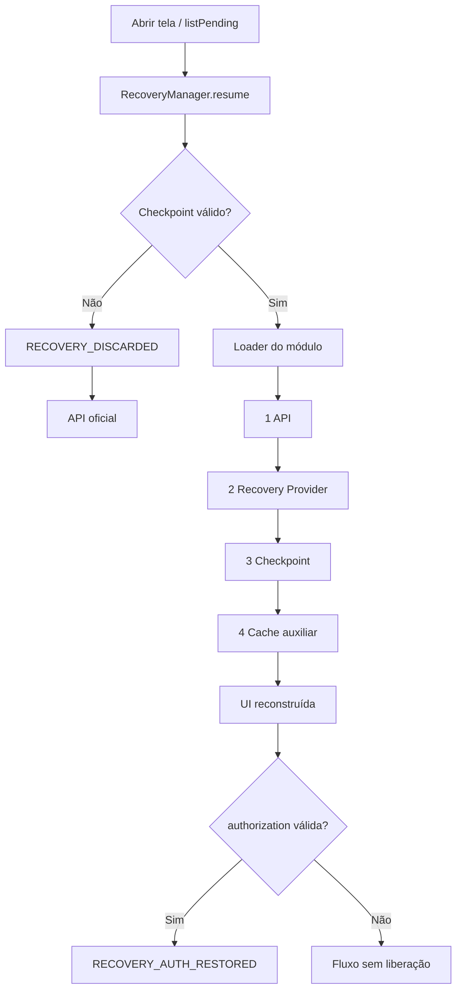
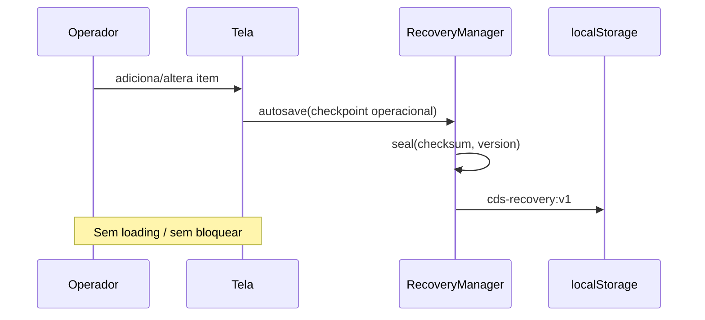

# Recovery Framework — Arquitetura Enterprise

## Papel na Plataforma CDS

O Recovery Framework **não é proprietário dos dados**. Ele coordena a recuperação de operações iniciadas nos motores (Comercial, Fiscal, NF-e, NFC-e, Financeiro, Compras, Estoque, Produção, Pedidos, Orçamentos, …).

Toda regra de negócio permanece no motor responsável. Backend/banco/APIs de domínio não são alterados pelo Recovery.

## Fluxo de recuperação



## Autosave



Antes do primeiro POST no backend, `entityId` é `draft-*`. No primeiro persist, `rebind(draft → id real)`.

## Estados

Ver `RecoveryStatus`: `NOVO`, `RASCUNHO`, `EM_ANDAMENTO`, `AGUARDANDO_CONFIRMACAO`, `AGUARDANDO_IMPRESSAO`, `AGUARDANDO_ASSINATURA`, `CONCLUIDO`, `CANCELADO`.

## RecoveryContext

| Campo | Função |
|-------|--------|
| module / operation / entityId | Identidade |
| checkpoint | Snapshot operacional |
| authorization | Liberação gerencial da operação |
| version / checksum / timestamp / integrity | Validation |
| status / meta | Ciclo de vida |

## RecoveryProvider

Camada 2 da ordem oficial. Módulos podem registrar providers (`RecoveryProvider.register(module, operation, fn)`). Sem provider, o loader usa projeções/bridges existentes.

## Boas práticas

- Chamar `autosave` em toda mutação operacional relevante.
- Guardar autorização via `setAuthorization`, não só `sessionStorage`.
- Exibir apenas `RecoveryMessages.toOperationalMessage`.
- Usar `complete`/`cancel` para encerrar (limpa auth com `expiresOnComplete`).
- Registrar loader + operations no `RecoveryRegistry` por módulo.

## Anti-padrões

- Depender só de `sessionStorage` / estado JS / query string.
- Gravar no checkpoint dados de estoque/financeiro/fiscal definitivos.
- Exibir stack traces ou mensagens de API ao operador.
- Inverter a ordem API → Provider → Checkpoint → Cache.
- Alterar limite comercial permanentemente via Recovery.
- Apagar checkpoint quando a API estiver offline.

## Compatibilidade NF-e

Mesma API: `module: 'nfe'`, operations próprias, loader próprio. Storage e Validation são compartilhados.

## Componentes

```
frontend/shared/recovery/
  RecoveryManager.js
  RecoveryRegistry.js
  RecoveryContext.js
  RecoveryLoader.js
  RecoveryProvider.js
  RecoveryStatus.js
  RecoveryStorage.js
  RecoveryEvents.js
  RecoveryValidation.js
  RecoveryMessages.js
```
